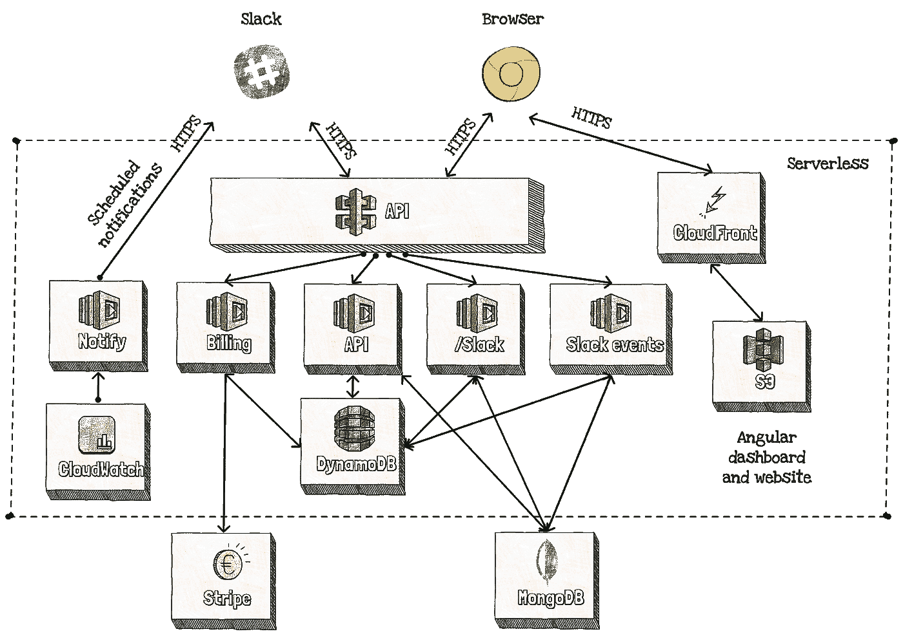

# 你的创业如何受益于无服务器

> 原文：<https://medium.com/hackernoon/how-your-startup-can-benefit-from-serverless-39ff8c88090b>

当 [Cloud Horizon](http://cloudhorizon.com/) 增长到 12 人时，很明显我们需要一个管理假期和休息日的工具。使用[谷歌](https://hackernoon.com/tagged/google)电子表格很难，而且当某人的假期即将开始时没有通知。我们试着用日历，但是它不能让你很容易地看到一个人一年中还剩多少天假期。然后，我们试图找到一种工具来管理休假，但大多数可用的工具都是完整的人力资源解决方案。对于一个 12 人的团队来说，这些工具太贵了，而且有很多我们不需要的功能。

因为我们的长期计划是制造一个产品，这看起来是一个完美的机会。所以我们决定硬着头皮打造[度假追踪器](https://vacationtracker.io?ref=medium)。

 [## 假期跟踪器-管理您的请求并接收假期提醒

### 跟踪团队假期和休息日的最简单方法管理您的请求并接收有关以下内容的假期提醒…

vacationtracker.io](https://vacationtracker.io/) 

当你开始考虑你的新产品时，通向你的核心特性的道路似乎是清晰而明显的。但是一旦你开始旅程，道路就变得模糊不清，到处都是路障。大多数障碍是由枝节问题引起的，这些问题是你的产品所需要的，但是并没有解决你的核心问题。

Your plan vs reality (source: [wonderingaround.me](https://wonderingaround.me/2013/11/13/your-plan-vs-reality/))

你将如何管理你的用户？简单的注册和登录是不够的。用户需要能够重置他们的密码，创建团队，管理权限等。或者说，如何管理订阅？支付处理商并不总是像你一样处理被拒绝的信用卡并重试。此外，有些不生成和发送发票。

这些事情大部分都不难，但是需要时间去研究和实施。通常比你的核心功能需要更多的时间。开发时间是昂贵的，但是所有这些“附加特性”需要的不仅仅是一个开发人员。有人需要决定一个特性将如何工作，并为它写规格。此外，在将该特性投入生产之前，需要有人对其进行测试。这使得你的产品开发更加昂贵。

一个显而易见的解决方案是将一些非核心功能外包给第三方服务。例如，社交登录处理用户注册、登录和个人资料。在我们的例子中，由于[假期跟踪器](https://vacationtracker.io?ref=medium)是公司的一个工具，Slack login 是一个明显的选择。除了登录，它还为我们处理用户权限和邀请。我们还使用许多其他服务，如 Stripe Billing 和 MailChimp。

这为你的团队节省了很多时间，但是你的开发人员仍然需要做很多与你的核心特性没有直接关系的事情。当一个新特性准备好了，它需要被测试，这需要一些基础设施。如果您的团队中没有 DevOps 人员(作为一家初创公司，您可能没有)，开发人员就是需要设置基础设施的人。然后，他们需要为生产做同样的事情。您如何为新产品选择生产服务器的大小呢？它需要足够大，以便在你将产品发布到 Product Hunt 后，你可以获得峰值，但它也需要留在预算内。预算总是有限的，因为营销是昂贵的，但也是产品成功的必要条件。

生产基础设施不仅仅是服务器。您的开发人员能正确处理扩展、日志和备份吗？请记住，他们不是被雇来安装服务器的，即使是一个小小的错误也会让你付出巨大的代价。你会请水管工来修理你家的电力问题吗？

像外包支付处理一样外包基础设施不是很好吗？让您的开发人员专注于核心功能的业务逻辑不是很好吗？

嗯，有一种方法可以做到这一点。它的名字有点争议:无服务器。但是在这个有争议的名字背后有一个简单但强大的思想:您关心您的业务逻辑，服务提供商处理基础设施，包括设置和扩展。更重要的是它的定价模式，因为使用无服务器，您只需为已用容量付费，而无需为预留容量付费。

# 无服务器帮助您创业的五种方式

即使无服务器与基础设施直接相关，您的初创企业也可以通过许多不同的方式从中受益，包括:

1.  托管基础设施
2.  按使用付费
3.  真正的可重用性
4.  更轻松的更改和旋转
5.  更快的开发周期

让我们深入了解每一个问题。

## 托管基础设施

无服务器的第一个也是最明显的优势是托管基础设施。您的开发人员可以专注于您的业务逻辑，服务提供商将处理基础设施。这是怎么回事？

你的系统被分割成多个功能(或微服务)，每个功能都由一个特定的事件触发。假设您有一笔来自用户的新付款。该事件触发处理付款的功能，然后确认触发另一个生成并发送发票的功能。您的开发人员不需要安装新的服务器，也不需要担心安全更新和补丁。相反，他们只是编写功能，并使用一些流行的框架将它们部署到无服务器环境中，如 [Claudia.js](https://claudiajs.com/) 、 [AWS SAM](https://github.com/awslabs/serverless-application-model) 或[无服务器框架](https://serverless.com/)。

您的函数仅在特定事件发生时运行。例如，当系统收到用户的新付款时。更重要的是，您的提供商正在为您提供所有的扩展和安全补丁。这意味着您的产品使用量的突然增加将由您的提供商自动处理。

## 按使用付费

最大的改变之一是无服务器架构的经济性。除了托管基础架构之外，对于无服务器，您需要为已用容量而不是预留容量付费。那是什么意思？很简单:如果没有人使用你的应用程序，你的费用是 0 美元。如果几分钟内有几百个用户，你只需为这几分钟付费。

这是一个巨大的好处。在云计算出现之前，我们提前几个月规划和预留容量。云计算将这一时间缩短到了几分钟。而 serverless 则更进一步，向我们收取 100 毫秒的使用费，而无需预留任何容量。

无服务器更便宜吗？无服务器功能的 1，000，000 次请求的费用为 0.20 美元，每月前 100 万次请求免费。一个请求是 100 毫秒的功能执行。对比每 100 ms 的价格，大概不会比传统的云服务器便宜。但是您的服务器从未满负荷运行，在最好的情况下，至少有 50%的服务器容量和成本被浪费。因为浪费少，所以实际上无服务器便宜很多。它便宜得多，你只需支付 107 美元就可以服务 40 万月活跃用户！

## 真正的可重用性

使用无服务器，您的应用程序被分成更小的部分。你可以把它们看作微服务。所有这些微服务都通过事件或 HTTP 请求进行通信。在实践中，这意味着你将有一个独立于上传和其他图像相关功能的服务，如图像大小调整。由于大多数项目都使用了这些功能，这意味着您可以在下一个项目中完全重用图像大小调整服务。

这在实践中是如何运作的？由于[假期跟踪器](https://vacationtracker.io?ref=medium)是一个无服务器的应用程序，它的计费功能是连接到条纹计费。但是由于它是一个独立的服务，我们只需要将我们的计费服务部署到我们的下一个产品，并将其绑定到产品数据库。通过这样做，我们可以为下一个产品的计费功能节省 95%的开发时间。

## 更容易改变和旋转

由于您的应用程序被分割成一堆服务，因此重构代码要容易得多。是的，这个词听起来很吓人，但其实不应该。就像您的汽车需要定期维修一样，您的应用程序也需要维护和重构。重构是可怕的，因为经常改变应用程序的一部分会破坏其他一些服务。但是对于隔离的服务，只要不破坏服务与其他服务的通信方式，您的更改不会影响其他任何东西。

除了重构之外，这些服务允许你更快地对你的产品进行修改。众所周知，初创公司往往不可预测，有时市场会迫使你快速转向。有了 serverless，你可以做更快的修改，甚至可以轻松的做 A/B 测试。例如，您可以部署一个新版本的服务，并将 10%的流量导向该新版本。如果它工作，你可以慢慢增加流量，直到它得到 100%的流量。如果没有，你可以在不影响其他用户的情况下关闭它。

## 更快的开发周期

我们将在这个列表中提到的最后一个好处是更快的开发周期。这是否意味着你可以更快地建立无服务器的创业？嗯，也许吧。构建产品不仅仅是软件开发，serverless 可以帮助您完成某些部分，但不是所有部分。根据我们的经验，瓶颈通常在其他地方。例如，规范没有准备好或者不存在，业务逻辑没有考虑好，等等。

但是，有了无服务器，你至少可以有更快的开发周期。首先，你的开发人员只需要专注于他们的工作，他们不需要考虑基础设施和部署。但是他们也可以重用现有的服务。AWS 上甚至有一个用于无服务器应用的[无服务器应用库](https://aws.amazon.com/serverless/serverlessrepo/)。你可以去那里，点击几下就能得到别人制造的系统部件。免费的！

# 假期跟踪器如何使用无服务器

在[度假追踪器](https://vacationtracker.io?ref=medium)，我们大量使用无服务器。我们的应用程序几乎是完全无服务器的，除了一些很快将无服务器的服务。我们将其托管在 AWS 上，目前，应用程序基础架构的成本为 0 美元(不包括我们正在使用的工具的成本，如 MailChimp)。

假期跟踪器有几组服务，每组有几个 AWS Lambda 函数和一堆其他 AWS 服务。四个最重要的群体是:

*   Slack bot 服务组涵盖了 Slack webhooks、slash command 等。
*   API 服务组涵盖 RESTful API，包括 API 网关和 AWS Lambda 服务。
*   计费服务组包括计费和发票。我们使用条纹计费，但这项服务围绕它建立了一个完整的生态系统。
*   通知服务组涵盖了我们发送的不同通知，包括谁休假的每周时差汇总等。

我们的架构如下图所示:

Vacation Tracker architecture

# 结论

无服务器架构改进了我们构建软件的方式。但这不仅仅是开发，因为它可以改善我们构建产品的方式。

有了无服务器，您的开发人员可以专注于业务逻辑实现，而不是花费大量时间来设置和维护基础设施。它还降低了应用程序的成本，因为它将资本转化为运营费用。除此之外，拥有更小的服务可以让您更容易地实现变更和 A/B 测试，并更快地转向。

有了上面提到的所有好处，无服务器不仅仅是体系结构的选择，它成为了一个重要的策略。例如，它可以让你按活跃用户向团队收费，而不必是像 Slack 这样的大公司。

当然，任何事物都有它的缺点。我们将在下一篇文章中讨论无服务器架构最重要的局限性。通过订阅我们在 [vacationtracker.io](https://vacationtracker.io/?utm_source=medium&utm_medium=article&utm_campaign=newsletter&ref=medium) 的邮件列表，确保你不会错过它。

*原载于 2018 年 7 月 25 日*[*vacation tracker . io*](https://vacationtracker.io/blog/startups-can-benefit-from-serverless/)*。*