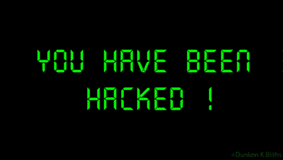

# 你的交易 API 密匙如何被用来耗尽你的资金

> 原文：<https://medium.com/hackernoon/how-your-trading-api-keys-can-be-used-to-drain-your-funds-f9148d1e6d33>

source: gifimage.net

许多密码投资者可能没有给予足够的考虑。交易所含蓄地让我们相信，只要你的 [API](https://hackernoon.com/tagged/api) 键无法提取，任何人都很难转移你的资金。但最近的黑客攻击开始表明，攻击者的新目标是交易者的 API 密钥。这尤其适用于使用机器人和不同的云服务来管理账户的交易者和投资者。

就在两天前，有一个广为流传的谣言说[币安可能被黑了](https://thenextweb.com/hardfork/2018/03/07/binance-accidentally-selling-users-cryptocurrency-bitcoin/)。这是由于对某些用户帐户的攻击，这些用户使用他们帐户中的资金操纵市场价格。币安声称这是由于受影响用户使用的机器人对 API 密钥处理不当。上个月窃取用户登录凭证的网络钓鱼攻击也可能是原因之一。不过，我怀疑攻击者真的像币安声称的那样损失了金钱。如果他们实施了下面的策略就不会。

这场攻击是如何进行的？简单。攻击者获得了用户的交易 API 密钥。因为他们能交易但不能退出，他们需要一种方法来操纵市场。一种常见的方法是通过泵和倾卸。在典型的泵送和转储中，许多用户会聚集在一个秘密团体中，试图通过在非常短的时间内购买大量资产来人为地提高资产的价格。这种价格上涨将引发其他一些投资者或机器人买入并进入潜在的牛市。由此产生的多米诺骨牌效应将进一步推高价格。通常，这个泵和转储组的组织者在通知其他人所选择的资产之前，会通过购买资产来进行预泵。

根据泵组的目标，大规模的销售几乎与最初的泵一样突然。谈到 API 键攻击，攻击者理解物理用户和对他们的 API 键的限制一样有用。因为他们可以用这些 API 键进行交易，所以只需要一点点洞察力就可以意识到，他们也可以使用这些 API 键来模拟传统的泵和转储。

他们只需要:

1.  如果他们不够，借一些 BTC。
2.  在预抽阶段购买目标资产(币安的情况是 Viacoin)。
3.  编写一个机器人程序，获取受害者的交易 API 密钥，将他们所有的替代硬币出售给 BTC，然后以已经膨胀的市场价格购买目标资产(Viacoin)。

通过重复步骤 3，攻击者能够将 VIA 的价格提高近 70 倍(根据[比特币](https://hackernoon.com/tagged/bitcoin))。com)在几分钟内。现在，如果一个用户的账户遭到攻击，而他又有幸在攻击期间进入并从币安提取了资金，那么他可能会非常感激这次攻击。但碰巧的是，这种泵持续不了多久。由于大规模抛售，随之而来的通常是致命的价格下跌。这将导致更大比例的受损账户遭受巨大损失。

如果攻击者速度足够快，他们就能在币安制止撤资并重置他们的系统之前撤资。只有 1 BTC 的初始投资，攻击者可以获得 60+ BTC 的战利品。

这个帖子是出于教育目的而张贴的，目的是让投资者意识到将他们的交易 API 密钥暴露给不安全和不可信的第三方服务或机器人所带来的风险。为了保护自己免受 API 密钥泄露或网络钓鱼攻击的损失，请始终确保:

*   在所有 exchange 帐户上设置双因素身份验证(2FA)。
*   设置您的 IP 白名单，只允许信任的 IP 地址访问您的帐户。

如果你有一个加密投资组合，并且你还没有开始最大化你的回报，看看我在[上的文章《最大化你的加密回报](https://hackernoon.com/the-simple-strategy-that-will-help-you-beat-the-crypto-market-this-year-5eecdfa7d6e7)。

感谢阅读。如果你发现这篇文章信息丰富，不要犹豫，拍它(多达 50 次)，以便其他人可以发现它。另外，如果你在我的分析中发现了一个错误，请在下面留下你的评论。关注我，获取更多有趣和有意义的阅读。