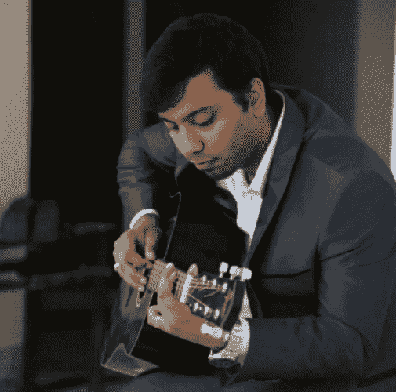
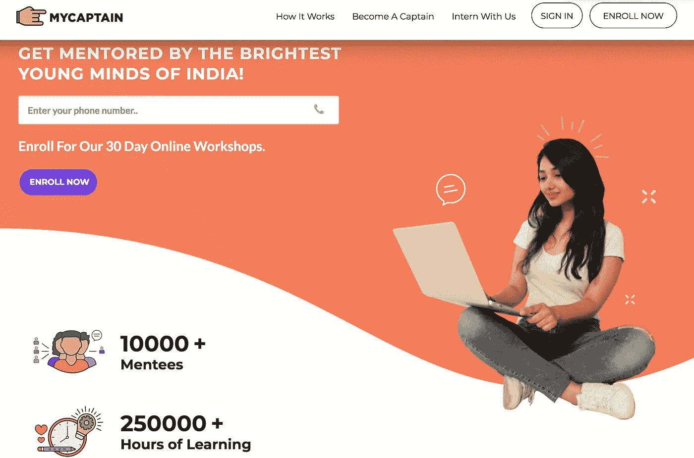

# Zeeshan 和他的团队如何建立 my captain——一个每年创造 20 万美元收入的教育技术创业公司

> 原文：<https://medium.com/hackernoon/how-zeeshan-and-team-built-mycaptain-an-edtech-startup-generating-200k-per-year-staying-69a614f312d1>

## [推送面试](https://www.facebook.com/groups/Pushstarter) 10:

## [Zeeshan](https://www.linkedin.com/in/mohammed-zeeshan-359bb368) 和团队如何建立 [MyCaptain](https://www.mycaptain.in/) 的旅程——一家每年产生 20 万美元的 EdTech 初创公司。

印度每年有超过 150 万学生毕业。

他们中有多少学生真正追求自己的激情？你怎么想呢?

没有这方面的数据，但我确信这个数字会很低。

作为一个青少年，在印度发现和追随你的激情是很困难的，因为教育系统没有提供充足的时间、相关的知识和正确的动机，社会也不支持。

我们被评判是基于我们记忆内容和上课的能力，不是吗？

这是****和**团队试图通过 [**MyCaptain**](https://www.mycaptain.in/) 解决的 **EdTech** 中的核心问题之一。**

## **通读这篇采访，了解:**

> **Zeeshan 和他的团队是如何创建 MyCaptain 的，这是一家每年创造 20 万美元收入的 EdTech 初创公司。**

**这是“[**push interview**](https://www.facebook.com/groups/Pushstarter/)**:帮你的面试**[**push start**](https://www.facebook.com/groups/Pushstarter/)**”**系列的第十次面试由 [**Pushstart**](https://www.facebook.com/groups/Pushstarter/) 提供动力。**

**如果你碰巧错过了，可以看看我们之前对印度最活跃的创业社区之一**的采访。****

**** [## 我如何建立印度最活跃的创业社区之一

### 我从零到一建立创业社区的旅程

hackernoon.com](https://hackernoon.com/how-i-built-the-most-active-startup-community-of-india-dfd83e8fe687)**** 

# ****🕴你是谁？****

****嘿 [**Pushstarters！**](https://www.facebook.com/groups/Pushstarter/) 我是[**Mohammed zee shan**](https://www.linkedin.com/in/mohammed-zeeshan-359bb368/)[**my captain**](https://www.mycaptain.in/)的联合创始人兼 CEO。我从 [**SRM**](http://www.srmuniv.ac.in/) 机械工程专业毕业，并在 SRM Enactus **担任副总裁。******

********

******Yep! That’s me.******

****我的[创业](https://hackernoon.com/tagged/startup)之旅始于我 19 岁的大学时代。我学的是工程学，但对成为一名天文学家感兴趣，我的一个朋友想成为一名记者和其他经济学家。****

> ****这种研究你不感兴趣的东西的模式促使我找出真正的问题，并以我的队长的形式找到解决方案。****

# ****🤔我的队长是怎么回事？****

> ****MyCaptain 是一个在线指导平台，来自全球各地的年轻成功人士可以在这个平台上指导他们感兴趣和感兴趣的领域的学校和大学学生。****

********

****导师为学生进行为期一个月的在线现场研讨会，帮助他们学习基础知识，了解他们感兴趣领域的就业机会。****

****除此之外，我们还 ***在印度各地组织聚会、活动和会议。*** 我们的学员自愿参加此类聚会，以便与我们保持联系并帮助其他学员。****

*******所有导师的年龄都在 25 岁以下*** 他们都经历过类似的阶段，并取得了胜利。****

****常规的在线会话是一对多的，但在额外查询的情况下，可以安排单独的一对一会话。任何这样的额外课程都是免费的，学生们甚至可以在课程结束后讨论他们的问题。****

# ****💯是什么激励你开始 [MyCaptain](https://www.mycaptain.in/) ？****

> ****“我的船长”这个想法是在一次宿舍讨论中产生的。****

****我和我的朋友们在讨论天文学、经济学、教育、政治和桑妮·黎翁(我不是在开玩笑！).****

****通过这次讨论，我们意识到我们都想从事一个不同的领域，而不是工程。我们从来没有机会选择我们想从事的领域。****

> ****这是印度每个青年都面临的核心问题。我们面对过它，我们的前辈曾经面对过它，我们的后辈也将面对它。我们想出去做点什么。我的队长就是这样开始的。****

****在 2014 年 12 月最终构思出 MyCaptain 之前，我们有多种产品和计划，如面向学校学生的杂志、活动和会议。****

> ****我们在 2015 年 2 月推出了 MyCaptain，我们所有的研讨会在推出后的两天内就销售一空。这证实了我们的想法。****

# ****🛠:构建最初的产品都花了些什么？****

> ****投资时间，而不是金钱来打造 T2 的 MVP。****

****我们通过在免费版的[***WizIQ***](https://www.wiziq.com/)***(电子学习交付平台)上交付实时在线课程，开始辅导 ***，并使用 Whatsapp 群组与学员进行交流和互动。**********

**我们过去常常通过 google drive 分享视频和其他类似的学习材料。**

**MyCaptain 已经发展了两年，现在我们使用我们的平台，增加了更多的功能和定制，以满足我们学员在现场会议中的需求。**

> **直到 2016 年 8 月才开始在产品上花钱。**

# **🤝你是如何获得最初的客户的？**

> **在创业节期间，我们在 SRM 摆了一个摊位，两天内就有了第一批 200 名付费学员。**

**从 200 人到 1.2 万人的付费学员是一段漫长的旅程，为了达到今天的规模，我们做了很多尝试。**

**在第一批 200 名学员之后，下一批学员来自现有学员的推荐和个人联系。**

> **经过大量的头脑风暴，我们决定启动校园大使计划，以加快学员的成长。**

**我是一个为全球青年提供领导力和发展机会的非营利组织****的成员。我利用他们的关系网从印度的各个大学找到了校园大使。******

******校园大使通过让学生们意识到加入我们的好处，在他们的学校和学院里宣传我的队长。他们过去常常根据自己的表现获得金钱奖励。******

> ******校园大使计划之所以奏效，是因为我们有清晰的愿景和文化。******

******除了关注线下渠道，我们还在 **Google** 和 **FB 上开展了活动。********

> ****在产品到位之前，我们使用带有 [**谷歌表单**](https://www.google.com/forms/about/) 的广告来获得新学员。我们过去每个月花费 1.5 万卢比，产生近 1.2 亿卢比的收入。****

****现在我们使用 [**脸书销售线索生成表单**](https://www.facebook.com/business/a/lead-ads) 来捕捉销售线索。我们每条线索花费 30 卢比，转化率为 5%。卖一个价值 4k 的产品要花我们 600 块。****

# ****💰你的商业模式是什么？你是如何增加收入的？****

> ****从第一天开始，我的船长就一直在创造收入和利润。****

****学生为为期一个月的研习班支付 1000 卢比。 导师拿到这个金额的一部分，剩下的我们拿。****

****导师的其他报酬来自于帮助他们为他们的研究或工作找到导师。他们也获得了 lor，我们甚至帮助他们获得研究或创业资金。****

> ****导师们在追求他们的激情时会得到帮助，无论是摄影还是编码。我们珍惜所有与我们相关的人的利益。****

****我们还定期组织物理会议，参与者在两次会议之间付费。两百卢比。1000.****

****这类事件的一个例子是**工程秘密会议**，它由帮助学生获得对他们感兴趣的领域的有用见解的会议组成。该活动持续了几天，涵盖了各个领域的主题。****

****MyCaptain 实现了每月 130 万卢比的收益。2017 至 2018 财年的营收为 15 亿克鲁塞罗。****

# ****📉有没有一件事让你悲惨地失败了，但是你站起来重新开始？****

> ****由于我们的杂志没有成功，在创办《我的船长》之前，我们破产了，并且负债累累。****

****2014 年底，我们的杂志有了订户，但我们没有资源来满足他们的需求。我们有责任多印 12 期杂志，但我们没有资金这么做，而且**负债约 2.5 升。******

> *******my captain 的想法就是在这个阶段诞生的。开办 MyCaptain 最初几个月的收入帮助我们还清了债务。*******

# ****🏁你未来的目标是什么，你打算如何实现它们？****

****我们计划建立物理空间，让学生们可以聚在一起，了解更多他们的兴趣和激情。****

****这些空间将出现在主要城市的多个地点，学生将通过 MyCaptain 应用程序相互联系。****

> ****实现这一目标的第一步已经以“MyCaptain Connect”的形式迈出了****
> 
> ****该计划促进学员和导师之间的会面，以加强互动。****

# ****🌋到目前为止，你面临的最大挑战是什么？****

> ****自举的时候管理现金流是个大问题。你没有奢侈的体验或花费在飞行员身上。****

****它确实会让事情慢下来一点，但也有助于推动持续的忙碌。没有时间放松，也没有借口不交付高质量的工作。****

****除此之外，我们负债的整个情况对我们来说是一个巨大的挑战。那段时间，团队在分崩离析，感觉我好像什么都没有了。****

****不放弃和勇往直前的价值让我不断努力，我终于可以回到正轨并思考解决方案。经过大量的头脑风暴和失败的尝试，我们想出了“我的队长”。****

> ****永不放弃的态度让我走到了今天。****

# ****🗒What，你对积极进取的人有什么建议吗？****

*   ****追客户，不追投资人。****
*   ****专注于找到具备互补技能的合适的联合创始人。****
*   ****如果你是一名大学生创业者，确保你的初创企业能够产生收入，并且从一开始就是盈利的。****
*   ****如果你是自举，关注现金流。有了正确的现金流管理，你可以保持更长时间的可持续发展。****

# ****✉️:我们怎样才能和你联系上？****

****可以在[**Linkedin**](https://www.linkedin.com/in/mohammed-zeeshan-359bb368/)**或者 [**脸书**](https://www.facebook.com/M.Zeeshan93) **上联系我。********

**——作者[安姿丽·阿罗拉](https://medium.com/u/7a4170dee4a6?source=post_page-----69a614f312d1--------------------------------)和[尼拉杰·乔希](https://medium.com/u/62c16aa7c0ed?source=post_page-----69a614f312d1--------------------------------)。**

## **非常感谢你的阅读！如果你喜欢，请鼓掌支持👏🏻还有分享帖子。请随意发表评论💬下面。**

## **想成为印度最活跃的创业社区的一员吗？**

***在* [***上发送请求 Pushstart***](https://www.pushstart.in/join-network-community) *成为我们不断壮大的大家庭的一员。***

***嘿！Neeraj 这里的创始人*[***Pushstart***](http://pushstart.in/feed)*，印度最活跃的企业家群体。我每周都会发布对成功企业家的采访。**[***脸书***](https://www.facebook.com/jneeraj0807)***|***[***Linkedin***](https://www.linkedin.com/in/jneeraj0807)***| neeraj . Joshi @ pushstart . in |***[***Twitter***](https://twitter.com/jneeraj0807)***