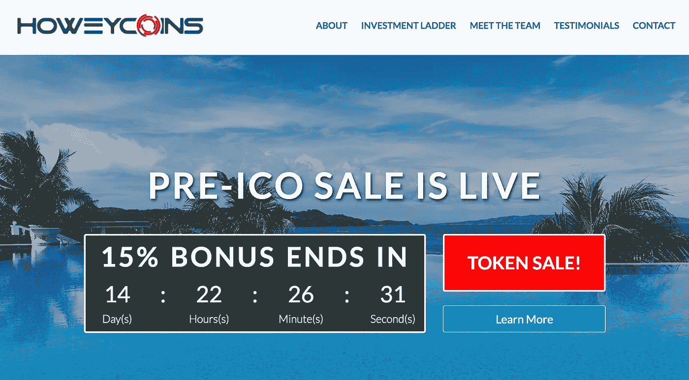
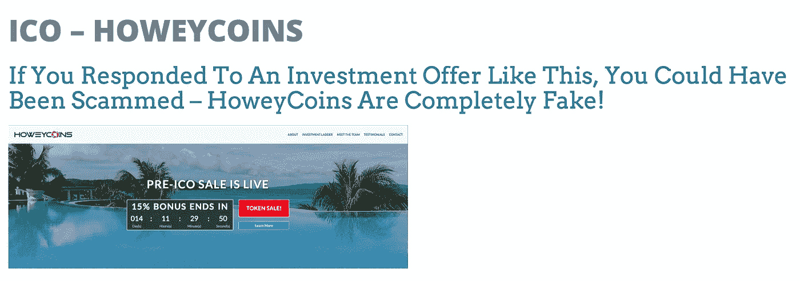

# 无论如何，ICO 不是一个笑话

> 原文：<https://medium.com/hackernoon/howeycoins-ico-is-not-a-joke-5ca310455019>

A screenshot of the SEC’s fake website: [https://www.howeycoins.com/index.html](https://www.howeycoins.com/index.html)

在过去的 12 个月里，全球的 ico 筹集了超过 80 亿美元。就这样，ICOs 成为筹集巨额资金的最令人兴奋的方式，每家公司的规模可达数千万美元。但 ICOs 也成为投资者损失资金的最危险方式。

ICOs 在一夜之间推出，就好像它们刚刚从地球上冒出来一样，丝毫不考虑联邦证券法。这让证券交易委员会和州政府很担心，因为他们的任务之一是保护投资者免受欺诈。这项指令已经存在很长时间了，目前的解决方案是 1933 年的证券法。

该法案要求对出售给普通投资者的股票进行登记，即未经认证的投资者不能参与公司的证券销售，除非该销售在美国证券交易委员会登记(或使用豁免)。提醒一下，合格投资者是那些净资产为 100 万美元的人，或者是那些在过去两年里年收入至少为 20 万美元的人。

绝大多数 ico 向任何愿意购买代币的人出售代币，不管是否经过认证。这些 ico 中的绝大多数都没有将代币销售作为证券在美国证券交易委员会注册，也没有使用豁免，如 A+规定。即使不是大多数，这些 ico 中的许多人也不知道他们违反了法律。有几个糟糕的演员可能做到了。

在过去的 6 个月中，SEC 发布了一系列公告，提醒投资者、律师、发起人和发行代币公司的首席执行官，任何 ICO 都需要注册或寻求豁免才能向投资者发行代币。

用现在广为人知的 SEC 主席杰伊·克莱顿的话说，“我见过的每一个 ICO 都是证券。”

昨天，在一个前所未有的举动中，证券交易委员会决定通过出售 [HoweyCoins](https://www.howeycoins.com/index.html) 来推出他们自己的 ICO。我希望我能说这些代币是以我的名字命名的，但事实上，这是对[豪威测试](https://consumer.findlaw.com/securities-law/what-is-the-howey-test.html)的半开玩笑的引用，豪威测试是一种简单的测试，用来确定一项资产是否是一种证券。

> HowieCoins 将成为旅游业的加密货币标准——[Howie coin 白皮书](https://www.howeycoins.com/files/howeycoin_white_paper.pdf)。

该网站详细介绍了 HoweyCoin(一种拟议中的旅行货币)将如何为投资者带来有保证的回报。当然，如果没有一系列有计划的提价和抛售，以在短期内推高房价，为投资者带来回报，任何欺诈计划都不会完整。当证交会的工作人员把这个网站整合在一起时，他们肯定笑了。

然而，他们试图提出一个有效的观点:任何人都很容易推出 ICO 并欺骗投资者。他们的许多讽刺观点在网站的背景下可能看起来有些夸张，但他们也明显呼应了许多 ICO 营销策略。投资者没有看到危险信号。

A screenshot of the early bird discount from [https://www.howeycoins.com/index.html](https://www.howeycoins.com/index.html)

HoweyCoin 网站详细介绍了公式化的投资装饰，包括激进的投资时间表、对早期投资者的巨大折扣以及有保证的回报。由于公众对他们的公告缺乏兴趣，证券交易委员会可能会感到沮丧，这是理所当然的，所以他们正在尝试一种新的策略。

真正的问题是:SEC 希望每位首席执行官及其专业团队在向投资者出售代币时遵守证券法。然而，问题并不那么简单，因为证券法很复杂，而且提供了许多选择。只有有经验的证券律师才知道如何给企业家提供适当的建议。

过去一年推出的 800 多个 ico 中，大多数都没有遵循任何证券规则。这意味着投资者有权要求收回他们的钱，而那些帮助销售这些“公用事业”代币的人可能要承担刑事欺诈和严厉处罚的责任。

最近，美国证券交易委员会向公司、发起人和律师发送了数十份调查和传票。这是监管机构的火力空前集中在一个新生的市场上，不应掉以轻心。

After clicking “buy coins” or submitting their email, visitors are redirected here: [https://www.investor.gov/howeycoins](https://www.investor.gov/howeycoins)

HoweyCoin 是纸上的伟大投资(保证利润！谁能说不呢？).然而，这是一个骗局，因为只要你试图购买硬币，SEC 就会很快注意到。惊喜:没有 HoweyCoins 出售。这个网站仅仅是一个教育工具。

希望 HoweyCoin ICO 能作为一种教育工具在市场上传播开来。幽默可能非常有力量，美国证券交易委员会应该为他们的创造性努力和独创性鼓掌。希望投资者不会错过这个笑话。

*感谢阅读，如果你喜欢，请鼓掌 50 次！如果你有兴趣看到真正的创业公司推销他们的业务，请收听 5 月 31 日的* [*StartEngine 演示日*](https://signup.startengine.com/DemoDay?utm_source=Howard_Blog) *，我们平台上的公司将在网上向投资者推销。*