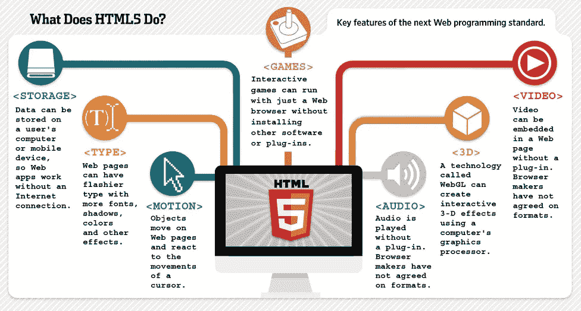
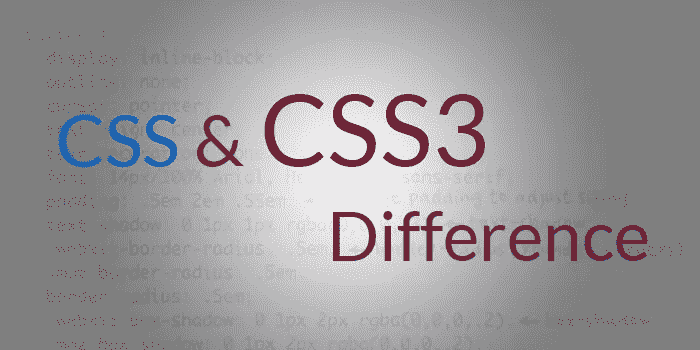

# HTML 5 和 CSS 3:让你的网页设计栩栩如生

> 原文：<https://medium.com/hackernoon/html-5-css-3-bring-your-web-design-to-life-4be7600a3cc4>

Relation between HTML and CSS with modern web like “two person holding hands while standing” by [Brooke Cagle](https://unsplash.com/@brookecagle?utm_source=medium&utm_medium=referral) on [Unsplash](https://unsplash.com?utm_source=medium&utm_medium=referral)

你有没有想象过自己或者一个没有骨架和其他部分的动物身体？它看起来是隐形的，不是吗？如果一个骷髅的形状在你周围移动，没有任何肉、眼睛、手、腿等等，你会有什么感觉？有线的，对吧？。现代 web 应用程序和 HTML & CSS 之间的关系类似于此。HTML(超文本标记语言)是一个网络应用的骨架，没有 CSS 它看起来很奇怪。他们是真正的灵魂伴侣，很难想象没有他们的现代网络应用。

Functionality of HTML 5 “image taken from google” — [used in blog](https://www.keycdn.com/blog/html-vs-html5)

## HTML 与 HTML 5

HTML 5 是 HTML 语言的最新规范，代表了与以前标记实践的重大突破。这种语言的目的是标准化开发人员使用它的新方式，以及鼓励一套关于 web 开发的最佳实践。HTML 5 的核心特性是语义(有意义的)标记，这使得它更适合一个 web 开发者。如果你想深入研究，那么你可以阅读这些“ [Quora 文章](https://www.quora.com/What-are-the-differences-between-HTML5-and-pre-5-HTML)”或者另一篇名为“[HTML 和 HTML 5 的区别](https://www.hostinger.com/tutorials/difference-between-html-and-html5)”的文章

Taken from google image

## CSS vs CSS 3

CSS 3(层叠样式表)是 CSS 的最新版本。在 CSS 3 中，你可以毫无困难地做很多事情。您可以轻松制作一些高级的酷炫动画、运动效果等。Flexbox 和 Grid 是 CSS 3 的强大功能，它们使得许多复杂的任务变得非常简单。如果你想知道更多，那就看看这篇[文章](https://www.quora.com/What-is-the-difference-between-CSS-and-CSS3)。

## 学习路径

当我开始学习这些技术的时候，我选择了 [w3Schools](https://www.w3schools.com/) 作为核心。试了几天后，我觉得很无聊。然后我找到了 [freecodecamp](https://learn.freecodecamp.org) ，完成了他们的[响应式设计部分](https://learn.freecodecamp.org/responsive-web-design/basic-html-and-html5/)。不弄脏自己的手是学不好任何技能的。相信我，这是事实。

> **“如果你在许多不同的网站上工作学到了一件事，那就是几乎任何设计想法——无论多么糟糕——只要付出足够的努力，都可以在正确的环境下使用。”――史蒂夫·克鲁格，*不要让我思考:一个关于网站可用性的常识方法***

在完成 [freecodecamp](https://learn.freecodecamp.org) 的响应式设计部分后，我感觉自己的理解有些模糊。当我和我的编码伙伴在 [Microverse 的快速通道项目](https://www.microverse.org/) ( [这里](https://hackernoon.com/my-journey-through-the-software-development-path-1b95eadee4c3)是一篇关于 Microverse 的文章)中一起开发 HTML 和 CSS 项目的时候，我能够让晦涩的部分变得清晰。现在，我可以使用这些响应特性构建任何 web 模板。

“boy leaning on white chair” by [Chinh Le Duc](https://unsplash.com/@mero_dnt?utm_source=medium&utm_medium=referral) on [Unsplash](https://unsplash.com?utm_source=medium&utm_medium=referral)

## 什么是 ***响应式*** ？

现在 web apps 更出名，因为你不用去想设备(台式机，pad，笔记本电脑，还是手机)以及哪些平台适合执行这些 apps apps。相反，你可以使用 CSS 的媒体查询来使你的网站具有响应性。首先，我问自己“我将使用哪种设计策略来开发这个应用程序，移动优先还是桌面优先？”，然后再写代码。移动优先设计是一种设计策略，即当你创建一个网站或应用程序时，你应该先从最小的屏幕开始绘制草图和原型，然后逐步扩展到更大的屏幕。桌面优先也是一种与移动优先设计完全相反的设计策略。当我不得不使用最大宽度或最小宽度来创建断点时，我首先会考虑这些设计策略。

## 框架是让你更有效率的最好工具

框架是一个模板或工具，开发者在其中做所有的事情来构建一个有很多很酷的设计和效果的网站。这样你就不需要重新创建所有那些你需要用来建立一个完整网站的重要东西。有很多框架，其中 bootstrap 是最流行的。对于使用 bootstrap，您只需要知道哪个类名适合您的特定设计。

## 萨斯的 SCSS 是编写 CSS 的最佳选择

Sass 的 SCSS 被称为 CSS 预处理语言。CSS 本身很有趣，但是样式表变得越来越大，越来越复杂，越来越难维护。这就是 css 预处理程序像 [SASS](https://sass-lang.com/guide) 、 [SCSS](https://sass-lang.com/guide) 、 [LESS](http://lesscss.org/features/) 让你的生活更轻松的地方。现在有了 SCSS，我可以使用 CSS 中还不存在的特性，比如变量、嵌套、混合、继承和其他漂亮的东西，让编写 CSS 再次变得有趣。

如果你想成为一名前端 web 开发人员，那么你必须学习这些东西来提高你工作效率。

> 设计是一个计划，它以一种最好的方式来安排元素，以达到一个特定的目的—查尔斯·伊姆斯，*查尔斯·伊姆斯的 100 句名言*T3

*——[Twitter](https://twitter.com/Diptokmk47)|[Github](https://github.com/dipto0321)|[LinkedIn](https://www.linkedin.com/in/diptokarmakar47/)*