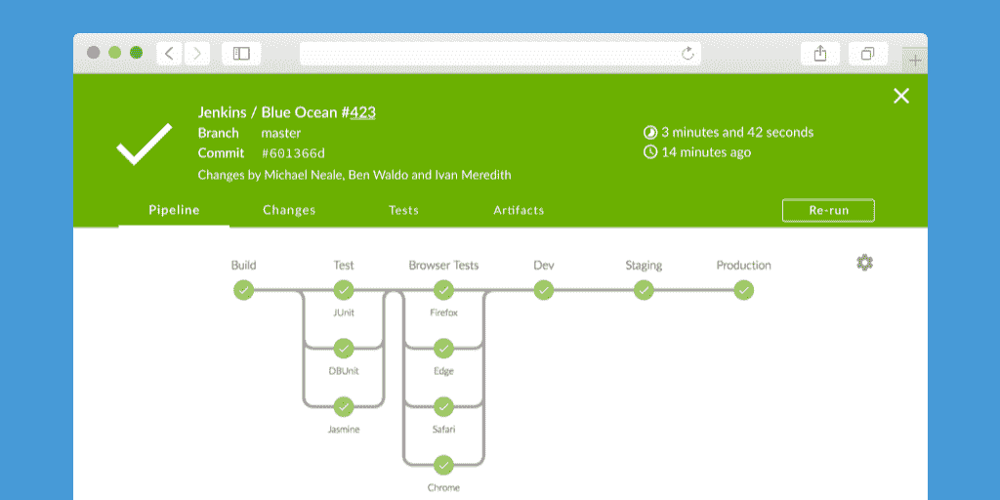
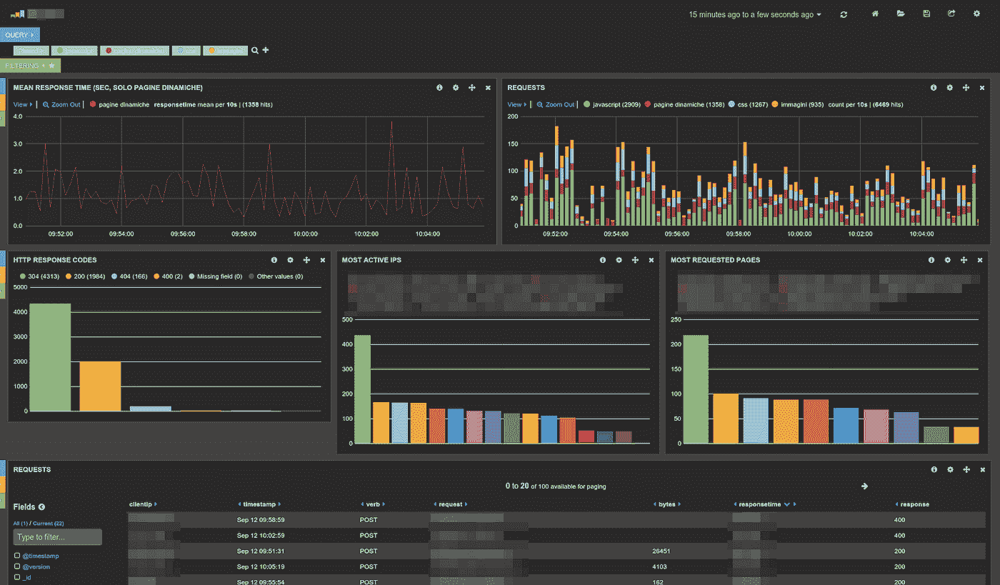

# 帮助您在组织中实施 DevOps 的 4 个想法

> 原文：<https://medium.com/hackernoon/https-hackernoon-com-4-ideas-to-help-you-implementing-devops-in-your-organization-abe6b01a14c3>

## 在企业组织中应用和扩展 DevOps

# 动机

随着[技术](https://hackernoon.com/tagged/technology)在我们日常生活中的重要性不断增长，各种类型的企业都被迫成为自己的“**数字**版本”。

要么是因为他们超级互联的消费者的压力，要么是新竞争对手的推动，他们很快意识到他们当前的流程不再能够跟上业务**创新**和更快**反馈**周期的步伐。

虽然这些组织中的大多数已经将他们的开发方法转向敏捷，但是这种敏捷通常被限制在开发团队的筒仓中，并且对整个组织的上市时间几乎没有影响。

[**DevOps**](https://hackernoon.com/tagged/devops) 无疑是被用来**加速**端到端交付和创新的关键实践之一，但是**大型** **公司**通常会面临许多**挑战**到**规模**这种文化，相比初创公司或纯[技术](https://hackernoon.com/tagged/technology)公司。

下面，我会介绍一些在这个旅程中可以帮助你的想法。

# 1.自动化班

大家都知道一个典型的企业是怎样的:几个**团队**、**厂商**分布在多个地点、**沟通**、**挑战**、多个**项目**和项目**并行**。

公司通常如何驯服这条*龙*？标准方法:*标准*。

让人们创建描述**该做**和**不该做**的文档，将其移交给相关人员，定义每个阶段之间的人工验证和批准门。

结果:交付**延迟**，**依赖** **地狱**，工程师在文书工作上花费太多时间，从长远来看没有优化。

更好的( [DevOps](https://hackernoon.com/tagged/devops) )方法:(技术)**契约**和**工具**。

也就是说，*数字化*您的流程，尽可能自动化(构建、测试、交付、监控)。关注整个交付流程的敏捷性，将自动化速度置于(容易出错的)控制之上。

在一个**完美的** **世界**(你可能想知道)，工程团队将能够**识别**，**(从多个领域和利益相关者……)获得支持**，并自己实现这些工具。

在真实的**企业**场景中(内部和外部参与者都有)，你可能需要建立一个专注的团队(一个**自动化** **小队**)**专注**和**授权**去做这件事。

这不应该是新的“**变** **管理** **团队**”。这个团队必须创建**工具**，使**能够让**其他**团队**自主开发和交付他们的软件。

[*Jenkins*](https://jenkins.io/) *(an Open Source Automation Tool) can probably be a good base platform for this team and is probably already being used by many of your development teams anyway*

# 2.应用分析

不是每个人都明白敏捷不仅仅是“快速移动**”，还包括当你**需要**时**改变**你的**方向**。**

**而这个**需要**通常有两种味道:**用户反馈**和**技术原因**。**

**我的经验是，第一种类型通常已经存在。围绕它已经有非常强大的商业压力，这是公司已经做了很多年的事情。像 **Google Analytics** 这样的工具可以让产品所有者和商业利益相关者获得关于应用在**用户层面**表现如何的关键见解(页面浏览量、转换率等等)。**

****

***The good ol’ Google Analytics***

**这并不意味着没有改进的余地。有许多新的**用户分析**工具可能非常有价值，特别是对于**设计师**。如果你看看 [HotJar](https://alternativeto.net/software/hotjar-insights/) 和类似的产品，你会对这种更新的工具有所了解。**

****

**[*HotJar*](https://www.hotjar.com/) *Heatmap example***

**现在，为了支持 DevOps 团队，您需要一个具有**完全不同视角**的工具，它可以提供如下功能:**

*   **发布**调试。****
*   ****性能**分析。**
*   ****安全**和审计日志。**

**为此，您通常需要访问所有生成的**日志**，而不仅仅是样本和汇总数据(这通常是您从之前的工具类别中获得的)。**

**当然，有许多企业级工具具有这种功能，但如果您想从基础开始，首选是****(elastic search+LogStash+Kibana)。******

************

*******Sample ELK Dashboard (analysis of HTTP/Apache logs).*******

******您可以设置自己的基础设施，或者您可以搜索 SaaS 选项(有几个可用的)。******

******重要的是，您需要有一个工具来支持 DevOps 组织中多个角色之间的**高效** **沟通**和**交互**。******

****如果您在生产中遇到的任何**事件**需要花费**几天**(以及几十个电子邮件线程)来分析和解决，那么您仍然在运行传统的“开发与运营”模型。****

# ****3.新的安全思维****

****与自动化主题不同，我认为集中化的方法在企业组织中最有效，我认为与 T21 相反的方法必须应用于安全。****

****你可以准备好**工具**来检查系统漏洞并执行**渗透** **测试**，但是人(所有人)必须真正成为你的安全策略的中心。****

******为什么？******

****我在过去几年中排除的大多数难以捕捉的(**功能性)**bug 都是由**事故**引起的，我的意思是: ***熟练*****人*** *做某事(例外)* ***错误*** 。*******

***但是当我想到很多项目中交付的**安全**的水平，却完全相反。安全**漏洞**和**漏洞**是由对他们正在犯的**错误**毫无头绪的人创造的。成功将是特例。***

******

***去问你的团队几个问题:***

*   ***他们知道 OWASP 是怎么回事吗？***
*   ***他们能给你举一些 XSS 的例子吗？***
*   ***他们知道不同的文件都在他们的~/上吗？ **ssh** 文件夹？如果是，他们还在使用密码连接服务器吗？***
*   ***他们的硬盘**加密了**吗？他们正在处理的服务器上的那些呢？***
*   ***他们用的是什么**密码** **经理**？***
*   ***他们在 web 应用程序上部署了什么类型的 SSL/TLS **证书**？***

***他们可能无法回答其中的一些问题。不幸的是，在大多数计算/开发课程中，安全性仍然不是一个非常重要的主题。你必须实施**培训**和**知识** **分享**实践，以在你的团队中培养这种技能。***

***让公司投资安全培训和工具的最快(但不是最好的……)方法是让**被黑**——*悲伤但真实的*。***

***下一个主题可以给你另一个更好的方法，让每个人都注意到这一点。***

# ***4.军事演习***

***DevOps 被定义为整合**不同** **团队**的**文化**，要做的一件关键事情是将一些**团队** **建设**活动整合在一起，使之真正发生。***

***一种方法是进行一些“军事演习”，模拟和练习不同的目标和不同的人。一些想法:***

*   *****单行** **行**更改:通过更改单行代码来测试您的整个开发和部署流程。***
*   ***内部**黑客**/渗透测试:尝试入侵你自己的系统，并以此来建立安全意识(见上面的主题)。***
*   *****灾难** **恢复**:模拟不同的灾难(单服务器、单 AZ、完整区域)。你可以用你系统的备份来做。为此，你不需要成为一家经营混沌猴的网飞公司。***
*   *****峰值** **需求**:在严重的需求峰值期间，您的应用程序/基础设施会发生什么。它能像设计的那样扩展吗？***

******

***这些练习中的每一个都将测试不同的技能，并且肯定会帮助你的团队更加自信地处理现实生活中的情况。***

***—***

****如果您有任何 DevOps 实现经验可以分享，请告诉我！****