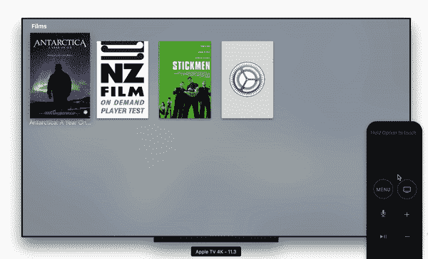

# 使用 React Native 构建视频点播应用

> 原文：<https://medium.com/hackernoon/https-hackernoon-com-build-vod-apps-using-react-native-f7fdcd7959bf>

Photo by [Pietro Jeng](https://unsplash.com/photos/n6B49lTx7NM?utm_source=unsplash&utm_medium=referral&utm_content=creditCopyText) on [Unsplash](https://unsplash.com/search/photos/chemical-reaction?utm_source=unsplash&utm_medium=referral&utm_content=creditCopyText)

> 金属和其他元素的精心混合制造出更坚固和/或更通用的金属…

当你的公司向像 **Festival De Cannes** 和 **SXSW** 这样的全球娱乐品牌提供视频流[技术](https://hackernoon.com/tagged/technology)时，软件开发人员使用统一的源代码和工作流程，并尽可能以平台无关的方式进行操作是至关重要的。

这是 R&D 团队在 [**SHIFT72**](https://www.shift72.com/) 面临的挑战，因为我们为越来越多的全球娱乐品牌开发视频流媒体应用，就像上面提到的那些。我们开始探索[*React*](https://hackernoon.com/tagged/react)*Native*作为显而易见的解决方案之一，但最初不确定它会有多有效，因为依赖于沉重的`WebView`层的混合应用程序很少提供良好的 UX。另一方面，我们很快发现基于 *React* 的框架可以实现原生级别的性能，因为那些 *JavaScript* 驱动的组件与那些在 *Objective-C* 中编程的组件相比，并没有表现出明显的性能下降。

我们使用 React Native 已经快一年了，一切都很顺利。我们在苹果电视*上发布了我们的第一个 *React 原生*应用，并且非常接近发布我们的新移动应用。这似乎是一个合适的时间来回顾我们的发展历程，并在我们接近一周年的时候为那些考虑*React Native*的人提供一些见解。道路是崎岖还是平坦？这是报告。*

# React 和 React Native 之间的根本区别

无论是使用 *React* 还是 *React Native* ，开发者在 UI 上依赖 *JSX* ，在逻辑上依赖 *JavaScript* 。这是通过代表 *JSX* 节点的*虚拟 DOM* 和以按需方式指示 UI 更新的协调算法来完成的。

More native than web

虽然 *React Native* 和 *React* 有这个共性，但是有一个根本的区别: *React Native* 不使用 *HTML* 渲染元素；相反，它依靠 *Cocoa Touch* 和 *Android UI* 在用户屏幕上绘制实际像素。这与 *React* 不同，后者的最终修改被传递到 HTML 中的真实 *DOM* s *上。为了说明这种差异*，*考虑一个在 *JSX* 文件中定义的`<Image/>`标签。为了在 *iOS* 上显示指定的图像，标签实际上是由一个原生类`RCTImageView`做后盾，这个原生类通过传递`props`中包含的属性来渲染一个`UIImageView`。正是这种底层 UI 框架的封装，使得*跨各种平台的反应更加一致。如果 *React Native* 直接公开特定于平台的 API，我们将最终为不同的平台编写特别的( *JavaScript* )代码，这从根本上违背了我们的主要意图——创建一个简洁和聚合的代码库。**

理解了这种差异之后，我们继续进行一些真正的工作。

# 实现 Web API 层

幸运的是，JavaScript 是 React Native 的官方语言。这意味着我们现有 web 系统久经考验的源代码可以在很大程度上被重用，新 API 请求和模型层的开发可以通过复制和粘贴`/api`子目录轻松实现。这为有价值和有意义的工作提供了更多的时间。

我们还发现 GitHub 上有更广泛的 *JavaScript* 项目可以使用。然而，由于 *React Native* 不使用 *HTML* ，任何对`document`对象的操作都无法进行。对于这些情况，我们只能保留指定项目的纯逻辑，例如协议解析器。正因为如此，如果项目在逻辑层和 UI 层之间划出一条清晰的界限，那将非常有帮助。

# 实现 UI 层

这就是我们遇到的第一个真正的障碍:为 *Apple TV* 应用程序实现 UI 层。目前， *React Native* (0.46.x)似乎不包括一个完整的焦点引擎，也不包括视差动画。由于这个原因，我们不得不修补，直到我们找到一种方法来完全支持 TVOS 遥控器。对我们来说幸运的是， *React Native* 直观的逻辑流程和模块化的源代码使得添加这个特性比预期的要容易得多。我们将把对 *React Native* 的修改留到另一篇文章中，但是为了展示最终结果，请看下面。

接下来，我们根据移动平台的要求添加了更多的效果，很少注意到制作中滞后的动画或缓慢的过渡；然而，我们确实在开发构建中看到了缓慢的动画，这可能是由调试器引起的[。](https://facebook.github.io/react-native/docs/performance.html)

遵循 *React 的相同设计模式，*我们将重复使用的 UI 元素封装到`Component`中，因为这确保这些元素只需要开发一次，然后就可以在任何地方再次使用。

# 实施多租户机制

我们所面临的压力不同于许多其他 R&D 团队，他们通常在开发阶段(开发、登台、产品等)进行构建。)，在这种情况下 [react-native-config](https://github.com/luggit/react-native-config) 可用于定义这些不同构建的参数。

在 **SHIFT72** 我们需要为不同的客户端部署可执行文件，在某些情况下，可执行文件需要从多个客户端获取元数据。我们的客户通常还要求不同的色调、布局甚至 UX 流，这些很难通过静态配置条目反映出来。所以我们不依赖 [react-native-config](https://github.com/luggit/react-native-config) ，而是依赖于原生多租户机制的组合(即 *Xcode targets* 和 *build variant* 和 *JavaScript* 模块依赖)。到目前为止，这对我们来说效果很好。

为此，我们为不同的目标或变量指定了`xxx.index.js`。然后这些入口`index`文件决定它依赖于哪些组件。每个条目还包含一个`context`对象，该对象要求对通用组件(如色调和布局)进行细微的表示调整(如果适用)。

Component Trees

# 结论

随着 **SHIFT72** 现在使用 *React Native* 进行应用程序开发，我们可以从 *React* 和 *Native 的世界中购买最好的部分。*无论我们何时寻找解决方案，这都是一个好主意。我们在这个过程中还发现了一个有趣的现象，即具有强大 web 背景的开发人员可以通过修复组件、优化 *JavaScript* 代码和修改一些模糊的实现(如嵌套的`Promise`)来帮助应用团队。反过来，该技术也帮助我们的应用程序开发人员建立他们的网络开发能力。这凸显了一个关键点: *React Native* 不仅让我们的应用跨平台，也让我们的团队跨平台。毕竟，如果金属和其他元素的故意混合可以制造出更强和/或更通用的金属，那么也许同样的原理也适用于应用程序和制作它们的人。

## 参考

 [## 我如何设置我的 React 本地项目

### TLDR = >已经建立了许多 React 本地项目，了解了一些怪癖和陷阱，我已经开始着手建立一个…

medium.com](/react-native-training/how-i-set-up-my-react-native-projects-bd30284e4512)  [## React Native 中的图像缓存

### 更新。写这个故事快一年了。你可以在故事里读到我在这个话题上的最新发现…

hackernoon.com](https://hackernoon.com/image-caching-in-react-native-96d8df33ca84)  [## 用部分标题反应本机 ListView 创建方式

### React Native 是一个令人兴奋的框架，它使开发人员能够使用一个通用的 web……

moduscreate.com](https://moduscreate.com/blog/react-native-listview-with-section-headers/)  [## 为 React Native Apps(和浪子 CircleCI 部署)pt 添加多个目标管道。一

### 为什么我们应该在应用程序中添加多个目标？

medium.com](/@jacks205/adding-multiple-target-pipelines-for-react-native-apps-and-fastlane-circleci-deployment-pt-1-ae9590ae52f2)  [## React-Native 中的动画文本颜色变化

### 这个问题已经困扰我一段时间了，我被卡住了。我想动画显示我的文本的颜色属性，当…

stackoverflow.com](https://stackoverflow.com/questions/45066762/animate-text-color-change-in-react-native/47805126#47805126)  [## 优化性能-反应

### 在内部，React 使用了几种巧妙的技术来最小化更新…

reactjs.org](https://reactjs.org/docs/optimizing-performance.html)  [## 和解-反应

### React 提供了一个声明式 API，因此您不必担心每次更新时会发生什么变化。这使得…

reactjs.org](https://reactjs.org/docs/reconciliation.html)  [## 了解 React —组件生命周期

### React 为开发人员提供了许多在组件生命周期中调用的方法或“钩子”,它们…

medium.com](/@baphemot/understanding-reactjs-component-life-cycle-823a640b3e8d)  [## 了解 react js-setState

### 组件状态是一种保存、处理和使用给定组件内部信息的方式，它允许…

medium.com](/@baphemot/understanding-reactjs-setstate-a4640451865b) 

特别感谢马修·儒贝尔为我们做的手术。