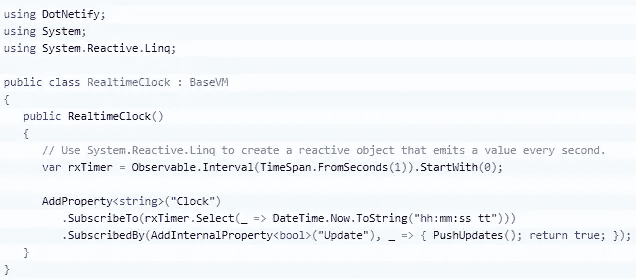
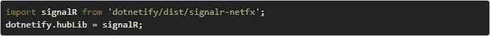
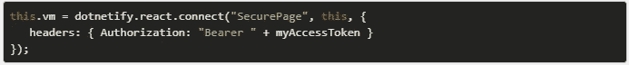
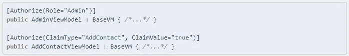
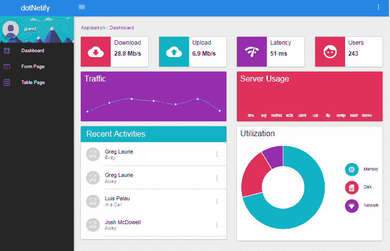
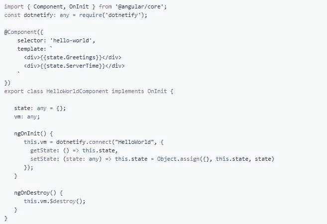

# DotNetify-React 发布:用 React + SignalR 构建反应式 MVVM 应用。网络核心 2.1

> 原文：<https://medium.com/hackernoon/https-hackernoon-com-dotnetify-react-released-efc7de44a47e>

经过一年多的测试，我很高兴地宣布 [dotNetify-React 终于发布了(3.0)](https://github.com/dsuryd/dotNetify) 并准备好在后端定位的 web 应用上使用。网芯 2.1。

DotNetify 是一种简单、轻量级但功能强大的构建实时 web 应用程序的方法。它利用 SignalR [技术](https://hackernoon.com/tagged/technology)在后端 上使用反应式 MVVM 范式 ***来实现基于 WebSocket 的 web 开发。最初创建它是为了与 KnockoutJS 一起工作，现在它可以与 React 和本地 React 一起使用。***

我之前的文章已经触及了反应式[编程](https://hackernoon.com/tagged/programming)和后端 MVVM 的话题；为什么我认为它们是 web 应用程序开发的理想选择，尤其是涉及实时数据编排和可视化的复杂应用程序。

让我们来看看自那以后还有什么新的东西。

# 改进的反应式编程

DotNetify 以反应式视图模型属性的形式添加了对“函数式反应式编程”的一流支持。它们是静态或运行时创建的，可以立即从*系统连接到 Rx APIs。Reactive.Linq* 命名空间。

提供了两个额外的 API 来进一步简化它: *SubscribeTo* 和*subscribe by*。他们在 dispose 上为你处理退订，让你的代码更流畅。例如，下面的简单代码将服务器的时钟实时推送到客户端浏览器:

*Clock* 属性订阅每秒发出一个值的 Rx observable，并将其转换为当前时间。反过来，它被*更新*属性订阅，每次更新时，该属性将*时钟*值推送给客户端。

这种编程风格极具表现力、简洁，并且还有其他好处:

*   数据发布者(可观察对象)和订阅者(观察者)之间保持分离，
*   不需要将视图模型状态公开为公共属性，
*   显式订阅清楚地显示了依赖性和副作用，使事情变得容易推理，并且
*   可以说它最大的好处是:观察者能够订阅多个异步数据流，并通过一组强大的 Rx LINQ 函数以声明方式操纵它们，这些函数可以转换、组合、过滤和创建衍生流。

# SignalR 客户管理

而信号员。NET Core 破坏了与旧版本的兼容性。NET Framework 版本，DotNetify 两者都支持，并提供了一个简单的方法在它们之间切换。默认情况下，它被配置为与. NET 核心后端对话，但是可以用这两行代码进行更改:

您可以配置更多内容，例如，连接丢失时重试的次数、重试间隔、连接状态更改回调和跨域支持。

# 中间件/过滤器管道

DotNetify 允许您编写定制的中间件和过滤器——在到达视图模型之前拦截和转换 WebSocket 请求有效负载的能力，以及传出的响应。

抛出的异常也可以被拦截，并且有一个默认行为向客户端发送异常消息，因此您可以在浏览器的控制台日志中看到它们。

# 基于令牌的认证

对 JWT 认证有现成的支持。客户端具有在初始连接上传递令牌的机制:

通过内置中间件配置后端以提取和验证令牌后，您可以使用视图模型属性来基于声明或角色限制访问:

# 依赖注入

DotNetify 与 ASP.NET 核心 DI 服务集成，这意味着您可以使用内置容器或您最喜欢的 IoC 库来实例化视图模型及其依赖关系。默认的作用域生存期只在 HTTP 请求的上下文中有意义，因此 dotNetify 通过将生存期的作用域设为持久 WebSocket 连接来覆盖它。

# React SPA 模板

去年年底，我发布了一个 dotnet 模板来快速创建一个 React SPA ASP.NET 核心+ WebPack 项目，[在这里写了它](https://hackernoon.com/introducing-real-time-react-spa-template-for-net-core-2-0-f13e64c3b7e9)。此模板以材料 UI 主题中的实时仪表板演示为特色，并已更新以反映此版本。

# Angular 或者 Vue 呢？

虽然目前的重点是让 dotNetify 与 React 配合工作，但让 dotNetify 也与 Angular 或 Vue 配合工作并不需要太多时间。以下是 Angular 的示例:

Vue 也有一些社区努力；[你可以在这里的 Github 问题论坛查看](https://github.com/dsuryd/dotNetify/issues/49)。

# 接下来会发生什么

更令人兴奋的东西正在准备中。再过几周，[***dotNetify-Elements***](https://github.com/dsuryd/dotNetify-Elements)将首次亮相，希望你会发现它非常有用！这是一套后端就绪、可定制的 React 组件，让您可以构建专业外观的 web 应用程序，即使您只有很少的前端经验。一切都是以声明的方式完成的，并且使用了最少的 Javascript。所以，敬请期待！

> **更新:
> dotNetify-Elements 出来了！** [**在这里查看文档和现场演示**](http://www.dotnetify.net/elements/) **。**