# 新时代旅游服务:机器学习和人工智能如何改变行业

> 原文：<https://medium.com/hackernoon/https-hackernoon-com-how-machine-learning-and-ai-are-transforming-the-industry-dd7b91f0d958>

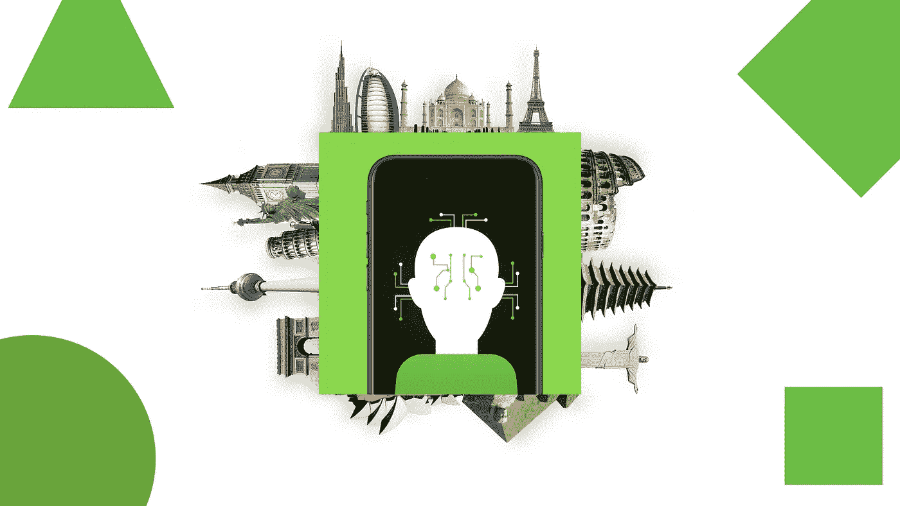

> 这篇关于[机器学习和人工智能在旅游行业](https://djangostars.com/blog/benefits-of-the-use-of-machine-learning-and-ai-in-the-travel-industry/?utm_source=medium&utm_medium=hackernoon.com&utm_campaign=newagetravelservices&utm_content=machine%20learning%20and%20AI%20in%20travel%20industry)的文章由**Alex Bulanov—**Django Stars**的后端工程师撰写。**

> 阅读 Django Stars 博客上的原创文章。

克里斯托弗·哥伦布是历史上最著名的旅行家之一，他一生只进行了 4 次旅行。其中一次旅行花了他将近 6 年的时间来准备、计划和预算。幸运的是，现代旅行者可以在仅仅一年甚至一个月甚至一周内轻松打破那个终身记录(一些铁杆)。

廉价的航班，实惠的酒店价格，以及大量帮助旅行者计划和导航旅行的旅行应用程序，使人们能够更多地旅行。难怪数字旅游销售额预计到 2020 年将突破 8000 亿美元。Kayak、[Booking.com](http://booking.com/)和 Expedia 等应用程序颠覆了旅行社行业，现在正通过使用机器学习进行旅游服务开发来重建全方位服务体验。

尽管看起来很痛苦，但人们实际上喜欢计划他们的旅行，可以花 2 / 4 /(你可以选择)个小时粘在屏幕上寻找最佳地点、最佳行程和最佳价格。这就是机器学习和人工智能发挥作用的时候:通过分析大型数据集，人工智能融合的旅行系统可以为旅行者提供超级个性化的建议。

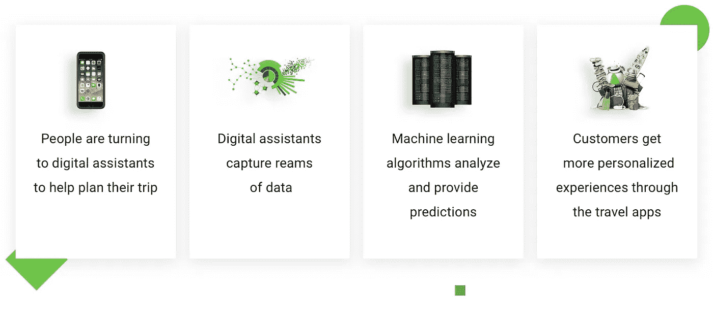

# AI & ML 的螺母和螺栓

越来越难找到一个成功的故事，说明旅游公司 X 如何进行技术改进，使销售额增加 Z%，而没有发现“机器学习”或“人工智能”的字眼。有时互换使用，这两个概念实际上有不同的含义。

人工智能是计算机科学的一个广阔领域，它研究如何教会计算机像人一样思考和行动。

机器学习是 AI 的子集，重要，但不是唯一。简而言之，机器学习就是建立模型，在输入数据的基础上以高精度预测结果。使用统计方法，随着更多的数据被输入系统，它使机器能够提高它们的准确性。

机器学习模型的最终输出取决于:

**1)数据的质量。**数据越多样、越丰富，机器就越能发现模式，结果也就越精确。例如，以下是旅游业提供商获取数据的一些方式和方法:

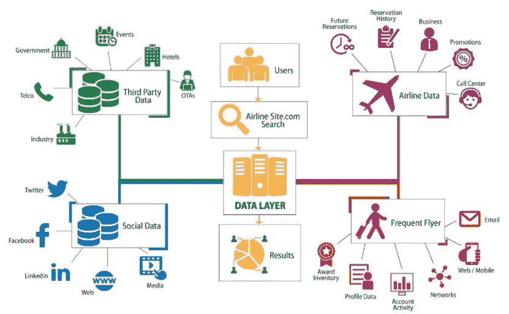

*Image source: Markrs.co*

高质量的数据集通常需求量很大，公司有时不得不寻找合适的数据集。

**2)特征**是现有数据包含的有意义的输入，如用户性别/位置/浏览器扩展等。通常数据有更多的信息需要建立模型，因此有必要选择重要的特征。在此过程中，分析师或建模工具根据属性对分析的有用程度来选择或丢弃属性。

众多的特征使得算法工作得更慢，所以通常数据准备和 having 的过程是整洁的。xlsx 和。csv 文件最终比整个培训过程花费更多的时间。

**3)分析数据的算法**寻找模式或趋势，然后找到创建模型的最佳参数。选择最佳算法来解决特定任务是一项相当具有挑战性的任务，因为每种算法都可能产生不同的结果，其中一些算法会产生不止一种结果。

以下是机器学习驱动的模型是如何构建的:

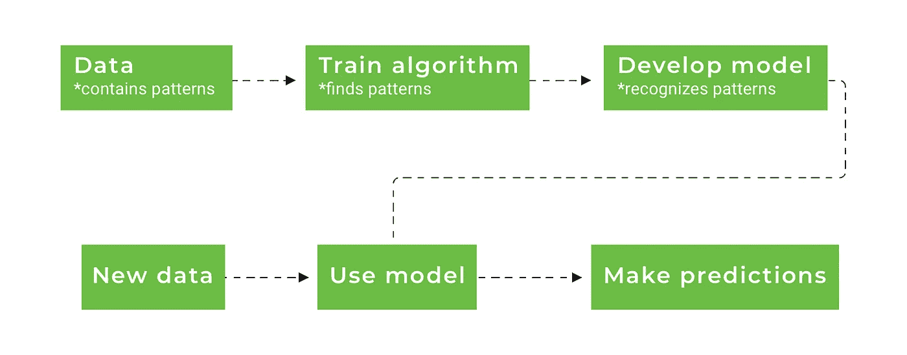

机器学习模型可以胜过传统的僵化的商业智能，在传统的商业智能中，商业规则无法捕捉隐藏的模式。

旅游公司正在积极实施 AI & ML，以深入挖掘可用数据，优化其网站和应用程序的流程，并提供真正卓越的体验。

## 您可能还喜欢:

 [## 如何开发旅游预订服务:来自 PADI 开发团队的 5 条经验

### 易于使用，顺利交易，快速获取信息和交易-热情的旅行者通常使用这些…

djangostars.com](https://djangostars.com/blog/how-to-develop-a-travel-booking-service-padi-travel/?utm_source=medium&utm_medium=hackernoon.com&utm_campaign=newagetravelservices&utm_content=youmayaslolike1) 

# 你随时想要的任何东西的世界。旅游公司如何使用人工智能和机器学习解决方案来取悦客户

旅行是一种高度情绪化的体验，有无数的选择来满足不同预算和类型的旅行者。独自旅行、公司旅行或家庭度假——心中有不同目标的旅行者希望应用程序从一开始就建议正确的套餐。证据如下: [88%的休闲旅行者](https://www.thinkwithgoogle.com/consumer-insights/travel-infographic-mobile-shapes-customer-journey/)如果你的应用程序或网站不能满足他们的需求，他们会换一个不同的应用程序或网站。

[Booking.com](http://booking.com/)在其[调查](https://checkin.booking.com/en-gb/uk/2018/01/11/8-travel-trends-look-2018/)中发现，几乎三分之一(29%)的全球旅行者表示，他们愿意让计算机根据他们之前的旅行历史数据来计划即将到来的旅行，一半(50%)不介意与真人或计算机打交道，只要任何问题都能得到回答。

目前，预订机票、酒店和租车已经完全变成了一种在线体验。因此，我们所有的旅行习惯都有大量的数据，这允许人工智能算法提取大量的见解，并将它们转化为定制的产品和一种新的体验。

谷歌首席执行官桑德尔·皮帅已经讲述了人工智能如何引领世界:

> ***“随着时间的推移，计算机本身——无论它的外形如何——将成为帮助你度过一天的智能助手。我们将从移动优先转向人工智能优先的世界”。***

人工智能是一个强大的工具，可以促进客户与旅游提供商之间的关系，即时丰富体验，并提供无摩擦的体验。以下是人工智能和人工智能在旅游业中最成功的应用:

*   聊天机器人

根据 HubSpot 的研究报告，71%的人使用聊天机器人来快速解决他们的问题。截至目前，我们在酒店领域看到人工智能的最大地方是用于客户服务的聊天机器人。客户服务在旅游业中占有非常重要的位置，聊天机器人可以提供全天候的全面客户支持，从而减轻工作人员的负担。

聊天机器人有两种类型:

**第一种**由一组预先设定好的答案驱动，这些答案由一组规则驱动。这些需要手动编程，并且往往代表一大组常见问题，例如:

*   “明天布鲁克林的天气怎么样？”
*   "下一趟去巴黎的航班是什么时候？"

## 阅读如何创建电报机器人的教程

 [## 如何创建和部署电报机器人？| Python

### (如果你已经知道如何使用你的机器人，你可以跳过它)机器人无处不在。好像就在昨天，我们还做了…

djangostars.com](https://djangostars.com/blog/how-to-create-and-deploy-a-telegram-bot/?utm_source=medium&utm_medium=hackernoon.com&utm_campaign=newagetravelservices&utm_content=readtutorial) 

第二种类型更复杂，由人工智能驱动，它理解语言和命令，并在交互过程中学习。它可以回答一些更复杂的问题，比如:

*   “150 美元能带我去哪里？”
*   “纽约发生了什么事？”

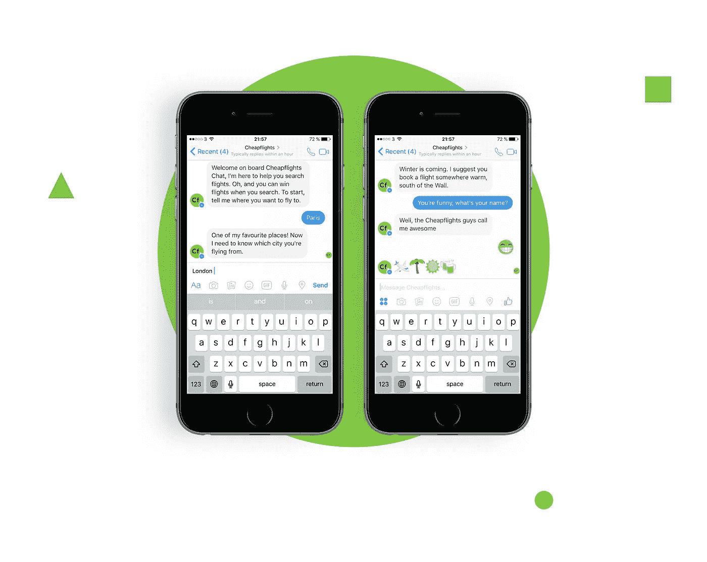

*Image source: JWT Intelligence*

无论白天还是晚上，随时提供即时回答，提供全面的支持，尽管听起来可能很奇怪，但以友好的方式管理与人类的关系。通过适当的预编程，聊天机器人可以增强整个旅行体验，从到达前的自动提醒到建议目的地附近的娱乐场所和交通设施。

如果游客到达一个新的目的地，在游客信息中心撞上了“关闭”的标牌，不用担心——只需轻点几下，他们就可以启动一个机器人，询问他们需要什么。事实上，客户对人工智能聊天机器人的期望很高——他们希望聊天机器人以友好的方式解决他们的问题，而且在紧急情况下提供帮助。下面是用户请求的表达方式:

**Kayak** 因将机器人融入旅行体验而闻名。这个机器人会为你提供完整的信息，包括航班、租车、行程选择，还会告诉你一些活动。此外，它还通过 messenger 向客户发送未来旅行计划的更新信息。

Kayak 首席执行官史蒂夫·哈夫纳说，

> ***“有整整一代人更熟悉通过 Siri 发送短信和语音，他们在寻找与在线旅行社不同的互动方式。我们有与 Alexa 的语音交互，你可以对 Kayak 说，'嘿 Kayak，我今天晚些时候飞往丹佛的航班情况如何？'‘这个周末我可以花 300 美元去哪里？’***

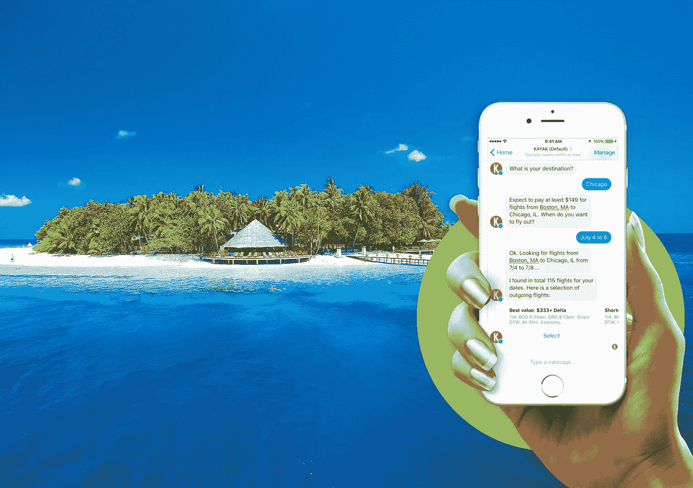

到目前为止，旅游行业出现了一些很棒的聊天机器人，如 Lola，它使用人工智能增强功能来授权旅游顾问，以便他们可以提供完美的旅行。由人工智能驱动的 Mezi，一个可以帮助所有旅行安排的聊天机器人，人工智能由旅行专家训练和改进，或者 Sam，一个帮助提高旅行顾问专业知识的聊天机器人。沃森驱动的“康妮”机器人是为连锁酒店希尔顿开发的，它使用沃森的大脑来帮助客人办理登机手续并推荐当地景点。

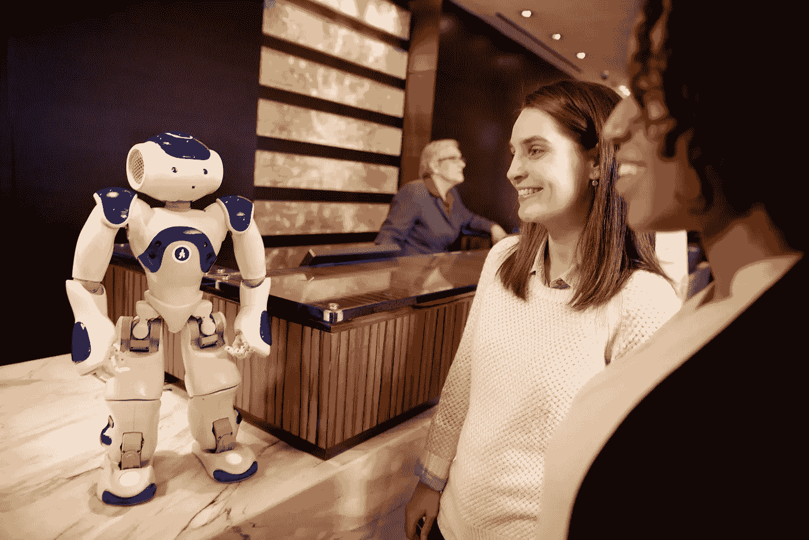

*Image source:* [*theverge.com*](http://theverge.com/)

*   推荐系统

Youtube、Spotify、网飞、[Booking.com](http://booking.com/)——这些领先的公司有一个共同点。这个东西让他们的客户在网站上保持很长时间，对历史和实时数据进行操作，并生成大量的相关命题。

通常，旅行者一旦进入旅游网站或应用程序，就会被信息淹没。另一方面，以正确的方式响应客户日益复杂的期望是一个相当大的挑战。将人工智能和人工智能纳入其业务的酒店和旅游提供商有一张王牌——通过利用大量数据，公司可以更密切地调查客户的行为，并最终提供定制产品。

旅游平台上每个客户的数字足迹使系统能够了解每个客户的需求、预算和偏好，并建议合适的交易。在正确的时间提供正确的建议将有助于增强客户的忠诚度，让他们一次又一次地回来。

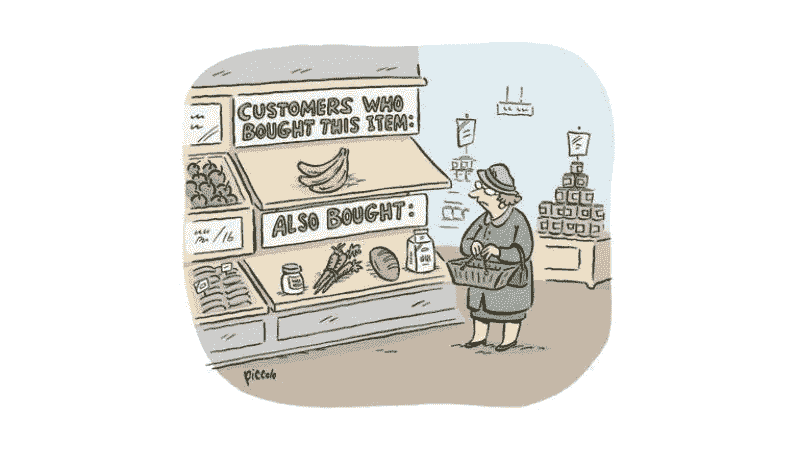

人工智能支持的推荐系统可以输入历史数据，如旅行者以前的预订、行为或实时数据。例如，当这个人打开电子邮件时事通讯时，它会向数据科学家发回一个信号，以便在下一次触摸时合并该信号。

经过处理并与旅行者的背景保持一致后，人工智能支持的推荐系统可以提供卓越的体验。比较这两种情况:

这种量身定制的推荐无疑会提升整体体验。

*   预测:从机票价格到酒店客房供应

“航空公司什么时候降价？”、“周二的航班真的便宜吗？”而且一堆类似的问题，每天都要多次输入谷歌搜索栏。难道它们不是人们渴望找到脑海中出现的最佳价格的最好证据吗？似乎每个人都有这样的情况:你刚刚找到一个好的航班交易，然后过一会儿回到网站，哇！—票价上涨(或者如果你幸运的话，下跌)。

航班价格生成引擎根据特定规则工作，可能会考虑以下一些参数:

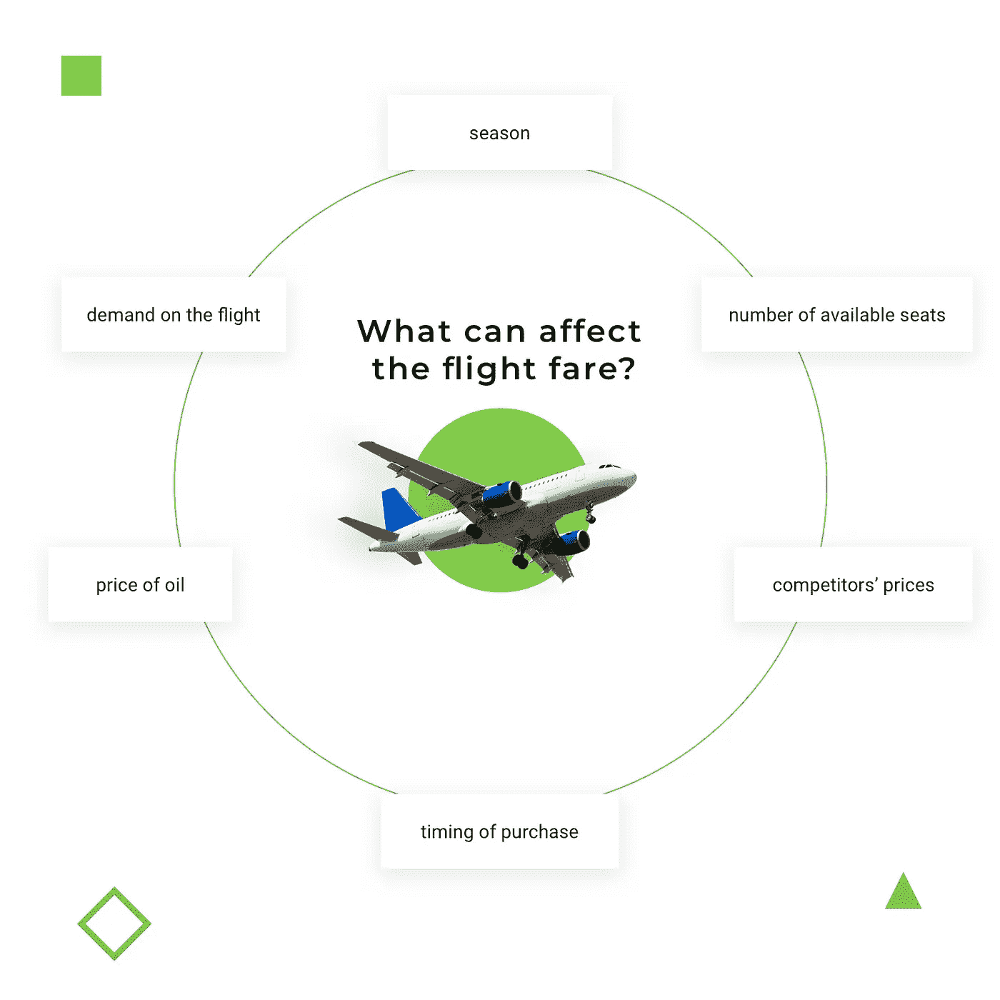

众所周知，机器学习可以发现隐藏的模式，而人类的眼睛甚至可能看不到这些模式。例如，ML 算法可以在票价大幅上涨后检测到异常情况，并考虑导致这种上涨的特征组合。

旅游提供商可以通过利用机器学习来帮助旅行者找到预订酒店或购买廉价机票的最佳时间。当交易变得可用时，应用程序可能会向用户发送通知。

例如，以帮助客户跟踪最佳航班交易而闻名的 [Hopper 应用](https://www.hopper.com/)，最近加入了选择酒店的功能；应用程序中实现的 ML 算法将推荐是否预订酒店或等待价格下降，类似于机票的工作方式。人工智能和预测分析是这一驱动力的核心。使用彩色编码的日历，用红色标记昂贵的日期，用黄色标记适中的日期，用绿色标记最便宜的日期，Hopper 允许用户查看哪些日期会比其他日期更昂贵:

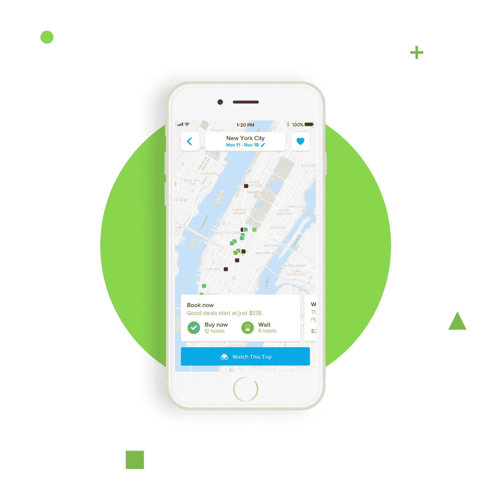

*Image source:* [*theverge.com*](http://theverge.com/)

*   内容监管

对于品牌与顾客的互动来说，内容才是王道，旅游和酒店业也不例外。网站上的一张照片，移动应用程序中的推送通知，新收到的电子邮件，这些只是为旅行者提供所有所需信息的整个内容机器的几个触摸。告知、启发、互动、推动对话——一流的内容总是会引发用户在网站上的活动。

通常，内容监管是一个依赖于人的过程；然而，AI & ML 可能有助于提供个性化和自动化一些日常任务。

Trip Advisor 在重新设计网站时，注意到他们的网站上有很多很棒的照片(超过 1.1 亿张)；然而，你永远不知道哪张照片会先出现。这就是为什么工程团队决定改进照片在不同背景下的显示方式。

该团队可以要求业主对照片进行评级，为他们的列表选择主要照片，并根据场景类型标记照片。在那之后，他们不得不雇佣一大群照片版主来标记、排列和选择照片，但是这又慢又贵。

工程团队从深度学习的角度来完成这项任务。深度学习是机器学习的一个子集，专门用于神经网络架构开发和训练。该团队开发了一个模型，选择有吸引力的相关照片，然后在网站上优先显示它们。只需对比一下他们在实现深度学习模型前后的英雄照片:

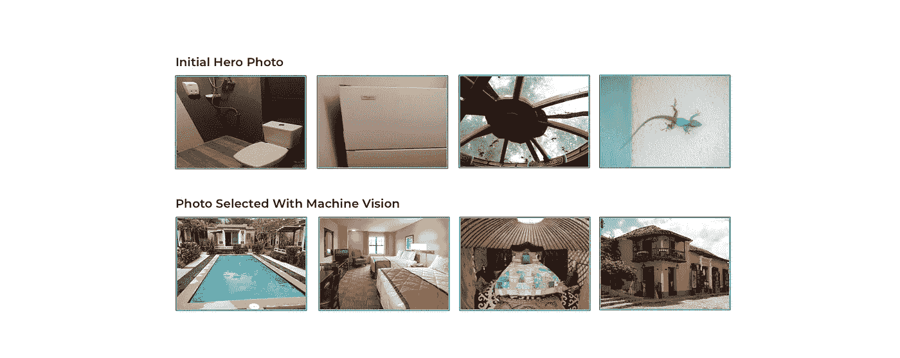

*Image source:* [*tripadvisor.com*](http://tripadvisor.com/)

内容优化中人工智能应用的另一个变革性例子是 Booking.com[的翻译管理。他们是迄今为止最大的旅游运营商，通过神经机器翻译(NMT)提供相关的交流——酒店描述、房间描述和酒店名称被翻译成 43 种语言:](http://booking.com/)

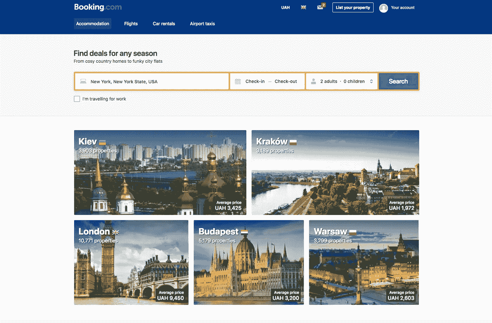

# 也请阅读我们的案例研究

# 用户体验管理

对于旅游行业的企业来说，你的网站/应用程序的客户之旅对公司的成功至关重要。一些数据可以证明:事实上，如果一个网站的内容或布局没有吸引力，38%的人会停止使用它。

ML 可以在不同的点上注入客户的旅程:从灵感、研究、体验到与家人和朋友分享印象。就 UX 而言，旅游提供商面临两大挑战:

*   优化用户交互界面的方式，从点击式模式到更具对话性的模式
*   让选择选项的过程变得简单快捷

人工智能可以从网站上的每一次互动中主动学习，从而优化用户流量。接触点是否过多？在客户旅程的每一点，会有什么建议？每个阶段应该弹出哪些上下文提示？

将人工智能和人工智能应用于 UX 将有助于理解如何设计客户体验。
大量的数据允许追踪:

*   客户最关心的事情是什么？
*   客户的细分是什么？
*   人们在旅途中会从哪里掉下来，最重要的是，为什么？
*   客户生命周期是怎样的？
*   用户能多快找到东西？

Booking.com 的全球客户服务总监詹姆斯·沃特斯说

> ***“由于我们在一个极其个人化、情绪化和复杂的行业中运营，在真正的人际互动和高效的自动化之间保持适当的平衡是我们一直试图在消费者旅程的每个阶段进行微调和优化的事情。”***

Skyscanner 分析了用户在使用该应用程序时经历的客户旅程，发现为了获得他想要的东西，用户必须在应用程序中至少进行 9 步操作和 17 次点击。在那之后，该公司转向用基于人工智能的聊天机器人建立对话界面。

旅游公司将通过跟踪元数据提供更相关的体验，例如:

*   意味着你更愿意离开机场
*   和你一起旅行的同伴
*   无论是出差
*   个人/团体
*   该地点的天气如何

# 旅游业中的机器学习和数据分析:转变商业运作

让我们把话题从客户利益转到业务利益上，因为人工智能和人工智能可以在许多情况下应用于调整业务流程:

**销售优化**

人工智能模型可以在销售漏斗的所有阶段增强销售经理的能力:

*   发现阶段帮助客户找到目的地
*   参与阶段，找出最适合每个客户的选项
*   通过处理众包数据的转化和保留阶段

旅行历史、以前的行为模式、购买历史和加入忠诚度计划——如果这些数据被输入基于人工智能的系统，它可以帮助销售团队生成个性化的旅行套餐。

人工智能和人工智能模型也可以通过应用程序帮助追加销售/交叉销售产品。例如，如果客户更喜欢在商务旅行中开车，并且正在寻找一些酒店报价，则该算法将从整个建议池中获得租车报价。

*Image source:* [*http://gearmark.blogs.com*](http://gearmark.blogs.com/)

**价格优化**

人工智能注入的动态定价技术可以帮助精确定位购买模式，使航空公司可以实时同步其定价策略，并在正确的时间提供正确的价格。

让我们以 Hopper 为例:它鼓励旅行者利用他们的数据驱动技术进行智能购物，这是他们应用的核心。每个用户都有特定的特征，例如更喜欢的飞行日期和时间、购买机票的时间、便利性等。该系统自动检测价格和产品特性之间的正确权衡，并在正确的时间以最优的价格提供相关优惠。

Hopper 在他们的[博客](/@hopper_travel/ai-in-travel-part-1-making-travel-recommendations-733a16d9e010)中写道，他们 90%的销售额直接依赖于应用程序通知:

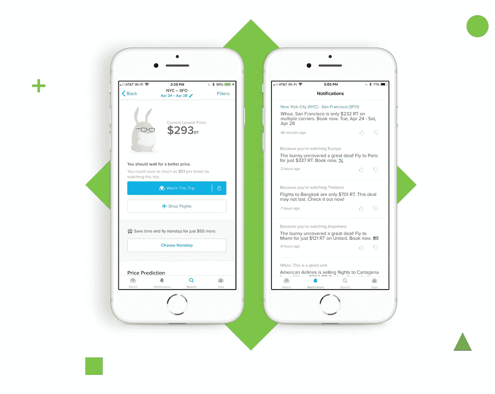

当公司的大部分收入来自特定数量的客户时(就像帕累托法则)，为什么不为公司的忠实客户优化价格呢？
例如，当一个新客户向系统提出一天的需求，而一个忠实客户提出五天的需求时，系统可以为这两种不同类型的客户生成价格。

**营销机会**

在理想的价值链中，来自营销工作和人工智能及人工智能技术的销售收益激励营销人员根据上下文和信息在所有客户的设备上开展所有营销活动。

通过分析 cookies 和设备 id，人工智能系统将允许营销人员通过精确定位，在正确的时间通过正确的设备精准地接触到用户，因此该公司的所有客户都不会被“一刀切”的广告吓倒。

**欺诈检测**

使用自然语言处理、计算机视觉和机器学习的人工智能工具可以实时分析大量数据集和各种数据源。在这些数据的基础上，人工智能系统可以识别异常行为，并创建风险评分，以全面了解每笔支付交易。

AI & ML 可以帮助旅游公司跟踪不同类型的欺诈行为:

*   信用卡信息被盗时的支付欺诈
*   创建假账户
*   内容滥用(如果它们包含评论和其他用户生成的内容)
*   账户接管(忠诚度欺诈)

通过整合人工智能工具，旅游公司将能够识别可信的付款人和不可信的付款人，以高精度和高速度检测异常，从而确保在线交易的安全。

# 结果

有了人工智能和机器学习所建议的各种各样酷而闪亮的东西，很容易捕捉到火花，并陷入“我想要全部”的想法。请记住，技术只有在正确实施时才能发挥作用。考虑以下事项，并在您的企业中推广这些技术:

*   收集质量数据。他们说“垃圾进——垃圾出”，这很刺耳，但却是事实。数据的丰富程度、是否可连接以及如何标记数据都非常重要。数据质量直接影响模型的输出。数据科学家可能会帮助你整理这些数据集，并建立整个系统。
*   *了解你的产品。*是的，这听起来像是“谢谢，显而易见的队长”，但实际上这是任何技术实施的起点。我们 Django Stars 告诉我们的客户，我们可以构建任何复杂的算法，但产品负责人必须清楚地了解如何插入这些算法，商业目标是什么，以及它应该如何工作。
*   *考虑你业务的成熟度。*引入人工智能是一项艰巨的任务，需要非常好的领域知识、高级技能和法律限制知识(例如数据捕获法规)。这就是为什么你可以考虑聘请工程师来协助，因为在公司内部很难找到并留住工程师。
*   关注最重要的事情。“吃到饱”的方法有一点成功的机会。一些模型只给出了 5%的改进，但在大范围内，这是一个实质性的进步，带来了更好的体验和收入。另一方面，专注于人工智能聊天机器人可能会解放你的员工，并将客户体验带到新的水平。

> 如果你觉得这篇文章有用，请点击👏下面的按钮:)