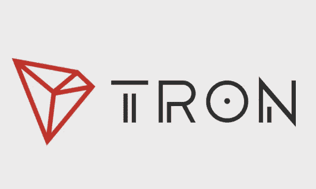

# 贾斯汀·孙的《创:过去、现在和未来的价格分析》

> 原文：<https://medium.com/hackernoon/https-hackernoon-com-justin-suns-tron-complete-analysis-with-expert-review-and-future-price-analysis-61e1475d5276>

Source: Google images

# **了解** [**创**](https://tron.network/index?lng=en)

Justin sun 的 TRON 是一个分散的区块链平台，支持面向全球互联网、媒体和娱乐市场的高吞吐量智能合同。Tron 作为一个优秀的社交媒体平台，允许用户自由交流思想、观点、媒体，而不受任何中间人的干扰。

# **团队的专长:**

Source: Inwara’s ICO database

该项目由首席执行官贾斯汀·孙(Justin Sun)领导，他曾在 [Ripple](https://ripple.com/) 担任首席代表和顾问，并于 2013 年创建了中国最大的直播应用之一 Peiwo。他的教育背景包括宾夕法尼亚大学、北京大学和阿里巴巴集团主席马云创建的盘瓠大学。

根据公司网站，有 100 多名拥有丰富专业知识的员工为 TRON 的研发贡献他们的知识。

TRON 的技术骨干是经验丰富的爱好者，他们曾受雇于阿里巴巴、腾讯和百度等互联网巨头，孙身边有一个全明星导师团队，其中包括和。

## BitTorrent 收购

并购在展示公司的优势和潜在能力，增强投资者信心方面发挥着关键作用。

Tron 以 1 . 4 亿美元收购了 BitTorrent，这是增加其市场空间和用户的一个很好的机会。根据 BitTorrent 的说法，其协议的月用户数高达 1.7 亿。

由于这次收购，Tron 可能会获得一个潜在的网络来帮助挖掘硬币，使用 BitTorrent 的 P2P 架构和庞大的用户网络。

BitTorrent 声称，它的协议在一个典型的日子里转移了多达 40%的世界互联网流量，使其成为当时最大的分散应用程序。

## 价格和投资回报(RoI)分析:

TRX 的峰值价格平均为 0.13 美元，自其主要销售以来，价值上涨了 6742.10%。作为一种替代硬币，这种飙升是 2017 年 12 月至 2018 年 1 月比特币繁荣的必然结果。

Tron 见证了其价格的下一个高峰，即 0.09 美元，在 4 月份测试网(2018 年 3 月 31 日)和主网(2018 年 5 月 31 日)发布之前，其价格上涨了 4636.842%。

Return on Investment (Weekly average)| Source: InWara ICO Database

TRX 投资回报率的第一个低谷发生在 2018 年 1 月的第二周，为 1935.41%，BTC 的价格为 11，188 美元，TRX 为 0.04 美元，与 BTC 平行下跌。

投资回报率的第二个低谷发生在 9 月的第二周，为 917.86%，当时 BTC 为 6300 美元，TRX 为 0.02 美元，这是其价格和投资回报率的历史新低。

# **比赛:**

就他们处理的交易数量而言，以太坊可以被认为是 Tron 的主要竞争对手之一。TRX 一贯处理 2,000 TPS，而以太坊处理 25 TPS，BTC 处理 3 到 6 TPS。

Tron 于 10 月 12 日推出了其虚拟机，10 月 18 日，以太坊记录了 565，791 笔交易，而 Tron 的交易量高达 599，354 笔。显然，创在 TPS 方面对以太坊构成了挑战。

2018 年 10 月 23 日，Tron 在推出赌博 Dapp“Tron bet”后，超过了以太坊的日交易额。

创基金会的首席执行官 Justin Sun 报告说，该组织希望很快允许 Dapps 的广泛展览。Tron 的区块链目前可以处理超过 20，000 TPS，这为大量新开发人员的涌入提供了充足的空间。

# 评估加密令牌:TRX

这里是 Inwara 参考的估值模型[https://docs . Google . com/spreadsheets/d/1 me 8 yljxegocguue 682 TG 061 oxes 0 hkdkqem-f1 uz 4dm/edit？usp =共享](https://docs.google.com/spreadsheets/d/1mE8YLJXegoCGuUe682tG061oXeS0hkdKQEM-F1uz4dM/edit?usp=sharing)

InWara 使用的大多数加密估价模型有四个部分。

*   A 节解释了供应计划的输入和输出
*   B 部分量化了经济投入，并根据计算结果，我们计算了经济和当前效用值
*   C 部分预测了 TRX 在其目标市场的采用率(纳入 B 部分)
*   D 部分说明了使用假定的贴现率从未来效用得出当前市场价值。

从**部分 A** 开始，第 2-11 行用于确定浮动中有多少代币，因此可用于 TRX 经济，第 11 行是特别重要的输出行:债券持有人&之后浮动中的代币数量。

有一定数量的 TRX 代币发行在 ICO 中，在这种情况下，40%的总数将永远存在，或 400 亿 TRX。剩余的代币由早期私人投资者、基金会和创始人锁定，根据货币政策的结构在不同时期授予。

转到 B 部分，让我们深入了解 TRX 的经济。假设 Tron 促成的单位成本每年下降 5%。它解释了计算 TRX 国内生产总值所需的货币基础。

基于全球范围内“在线流媒体”行业的市场估值输入，我们计算了浮动中每个 TRX 令牌的效用值。

*   网络从其饱和百分比的 10%达到 90%所需的时间(接管时间)
*   当网络达到其饱和百分比的 10%时(快速增长的开始)
*   网络将在其目标市场中占有的最大份额(饱和百分比)
*   基准年为 2018 年

请注意，所有蓝色的值都是特别主观的假设。

Graph 1

图表 1 描述了 TRX 每年的当前效用值，而图表 2 指出了从 2018 年到 2025 年每年的产量和渗透率。

Graph 2

加密资产的市场价格基于对加密经济未来规模的预测，以及浮动中每个令牌在未来支持该经济所需的效用值。

最后，考虑第 45 和 46 行，并查看加密资产市场价格的百分比，该百分比由当前效用值与期望效用值组成。

因为我们已经从未来的效用值折回到了现在，有一定比例的价格是由当前的现实支持的($0.026741484)，而其余的是由未来的预期支持的($0.015640291)。

在 TRX 的情况下，资产的市场价值由当前效用值的 128.97%支持，这明显优于目前市场上的大多数加密资产。

*估值模型的灵感来自克里斯·伯尼斯克的* [*文章。*](/@cburniske/cryptoasset-valuations-ac83479ffca7)

免责声明:这不是财务建议。InWara 不提升/降级任何公司/ICO。本信息或其他媒体中的观点、陈述、估计和预测仅属于作者个人。它们不一定反映 [*因瓦拉*](http://www.inwara.com/?utm_source=hackernoon&utm_medium=hackernoon&utm_campaign=tron) *或其任何关联公司(“因瓦拉”)的意见。Inwara 没有义务更新、修改或修正此消息或其他媒体，或以其他方式通知其接收者，如果此处陈述的任何事项或此处陈述的任何意见、预测、预测或估计发生变化或随后变得不准确。本邮件或其他媒体中提供的任何内容、信息和材料均按“原样”提供。Inwara 对其准确性、完整性或及时性，或收件人获得的结果不做任何明示或暗示的保证，并且不对任何收件人在此的任何不准确、错误或遗漏承担任何责任。在不限制上述规定的情况下，Inwara 对任何消息或媒体的接收方不承担任何责任，无论是在合同、侵权行为(包括疏忽)、担保、法规或其他方面，对于此类接收方因其或任何第三方决定的任何行动、意见、建议、预测、判决或任何其他结论或任何行动过程而遭受的任何损失或损害，无论是否基于此处包含的内容、信息或材料。***