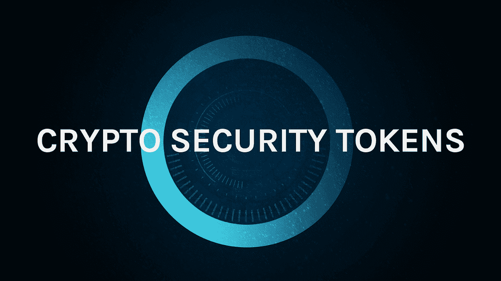
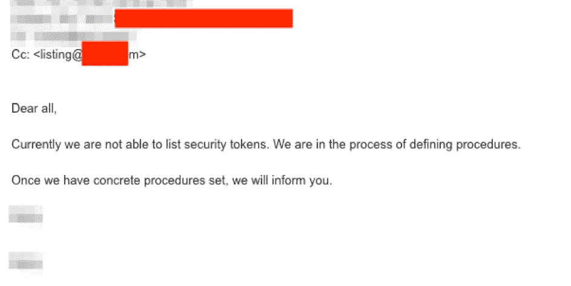
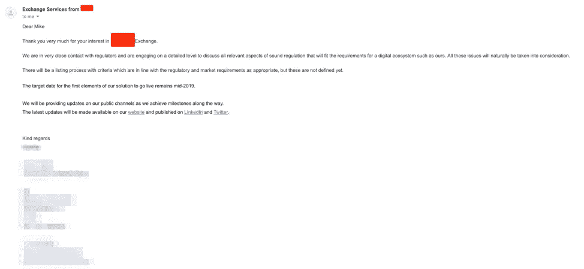
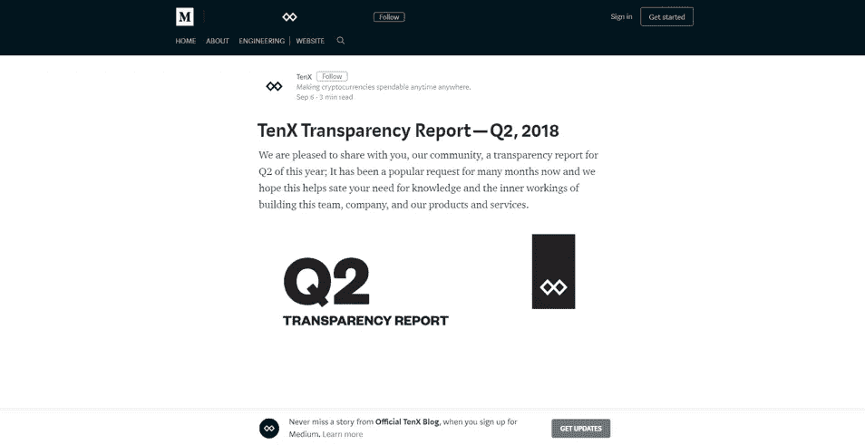

# 加密安全令牌的五个未解决的挑战

> 原文：<https://medium.com/hackernoon/https-hackernoon-com-the-5-unsolved-challenges-of-crypto-security-tokens-4eda8d34cd10>

安全令牌是加密货币生态系统中最新的热门话题。不仅在媒体上，在精明地寻找“区块链下一个杀手级应用”的投资者中也是如此。在 TenX ( [www.tenx.tech](http://www.tenx.tech) )，我们最近在[宣布了我们的 TenX 奖励令牌](https://blog.tenx.tech/en-tenx-rewards-token-faq-3f5a5f6d7848)，作为传统和创新投资工具的组合。然而，在从法律和监管角度定义这种令牌时，我们确实发现了一些挑战，这些挑战可能会使安全令牌的可扩展突破不像希望的那么容易。所以，让我们穿上爱丽丝的密码鞋，爬下兔子洞。

Photo credit: [http://www.disneystoryoriginspodcast.com/07a-alice-in-wonderland-part-1/](http://www.disneystoryoriginspodcast.com/07a-alice-in-wonderland-part-1/)

在世界各地的活动中，当我谈到 TenX 的现状、区块链的未来以及如何成为#cryptofit 时，我会问一个问题，观众是否知道这种被过度宣传的新东西称为加密安全令牌。大多数情况下，房间里只有不到 10%的人知道。考虑到这一点，让我们首先了解一下我们在这里实际谈论的内容:

## **什么是加密安全令牌？**

根据维基百科，代币是“作为事实、品质、感觉等的可见或有形表示的东西。”([https://en.wikipedia.org/wiki/Token](https://en.wikipedia.org/wiki/Token))。在加密术语中，当这种表示不是其完整的区块链时，我们通常称之为令牌，例如比特币等加密货币，而是当它是另一个区块链之上的所有权的一部分时。最著名的例子是由 ERC20 标准([https://theethereum.wiki/w/index.php/ERC20_Token_Standard](https://theethereum.wiki/w/index.php/ERC20_Token_Standard))定义的以太坊区块链上的令牌。在这里，任何创建者都不必建立自己的区块链，而是可以通过定义六个简单的函数来使用以太坊基础设施，在几分钟内生成一个新的令牌。

[https://github.com/ethereum/EIPs/issues/20](https://github.com/ethereum/EIPs/issues/20)

下一个问题是，这样的标记做什么或代表什么。迄今为止，所创建的所有 ERC20 令牌中的绝大多数都是实用令牌，这意味着这些令牌用于某种服务。一个这样的例子是忠诚度计划，这是我们 TenX 目前使用我们的支付令牌([https://coinmarketcap.com/currencies/tenx/](https://coinmarketcap.com/currencies/tenx/))的原因，但它们可以采取其他形式，如虚拟的锁钥匙或其他声明。

## **如何创建令牌？**

大多数情况下，这发生在首次发行硬币(ico)期间，代币发行者(公司)几乎无成本地创造这些代币，并将其出售给公众。迄今为止，这种方法已经让代币发行商赚了数十亿美元。由于大多数公司创造这些代币来筹集资金，这就引出了一个问题，为什么这些代币具有效用函数，而不是像 IPO([【https://www.investopedia.com/terms/i/ipo.asp】](https://www.investopedia.com/terms/i/ipo.asp))期间那样，具有类似房地产的安全性。证券是一种可交易的金融资产，其价值来源于合同债权，如银行存款、债券和股票，通常比商品或房地产等其他有形资产更具流动性，可以在金融市场上交易(【https://en.wikipedia.org/wiki/Financial_asset】T2)。对于一个小的创业公司来说，进行首次公开募股通常过于昂贵，但特别是在过去的两年里，越来越多的声音开始询问为什么不创建一个加密令牌来代表某种所有权、权利或对公司的索赔。这就是加密社区创造的加密安全令牌。

这个想法的主要问题是什么？就像在一个满是密码爱好者的房间里，90%的人不知道密码安全是什么，大多数监管者也不知道。在任何法律制度中都不存在将两个世界的精华相结合的概念，即一方面密码市场的低成本和易管理性，另一方面利用其所有权利创造金融担保的可能性。这是我们企业家为了推动创新而想出的主意。虽然我个人总体上支持“减少监管”，但我确实明白为什么在这种情况下，一些规则是必要的，尤其是为了保护投资者的血汗钱。我是世界各地许多区块链监管工作组的成员，我曾经向任何一个监管机构提出过这个问题，但没有一个监管机构对这种非安全性和安全性的混合体应该是什么样子有答案——目前还没有。

近两年来，“秘密街道上的话”是，这个问题将得到解决。但今天，在 2018 年 11 月底，我们在法律上对这一想法的定义并不比一年前更进一步。一些公司已经在尝试创建安全令牌，那么为什么不“直接去做”呢？因为我们首先要回答以下问题:

"二级市场如何与证券代币合作？"

一级市场是在 STO(证券代币发行)期间，公司向公众出售代币。然而，任何购买这种代币的人都希望有一个退出策略——一个如何从代币中实际获益的计划。完全缺乏流动性的东西不值什么钱，就像那些冻结资产价值数百万美元的人在无法兑现资金时向你证实的那样。我们需要一个二级市场来做到这一点，为此我们必须首先解决一些问题——确切地说是五个问题:

## **问题 1:将代币从 A 人转移到 B 人有什么规则？**

为了将比特币从一个人发送到另一个人，一个人只需要将其发送到另一个人的地址。这同样适用于实用程序令牌。然而，当涉及证券时，我们需要考虑 KYC/KYB(了解你的客户/企业)、年龄、居住地等。例如，在大多数司法管辖区，12 岁的孩子是不允许购买证券的。在一个从设计上来说是开源的、无边界的和抵制审查的系统中，这样的传输限制将如何实施呢？如果我想把苹果股票转让给另一个人，它会在一个中央数据库中注册——当这个数据库是分散的时，它会完全颠倒过来。但是，隧道的尽头有光(希望不是迎面而来的火车 there 令牌标准 1400 及其姊妹标准 1462(也是我们用于 TenX 令牌的标准)将允许将地址列入白名单进行传输，并可以解决这个问题以保持合规性，甚至可能在 2019 年内实现。

ERC 1400: The transfer of security tokens can fail for various reasons in contrast to utility tokens, where in general a transaction only fails because of insufficient account balance.
[https://github.com/ethereum/EIPs/issues/1411](https://github.com/ethereum/EIPs/issues/1411)

## **问题 2:交易所如何处理存款&取款？**

从 KYC/KYB 的角度来看，在交易所交易安全令牌是非常直接的，因为它们可能要求任何用户预先注册和验证，类似于大多数加密交易所已经在做的事情。然而，代币是如何进入交易所的，用户又是如何提取代币的呢？最后是:NYKNYM——不是你的密钥，也不是你的钱——加密生态系统的参与者喜欢控制他们自己的私钥，这意味着在不控制私钥的交易所存储令牌不是一个理想的解决方案。那么，我如何在交易所交易安全令牌，然后提取和/或存入它们呢？在这里，“资金来源”出现了许多不确定性。你最初是怎么得到代币的？如果你的地址没有被列入合适的白名单会怎样？如何证明令牌的所有权？今天，这些问题中只有少数有了答案。此外，我们在 TenX 联系了 23 家加密安全令牌交易所，他们声称已经上线或接近上线，以了解他们对列出安全令牌的要求。答案？大多数人回答说，他们还没有准备好，但很快就会了。一年前，当我们联系 9 家加密安全交易所以获得更多细节时，我收到了同样的答案。我的预测是:即使在 2019 年，也很难看到这方面的进展。一些沙盒可能会出现，就像新加坡设想的那样，但不是我们希望看到的所有访问加密安全令牌交换。

尽管如此，我们在这方面还是相当乐观的，我们可以在与交易所的伙伴关系中作为一个积极的榜样而先行一步。

## 问题 3:作为代币持有者，我应该向谁索赔？

下一个要解决的挑战是找到一个问题的答案，当你对你的令牌不满意时，该去找谁。如果你在 STO 期间从公司购买了你的代币，这个答案很容易，因为只有你和公司。然而，当你在公开的二级市场上购买代币时，该怎么办呢？如果一笔交易没有按计划进行，是公司的错吗？很可能不是，而是交易所或场外交易中的另一方。如果你认为卖家多收了你的代币，该怎么办？代币表现不按计划怎么办？在不受监管的公用事业代币市场中，到目前为止，100%的交易代币都在这个市场中，答案非常清楚:没有太多的规则，因此出现了“不受监管”一词。这些代币并不指望带来任何回报，而是提供一种实用功能，因此对发行公司没有太多的要求。没有内幕交易，如果交易出了问题，唯一可以去的地方就是交易所——他们可能会也可能不会帮你。那么我们在像证券交易所这样的受监管的证券市场就完全相反了。在这里，我们有明确的规则，什么时候交易，什么时候不交易，什么是允许的，什么是不允许的。职责明确。这在安全令牌示例中是如何工作的？这是一个严重的问题，因为当我们想要尽可能多的自由时，我们也想要尽可能多的确定性。两者立场相左。比如内幕交易是如何监管的？如果我在二级市场上购买了代币，但对代币不满意，我该去找谁？这些问题以及许多其他问题还有待回答。这里最难的部分是，答案非常主观，不像之前的问题那样客观可解。谁该负责没有对错。是的，虽然交易所可能有责任，但也可能是卖家或公司。看看这个问题是否会在 2019 年得到解决，以及如果解决了，如何在各种交易所之间建立标准，这将是一件有趣的事情。只有回答了以下两个问题，才有可能得到部分答案。

## 问题 4:作为发行安全令牌的公司，我需要报告什么？

该问题针对执行 STO 的公司以及之后必须执行的报告措施。在大多数股票市场，这些报告每季度发布一次，并且完全标准化。到目前为止，在加密生态系统中，它们几乎是不存在的，因为它们不是发布实用程序令牌所必需的，也没有为安全令牌建立明确的规则。尽管我们没有被要求这样做，但我们 TenX 在令牌销售一年后发布了一份透明度报告，以便向公众通报各种主题，如财务状况、进一步的计划和挑战:[https://blog . TenX . tech/TenX-transparency-report-Q2-2018-98 bb 05 DD 98 b 8](https://blog.tenx.tech/tenx-transparency-report-q2-2018-98bb05dd98b8)迄今为止，只有少数公司效仿，尽管他们获得了数十亿美元，换取了几乎毫无价值的令牌。虽然我完全同意像成熟的上市公司那样的严格报告安排对初创公司来说过于严格和短视，但为了向投资者提供透明度，一些监督绝对是必要的。然而，问题在于细节:这样的报告需要审计吗？它们需要有多详细？以季度或年度为基础来衡量一家可能需要十年才能颠覆一个行业的初创公司公平吗？这些以及更多的问题还有待回答。

TenX 透明度报告— Q2，2018:[https://blog . TenX . tech/TenX-Transparency-Report-Q2-2018-98 bb 05 DD 98 b 8](https://blog.tenx.tech/tenx-transparency-report-q2-2018-98bb05dd98b8)

TenX Transparency Report — Q2, 2018: [https://blog.tenx.tech/tenx-transparency-report-q2-2018-98bb05dd98b8](https://blog.tenx.tech/tenx-transparency-report-q2-2018-98bb05dd98b8)

## **问题 5:代币与标的资产之间的法律联系是什么？**

第五个也是最后一个问题围绕着控制代币和对基础资产拥有有效债权之间的法律联系。一个关于所有权究竟是什么的简单问题并不容易回答。对于黄金，所有权就是拥有实物。对于股票，它是将股票登记在某人的名下。对于房地产来说，这是关于你名下的所有权。但是在区块链上？在这些分散的数据库中，除了允许您向数据库中添加条目的私有密钥之外，您甚至不能拥有任何东西。如果可以证明密钥的所有权，就可以用加密方法证明数字令牌的所有权。但这是一个全新的概念，它还没有显示，如果和如何在法庭上成立。监管机构会接受基于一个数学公式的诉讼吗？这个公式表明，是的，你确实持有某家公司的一些证券代币，尽管这些代币没有以任何人的名义注册。如果两个或两个以上的人都能证明所有权，因为他们都知道私钥，怎么办？列支敦士登似乎是世界上第一个开始在新的区块链法律中解决这些难题的国家，该法律有望在 2019 年生效:[https://www . Liechtenstein . Li/en/news-detail/article/列支敦士登-preining-区块链-act/](https://www.liechtenstein.li/en/news-detail/article/liechtenstein-preparing-blockchain-act/)

它将为如何真正建立代币所有权与其基础资产之间的法律联系奠定基础。

“Consultation launched on Blockchain Act” published by the Government Principality of Liechtenstein from 29th August, 2018

## **是还是不是？**

那么，对于作为区块链下一个杀手级应用的安全令牌来说，这意味着什么呢？Y-combinator 创始人保罗·格拉厄姆说过一句名言:“如果你想知道下一步投资什么技术，看看孩子们和软件开发者在玩什么吧！”按照这句话，你在 2011 年是对的，那时孩子们还在玩比特币来购买游戏中的物品，而你在 2015 年对以太坊是对的。然而，我还没有听说有小孩或软件工程师在玩安全令牌。尽管如此，我仍然相信加密安全令牌有巨大的优势，特别是与公用令牌模型相比，在公用令牌模型中，投资者没有太多的权利，但风险很大。

您如何看待围绕安全令牌的这些挑战？它们会在 2019 年得到解决吗？如果是，如何做，如果不是，为什么不做？请在下面的评论中告诉我，我期待着在未来对这个令人兴奋的话题进行富有成效的讨论。

## 在推特(【www.twitter.com/julianhosp】T4)上关注我，了解更多关于这个话题和其他话题的更新。

— — —

> Julian Hosp 博士是新加坡公司 TenX ( [www.tenx.tech](http://www.tenx.tech) )的联合创始人兼总裁，这是一家领先的区块链公司，致力于在日常生活中随时随地使用加密货币。迄今为止，TenX 已获得超过 1 亿美元的资金。
> 
> 在 TenX 之前，朱利安是一名 10 年的职业运动员和医学博士。他与人合著了 COMIT ( [www.comit.network](http://www.comit.network) )，这是一个开源协议，允许区块链之间的互操作性，将他们连接到一个不可知的网络。
> 
> 他是几本畅销书的作者，如《加密货币简单解释》和《区块链 2.0——不仅仅是比特币》，这些书被翻译成 15 种语言，销量超过 10 万册。
> 
> 他被任命为世界顶级区块链和加密货币专家之一，并在区块链集团和欧盟合作，研究监管、社会影响和经济学等主题。
> 
> 作为 Washington Speakers Bureau 的发言人，他经常被邀请参加全球科技和企业家活动以及世界各地的政府峰会，并且他还是媒体上关于当前区块链趋势、加密货币的未来和最佳实践的定期评论员。