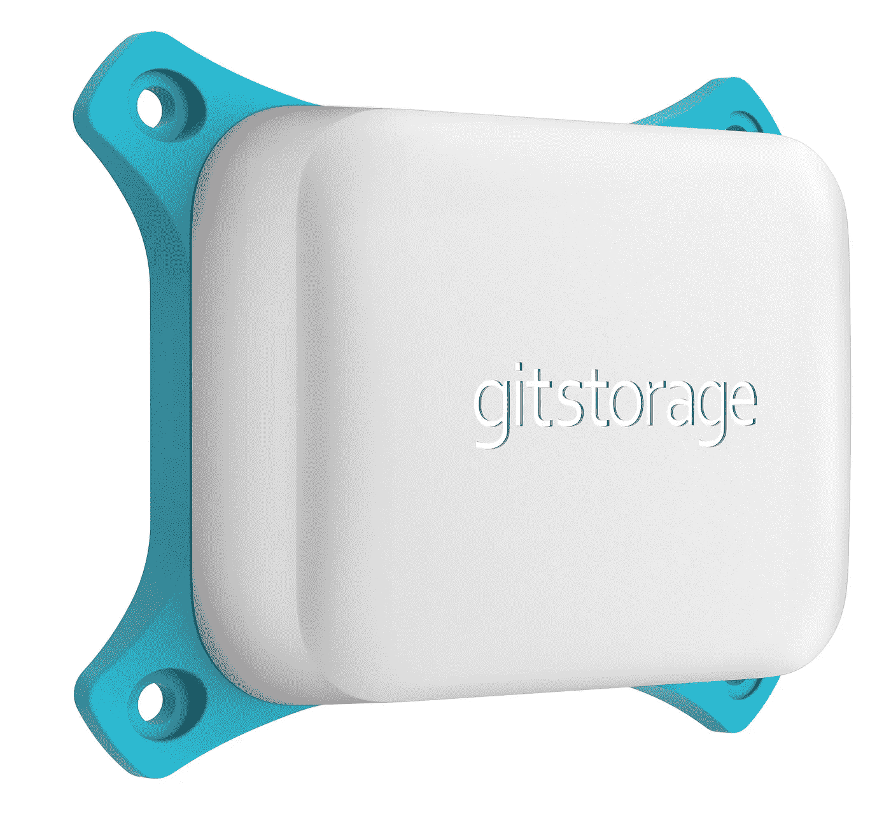

# 这次我们为自己保留了源代码

> 原文：<https://medium.com/hackernoon/https-hackernoon-com-this-time-we-keep-our-source-code-for-ourselves-using-gitstorage-4693e4bdc9de>

*这个故事是与本地源代码安全和协作设备制造商*[*【git storage】*](http://gitstorage.com)*的创始人合作编写的。*

gitstorage model GS64

如今，许多人发现数字货币有很大的价值。然而，现在已经发生了几起硬币被盗的事件，用户们更加小心了，把他们的硬币存在数字钱包里。源代码包含相似的值，有时甚至更多。软件公司因令人瞠目结舌的交易价格而被收购；价值的很大一部分是它们的源代码。正如人们为保护他们的现金、数字或旧学校所做的事情与他们为保护他们的源代码所做的事情之间的差异令人瞠目结舌。

将代码存储在云中是解决这个问题的一种便捷方式。但随着最近出现的一连串安全漏洞，数百万人被最大的公司侵入，每个人都至少有一丝合理的怀疑，他们的知识产权是否真的安全可靠。管理许多存储库的大型主机站点尤其是各种黑客的目标，包括私人的、机构的甚至是政府的。对许多人来说，毕竟保持源代码私有更多的是副业而不是他们的主要目标。

黑客可以跳出框框思考。他们会雇佣一个漂亮的女孩让一个年轻的系统管理员泄露一两个备份吗？或者他们会尝试利用漏洞吗？也许托管公司正在使用共享硬件，CPU 错误可能会泄露虚拟化容器之外的信息？或者派一个老派间谍进入公司来完成任务。他甚至会因此得到报酬:现在很难找到好的系统管理员。谁检查这个？联邦调查局。管理层？每个人都很忙。很可能我们永远也不会知道。

建立自己的服务器是一个解决方案，但也伴随着挑战。安装和维护服务器不再是一项简单的任务。那些尝试过的人发现很容易意外地暴露你所有的源代码。配置中看似很小的故障可能已经让公众可以访问代码，而用户甚至没有意识到这一点。虽然局域网通常提供某种舒适，但它实际上可以像公共互联网一样狂野。每一台个人电脑、每一部手机、每一个设备都可能包含这种免费软件，它可以侵入本地网络，并成为黑客四处寻找的中心。

偷姑且说现金和源代码的区别在于，你知道你的现金什么时候被偷了；它不见了。但当有人窃取你的源代码时，他们通常不会留下任何痕迹；它还在你存放它的地方。但是你可能会发现你的竞争对手对你的产品了解太多，或者你的产品被打开了后门。关于风险有多大的统计数据还没有真正记录下来，所以很难说代码被盗了多少次。

如果你曾经想知道为什么来自遥远国家的竞争对手发布了你仍在开发的功能，或者有人写了一个你甚至没有意识到的软件错误，是时候问问你自己你的代码是否已经落入坏人之手了。如果你的竞争对手在销售方面非常积极，也许他们在收集信息方面也非常积极。如果他们雇佣公司来获取信息，这甚至可能看起来像是一件道德的事情，就像一个人可能雇佣私人侦探来收集关于你的竞争对手的情报一样。让别人去做脏活吧。谁在乎他们是否走得太远。

我们可能永远无法确定我们是否是这种行业间谍活动的受害者。也许我们的竞争对手只是工作更努力。我们能做的是通过降低被黑的风险来保护未来的项目。这就是我们启动 gitstorage 项目的原因:确保我们接下来做的任何事情都不会被遗忘。在一台设备上物理存储和加密数据，该设备上没有运行任何可能导致泄漏的其他设备，将数据备份到加密的云，并且只有我们自己的系统管理员可以访问服务器。我们了解我们信任的人。

GitStorage introduction video

即使我们只是为自己使用这个设备，这个项目也已经是成功的了。我们确信还有其他公司也想用这样的设备为自己保留代码。

*感谢您阅读这篇文章。如果您有兴趣进一步了解该产品，请访问 gitstorage.com***。你也可以通过给 info@gitstorage.com 发邮件或打电话+1–617–399–8179 与开发团队聊天。**