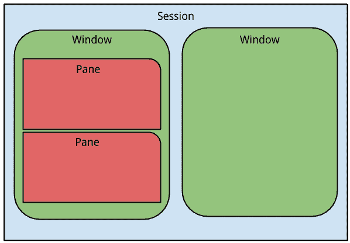
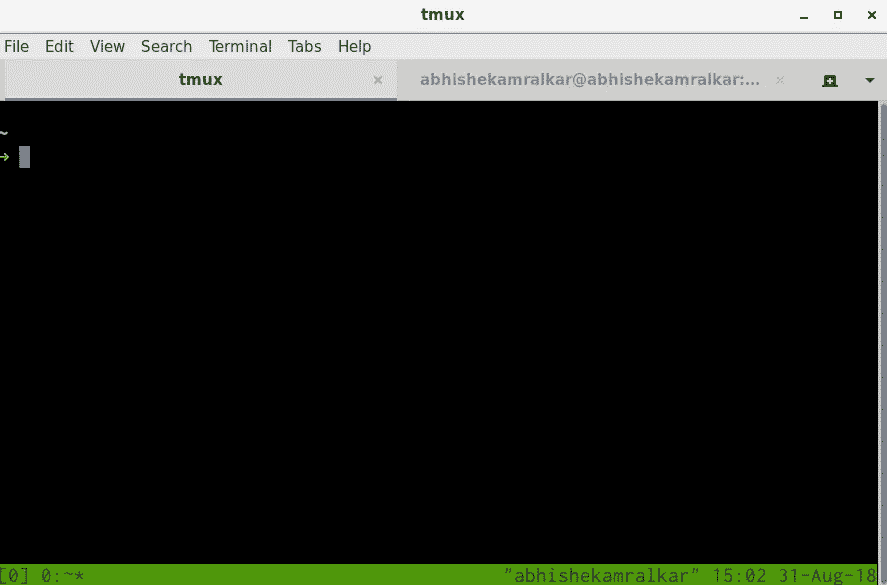
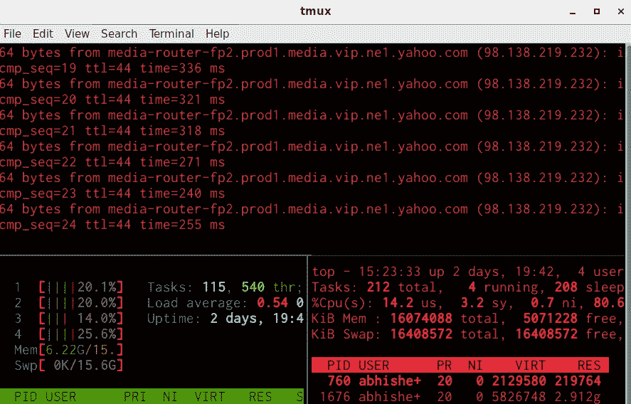

# tmux——忍者

> 原文：<https://medium.com/hackernoon/https-medium-com-aamralkar-tmux-for-ninjas-5c38a1a51dc2>

我用 Tmux 已经很久了。终端多路复用器。Tmux 是一个漂亮的工具，让你的终端更强大。一旦你安装了 Tmux，你的终端可以被分成多个会话，并且可以增加并行性。



*   一个会话可以有多个窗口。
*   一个*窗口*是一个单一视图。
*   一个窗口可以进一步分割成窗格。

Tmux 安装非常简单。几乎所有主流 linux 发行版中都有它的软件包。

Tmux 可以用下面的命令安装在所有主流的 Linux/mac 上。

```
**For Debian/Ubuntu distributions**sudo apt-get install tmux**For Fedora distribution**sudo dnf install tmux**And For RPM based distributions**sudo yum install tmux**For Mac**brew install tmux**For Windows**Sorry Not Available
```

`prefix + d`是默认的，但我确实使用了`prefix + t` ，这意味着你将首先点击(并释放)`Control + b`，然后键入`d`。

# 会议

对于您的第一个会话，只需在终端中键入 tmux:

```
tmux
```

这将创建一个新的 tmux 会话。一旦你运行上面的命令，你会看到你的终端如下所示。



只需使用 exit 退出您的 tmux 第一个会话。请记住 ctrl + b 是您的默认前缀。

**注意:- (=前缀 ctrl +b)**

# 窗格

终端可以进一步分成许多窗格。**前缀+ %** 用于垂直拆分，**前缀+ "** 用于水平拆分。



> 要在窗格之间导航，请使用前缀+箭头键。
> 
> 要关闭窗格，请按 ctrl+d 或直接退出。
> 
> 要使窗格全尺寸，只需点击前缀+ z。
> 
> 在不同窗格前缀+ o 之间切换
> 
> 同时在窗格中显示时钟点击前缀+ t。

# 一些有用的命令

1.  列出所有正在运行的会话

```
tmux ls
```

您应该会看到上面命令的如下输出

> **0: 1 窗口(创建于 Fri 2018 年 8 月 31 日 15:10:27)【173 x45】(附后)**

2.在 tmux 中启动名为的新会话

```
tmux new -s abhishekamralkar
```

请将 abhishekamralkar 更改为您想要的会话名称。

3.要附加到会话

```
tmux a -t 0
```

上面的命令将用户连接到会话 0。

要检查 tmux 中所有可用的命令都运行了什么

```
prefix + ?
```