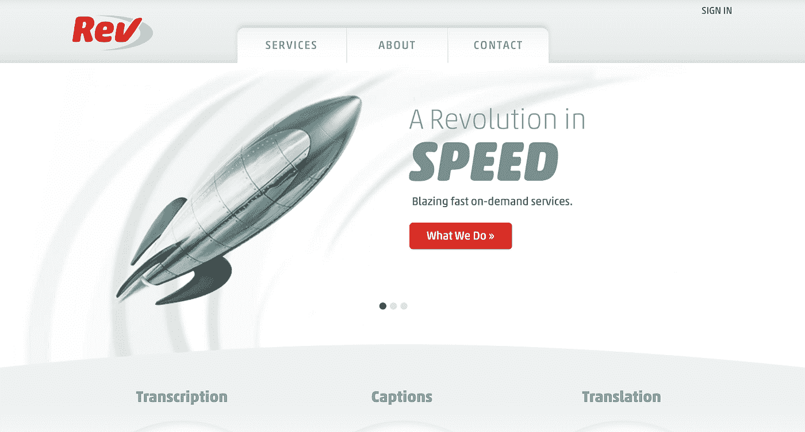
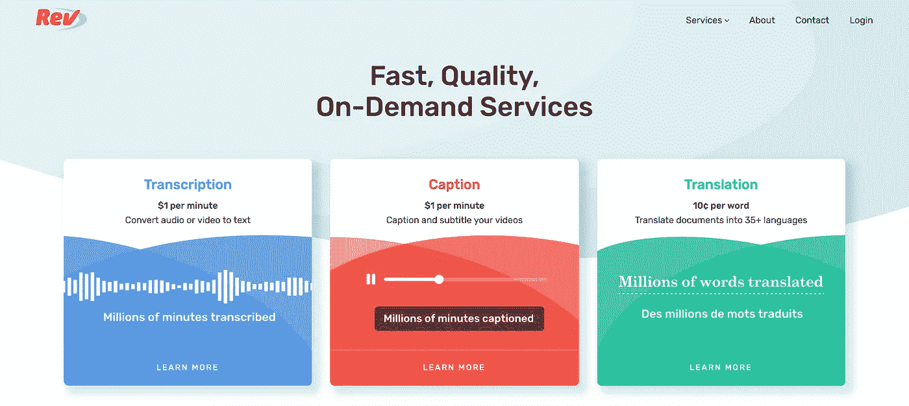

# 完整的网站重新设计:好、坏、丑

> 原文：<https://medium.com/hackernoon/https-medium-com-barroncaster-full-website-redesign-the-good-the-bad-and-the-ugly-8129fbc005d8>

我领导了 9 个月的过程来更新 Rev.com 的网站。

每次我向参与网站重新设计的人寻求建议时，他们都会向我表示哀悼，并说我将经历一段漫长而颠簸的旅程。我们确实遇到了一些障碍，但最终还是创建了一个网站，提高了员工的幸福感，并取得了成效(转化率提高了 18%)。

Rev’s old homepage was designed to resemble speed but grew dated (new homepage at end of post)

如果你正在考虑重新设计你的网站的漫长而复杂的过程，我希望这篇文章能让你的生活变得更容易。

完整的网站重新设计名声不佳，主要有三个原因:

1.  **超预算**:它们很贵。
2.  **超时**:他们需要时间和资源。
3.  过度情绪化:不是每个人都同意设计。

在介绍减轻这些的过程之前，我想分享一下我在这个项目中最大的起伏。

# 我最大的错误:

1.  在获得许多定价选项之前，我不知道预算是多少。一开始没有人知道什么是合适的。
2.  **与超出预算的人一起浪费时间**(例如 [MetaLab](https://metalab.co) )
3.  没有要求精确的工程估算。导致构建时间的缓冲区太小以及**不准确的截止日期**。
4.  **在实施阶段沟通不够**。
5.  **没有直接参与但为了项目不得不放弃内部资源的领导的认同**。
6.  浪费时间考虑向客户推广项目。相反，我们只是扳动了开关，没有客户困惑。

# 我最大的胜利:

1.  与一个伟大的团队合作。让其他事情变得简单。
2.  **结果**:转化率提升 18%。
3.  一个决策者与委员会设计。
4.  在不激怒人们的情况下，以统一的方式收集广泛的反馈(通过 Slack 频道和冗长、具体的谷歌表格)。
5.  **在设计中不断沟通**，没有*太多*不必要的会议。
6.  显然**遵循了下面的过程**。

# 运气:

我们的内部设计师坚持让我们与外部人员合作完成大部分设计工作。我们与一位不可思议的设计师合作——Jackie Ngo。不可能再有比她更有才华的设计师了，由于她彻底的过程和技巧，她很容易共事。

这是帮助我们成功重新设计网站的过程——你会注意到它与任何大型项目都相似。

# 步骤 0:定义并包括所有关键的利益相关者。

在开始之前，获得认同，为自己的成功做好准备。让每个人都参与进来是很重要的，即使是那些在后期阶段才需要的人(例如工程人员)。

如果有人在这个项目中有股份，他们需要成为这个团体的一部分。在流程的每一步都继续与该团队沟通。

我在这里的主要错误是，在我们接近实现步骤之前，没有包括所有的工程领导。如果他们在早期就知道项目的细节，那么我们就可以避免围绕项目目标的一些误解，并且会更加团结地工作。每个人参与的越多，项目的运行就越顺利。

**关键问题:**

1.  *谁需要参与流程的每一步？*
2.  *我怎样才能让每个人都参与进来，而不召开不必要的会议？*

# 第一步:定义问题。

在开始之前知道你期望的结果是什么。导致全面重新设计的常见问题包括不一致的信息、过时的品牌、糟糕的信息架构和不响应的设计。Rev 面临着一些这样的问题。

低转换率并不是完全重新设计的好理由。相反，通过更传统的测试框架来提高转化率。

在开始这个项目之前，我收集了定性和定量的数据来帮助说明我们的问题。最有力的定性数据是一项员工调查，我问他们与我们网站的关系如何。调查的结论是，目前的员工不认为网站过时的品牌是公司的准确代表，并积极损害招聘工作。

最有力的定量数据是基于当前 UX 的从客户到非必要页面的页面浏览量。

收集了这些信息后，我创建了一个完整的文档，以便更广泛地共享。当人们询问目的或预期结果时，分享这份文件节省了我大量的时间。

**关键问题:**

1.  我们试图实现什么样的业务目标？
2.  我们期待什么样的结果？他们现实吗？
3.  有没有更快更便宜的方法可以达到同样的效果？

# 第二步:定义范围。

在你知道你的目标是什么之后，围绕范围的对话将会变得更加容易。

推动做最少的量，以满足最初的问题陈述。不要把你想在这个项目中做的每一个网站改动都塞进去(例如，我一直讨厌页脚的这一块)。这需要提醒主要利益相关者主要目标，通常是多次提醒。

减少脂肪。

**关键问题:**

1.  什么在范围内？(整个网站、营销页面、信息架构)
2.  *这会影响品牌吗？*(标志、颜色、字体)
3.  *最低工作量是多少？*

# 第三步:定义过程。

您必须定义所需的每个步骤以及相关的时间表。当你这样做时，对每一步都要清楚和现实。然后建立一个时间缓冲，以达到最乐观的估计。任何像这样的大型项目，都会有突发事件把它往后推。

关键是最大限度地降低你过度承诺和兑现不足的风险。

我没有建立一个合适的工程缓冲区，这导致了团队在过程后期的挫折。

**关键问题**

1.  *有哪些步骤？*
2.  *在最好的情况下，每一项需要多长时间？最坏的情况？*
3.  *我如何准确地为参与项目的人设定期望？*

# 第四步:定义预算。

你越快弄清楚每件作品的总预算是多少，剩下的过程就越容易。

从我的谈话中，我发现与一个自由职业者合作进行重新设计要花费 250-15000 美元。我会对低端市场保持警惕，因为这里充满了未经验证的设计师，他们试图建立自己的作品组合，但有时这是必要的。

与代理公司合作的费用是 800-20 万美元。高端市场做了令人难以置信的工作，但超出了大多数(*所有*)初创公司的价格范围。

**关键问题**

1.  *你愿意每一步投入多少？*
2.  你会选择内部公司、代理公司还是承包商？

# 第五步:选择你的合作伙伴。

根据你的预算和目标，审查和选择你的设计公司，品牌专家，标志设计师，自由职业者等。

彻底搜索(研究以前的项目，寻求推荐，了解他们的过程和他们如何沟通)。你会花很多时间和你的伴侣在一起，所以你需要确保每个人都在同一页上。

我们找了一个顶级的自由职业者。Rev 喜欢与自由职业者一起工作，因为他们可以更好地融入你的工作流程，而且他们不会收取额外费用来维持公司的运转。

# 第六步:执行。

通过澄清上面的一切，执行阶段就没有风险了。

Rev’s new homepage matches who we are: High-quality, trustworthy, modern, and fast

# 结论

Rev 的重新设计实现了我们最初设定的所有目标。员工和客户对新网站都很满意。新客户从我们这里购买更多。

所有这些都是通过 9 个月的工作完成的，以实现品牌的现代化，在主页上直观地排列我们服务的优先顺序，更新文本使其更加简洁，改变登录页面的视觉层次结构，确保网站在所有设备上看起来都很好，并使导航更加直观。

这是一个漫长而复杂的过程，却结出了丰硕的果实。

如果你正在考虑重新设计，我希望这能帮助你理解与大项目相关的权衡。对 Rev 来说，我们无法用其他方法解决问题。

*特别感谢所有使这一切成为可能的人:* [*达斯汀·麦考伊*](https://www.linkedin.com/in/dustinmccoy/) *(我的工程同行)，杰基 Ngo(设计师)，老虎团队(这个项目的 Rev 工程师和设计师的跨职能团队)，以及 Rev 管理团队。*