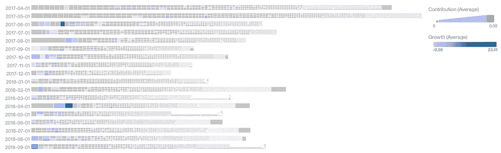

# 人工智能与中期选举

> 原文：<https://medium.com/hackernoon/https-medium-com-economymonitor-political-risk-forecasting-44322f5c8c62>

## 人工智能能改善中期预测吗？

Intelligence for the decisions that matter. Photo by [Andy Kelly](https://unsplash.com/photos/0E_vhMVqL9g?utm_source=unsplash&utm_medium=referral&utm_content=creditCopyText) on [Unsplash](https://unsplash.com/search/photos/ai?utm_source=unsplash&utm_medium=referral&utm_content=creditCopyText)

# 上下文意识

AI 大于机器学习。我们周围的物理世界和我们的社会不断地计算自己。美化的统计模型告诉我们昨天的世界是怎样的，上次选举发生了什么，如果我们的机器不能感知今天对人类来说什么是重要的，人类优先事项的突然和微妙的变化，这有什么用？

> 人们用选票和钱包投票

当人们把钱放在桌子上时，他们真的很在乎——一个通过政治捐款对一项事业做出实质性承诺的选民不去投票是不可能的。对信任度 **的**测量是机器可以依赖的信号**(驱动程序)。但也有可能在扩大开支后，由于资源分配不当而输掉比赛。幸运的是，一旦有了目的，机器就擅长计划。因此，政治活动需要理解那些信任信号和**优化目标**。**

# 在线投稿平台

我们研究在线贡献平台的用户行为，以发现哪些活动更成功/不太成功——然后我们单独研究这些活动，以了解*为什么*它们会成功。

由于这是一种基于公开数据的定量宏观方法，我们在任何时候都不会访问个人的私有数据——我们只关心群体行为和观察到的概率(实际发生了什么)。这些数据是针对特定时间段(例如，过去 2 年中的任何一个月)生成的，或者是针对营销活动财务领域中几乎实时的时间生成的(2 天前到连续 4 周)。权衡新近性允许我们考虑动量的影响。

## **MyNGP**

一个很好的例子是 NGP 平台。

The popularity of campaign contributions

该图显示了数以千计的收集捐款的活动和运动。有些可能在某个时刻吸引了大量的注意力，但无法持续增长。有些是常青树:它们在刚开始生长的几个月后就爆发了。大多数都太小，不可能产生任何持久的影响。还有鲸鱼:占了几十个小的候选人或原因。但是怎么做呢？

你会发现各种各样的惊喜。例如，民主党人利用共和党人的提议来推进他们自己的叙事，就像 Actblue (Actblue 是民主党人经常光顾的另一个筹款平台)的顶级捐款页面之一的情况一样，它不是关于民主党人，而是关于一项事业，实际上是利用前共和党总统候选人的地位作为“税收公平”的宣传。

其他服务，如 Anedot，在共和党候选人中很受欢迎，值得研究以制定涵盖多个角度的数字竞选战略。

通过这种宣传活动，他们可以将自己的表现与本党内最成功的表现进行比较，也可以在相互竞争的政党之间进行比较——然后，复制行之有效的策略。

# 增强人类的智力

很多时候，投票和筹款历史等传统方法并不确定——一些席位太接近了。甚至可能出现“专家”预测和基于可比的统计方法完全不适用的情况。在这些情况下，人工智能的**嵌入式智能**能够感知和计算**信念共识**——即那些真正关注和投入资源的人——类似于职业赌徒。

因为即使是内特·西尔弗[538](https://medium.com/u/2e5f29790cac?source=post_page-----44322f5c8c62--------------------------------)有时也不得不掷硬币。

Fivethirtyeight, ABC

# 政治权力下放的兴起

主要的一点是，在大多数小地区的竞选活动中，流量非常低——他们没有强有力的在线媒体战略。

一般来说，候选人品牌效应强、价值主张/信息/形象清晰响亮的页面表现良好。简单地要求预先付款的网页表现不佳。

A bad way to ask for money, is to do nothing more than asking for money

但是还有一些更基本的事情正在发生:政治融资的分散化。人们可以从点对点(P2P)短信的流行中看出来；在过去的选举中，比特币社区支持自由主义者、绿党和桑德斯；移动应用作为社交媒体替代品的出现，传达了一种话语，并建立了基层运动。

A **政治风险 AI** 特别擅长做群组分析，显示热门政治应用用户的“流失”模式。有了这些见解，你就能明白什么时候你会“失去”你的选民的注意力，什么时候应该安排重新参与的活动。举个例子，

1.你可以抓住对你的竞争对手感兴趣的选民的注意力。

2.你可以*重新抓住*访问过你的筹款平台的人的注意力，即使他们没有承诺资金。

手头有了这些信息，运营实施就简单了:活动可以在他们所在的地方吸引人，或者使用程序化营销服务在这些地方专门显示广告(例如，他们在哪里何时消费新闻)。没有这方面的知识，你将是在黑暗中拍摄，并燃烧推广预算。

一个典型的例子:一名候选人没有赢得他所在国会选区的初选，但收到了 80，000 笔在线捐款。在特定月份，他的网站的桌面用户大多是男性(51.84%)，年龄在 65 岁以上(22.61%)。另一方面，移动用户主要是女性(59.2%)，年龄在 55-64 岁之间(22.84%)。年轻一代(千禧一代等)在这两种情况下都只占一小部分。这种差异很重要，因为当月该网站有 72.89%的访问量来自移动设备，这表明在覆盖范围方面存在“盲点”——或者说有机会让该人群(约 1.91 万名女性)成为旗手。

候选人拥有强大的个人品牌，来自谷歌等搜索引擎的 60.44%的访问来自候选人的姓名查询(约 4630 次访问)，使用付费广告获得这些访问的每次点击成本为 0.34 美元。他的强大候选品牌的另一个标志是，网站 81.14%的访问是直接的(不是来自电子邮件或搜索)，超过 70%的访问者在离开网站前检查了 1 个以上的页面。

在他的案例中，筹款只进行了一半:他需要情报数据来了解他的政治努力在哪里处于危险之中。

数字领域是注意力的竞争——如果人们对当地政治感兴趣，但没有花时间在你的网站或你的竞争对手身上，他们可能会在犹豫不决的地方闲逛。而今天，这恰好是移动，人们重复使用的少数应用程序，以及他们在生活和政治交汇处的跨应用程序使用。

## 基于由[https://www.economymonitor.com](https://www.economymonitor.com)开发的政治风险预测算法

新兴市场的珀西·维尼加斯也是《T2:信任不对称》的作者，该书由 T4 施普林格出版社出版。