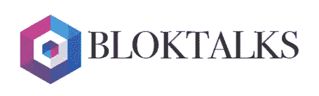
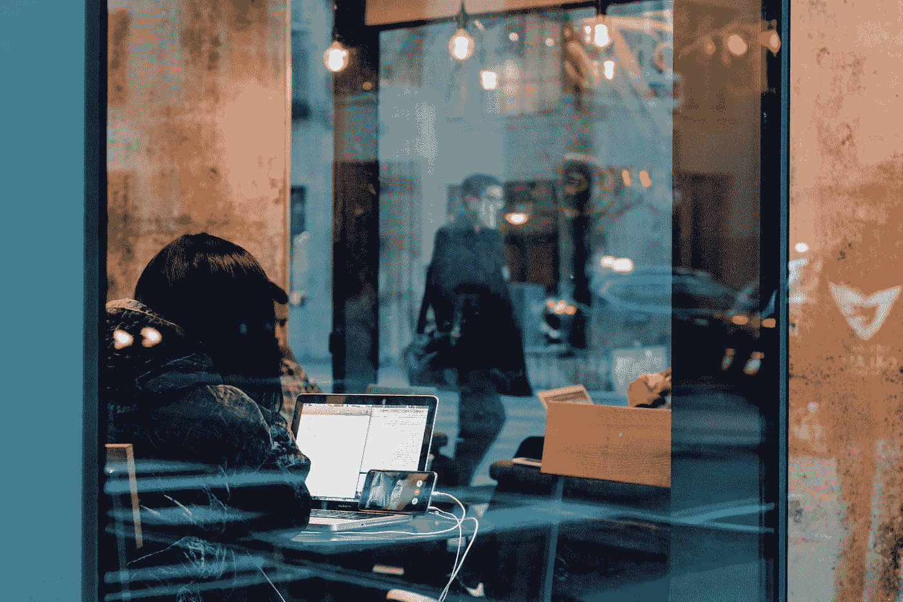

# 为区块链中的包容性社区 Bloktalks 访谈

> 原文：<https://medium.com/hackernoon/https-medium-com-gabriellemic-miamis-blockchain-band-interview-with-robin-lam-ceo-bloktalks-11a54362701c>

我最近很高兴在佛罗里达州国际大学(FIU)莫德斯托·麦迪克校区与迈阿密[区块链](https://hackernoon.com/tagged/blockchain)协会的联合创始人和 [#Bloktalks](https://bloktalks.com/) 、[、 Robin Lam](https://www.linkedin.com/in/robin-lam-a76899154/) 的首席执行官聊天。该组织每月举办大型聚会和众多与初创公司、投资者、爱好者和专业人士的网络活动，以及教育研讨会，以了解更多关于区块链和加密货币的信息。

*(为了清晰、流畅和突出重点，本次采访对话已经过编辑)。*

## **告诉我们更多关于 Bloktalks 的信息以及迈阿密区块链协会的基本介绍。**

它始于 2017 年 9 月，我和我的联合创始人 Dax 以及其他 3 个人，他们只是想见面讨论加密货币。所以我们都在布里克尔的蓝色马提尼酒吧度过了快乐时光，这是一次聚会，最终我们呆了大约 5 个小时，谈论了所有关于加密和区块链的事情。进行得非常顺利，从那以后我们心想，“好吧，我们再开一次会吧！”。我们只是邀请任何我们认为想与其他人讨论这些相同话题的人——我们慢慢地增长到 5 人，然后 7 人，然后 40 人，100 人，300 人，等等——现在我们的 [Telegram](https://t.me/BlokTalks) 小组有 600 名成员，并且还在增长。

## **经典问题:你是如何同时涉足区块链和加密货币的？**

我在 2011 年左右开始接触加密货币，是我的一个朋友建议我研究这种在线数字货币，这是任何政府都无法控制的。所以我有点感兴趣，当时我肯定放了大约 100 美元进去，然后不假思索地把它忘了。

区块链本身，以及围绕这项新技术的许多项目，主要是在去年 2017 年 3 月左右开始出现的，当时我开始阅读更多关于以太坊、智能合约和其他新区块链协议等内容。货币+技术是我感兴趣的时候。

Photo by [Markus Spiske](https://unsplash.com/@markusspiske?utm_source=medium&utm_medium=referral) on [Unsplash](https://unsplash.com?utm_source=medium&utm_medium=referral)

## 对于世界和社区在过去几年的发展，你有什么想法？

在围绕它的对话中，我可以看到逐渐的演变，特别是加密货币的概念，从“*看起来像一个骗局*”到“*看起来很有趣*”。总的来说，这个空间呈现出一种全新的身份，从以前的更“*”变成了这些“*蓬勃发展的利基社区*”，甚至有了自己的行话或对未来影响的不同看法。除了作为关键词的加密货币和所有的猜测之外，令人欣慰的是，它正在变成一种更加进化的文化和语言——HODL，“到月亮”等等。*

*也有许多人反对批评者和怀疑论者，他们变得非常有影响力，并主张区块链解决许多问题的潜力，如双重支出，或对系统的信任，或中央集权。*

## ***你对中央集权的问题有什么看法？***

*问题是太多的权力集中在一件事上，而这件事从来没有好结果。权力过于集中，你知道变革不会那么快发生，这也让人们不太容易接受变革。控制使移动东西变得更加困难；控制让任何人都更难放弃它。这里的区别是，这项技术和这种新的去中心化趋势不依赖于任何一个人，而是依赖于每个人对系统的信任，而不是需要依赖于信任(对不可信的行为者)。*

**

*Photo by [Tim Gouw](https://unsplash.com/@punttim?utm_source=medium&utm_medium=referral) on [Unsplash](https://unsplash.com?utm_source=medium&utm_medium=referral)*

## ***为什么你所做的对社区很重要？***

*我们意识到，总的来说，确实缺乏教育。我们的目标并不是最高级的用户，而是对*感兴趣*和*好奇*和*的人想要了解更多*。基础对于接纳新人来说非常重要，这给了他们理解基础知识的方法。*

*如果你持怀疑态度，我无法改变你的想法。但是，如果你乐于接受，但犹豫不决或不知道从哪里开始，并想知道如何“进入”以产生更大的影响，那么这些人就是我们试图接触的人。如果你害怕某件事，你就不太可能去冒险——没有这一点，就没有自由流动的想法和可以建立的东西。我们的最终目标是让尽可能多的人接受教育，这将有望让他们从那里开始构建更好的想法。*

> *加布里埃尔:“Bloktalks 以这种方式肯定有一个更具包容性的观点，让那些可能受过更多“有限”教育，但有“无限”好奇心的人参与到一些他们可以产生真正影响的事情中，并实际上进一步发展社区——他们可能被认为是“边缘”的人，或者更多的是没有做过的事情的人(T21)和过去没有去过的人(T23)。”*
> 
> *罗宾:“是的，当然。”*

## *您认为现有的和正在建设的基础设施可以改进吗？如何改进？*

*区块链技术非常新。几乎所有学到的东西，即使对于“高端”和有才华的开发人员来说，仍然是通过早期的试错，这很好。然而，当有资源帮助其他人看到另一个人的尝试和错误时，因为它是开放和共享的，这确实可以帮助加速学习，加速采用，并加速建立“桥梁”项目。*

*创造某种东西，在“传统”发展世界和“区块链”发展世界之间架起一座桥梁，以缩小这些差距，这一点很重要。很难找到资金作为连接两者的中介，我认为这是问题的一大部分，可以得到解决。*

**

*Photo by [Scott Rodgerson](https://unsplash.com/@scottrodgerson?utm_source=medium&utm_medium=referral) on [Unsplash](https://unsplash.com?utm_source=medium&utm_medium=referral)*

## ***你的短期远景是什么样的，你想为 Bloktalks 做些什么？***

*我们希望最终创造一个超级会议——在迈阿密，由迈阿密举办。过去，许多外部活动和会议进来，拿走了所有的钱，而*没有为社区做出任何贡献*:没有教育平台，没有慈善捐款，什么都没有。我们希望与迈阿密的团体合作，促进他们的项目，为他们争取观众，并在大范围内做出这种贡献。希望我们也能创建类似基金的东西，在事件发生后继续构建循环。我们目前正在与一些不同的团体合作，如 Hyperledger Consortium，希望我们可以共同成功实现超级会议的目标，以支持我们的本地生态系统。*

## ***在长远的未来，你能想象并希望看到区块链发生的最宏伟的愿景是什么？***

*我希望看到区块链成为一项革命性的技术，远离加密货币的炒作和投机。你可以创建一个分类帐，而不需要符号化，或者附加一些经济驱动的东西。人们已经越来越关注更多通过现实世界应用创新区块链的项目，我希望这能继续成功区分普通公众对区块链和加密货币的理解。*

> *#Bloktalks 和迈阿密区块链协会欢迎所有人——作为南佛罗里达同类社区中规模最大、发展最快的社区之一，该团体对任何真正感兴趣或只是好奇的人开放:*

*   **区块链和去中心化**
*   *[*比特币*](https://hackernoon.com/tagged/bitcoin) *、以太坊和智能合约**
*   **密码交易**
*   **挖掘比特币和其他山寨币**
*   **ICOs，cryptonews，法律合规**

## *点击此处了解更多关于社区的信息:*

*[www.t.me/BlokTalks](http://www.t.me/BlokTalks)|[http://www.instagram.com/BlokTalks](http://www.instagram.com/BlokTalks)|[http://www.facebook.com/MiamiBlockchainSociety](http://www.facebook.com/MiamiBlockchainSociety)|[http://www.twitter.com/BlokTalks](http://www.twitter.com/BlokTalks)*

*支持#WomeninBlockchain，在 Twitter 上关注 Gabrielle (@gabriellemic) [，或者点击此处查看更多信息和联系方式:](https://twitter.com/gabriellemic)*

 *[## 加布里埃尔·米凯莱蒂

### 人物角色

加布里埃尔设计](http://gabriellemic.design/)*