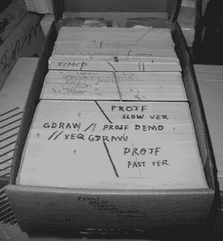
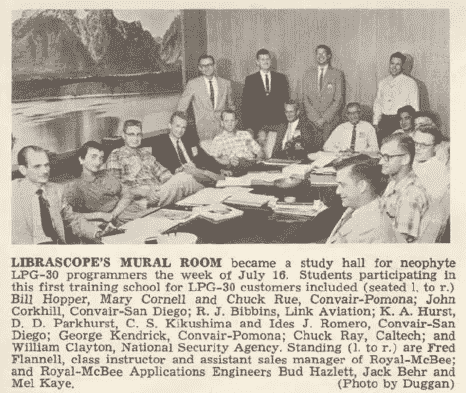

# 大铁:1960-1970

> 原文：<https://medium.com/hackernoon/https-medium-com-it-explained-for-normal-people-big-iron-6aee4e32ed51>

## 个人编程史的第二章

## 当恐龙在地球上漫游时

第一台计算机在当时价值数百万美元，相当于今天的数千万美元。制造它们的公司一年最多卖几十个。被称为大型机的计算机本身和制造它们的公司都是巨大、缓慢、笨重的野兽。编程是一项缓慢而笨拙的任务。

七十年代以前，程序员不像今天这样直接“在计算机上”编码。程序员手写或输入代码。然后它被数据录入员(有时是程序员自己)转换成 3 . 5 英寸高的穿孔卡片。每一张穿孔卡片都是一个程序的一行，上帝保佑那些卡片叠被打翻或掉落的程序员，因为只有最昂贵的穿孔机器在生产卡片时才给卡片编号。



程序员发明了各种各样的技巧，为他们将遭受这种命运的悲伤的一天做准备。注意左边卡片边缘上用马克笔画的对角线。如果(或者更常见的是，*当*有人掉了一叠卡片，对角线会有助于将它们排成一行，并按正确的顺序放回原处。

一旦卡片被重新分类——不再有难看的表情——程序员将在计算机上请求一些时间，并将这批穿孔卡片提交给一个队列(上面的方框是一个队列)。没那么花哨吧。).

在高峰时期，排队等待提交一批卡是很常见的。一段时间后(几个小时甚至几天)，计算机操作员会运行程序，打印出的结果会和穿孔卡一起返回给程序员。如果没有结果，或者有错误，程序员就通读他们的代码，寻找错误，并与穿孔卡进行比较，看是否在穿孔卡上出现了印刷错误。

许多早期生产率的提高仅仅是在这个过程中减少周期时间的进步。最终穿孔卡片变得过时了。

## 一台电脑，一个操作系统

大型计算机制造商，如 Rand/Sperry、IBM、Burroughs 和 Honeywell，会为他们推向市场的每一种新的计算机型号创建一个操作系统。操作系统是一种特殊的程序，它控制硬件并提供对计算机上运行的所有其他程序的硬件访问。在 1964 年之前，除了自己独特的操作系统之外，几乎没有一种计算机硬件能够运行任何东西。

1964 年，随着带有 OS/360 操作系统的 IBM System/360 计算机系列的推出，生产率有所提高。这一系列的计算机首次通过一个通用的操作系统在该系列的所有计算机之间提供了互操作性。这意味着在一种型号的计算机上编写的程序可以在该系列的任何其他计算机上运行，而不需要重写或重新编译。这本身就是生产率的一个重大提高，但它也允许程序员在更昂贵、更大容量的计算机上运行或生产之前，在相对便宜的机器上测试代码(更容易获得时间)，从而进一步提高生产率。

系统 360 也是一台流行的计算机(和数字设备 PDP-10 一起)用于*的分时服务*。分时服务局将使用一组电传打字机从同时工作的多个程序员那里收集程序，然后通过调制解调器将程序发送到大型计算机，利用“空闲周期”来执行，即 CPU 不被更高优先级的作业使用的时候。

这是交互式编程的开端。然而，它仍然不像今天。有了电动打字机而不是屏幕，十秒钟的反应时间被认为是很快的，等待几分钟或几小时才能看到程序的结果是很平常的事。尽管如此，与穿孔卡片相比，这仍是一个巨大的进步。

虽然 System/360 推出了使用阴极射线管(CRT)的 IBM 2250 视频显示终端(VDT ),但电传终端仍然更受欢迎。只要看看 2250 的价格就知道为什么了。一场展览花费了超过 25 万美元*。这相当于今天的 200 万美元，相当于 System/360 计算机本身的成本。直到 20 世纪 70 年代末，视频显示终端的成本才低到足以取代电传打字机。*

*在我看来，System/360 对这个世界唯一最持久的贡献是弗雷德·布鲁克斯的书，神话中的人月。但是这本书要到十年后才会出版，所以你必须等我在本系列的后续文章中告诉你更多的内容。*

## *更小、更快、更好*

*1965 年，一家名为数字设备公司的新贵公司推出了一款名为 PDP-8 的小型计算机。它是*迷你*，因为它只有*的*冰箱那么大。它也有一个迷你价格。人们可以用与一台 System/360 相同的价格购买一打 PDP-8。这意味着十几个程序员可以各自拥有一台“专用”计算机来工作，而以前从未接触过计算机的人现在可以了。PDP-8 之后是 PDP-10，正如我提到的，PDP-10 有助于创建时间共享，也是最终成为互联网的研究项目的支柱，这反过来又创建了[黑客社区](http://www.catb.org/jargon/html/T/timesharing.html)。如今，计算机领域的许多名人都是从分时服务起家的。*

*在这个十年的末尾，一个时代即将结束。大型计算机制造商正处于他们看不见的悬崖边缘。小型机和个人电脑即将改变世界。在此之前，硬件设计一直是电气工程师公认的科学和职业，而编程是有真正职业(如数学或物理)的人出于个人兴趣从事的副业。但随着计算机科学学科的出现，这种情况发生了变化，计算机科学专注于将编程和软件作为创新的引擎。软件最终会变得比硬件更重要，在这方面最有影响力的两个人是唐纳德·克努特和埃德格·迪克斯特拉。*

## *编程成熟了*

*很遗憾，我不会在这里写太多关于 Knuth 的内容。他确实是计算机历史上最有影响力的人之一，但是他的工作是精炼的，高度数学化的，没有对数学语言的广泛和非常坚实的理解的任何人都无法理解。就我个人而言，我花了一天的时间才读完他的《计算机编程的艺术》一页，七卷中的第一卷长达 2000 页。你可能已经猜到了:我从未完成它。见鬼，克努特从来没有完成它！50 年后，他只出版了七卷中第四卷的第一部分。他的工作在使计算合法化和推动其成为一门科学方面做了很多工作，然而在我看来，他在提高编程的生产率方面并没有起到太大的作用，而这正是这本书的内容。*

*Dijkstra 是一位荷兰物理学家和数学家，他爱上了编程。Dijkstra 害怕离开令人尊敬的物理学家的职业去追求大多数人认为是爱好的东西，他的老板说服了他，这位数学家放弃了学术数学生涯，选择了编程，他对他说“自动计算机会一直存在，我们才刚刚开始，不能让[他，Dijkstra]成为在未来几年使编程成为令人尊敬的学科的人之一？”。*

*Dijkstra 接受了挑战，并开始致力于这样做。*

*为了避免读者认为我夸大了 1957 年人们对克明的看法，请允许我提供以下 anecdote⁴:的例子:当迪杰斯特拉与玛丽亚·c·德贝茨结婚时，他被要求作为结婚仪式的一部分陈述他的职业。他声称自己是程序员，但当局不接受，因为当时在荷兰没有这种职业。*

*Dijkstra 和其他学者，如尼古拉斯·沃斯，将他们的大部分努力集中在 ALGOL(在本系列的第一部分中介绍)上，作为他们所谓的“结构化编程”的旗手。这是否意味着汇编、FORTRAN 和 COBOL 中的所有编程都是非结构化的？在某种程度上，是的，我将在下面进一步解释。*

*在编程历史的前二十年，这个领域的大多数程序员，那些编写在现实生活中使用的程序的人，都是自学的。没有程序员学校，没有正式的实践，没有知识体系，没有可言的纪律。程序员要么从导师那里学习，要么追求自己的个人本能和直觉。*

*说明这一现实的一个真正令人愉快的故事是艾德·纳特于 1983 年在⁵的新闻网上发布的梅尔的故事。梅尔是一名裸机程序员。事实上，术语文件条目“裸机”指的就是这个故事。*

*如果你不理解下面故事中的每个单词或技术细节，不要担心，你仍然会喜欢它，并且我相信你会得到要点。这是对一封写给 *Datamation* 杂志编辑的有点严肃的信的幽默半开玩笑的回应，这封信重复了上世纪 80 年代的*真正的男人不吃乳蛋饼*的比喻，标题是 [*真正的程序员不使用帕斯卡*](http://www.ee.ryerson.ca/~elf/hack/realmen.html) *⁶* ，作者在信中声称 FORTRAN 是“真正的程序员”会使用的唯一语言。Pascal 是一种非常结构化的语言，可能是所有语言中最结构化的。我会在故事结束后解释这一点。*

> *[梅尔的故事](#The_Story_of_Mel)*
> 
> *最近一篇致力于编程“大男子主义”一面的文章做了一个直率而不加掩饰的陈述:*
> 
> *真正的程序员用 Fortran 写。*
> 
> *也许现在他们知道了，在这个充斥着淡啤酒、计算器和“用户友好”软件的颓废时代，但回到过去的好时光，当“软件”这个词听起来很有趣，真正的计算机是由鼓和真空管组成的，真正的程序员用机器代码编写。不是 Fortran。不是拉特福。甚至不是汇编语言。机器代码。原始的，未经修饰的，难以理解的十六进制数字。直接。*
> 
> *为了避免新一代的程序员在对这段辉煌历史的无知中成长，我觉得有责任尽我所能通过代沟来描述一个真正的程序员是如何写代码的。我会叫他梅尔，因为那是他的名字。*
> 
> *我第一次见到梅尔是在我为皇家麦克比计算机公司工作的时候，该公司是打字机公司的一个现已解散的子公司。该公司生产了 LGP-30，一种小型、廉价(以当时的标准来看)的鼓式内存计算机，并且刚刚开始生产 RPC-4000，一种改进很多的、更大、更好、更快的鼓式内存计算机。内核成本太高，而且也不是长久之计。(这就是为什么你没听说过公司，或者电脑。)*
> 
> *我受雇为这个新奇迹编写一个 Fortran 编译器，梅尔是我的向导。梅尔不赞成编译器。*
> 
> *“如果一个程序不能重写自己的代码，”他问道，“那它有什么用？”*
> 
> *梅尔用十六进制写了公司最流行的计算机程序。它运行在 LGP-30 上，并在电脑展上与潜在客户玩 21 点。它的效果总是引人注目。每次展会上 LGP-30 的展位都挤满了人，IBM 的销售人员站在一起互相交谈。这是否真的能卖出电脑是我们从未讨论过的问题。*
> 
> *梅尔的工作是为 RPC-4000 重新编写 21 点程序。(港口？那是什么意思？)新计算机有一个 1 加 1 的寻址方案，其中每条机器指令除了操作码和所需操作数的地址之外，还有第二个地址，表明下一条指令在转鼓上的位置。用现代的说法，每一个指令后面都有一个 GO TO！把那个放进帕斯卡的烟斗里，然后抽。*
> 
> *梅尔喜欢 RPC-4000，因为他可以优化他的代码:也就是说，在鼓上定位指令，以便当一个指令完成它的工作时，下一个指令将到达“读取头”并可立即执行。有一个程序来做这项工作，一个“优化汇编程序”，但梅尔拒绝使用它。*
> 
> *“你永远不知道它会把东西放在哪里”，他解释道，“所以你必须使用不同的常数”。*
> 
> *过了很久我才明白那句话。由于 Mel 知道每个操作码的数值，并且分配了自己的鼓地址，所以他写的每个指令也可以被认为是一个数值常数。比如说，他可以选择一个更早的“加法”指令，然后乘以它，如果它有正确的数值的话。其他人不容易修改他的代码。*
> 
> *我将 Mel 的手工优化程序与优化汇编程序处理过的相同代码进行了比较，Mel 的程序总是运行得更快。那是因为“自顶向下”的程序设计方法还没有被发明出来，而且梅尔也不会使用它。他首先编写程序循环的最里面的部分，这样他们就可以优先选择磁鼓上的最佳地址位置。优化汇编器不够聪明，不能那样做。*
> 
> *Mel 也从未编写过时间延迟循环，即使当这个笨拙的 Flexowriter 需要输出字符之间的延迟才能正常工作时。他只是把指令放在鼓上，这样当需要的时候，每一个连续的指令都刚好经过读头；为了找到下一条指令，磁鼓必须再转一整圈。他为这一过程创造了一个令人难忘的术语。虽然“最佳”是一个绝对的术语，就像“独特的”一样，但它成为了一种常见的口头惯例，使其成为相对的:“不太最佳”或“不太最佳”或“不太最佳”。梅尔称最大时间延迟位置为“最讨厌的”。*
> 
> *在他完成 21 点程序并让它运行之后，(他自豪地说，“甚至连初始化器都优化了”)他收到了销售部门的更改请求。该程序使用一个优雅的(优化的)随机数发生器来洗牌和发牌，一些销售人员认为这太公平了，因为有时顾客会输。他们希望梅尔修改程序，这样，在控制台上设置一个感应开关，他们就可以改变赔率，让顾客赢。*
> 
> *梅尔犹豫了。他觉得这显然是不诚实的，事实也的确如此，这侵犯了他作为程序员的个人尊严，事实也的确如此，所以他拒绝这么做。首席销售员和梅尔谈了谈，大老板也谈了谈，在老板的敦促下，还有几个程序员同事。梅尔最终让步并写了代码，但他把测试弄反了，而且，当感觉开关打开时，程序会作弊，每次都赢。梅尔对此很高兴，声称他的潜意识是不受控制的道德，并坚决拒绝修复它。*
> 
> *在梅尔为了更环保的薪水离开公司后，大老板让我看一下代码，看看能不能找到测试并反转它。我有点不情愿地同意去看看。追踪梅尔的代码是一次真正的冒险。*
> 
> *我经常觉得编程是一种艺术形式，它的真正价值只有精通同样神秘艺术的人才能欣赏；有可爱的宝石和辉煌的政变隐藏从人类的观点和钦佩，有时永远，由过程的本质。你可以通过阅读一个人的代码，甚至是十六进制代码，来了解他的很多信息。我认为梅尔是一个无名的天才。*
> 
> *也许最让我震惊的是，我发现了一个没有经过测试的无辜循环。没有测试。*无*。常识告诉我们，这必须是一个封闭的循环，程序将永远无休止地循环。然而，程序控制正好穿过它，安全地从另一边出来了。我花了两周时间才弄明白。*
> 
> *RPC-4000 计算机有一个真正现代化的设备，叫做索引寄存器。它允许程序员编写一个内部使用索引指令的程序循环；每次通过时，变址寄存器中的数字被加到该指令的地址上，因此它将指向一系列数据中的下一个数据。他只需要在每次通过时增加索引寄存器。梅尔从来没用过。*
> 
> *相反，他会将指令放入机器寄存器，在它的地址上加 1，然后存储回来。然后，他将直接从寄存器执行修改后的指令。编写循环时考虑了额外的执行时间——就在这条指令完成时，下一条指令就在磁鼓的读取头下，准备就绪。但是这个循环中没有测试。*
> 
> *当我注意到索引寄存器位(位于指令字中的地址和操作码之间的位)被打开时，重要的线索出现了——然而 Mel 从未使用过索引寄存器，一直让它为零。灯一亮，我就几乎看不见了。*
> 
> *他将正在处理的数据放在内存顶部附近，这是指令可以寻址的最大位置，因此，在处理完最后一个数据后，增加指令地址会使其溢出。进位会给操作码加一，把它变成指令集中的下一条指令:跳转指令。果然，下一个程序指令在地址位置零，程序愉快地继续前进。*
> 
> *我没有和 Mel 保持联系，所以我不知道他是否曾经屈服于那些逝去的日子以来淹没编程技术的变革浪潮。我倾向于认为他没有。无论如何，我被深深地打动了，以至于我放弃了寻找令人不快的测试，告诉大老板我找不到它。他似乎并不惊讶。*
> 
> *当我离开公司的时候，如果你打开正确的感应开关，21 点程序仍然会作弊，我认为应该是这样。我对破解真正的程序员的代码感到不舒服。*

**

*Mel Kaye, standing, far right.*

*正如这个故事精彩地展示的那样，最初几代程序员非常习惯于随心所欲，使用特殊的方法和高度个人化的编程风格。有时他们对学者和他们促进结构化编程的努力有怨恨。*

*为了方便非程序员的读者，结构化编程的概念与编程语言紧密联系在一起，因此人们称之为“结构化编程语言”，有时简称为“结构化语言”。在非结构化语言中，代码的格式不会给我们任何关于*控制流*(语句或指令执行的顺序)的线索。下面是用*伪代码*(不是用任何特定计算机语言编写的程序描述)写的内容:*

```
*1 START PROGRAM
2 GET list_of_names from user
3 COUNT = number of items in list_of_names
4 READ first item from list_of_names
5 DO thing a
6 DO thing b
7 IF result of thing b is TRUE GOTO line 11
8 DO thing c
9 DO thing d
10 END IF
11 DELETE first item from list_of_names
12 SUBTRACT 1 from COUNT
13 IF COUNT = 0
14 EXIT
15 END IF
16 GOTO LINE 4
17 END IF
18 END PROGRAM*
```

*只要列表中有要处理的名字，这段代码就会循环，如果第 7 行的结果“评估”为真，它就会跳过第 8 & 9 行。只需浏览一下，这段代码的结构中没有任何东西可以告诉你。你得一行一行的读才知道。即使这样，也没有线索告诉你第 8 行和第 9 行是*的特例，并且“b 的结果”通常是真的。**

*“结构化语言”不提供 GOTO 指令(上面的第 7 行和第 16 行),而是提供更高级的概念，如 WHILE 和 FUNCTION，如下例所示:*

```
*START PROGRAM
GET list_of_names from userWHILE list_of_names is not empty
    READ first item from list_of_names
    DO thing a
    DO thing b IF result of thing b is TRUE
        DO somethingSpecial
    END IF DELETE first item from list_of_names
END WHILEFUNCTION somethingSpecial
    DO thing c
    DO thing d
END FUNCTIONEND PROGRAM*
```

*这两个例子做同样的事情；然而，结构化编程的支持者认为第二种方法可读性更好，不容易出错，写起来更容易/更快，因此提高了生产率。可读性尤其重要，因为事实上，程序员花在阅读已经写好的代码(即使是他们自己的代码)上的时间比他们写代码的时间要多得多。⁷*

*六十年代，Dijkstra 发表了七篇论文。在 1996 年对 1000 多名计算机科学教授的调查中，其中四篇论文被选为有史以来 38 篇最有影响力的计算机科学论文之一。但是到目前为止，他最著名的贡献是 1968 年寄给计算机械协会杂志*编辑的一封为结构化编程辩护的五页短信，该杂志是当时计算机科学的主要出版物。Dijkstra 用一个平淡无奇的标题发送了这封信:*一个反对 Goto 声明的案例*，但是编辑尼古拉斯·沃斯(他在 1970 年创造了 Pascal)有点恶作剧地修改了标题，用了一个时代流行的新闻陈词滥调，将*改成了被认为有害的声明*。**

*这封写给编辑的信引发了至少 20 年的争论，并且仍然是(可能是)有史以来最容易辨认的(也可能是最少阅读的)计算机科学文章。人们不必去寻找当代的引文和讨论。该出版物在许多方面都具有重要意义，尤其是它引发了最早的(也许是第一次)圣战、⁸宗教战争，其中真正的程序员不使用 PASCAL 语言，梅尔的故事只是一些小例子。从 1970 年开始，程序设计的进步会被狂热的宣传和极权主义者对竞争概念模型至高无上的主张打断。*

*编程，也许比任何其他应用科学更能激发对完美和纯粹的狂热追求。弗雷德·布鲁克斯认为，这可能是因为“程序员和诗人一样，他们的工作与纯粹的思想活动只有一点点的距离。他通过发挥想象力，从空中建造空中楼阁。很少有创作媒介如此灵活，如此容易润色和修改，如此容易实现宏大的概念结构”。⁹*

*2015 年，⁰在《商业内幕》*中的一篇[文章](http://www.businessinsider.com/why-coders-get-into-religious-wars-over-programming-languages-2015-6)对“*为什么程序员会陷入关于编程语言的‘宗教战争’*”给出了这种不太浪漫的解释，文章称，“ *…每种编程语言都代表着一种哲学，就像它代表着一种产品一样”。***

**自从*转到被认为有害的声明*首次发表以来，就不缺乏发动战争的理由。在它出版之前，只有 200 种语言被创造出来，但从那以后，又出现了几千种语言。**

**有许多重要的语言我不会在这一系列文章中讨论，因为我特别关注企业 IT 和 IT 项目失败。例如，我喜欢 Python 和 Ruby 语言，但是它们在公司 IT 和项目失败中并没有扮演重要的角色。相反，你会发现 Python 正被研究人员用于数据挖掘和人工智能。此外，Python 和 Ruby 经常出现在像谷歌、Dropbox 或优步这样的互联网公司以及大量的初创公司中。**

## **照明和旁注**

**我认为 1949 年后的头二十年是编程的黑暗时代。从这个时候开始，*计划*留下的历史文件已经不多了。计算机本身的历史文献比比皆是。正如我之前写的，硬件工程是非常受尊重和认可的。电气工程这个职业被很好地组织起来，很好地记录下来，并且被认为是非常重要的。然而程序员们默默无闻地工作着。**

****

**典型的程序员是自学的，并且有很强的内在动力。除了少数年轻的天才之外，程序员更有可能已经受过高等教育，通常拥有硕士或博士学位，这也是他们开始接近计算机的原因。他们往往是一群非常聪明的 T4 人。**

**没有程序员的学校或课程，当计算机花费数百万美元时，也没有临时的程序员。仅仅因为在那个时候成为一名程序员是多么的困难，他们就成为了人类中最闪亮的灯。**

**对于我们所知道的每一个迪克斯特拉或克努特或沃思，都有一千个融合在一起，创造出纯粹的天才、优雅和罕见的美丽的作品，这些作品将永远消失，因为保存着这个隐藏的一代最深刻思想的磁带和穿孔卡片变得过时了，被随意地扔进垃圾箱，不见了。**

> **“程序员的问题在于，你永远无法知道一个程序员在做什么，直到为时已晚。”**
> 
> **~西摩·克雷
> 克雷超级计算机的发明者**

## **[<——上一章](https://hackernoon.com/https-medium-com-it-explained-for-normal-people-the-metal-years-5be295dad17c)**

## **[下一章->](https://hackernoon.com/the-winds-of-change-1970-1980-c1baa1c07872)**

**[1] **恐龙** : n:任何需要架空地板和特殊动力的五金件。尤指旧的小型和大型计算机，与新的基于微处理器的机器相对照。在 1998 年 Unix 博览会上的一句名言中，Bill Joy 将巨大的 IBM 展示区中的液冷主机与一只吃草的恐龙相提并论，“外面有一辆卡车在从中抽取体液”。IBM 没有被逗乐。比较 [*大铁*](http://www.catb.org/jargon/html/B/big-iron.html)；参见 [*主机*](http://www.catb.org/jargon/html/M/mainframe.html) 。[http://www.catb.org/jargon/html/D/dinosaur.html](http://www.catb.org/jargon/html/D/dinosaur.html)**

**[2][http://www.catb.org/jargon/html/T/timesharing.html](http://www.catb.org/jargon/html/T/timesharing.html)**

**[3] Dijkstra，Edsger W .《卑微的程序员》。美国计算机学会通讯，第 15 卷，第 10 期，1972 年，第 859-866 页。*计算机械协会(ACM)* ，doi:10.1145/355604.361591。**

**【4】[e . w . Dijkstra 档案](http://www.cs.utexas.edu/users/EWD/transcriptions/EWD03xx/EWD340.html)。詹姆斯，迈克(2013 年 5 月 1 日)。[*埃德格·迪杰斯特拉——编程的诗意*](http://www.i-programmer.info/history/people/144-dijkstra.html)。2015 年 8 月 12 日检索到的 i-programmer.info。**

**[5]”**https://en.wikipedia.org/wiki/Usenet**是一个世界范围的分布式讨论系统“[T28](https://en.wikipedia.org/wiki/Usenet)**

**[6] *波斯特，编(1983 年 7 月)。* [*【真正的程序员不用 Pascal】*](http://www.ee.ryerson.ca/~elf/hack/realmen.html)*。* [*数据化*](https://en.wikipedia.org/wiki/Datamation) *。* [*存档*](http://www.webcitation.org/659yh1oSh) *于 2012 年 2 月 2 日从原。**“…真正的程序员用 FORTRAN。吃乳蛋饼的人用帕斯卡……”***

**[7]马丁、罗伯特·c 和韩雷。干净的代码。电子工业出版社，2012**

**[http://www.catb.org/jargon/html/H/holy-wars.html](http://www.catb.org/jargon/html/H/holy-wars.html)**

**[9] Brooks，Frederick P. *神话中的人月和其他关于软件工程的论文*。教堂山，计算机科学系，北卡罗来纳大学教堂山分校，1974 年，第 21 页**

**[10][http://www . business insider . com/why-coders-get-into-religious-wars-over-programming-languages-2015-6](http://www.businessinsider.com/why-coders-get-into-religious-wars-over-programming-languages-2015-6)**

**这篇文章摘自我即将出版的书*《混乱工厂*》，书中解释了为什么大多数公司和政府不能编写“正常工作”的软件，以及如何解决这个问题。**