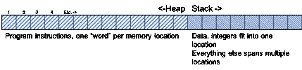
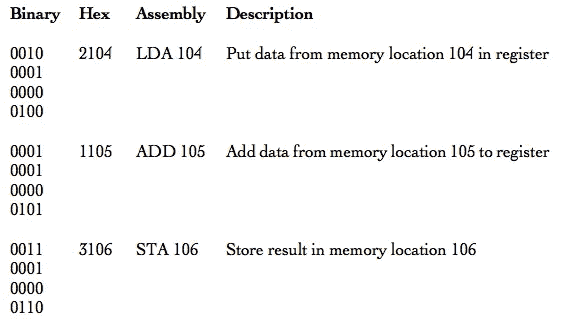

# 金属时代:1950-1960

> 原文：<https://medium.com/hackernoon/https-medium-com-it-explained-for-normal-people-the-metal-years-5be295dad17c>

## 个人编程史的第一章

## 开始的时候

…没有程序员，因为计算机*就是程序*。它们在任何方面都不像现代计算机。他们重达数吨，占据了房间的整面墙，房间里有定制的空调和通风设备，更不用说特别加固的地板了。

早在我学会如何编程之前；事实上，在我出生之前很久，第一台计算机是通过拨动机电开关和在接线板上插上电线来“编程”的。

操作这些电脑的人(穿着实验服)甚至没有把插电和开关翻转当成编程。该程序由电气工程师设计，内置于这些极其昂贵的巨型电子计算器的线路中。这些人正在做的是*输入要计算的问题*。

下面的照片经常被误标为*给 ENAIC 计算机*编程。事实是，像那个时代的所有其他计算机一样，ENIAC 是不可编程的。至少不是人们想象的那样。它可以像录像机或电子表一样编程(对我们这些老前辈来说)。然而，它的特别之处在于，它不是只有一个程序，而是有许多程序。你在下面的照片中看到的每个面板都是一个硬连线程序。使用接插电缆，计算机*操作员*如照片中的操作员可以将数据输入到包含要运行的硬件“程序”的面板中，并将面板配置在一起，根据另一个程序/面板的结果运行一个程序/面板。

我无意贬低这项工作。它需要大量的创造力和专业知识，本身就是开创性的。然而，它并不像大多数人理解的那样是编程。这更像是电气工程。


Computer operators configuring ENIAC

尽管康拉德·楚泽现在被公认为发明了现代计算机和纳粹德国的第一种编程语言，但他的努力在很长一段时间内都是绝密的。真正启动*软件* *编程*的事情，正如我们今天所知道的，是 1945 年关于 EDVAC 的报告*初稿的出版，这份报告是应美国陆军的要求由约翰·冯·诺依曼撰写的(或者更准确地说:是汇编和编辑的),他是一个了不起的人，他的成就太多了，无法在此一一列举。这篇论文描述了我们所知的现代计算机的基础；非常快的二进制计算器，用机器语言存储程序并执行它们。真正创新的部分是他描述的计算机没有为任何程序做硬件连接。程序必须使用操作码编写(我将在下面描述)。不可否认，这份报告的传播是现代计算机设计的催化剂。*

1949 年，EDVAC 运行了它的第一个程序，从一卷巨大的磁带上读取数据。这些磁带卷轴是如此巨大，以至于像我母亲这样的女性都不愿意进入这个领域，因为她们担心女性不可能亲自将它们运进运出计算机。

那是 1949 年:

*   哈里·楚门成为总统并介绍了他的*公平交易*
*   据报道，这是美利坚合众国第一年没有非裔美国人被处以私刑
*   加拿大人和澳大利亚人脱离了英联邦，建立了他们自己的公民权
*   毛和中华人民共和国夺取了政权
*   以色列举行了第一次选举并加入了联合国
*   德意志民主共和国成立
*   北约成立了
*   温斯顿·丘吉尔提议建立欧盟
*   第一次不间断环球飞行开始了
*   第一架喷气式飞机起飞了
*   苏联试验了第一颗原子弹…

**于是编程诞生了。**

> ENIAC 上的计算器装有 18，000 个真空管，重 30 吨，而未来的计算机可能只有 1，000 个真空管，重 1 . 5 吨
> 
> ~大众力学，1949 年 3 月

## 然后有了这个词

现代计算机有时被称为“冯·诺依曼”计算机，它们都根据一些共同的基本原理运行。它们将内存分成两个“空间”,称为堆栈和堆。堆用于存储正在运行的程序，堆栈用于存储输入和输出的数据。正如您将在后面看到的，一些聪明的程序员会耍花招，将数据隐藏在代码中，或者将代码隐藏在数据中。



二进制程序作为一系列十六进制的*字*存储在堆中。⁴字在不同的 CPU 上长度不同。非常古老的 CPU 使用 8 位字，现代 CPU 使用 64 位字。每个单词触发一个特定的 CPU 操作。因此，它们被称为*操作码*。例如，在一个旧的 16 位 Intel CPU 上，十六进制数“2104”将把来自 CPU 中堆栈位置 104 的数字存储在一个称为*寄存器的特殊存储器暂存区中。*“1105”将把来自堆栈位置 105 的数字加到第一个数字上，而“3106”将把结果存储在堆栈位置 106。所有的计算机程序最终都归结为存储在内存中的一系列字。

在*汇编语言*中，三个字母的助记符代表二进制或十六进制机器指令。近十年来，程序员使用汇编语言来定位和检索内存中的数据，并将其移动到中央处理器(CPU)进行计算。一步一步的指示在任何方面都不像正常的人类逻辑。

下面是一个将两个数相加的非常简单的程序。我并排显示了二进制、十六进制和汇编指令(数据没有显示)。



下面是一个简单的汇编语言程序，它打印出短语“Hello World”。第 5–9 行的第一个单词是操作码的例子(在这个程序中还有其他操作码不容易指出)。

```
1 section .text
2 global _start
3 _start:
4             ; write our string to stdout.
5 mov edx,len ; third arg: message length
6 mov ecx,msg ; second arg: pointer to msg
7 mov ebx,1   ; first arg: file handle (stdout)
8 mov eax,4   ; system call number (sys_write)
9 int 0x80    ; call kernel
10            ; and exit.
11 ebx,0      ; first syscall argument: exit code.
12 mov eax,1  ; system call number (sys_exit)
13 int 0x80   ; call kernel.
14 section .data
15 msg db “Hello, world!”,0xa ; the string to print.
16 len equ $ — msg ; length of the string.
```

这种编程叫做*裸机*编程。⁵:它简明扼要，难以理解。在早期，计算机程序很小，因为计算机的容量很小。

你可能放在口袋里的手机比 1954 年的 IBM 650 存储容量大 3000 万倍，速度快 1000 万倍。你手机上最小的程序也装不下 10，000 个 IBM 650s。手机硬件也更小更轻约 4 万倍，耗电约 40 万倍，价格便宜 1 万倍。IBM 650 在 1954 年价值 50 万美元，相当于今天的 460 万美元。

在本系列的其余部分，我将描述允许程序员从最初的编程语言开始，开发更大、越来越复杂的程序的技术进步。

## [下一章->](https://hackernoon.com/the-first-decade-of-programming-speaking-in-tongues-f395a228cf35)

[1]对于那些感兴趣的人，我正在编写一个附录，其中包含我提到的所有人的名单，以及基本的简历信息。我将在该系列的最后一篇文章的结尾发表它。

[2]冯·诺依曼，约翰。“关于教育和暴力侵害妇女问题的报告初稿”。1945 年，*宾夕法尼亚大学摩尔电气工程学院*，doi:10.5479/sil。19406.886386863617

[3]你可以在 YouTube 上了解二进制:[https://youtu.be/lsCKJ6se_1w,](https://youtu.be/lsCKJ6se_1w,)以及在[https://youtu.be/b7pOcU1xMks](https://youtu.be/b7pOcU1xMks)了解比特和字节

[4]我们熟悉的计数系统是以 10 为基数，二进制是以 2 为基数，而十六进制是以 16 为基数。

[http://www.catb.org/jargon/html/B/bare-metal.html](http://www.catb.org/jargon/html/B/bare-metal.html)

这篇文章摘自我的书 [*混乱工厂*](https://www.amazon.com/dp/B07XXM1B23) ，讲述了企业 it 失败的内幕，并提供了修复 IT 失败的*真实*秘方..