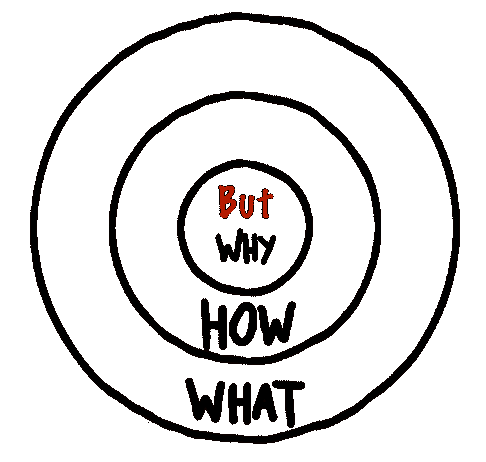
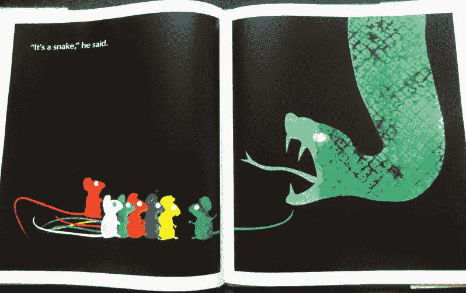
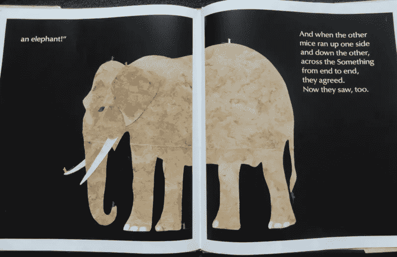

# 不要从为什么开始！

> 原文：<https://medium.com/hackernoon/https-medium-com-k-yonatan-dont-start-with-why-14a4bb58a209>

## 我们这个时代最有影响力的营销模式背后真正的原因是什么。

如果你在过去八年中参与了产品的发布或重新发布，你可能会收到一个链接，链接到西蒙·西内克和他的黄金圈的视频。这个演讲在 TED 上被观看了 3600 万次，在 YouTube 和其他网站上被观看了数百万次。人们对它和相关书籍《从为什么开始》的兴趣似乎在[不断增长](https://trends.google.com/trends/explore?date=all&q=Simon%20Sinek%20start%20with%20why)，它在几乎每个营销桌上都被频繁提及。因此，我们可以有把握地称之为我们这个时代最有影响力的营销模式。

“如此简单，却又如此真实，”看完视频后，你可能会这样想。“最后，我要用它来打造顶级品牌。”你有吗？

**7 只瞎老鼠**

不要误解我——我喜欢西蒙·西内克。他敏锐，有洞察力，极其聪明。他的想法确实开阔了你的思维，我今天仍然喜欢关注他的工作。更重要的是，我承认过去自己也使用过黄金圈，因为它为说服人们相信更复杂的思维创造了一条捷径。这是有道理的——许多领先品牌确实是从为什么开始的。

问题出在别处:“**从为什么开始”仅仅是一个回顾性的观察**。某种程度上，这就像是说:*要想成为美国总统，你需要从相对高大开始*。这是真的:平均而言，美国总统现在和过去都比普通美国人高得多。然而，尽管个子高是一个优势，但身高并不是后来成为总统的人背后的核心驱动力。登上总统宝座需要很多天赋、韧性和运气。

All rights reserved to Ed Young

一个很好的比喻是 Ad Young 的书《七只瞎老鼠》(我最喜欢读给我女儿听的书之一)。在这部电影中，七只失明的老鼠遇到了新事物，并试图从许多不同的角度了解它是什么。有人认为爬尾巴是条蛇，有人认为一条腿是根柱子等等，直到第七只老鼠在大象身上跑来跑去，认出了这个强大的动物。

西蒙·西内克试图理解说服动物的本质。问题是，他看到的是全貌还是只有一部分？

**那些使用‘从为什么开始’的人**

我每天都在浏览科技公司和初创公司的推介，我见过一些公司通过回答“为什么”找到了稳固的定位。不幸的是，这很少见，对于绝大多数公司来说，黄金圈并不是一个真正有效的框架。

在绝大多数情况下，以“为什么”开头是一些最无聊、最不真实、最低效的信息的沃土，比如:“让世界变得更美好”、“改革行业”、“帮助我们的客户成长”等等。“为什么”是一个模糊的术语，很容易理解，但很难建立强大的品牌。

从“为什么”开始可能对你没有帮助，就像它对那些建立了书中和著名演讲中描述的顶级品牌的人没有帮助一样。史蒂夫·乔布斯没有使用这个框架或任何类似的东西；马丁·路德·金也没有。(两者都是 Sinek 提到的。)

那么大象在哪里呢？

All rights reserved to Ed Young

这很简单。在著名的演讲中提到的所有例子都是好的和引人入胜的…故事的例子。

让我们通过研究 Sinek 给出的三个例子来尝试理解这一点:

1.苹果的成功被 Sinek 解释为有一个“为什么”，即“我们所做的一切，我们相信挑战现状”。不如说他们一直在给**讲关于“挑战现状”的故事**？

在整个突破性的几年里，苹果的[签名广告](https://youtu.be/2zfqw8nhUwA)和史蒂夫·乔布斯的[采访](https://youtu.be/3H-Y-D3-j-M?t=5m48s)引导了一个带有明显反面角色的叙事，比如 IBM 和它的大型企业电脑，微软和它的软件，或者作为概念的框中思维。这些故事也有一个英雄，由个人电脑等新产品、完美的软硬件合作或品牌本身来代表。

2.Sinek 说，莱特兄弟的成功是因为他们“被一个事业、一个目标、一个信念所驱动”。事实上，莱特兄弟的故事是一个不屈不挠和克服困难战胜失败的经典故事。我仍然认为，他们的成功与他们的叙述或原因关系不大，更多的是与他们实际建造了第一台工作中的比空气重的飞行器有关…

3.Sinek 说，马丁·路德·金博士被追随是因为“他四处奔走，告诉人们他的信仰”，特别提到了著名的“我有一个梦想”的演讲。我想说，金通过讲述他想要创造的世界的生动故事而风靡美国。

底线是，Sinek 的模型还没有被证明是有效的，但故事肯定已经并且已经引领人类发展了十万多年。在我们这个时代，自从核磁共振成像成为神经科学家可以使用的工具，故事对我们大脑的影响已经得到了非常彻底的测试。大量研究人员已经证明，与其他说服形式相比，故事对人们有着近乎神奇的影响。

记叙文的结构中有一些东西鼓励释放三种最重要的参与荷尔蒙:皮质醇，它增加注意力；多巴胺，它产生希望和乐观的感觉；最重要的是催产素，它能产生推动行动所需的同理心。

讲故事框架的主要优势在于它是通过几个世纪的学习和实验建立起来的。许多人都有能力创造引人入胜的故事，有许多方法可以自学掌握这门手艺。

> 在我的下一篇文章中，我将讲述我自己的公司故事讲述方法，理想的故事结构，以及优秀品牌故事的使用案例。如果你想继续收听，请跟我来。

# 那么，有史以来最有影响力的营销模式背后的秘密是什么？嗯，这简直是一个伟大的故事！

_______

如果你想读我自己讲故事顿悟的故事，你可以在这里找到它[。如果你在企业/品牌故事方面需要帮助，欢迎通过](https://hackernoon.com/yonatan-kagansky-storytelling-epiphany-2c620ec4dca4) [info@NewSpark.pro](mailto:info@NewSpark.pro) 联系和咨询我们，或者直接在这里联系我。