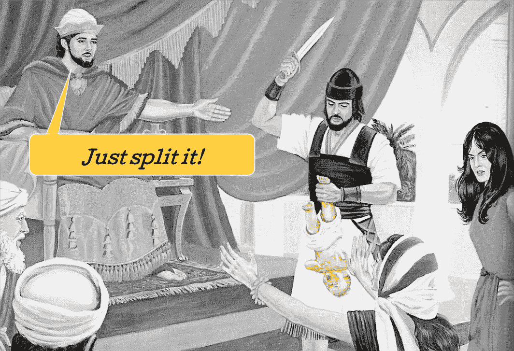

# 策略是一种妥协

> 原文：<https://medium.com/hackernoon/https-medium-com-k-yonatan-strategy-is-a-compromise-1a2d7455c01b>

## 你妥协了吗？你应该！

我第一次听到标题中的词是在向一个大客户推销新的营销策略之后。我马上就知道我们输了——一句话就把我们彻底打败了。一个惊人的句子。

第二排的男人

想象一下这种情况，一个中型会议室，坐满了高管。人们坐成两排，因为他们在主桌周围没有位置。该品牌有很大的形象问题，我们正在推出一个有很多积极氛围的大型活动。

我们对这些积极的氛围进行了稳妥的押注，旨在高管之间达成共识。我不喜欢这个概念，但我想赢，所以我…妥协了。这在一开始肯定是有效的——桌子周围的人开始一个接一个地给予积极的评价。直到坐在后排的一位说话温和、头发花白的顾问开口说出了一句话:*据我所知，战略是一种妥协，我觉得你在这里没有做对*。

这就是他所说的一切，尖锐地刺痛了我们的心。我希望没人听到他的话，但高管们的肢体语言表明，他们确实听到了。一轮积极的反应还在继续——毕竟，房间里有喜欢我们的人——但游戏已经结束了。

**添加东西的便利性**

在我最近参与的许多战略讨论中，有一种我已经学会鄙视的“积极氛围”。你会听到人们这样说:“*太棒了，我喜欢，我建议我们也这样说/做…反应通常是积极的，而且很容易被接受。*

你可以归咎于一种企业文化，在这种文化中，人们更关心关系而不是真相，或者可能是人类避免对抗和寻找共同点的普遍意愿。底线是，人们不认为在战略中加入东西是一件坏事。但我认为，这种对消极的恐惧是大多数战略错误背后的核心问题。

试想历代重大战略决策背后的这种态度:“这次诺曼底入侵是一个伟大的想法；我建议我们把这些力量中的一部分拿出来，同时入侵别的东西，”或者“这次登月听起来很棒，我们为什么不试着平行登陆火星和木星呢！?"

**你不能靠增长来制定战略**

这种添加东西的便利性是我们所生活的数字时代的特点。容易接近各种各样的观众，加上 A/B 测试方法的理想化，造成了资源的分散和对任何特定方法的低投入。一个观众没有响应；让我们试试另一个。通道 A 不工作；我们选 b 通道吧，漏斗 X 不起作用；让我们来看看漏斗 y。

你见过创业公司的创始人寻找一个增长黑客来领导他们的营销工作吗？这一切都在这种方法中——而不是在战略上工作，战术是作为一个整体来处理的。

不要误会，我是 A/B 测试和增长黑客的忠实粉丝。它们是*优化*的好方法。 ***但是从 A/B 测试开始就像通过向各个方向射击希望击中敌人*** 来开始火炮攻击。

**你的客户希望你妥协**

你可能会说，这在某种程度上是对的，但是当你有战略和预算时，增加福利是一件好事。从消费者的角度来看，越多越好。

嗯……不！我们的大脑不能处理广泛的利益——它只是不能连接不相连的点。一系列完美的特征，创造了一个我们大脑完全忽略的混乱。

最近的研究表明，这一切都归结于我们大脑的硬接线。它只能储存与意义相关的信息。只有当信息被整合成一个故事(有一个阐述，不断发展的行动，高潮和一些道德)，它才能被记住并付诸行动。

[我将在接下来的文章中详细阐述大脑的这种连接方式。如果这听起来有趣，请关注我，或者在此阅读我自己讲故事顿悟的背景故事[。]](https://hackernoon.com/yonatan-kagansky-storytelling-epiphany-2c620ec4dca4)

Connect the dots into one brand narrative. Some dots are bound to stay outside.

**商业战略的所有部分都需要妥协**

我听到第二排那个人的声音已经是好几年前的事了。灰色已经成为我头发的主要颜色，第二排现在是我的了。但当我坐在那里时，我不会谈论妥协——人们不太喜欢这个词。相反，我说的是找到本质，把战略的每一部分简化到核心，对事情说不。

在你的商业策略的不同部分，你需要说一些“不”:

- **愿景** —它不能包含一系列不相关的目标，而是必须整合成一个连贯的故事，能够深入人们的思想并激励他们。不要试图覆盖所有的子弹，只覆盖那些自然适应的子弹。

- **产品战略** —产品特性应该只包含那些支持战略受众主要价值主张的特性。如果你不对附加功能说不，你将永远无法实现产品/市场的契合。

- **媒体策略** —某个平台讲你的故事，总是比其他的更有效率。一旦你找到它，你应该围绕它巩固你的预算。是的，你可以有额外的渠道，但这些渠道应该永远是次要的。

- **公关策略**——没有记者有兴趣阅读和转贴一份福利清单。如果它们不能很容易地转化成一个故事，就没有公关。

- **社交媒体策略**——发布与竞争对手的热门内容相似的东西的诱惑总是很强烈。但是，只有通过非常独特的声音，才能获得大量的在线关注和有机的结果。对任何可能损害它的事情说不。

- **定价策略** —每个受众都应该有一个特定的、成熟的产品。一组将获得“最受欢迎”的选项，另一组将获得“最物有所值”的选项简单地添加一个定价选项以创造定价连续性可能是一个重大错误。

- **分销策略**——这里的妥协应该来自于为你的品牌找到最合适的平台，而不是那些已经准备好托管你的产品的平台。

-我可以继续下去…

这一套步骤可以应用于任何行业的任何业务，并会阻止你陷入可怕的“越多越好”的动态:

基于对客户需求的理解找到战略假设= >建立简单的支持性叙述(删除所有不必要的好处)= >用真实客户测试它，直到你知道它有效= >根据调查结果微调产品(它必须适合叙述，而不是相反)= >定义策略—将叙述传播给正确受众的最快路线=> A/B 测试细微差别，删除任何不支持主要叙述的内容= >增加高效渠道的预算= >不要害怕随时从头开始。

____

如果您需要帮助，将您的战略简化为本质，并构建一个商业故事，欢迎您通过 [info@NewSpark.pro](mailto:info@NewSpark.pro) 与我们联系，或者直接在这里 ping 我。