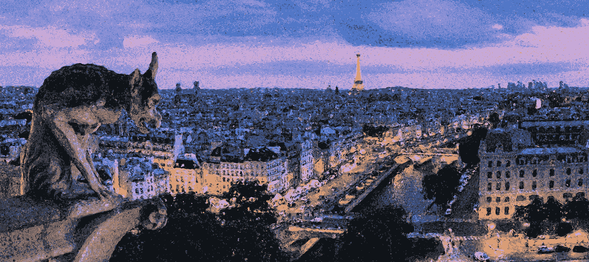
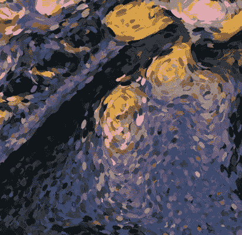
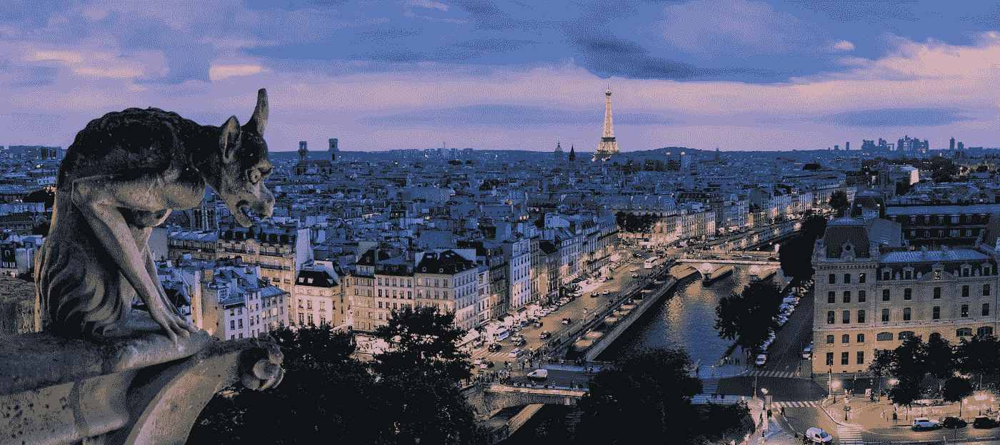
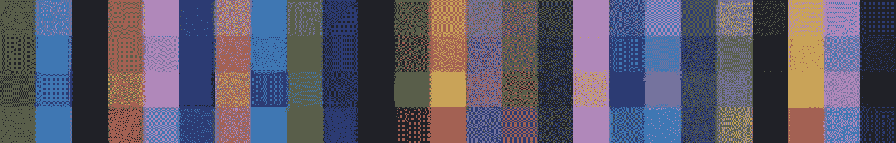
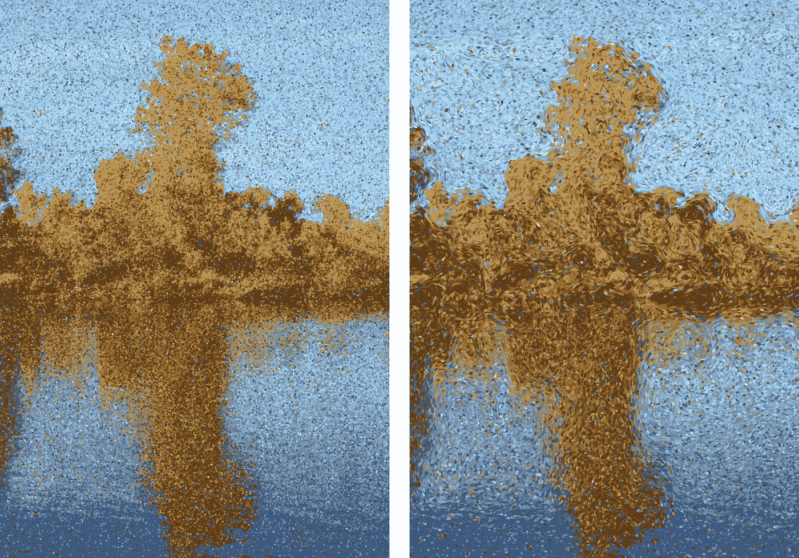
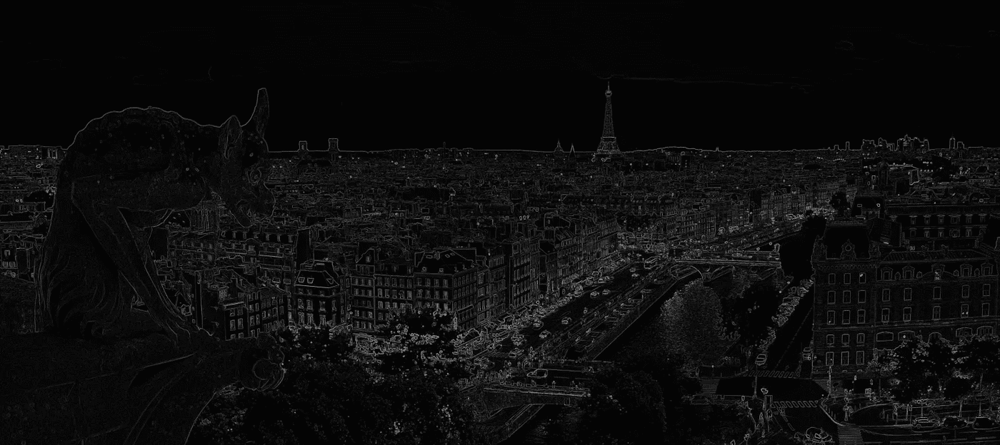
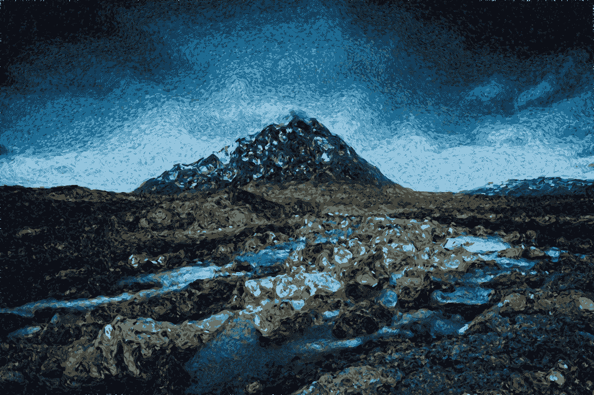
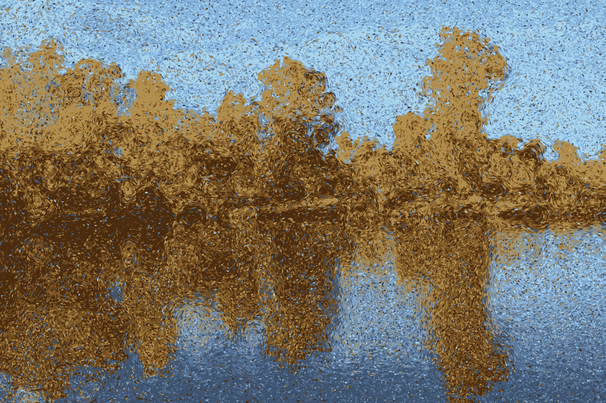
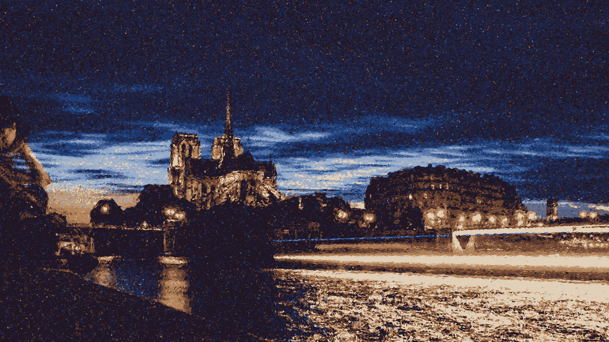
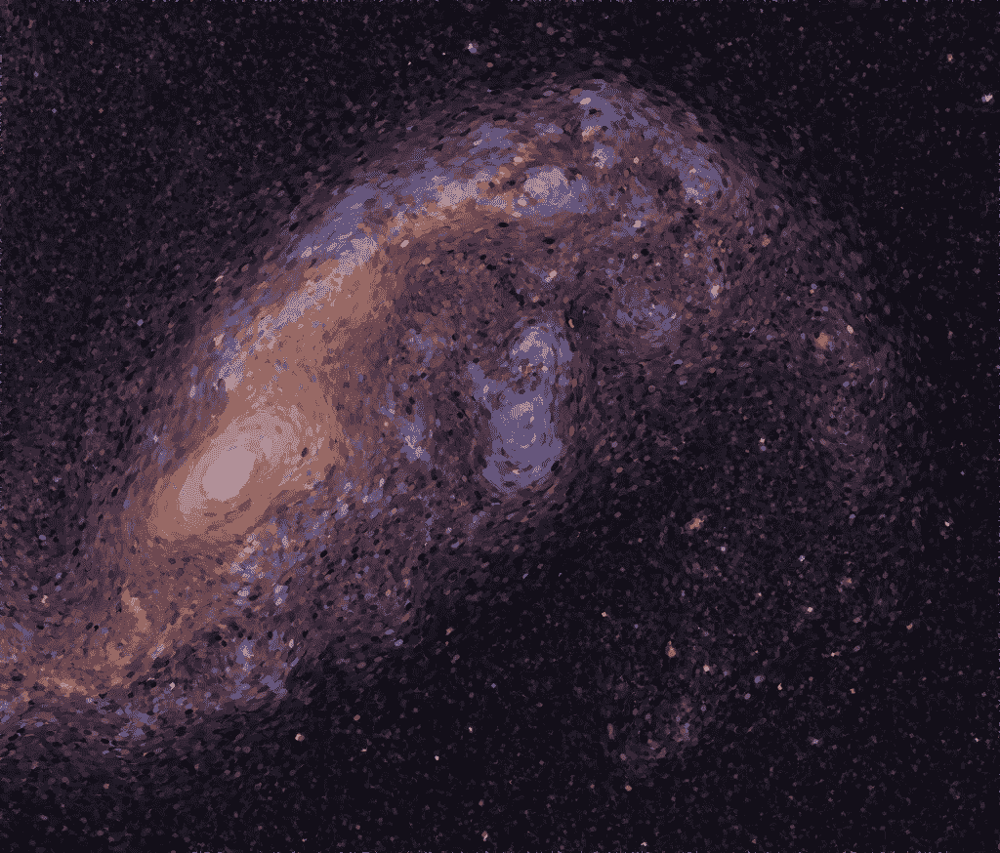

# 用 Python 和 OpenCV 创作点彩画

> 原文：<https://medium.com/hackernoon/https-medium-com-matteoronchetti-pointillism-with-python-and-opencv-f4274e6bbb7b>

The final result

我最喜欢的绘画技巧之一是点彩画，这是一种在图案中应用不同颜色的小点来形成图像的绘画技巧。

这种技术依赖于观察者的眼睛和头脑将色点混合成更全面的色调范围的能力。不同颜色的并置使它们更加生动，使整个图像更有活力。

Notice the juxtaposition of colors

点彩是一种华丽的技术，但是为了做出这种类型的画，你需要采取一种系统的、长期的方法。更不用说，你需要成为一个熟练的画家！

作为一名计算机视觉开发人员，我知道很多关于处理图像的知识——但让我们面对现实吧，我不擅长画画。

在我的巴黎之旅中，我受到启发，尝试使用 [Python](https://hackernoon.com/tagged/python) 和 [OpenCV](https://hackernoon.com/tagged/opencv) 来模仿点画师。在这篇文章中，我将指导你使用我开发的方法和我编写的代码来生成像这篇博客文章顶部那样的图像。

[只是在找源代码？你可以在这里找到它](https://github.com/matteo-ronchetti/Pointillism)

# 模拟绘画过程

喷漆过程模拟分三步完成:

1.  调色板创建
2.  笔画大小和长度计算
3.  实际绘画

举个例子，我从 https://unsplash.com 的一个网站上选择了一张美丽的巴黎照片，在那里你可以免费获得质量惊人的照片。我已经用 Gimp 对图像进行了预处理，以减少石像鬼上的绿色阴影，并将埃菲尔铁塔放大，使其更加醒目。一般来说，做一点预处理，特别是增加总饱和度，有助于获得更令人满意的结果。

The starting image (source: [https://unsplash.com/photos/v6Sy3kyBROE](https://unsplash.com/photos/v6Sy3kyBROE))

## 调色板创建

首先，我们需要决定哪些颜色将出现在我们的“虚拟艺术家”的调色板中。我们需要选择一组颜色，它与图像的颜色一致，但又生动而清晰。

我们首先运行 [k-means](https://en.wikipedia.org/wiki/K-means_clustering) 从图像中选择 n=20 种主色。k-means 的“对抗性”本质产生了集中在图像中最频繁出现的颜色周围的不同颜色。

为了增加活力，我们增加了一些由克曼人选择的颜色的变化。我已经选择添加一个更饱和的版本的基本调色板，和两个小的颜色变化(20 色调)与一点点增加的饱和度。

下图的第一行代表 kmeans 计算的调色板，后面的行包含最终调色板中包含的颜色变化。

The color palette computed by kmeans and augmented to be more vibrant

## 笔画方向和长度计算

为了给我们的最终结果一个更动态的外观，我们可以使用小的不同的颜色来代替圆点。这实际上是一种在很多点彩画中使用的技巧！我们希望笔触的方向与图像的内容一致，并使用较长的笔触来描绘边缘。为此，我们使用图像梯度来决定每个笔画的长度和方向。

Comparison of style of painting: dots (left), small strokes (right)

为了计算笔触的方向和长度，我们在 x 和 y 轴上取 Scharr 图像导数，从而在图像上定义一个矢量场。然后我们使用高斯模糊平滑这个区域，给最终的“画”一个更连贯的外观。

A visualization of the magnitude of image gradient(before Gaussian smoothing)

# 绘画过程

我们像真正的艺术家一样画出最终的效果，一次一笔！对于每一次划水，我们必须决定:

1.  地位
2.  每个笔画的方向和长度
3.  使用调色板的哪种颜色

选择一个随机的位置可能很诱人，但是这种方法有一个主要的缺点:我们不知道什么时候我们已经画了足够多的笔画来填充整个图像。因此，我们通过在图像上均匀采样来创建一个笔画位置列表，我们给每个位置添加一点随机噪声，然后我们打乱列表，给笔画一个随机顺序。

一旦我们使用图像梯度在图像上定义了一个向量场，方向和长度就很容易计算了。

我们将渐变的方向旋转 90 度，因为我们希望笔画平行于图像边缘(图像渐变垂直于边缘)。根据图像梯度的大小(即强度)来计算长度。这里 *stroke_scale* 是一个参数，指定了笔画的全局比例，平方根用于使笔画更加均匀。我们不希望笔画的长度有太大的差异。

笔画颜色的选择可能是最难的部分。我们希望它是随机的，以获得美丽的颜色并列，但我们希望与源照片保持一致。这个想法是从调色板中随机选择一种颜色，让与照片的下划线像素更相似的颜色更有可能被选中。使用颜色相似度的 [softmax](https://en.wikipedia.org/wiki/Softmax_function) 函数来确定概率。

# 代码

你可以在这里找到[的源代码](https://github.com/matteo-ronchetti/Pointillism)。它对应于我在这里描述的算法，有一些性能改进。代码被注释了，应该很容易理解。如果你有任何问题，欢迎在评论中提问:)

# 结果

其他照片的一些结果:

我希望你喜欢这篇文章！如果你有任何问题，欢迎在评论中提问。如果你创作了一些很棒的画，请在评论中发表，我真的很期待看到你能用这个程序做些什么！

你可以在我的网站上找到更多关于我的信息[https://Matteo . ronche tti . XYZ](https://matteo.ronchetti.xyz)

我写的关于计算机视觉的其他文章:

 [## BiBirra:啤酒标签识别

### 几周前，我和我的女朋友在超市，我们被邀请去吃饭，我们想带酒…

towardsdatascience.com](https://towardsdatascience.com/bibirra-beer-label-recognition-8546c233d6f4)