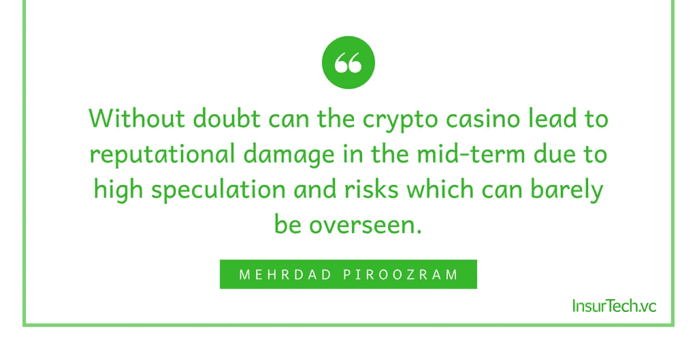
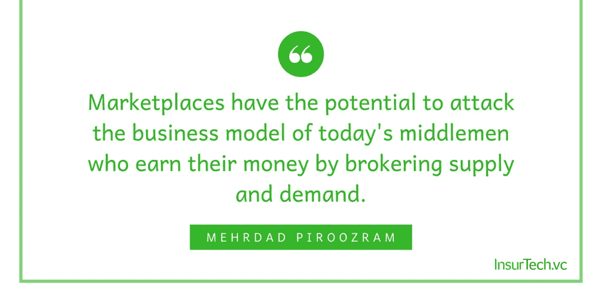

# 区块链与保险公司的相关性——企业技术和基于业务连续性的保险技术创新

> 原文：<https://medium.com/hackernoon/https-medium-com-mehrdadpiroozram-the-relevance-of-blochchain-for-insurers-7a98f6a6e88f>

通过与专注于保险技术的软件服务提供商 Widgetlabs 合作，我们探索了区块链对保险公司意味着什么，以及区块链的哪些项目正受到关注。

自 2009 年问世以来，加密货币[比特币](https://hackernoon.com/tagged/bitcoin)变得非常流行，被越来越多的人用作数字货币。除了这种货币如何演变的问题之外，其潜在的[区块链](https://hackernoon.com/tagged/blockchain)技术已经成为许多公司关注的焦点。据说它具有完全超越集中实例的传统角色的潜力，目前已经应用于包括保险业在内的众多行业的许多项目中。

# 明显的优势

理解[区块链](https://hackernoon.com/tagged/blockchain)技术、它的含义和潜力需要一段时间。最重要的优势简述如下:

*   **通过完整性获得信任** —其分散的基于共识的结构可以保证区块链的所有参与者从数据存储的那一刻起就具有高度的完整性。没有另一个共识，修改和删除是不可能的。这种信任建立在技术协议的基础上，而不是通过中间人。
*   **共享数据管理** —区块链的高度完整性支持多方共享和可靠的数据存储。这导致省略了孤立的筒仓以及那些筒仓所需的冗余数据的存储和同步。
*   **通过自动化节省成本** —中间商和不同仓库之间的数据同步意味着高成本的工作。通过消除中间商和人工流程，可以节省大量成本。
*   **防止操纵** —例如，虽然中间人的数据库处于中央权威之下，因此可以集中操纵，但区块链需要破坏大部分网络才能实现操纵。这样，区块链对操纵的保护随着网络的规模而增长，这与大多数其他技术不同。

# 剩余风险

像任何年轻的技术一样，区块链还没有摆脱风险，仍然有一些关键的挑战需要克服。这个陷阱一目了然:

*   **低交易量** —区块链技术故意牺牲计算能力和交易量，以便首先实现去中心化的、基于协议的数据完整性。这也反映在它巨大的能量消耗上，能量消耗源于确保区块链完整性的复杂加密算法。既然已经奠定了技术基础，就必须找到新的方法来提高性能，而又不损害到目前为止所获得的完整性。
*   **密码算法**——即使有庞大的现代计算机系统，今天构成区块链核心的密码“谜题”也极难破解。但是这一过程本身以及未来量子计算机的安全缺陷可能会构成重大威胁。那种新型计算机的优越性能很容易破坏今天的算法。需要探索和开发新的加密方法，以适应未来计算能力的增长。这是维持今天基于计算能力的安全水平的唯一方法。

# 三类项目

对最近几个月的项目进行分类时，有三类基于区块链的应用程序非常突出。

## 类别 1:“加密赌场”

对于这一类别的项目，都是关于使用区块链来创建自己的加密货币。许多公司只是想通过这种方式筹集资金，在许多情况下，这种货币也可以在创建的平台上用作支付手段。此类项目通常向公众开放，以便通过早期购买或长期投资于该平台来进行货币交易。

加密货币的首次发行被称为初始硬币发行(ICO)。在这一过程中，公司在规定的时间内以贴现汇率出售其货币的初始一次性分配份额。然而，这也常常导致混乱的局面，因为投资者不知道谁是其他投资者，也不知道做市商是否干预这一过程。

在这一阶段之后，公司通常会将其加密货币在专门设计的交易所上市，供更广泛的公众使用。在这里，早期投资者对价格的高增长进行投机，并经常设法增加他们的投资。

这种类型的资金被采用的程度在[中显示，这是由 CoinDesk](https://www.coindesk.com/research/state-blockchain-q1-2018/?slide=17) 进行的一项研究:2018 年第一季度，已有 63 亿美元被投资于 ico。这是同一时期传统风险投资家对区块链初创企业投资价值的 7 倍多。

由于许多 ico 的输出具有高度的投机性，市场也经常被比作赌场。

## 类别 2:“市场”

虽然加密货币也是为市场创造的，但这里的重点是使用该货币交换数字资产。这抵消了加密赌场的风险。

市场有可能攻击当今中间商的商业模式，他们通过代理供求关系赚钱。通过使用区块链功能，公司可以将他们的库存直接带到一个几乎没有利润的市场。例如，如果一家保险公司创建了这样一个市场，他们就可以创建一个新的、非常实惠的分销渠道。尤其是 B2B 参与者之间的非公开市场在这里很有意思。

市场还使数字企业资产货币化，否则这些资产将存放在内部数据仓库中，无法灵活使用。

***举例:iXledger***

初创公司 iXledger 承诺在区块链建立一个市场，保险公司、再保险公司和经纪人可以直接相互交易保险产品。这为参与者创造了一个全新的透明度水平，因为这些过程不再需要通过第三方。

***举例:Ryskex***

[Ryskex](https://www.ryskex.com/) 提供了一种基于区块链的方法，在国际公司或集团内部使用加密货币抵消专属风险。

# 类别 3:“企业应用程序”

加密货币在这一类别中没有核心作用。相反，人们关注的是区块链的去中心化特性和底层数据的完整性。此类项目大多是内部企业应用程序，使用区块链技术来提高现有流程的效率、速度和安全性。

这是一个很好的机会来重新思考各自的，通常是旧的系统。对于这类公司来说，国际网络中的数据交换尤其有趣。

***举例:马士基线***

[马士基航运公司](https://www.maerskline.com/)是全球最大的集装箱航运公司，营业额达 310 亿欧元。传统上，集装箱运输是一项非常繁琐的业务，参与者众多，从出口商到港口运营商，从海关到集装箱承运商本身，对信息流提出了非常不同的要求。20%的运输成本可归因于(通常完全模拟的)文件流程。

为了提高效率并确保可靠、始终最新和完整的装载文件视图，马士基航运公司现在依靠区块链技术。早在 2016 年，IBM 的一个平台就被用于试运行。鹿特丹港、德克萨斯州的休斯顿港、美国海关和边境管理局以及其他各种试点客户已经相互连接。减少官僚障碍也将刺激国际贸易。

# 对保险公司的意义

毫无疑问，由于高度投机和几乎无法监管的风险，加密赌场可能会在中期内导致声誉受损。因此，它显然不能推荐给公司。

由于处于早期市场阶段，从保险公司的角度来看，投资区块链初创项目和提供企业应用程序的产品的风险仍然很大。

然而，对于保险公司来说，在区块链的 B2B 市场和企业应用程序中，有着巨大的节约潜力和可管理的风险。许多保险流程涉及大量的内部和外部参与者和数据，这导致了大量的手动工作量，并使它们变得非常复杂和乏味。

有针对性的试点项目可用于评估风险和收益，并在实践中测试整个区块链的潜力，而无需大肆宣传。

***有趣的区块链案例:*** *一系列有趣的#insurtech 区块链案例可以在这里找到***。**

*这篇文章最初发表在 [Insurtech Rising 365](https://knect365.com/insurtech/article/087caa0c-6a70-4786-a9f0-fa9149431c61/blockchain-from-crypto-casino-to-cross-company-data-management) 上。*