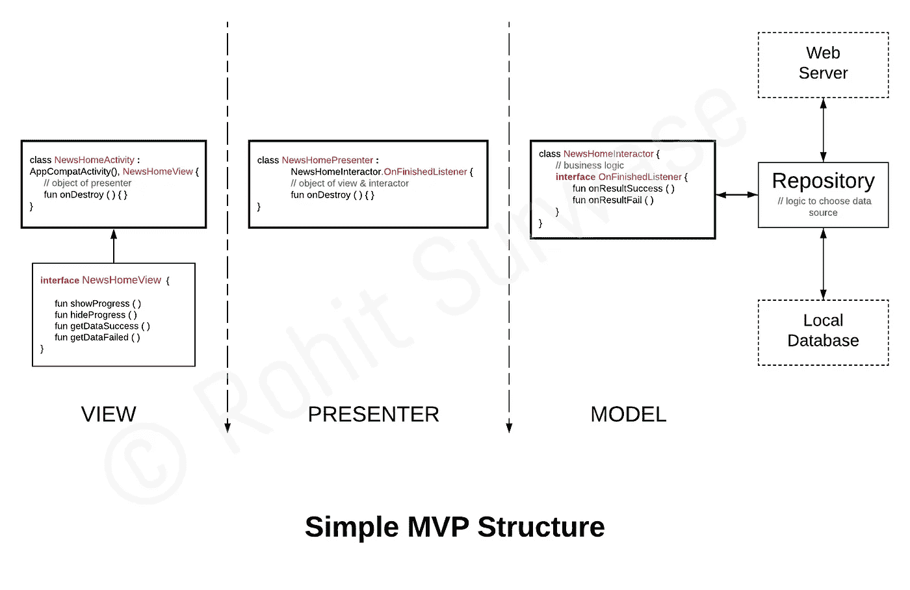
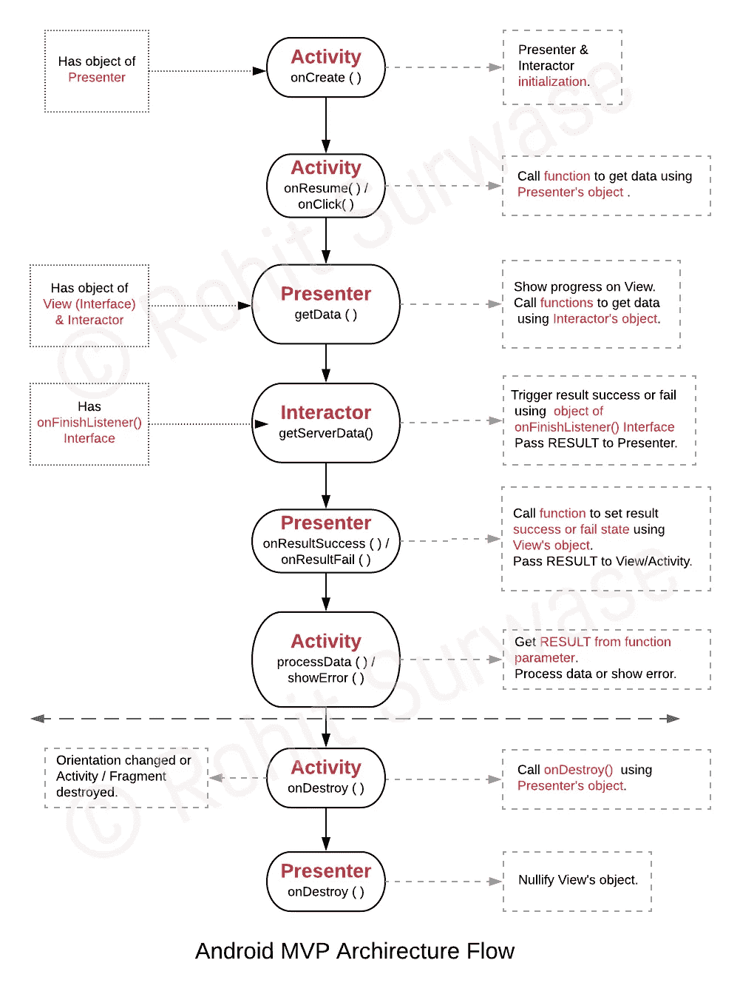

# Android 应用架构:使用 Kotlin 的 MVP 示例

> 原文：<https://medium.com/hackernoon/https-medium-com-rohitss-android-app-architectures-mvp-with-kotlin-f255b236010a>

## MVP 是如何工作的，它的简单例子展示了在 Kotlin 中的实现

> **TL；实际上，用几行文字来概括 MVP 模式是不可行的。但是我可以向你保证，下面这篇文章的每一行都值得你花时间去读。我敢打赌，它会给你足够的理解，你可以自己实现它。尽管如此，如果你赶时间，我还是建议你跳到“**MVP 是如何工作的？**谓节。[****的源代码示例****](https://github.com/RohitSurwase/Android-Architectures-Kotlin/tree/master/News-Kotlin-MVP) ****。******

**每当任何 Android 开发人员开始考虑提高技术技能时，他或她首先想到的是应用程序的架构。更不用说他们已经知道在标准代码增长后维护它的痛苦。**

**我也这样做了，学习了架构，后来选择专注于 MVP。在测试项目和后来的生产应用程序中尝试之后，我开始学习 Kotlin 语言，现在是最新的架构组件。但在这个转变过程中，我意识到，很少到没有；展示在 Kotlin 中实现这些概念的例子。所以，我在这里用这些例子展示了 Kotlin 中一些架构模式的实现。我向你保证，这些例子会非常简单，你可以轻松掌握这些概念的核心。**

**在这个系列中，我将针对两个主要的架构模式:模型-视图-表示器& Android 架构组件。**

> **[1。Android 应用架构:与科特林的 MVP 示例(this)](https://hackernoon.com/https-medium-com-rohitss-android-app-architectures-mvp-with-kotlin-f255b236010a)
> 2̵.̵̵a̵n̵d̵r̵o̵i̵d̵̵a̵r̵c̵h̵i̵t̵e̵c̵t̵u̵r̵e̵̵c̵o̵m̵p̵o̵n̵e̵n̵t̵s̵̵e̵x̵a̵m̵p̵l̵e̵̵w̵i̵t̵h̵̵k̵o̵t̵l̵i̵n̵
> 3̵.̵̵a̵n̵d̵r̵o̵i̵d̵̵a̵r̵c̵h̵i̵t̵e̵c̵t̵u̵r̵e̵̵c̵o̵m̵p̵o̵n̵e̵n̵t̵s̵:̵̵a̵d̵v̵a̵n̵c̵e̵m̵e̵n̵t̵s̵
> [**4。Android 最佳架构:mvi+livedata+viewmodel =❤️**](https://proandroiddev.com/best-architecture-for-android-mvi-livedata-viewmodel-71a3a5ac7ee3)**

****模型-视图-演示者** ( **MVP** ) 与**科特林****

**在设计任何软件的架构时，要记住的基本原则是关注点的分离。MVP 是将表示层从业务逻辑中分离出来的最佳模式之一。此外，MVP 还可以帮助您轻松实现更高级、更完整的架构模式，如 Clean Architecture。**

**这里我不会回答什么和为什么的问题，而是**如何**的问题。
如何使用 MVP？它是如何工作的？以及如何用 Kotlin 实现？
所以在第一篇文章中，我们将看到使用 Kotlin 实现 MVP。**

****

**V 视图**

****Who** :组合活动/片段/视图及其契约即接口。
**目的**:做所有 UI 相关的东西和所有需要 Android 上下文的东西。
**Job** :每当需要做某个动作的时候，就要使用对象触发 Presenter 各自的函数。它不应该有任何业务逻辑。**

**尽管 XML 布局是视图的一部分，但它并不单独被称为视图。所有必要的功能都通过契约/接口添加到我们的活动/片段/视图中。适配器也是视图的一部分。活动/片段/视图直接初始化包括模型在内的呈现者，而呈现者在其构造函数中间接初始化模型。**

**任务示例:
*-显示/隐藏进度条。
-请求显示数据，稍后显示收到的数据/错误。
-获取* LayoutInflater *，资源，安卓系统服务。***

**[Key points of **View** layer in MVP](https://gist.github.com/RohitSurwase/36c8c392c10d157ecbb223d89105b9eb)**

**愤怒者**

**谁？这是一个独立的类，不应该有 Android 上下文。
**目的**:充当架构视图和模型两个主要层之间的中介。
**作业**:根据视图的请求触发模型各自的功能。**

**演示者拥有视图和模型的对象。它不应该有任何业务逻辑。此外，它不应该直接访问任何 UI 元素。**

**[Key points of **Presenter** layer in MVP](https://gist.github.com/RohitSurwase/6f33cdc51c6ab6a9f622b6ace0e9e4ba)**

**M 奥德尔**

****谁**:数据库、模型(schema)、API 调用和所有其他业务逻辑都是这一层的一部分。这是所有业务逻辑的位置。
**目的**:分离业务逻辑，这样我们可以在没有视图的情况下单独测试它。这也有助于我们跨平台重用代码库。
**作业**:获取/计算数据或误差，显示在界面上。**

**这是我们应该进行 API、数据库调用和其他计算的地方。
但是为了让它更坚固，我们可以在模型内部再增加一层:**

****储存库** :
根据预定义的条件决定要显示的数据的来源。这意味着它将根据网络可用性等条件从离线或在线来源获取数据。
(为了简单起见，附带的 app 没有存储库层。)**

****这样，无论网络条件如何，我们的模型都会显示数据。****

**[Key points of **Model** layer in MVP](https://gist.github.com/RohitSurwase/031e14c0faa48758b79746c222a35cfe)**

> **最近，我发表了一篇关于协程的文章，请看-**

** [## Android Kotlin 协同程序:基本术语和用法

### 协同程序中使用的常用术语。提前了解这些术语将会简化您的学习过程。

android.jlelse.eu](https://android.jlelse.eu/coroutines-basic-terminologies-and-usage-b4242bd1b2a4) 

## MVP 是如何运作的？

简而言之:视图调用演示者的函数，演示者将其传递给模型，模型请求显示数据。模型获得数据后，将数据传递给演示者，演示者将数据传递给视图，视图在屏幕上显示数据。

**直接**沟通的:
视图== >演示者== >模型

**间接**使用契约/接口的通信:
Model =/=>Presenter =/=>View

下面是 Android 中 MVP 的简单工作流程图。我请求大家花几分钟时间看下面的插图，这会对你理解 Android 中的 MVP 有很大帮助。
注:模型被称为**交互器**。

我希望我说得够清楚，能让大家理解。
这里是 **示例** 的完整 [**源代码。**](https://github.com/RohitSurwase/Android-Architectures-Kotlin/tree/master/News-Kotlin-MVP)

 [## RohitSurwase/Android-架构-Kotlin

### Android-Architectures-Kotlin -展示一些流行的应用程序架构模式实现的简单例子…

github.com](https://github.com/RohitSurwase/Android-Architectures-Kotlin) 

感谢阅读！
**Rohit Surwase**

如果你喜欢这篇文章，鼓掌鼓掌👏👏👏尽可能多的次数。

**非常喜欢！**中等允许高达 **50 拍**。
也在 [**Twitter**](https://twitter.com/Rohit5rss) 上发一条**的推文。**

让我们成为[***LinkedIn***](http://in.linkedin.com/in/rohitss5)[***Medium***](/@rohitss)*[**Twitter**](https://twitter.com/Rohit5rss)**和[***GitHub***](http://github.com/RohitSurwase/)***。******

## ***另外，看看我发表的其他几个故事:***

*** [## 内向者解码:恋爱中未说出口的困境

### 他们从不告诉任何人的事情。

psiloveyou.xyz](https://psiloveyou.xyz/introverts-decoded-why-am-i-still-single-a046d1596d1e)  [## 内向者解码

### 当内向的人对自己脸红的时候，是时候更好地理解他们了。

psiloveyou.xyz](https://psiloveyou.xyz/introverts-decoded-by-rohit-surwase-edc36c8fbbe5)*****