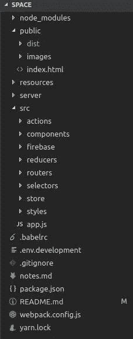

# 我如何使用 React 和 Firebase 构建实时聊天应用程序🔥🔥

> 原文：<https://medium.com/hackernoon/https-medium-com-sargupta-how-i-built-a-real-time-chat-app-using-react-and-firebase-dc8690bf41f7>

Medium 说你只需要 6 分钟就可以读完这篇文章，所以拿杯茶继续读下去吧！

> 此链接提供应用程序，请查看！
> 
> [https://spacedev.herokuapp.com/](https://spacedev.herokuapp.com/)
> 
> 加入聊天室`test`与其他开发者交流！

对于那些只对代码感兴趣的人，你可以直接进入🏊‍♂️
在[自述文件](https://github.com/sar-gupta/space/blob/master/README.md)中提供了本地运行的说明。

给我一颗星星🌟在 github 上击碎掌声👏如果你喜欢这个项目:

# [代码在这里](https://github.com/sar-gupta/space)

如果您想在接触代码之前先阅读一下这个项目，请继续阅读😄我试图通过加入迷因和 gif 让读者觉得这篇文章很有趣，希望你喜欢！

所以！大家好。我最近学习了 React 和 Firebase，所以我在寻找一些可以练习和获得经验的项目。在经历了大量的想法后，我决定构建一个聊天应用程序。柠檬榨汁机🍋

oh well….

在构建它的过程中，我遇到了许多障碍(实在太多了)。对你来说幸运的是，我正在写我构建这个应用程序的经历，所以如果你决定自己构建一些东西，希望你不会遇到很多问题。但是在你的代码中出现错误并不是坏事。这其实很好，因为你可以学到新的东西！此外，想想这个:你凌晨 4 点起床，想着如何解决一个问题，黑咖啡是你唯一的伴侣，突然它就灵光一现。您进行了更改，并看到您的代码工作正常。我可以亲自核实；完全是不一样的感觉！

是的，我的最后一周就是这样度过的:睡到很晚才醒，挤压虫子，然后遇到更多的虫子🤐😂

但最终，这个应用程序开始工作了🎉所以，让我们开始吧。

# 关于代码的一切👨‍💻

该应用使用 **React** 和 **Redux** 管理前端，使用 **Firebase** 管理后端。React 是一个根据应用程序的“状态”在屏幕上呈现应用程序的框架。对于复杂的应用程序，管理这种“状态”变得非常困难。输入 Redux。Redux 是 React 的状态管理器。最后，firebase 提供后端即服务；超级方便！

该应用程序的结构如下:

App Structure

我们所有的 React 代码都位于 src 文件夹中。 [Babel](https://babeljs.io) 为我们编译一切，输出到 public/dist/bundle.js

服务器服务于公共/文件夹。

我不会用所有的配置文件来烦你，你可以在 [Github](https://github.com/sar-gupta/space) 上看看。

您可以在[自述文件](https://github.com/sar-gupta/space/blob/master/README.md)中查看如何设置 firebase 项目。

我提供了`Login with Github`选项，这样我以后可以使用 Github API 为开发人员集成一些很酷的特性。

所以，我们想做一个实时的 app，对。有两件事我们需要反复做很多次。我们需要更新数据库，之后，我们需要用`dispatch`动作来更新应用程序`state`。如果我要总结这个应用程序，前面的一行将是它。

正如你可能猜到的，数据库主要有两部分:`rooms`(聊天室)和`users`。

现在，每当你想让应用程序重新渲染时，你只需通过调度动作来改变状态。有些动作就像创建房间、加入房间、离开房间、发送消息、更新未读消息数……你大概知道了。

这些操作是同步的，这意味着它们一行一行地运行代码，一个接一个。如果有任何异步代码，他们不会等待它返回结果。没有提供`callback`或`promise`。由于我们必须将数据写入 firebase(这是异步的)，我们将使用一个名为`redux-thunk`的 redux 中间件。它为我们提供了调度异步动作的能力。所有动作的一般模式都非常相似:

> 我们更新数据库，在回调中，我们调度乏味的旧同步操作来更新应用程序状态。

Oh Shelly, stop it, will ya?

一个重要的动作是**设置开始状态**。每当用户打开你的应用程序时，你想要像他离开时一样向他显示应用程序(带有关于新消息的更新)。你不希望用户每次打开应用程序时都面对黑屏。因此，每当应用程序刷新时，我们通过从数据库中读取来为用户设置开始状态。

现在，该应用程序的棘手部分是**如何使其实时化？**

每个用户都有自己的机器，并且状态对于他们的浏览器窗口来说是本地的。知道州是本地的对于构建任何 React 应用程序都很重要。所谓本地，我的意思是一台机器上的应用程序的状态变化不会影响任何其他机器上的应用程序的状态。

我们希望当一个用户发送消息时，在同一房间的所有用户的机器上的状态都改变，并显示新发送的消息。那么，我们该怎么做呢？

嗯，这没有你想象的那么复杂。我们的老朋友 Firebase 是来帮忙的！

为了从数据库中读取数据，firebase 大致提供了两种方法:

*   **。once()** :这将在被调用时给出数据库的一个`snapshot`。它只执行一次，然后离开数据库，直到它被再次调用。
*   **。这就是我们手头工作所需要的。该方法开始监听数据库某部分的变化，并在每次该部分更新时运行一个`callback`函数。**

这些方法的文档可以在 [firebase 文档](https://firebase.google.com/docs/)中的[处](https://firebase.google.com/docs/database/web/read-and-write)处找到。

因此，当一个用户发送消息时，会发生以下情况:

1.  数据库用新消息更新。
2.  用户的本地状态通过在异步发送消息操作的回调中调度操作来更改。
3.  该房间的所有用户都使用收听该房间中新留言的变化。firebase 提供的 on()方法。一旦新消息被写入数据库，调用。在()上调用。我们使用这个函数来调度一个更新用户本地状态的动作。这个回调被同时调用到所有用户的机器上，这些机器在那个特定的房间里监听新消息的变化。

(2 和 3 几乎同时发生，因为两者都在数据写入数据库后立即触发)。

理解异步和同步应用程序的概念对于构建任何 web 应用程序都是必不可少的。我遇到过无数次 bug，只是因为我忘记了某个事件的异步本质。代码中的这种错误很难被发现，因为它不会产生任何错误。它就是不做它应该做的事情，也不解释为什么会这样。

我希望你喜欢这篇文章，并在此过程中学到一些新东西！

That’s all, folks!

## 这款应用程序远非完美，但你帮助它更接近那个目标，同时将另一个项目(作为贡献者)添加到你的简历中！

随意分叉 [github 库](https://github.com/sar-gupta/space)并打开问题和拉请求。

如果你不想一路向上滚动代码，我会告诉你:

# [代码在这里](https://github.com/sar-gupta/space)

# 如果你喜欢这篇文章，请打星号🌟github 上的项目，给我一些掌声👏中号(大家都喜欢更多的拍手声吧？😛).