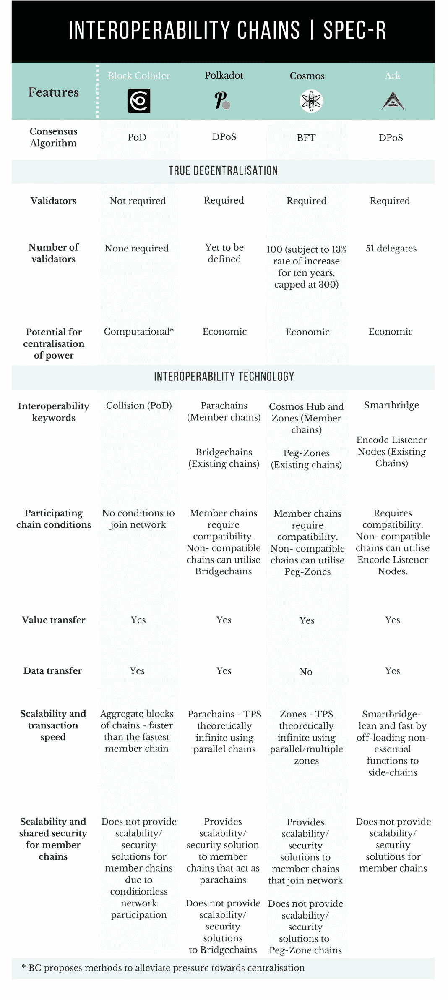
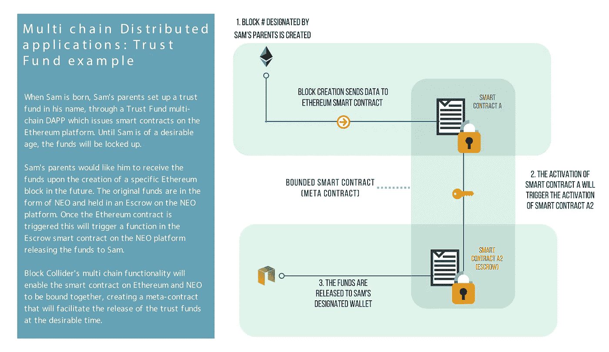
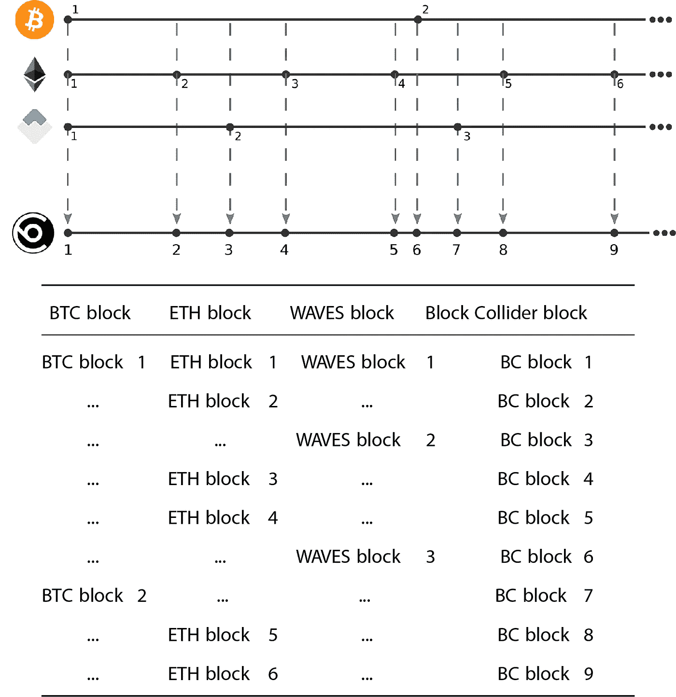

# 块链互操作性的新方法，真正的分散化。

> 原文：<https://medium.com/hackernoon/https-medium-com-specrationality-block-collider-a-new-approach-to-blockchain-interoperability-60eab1b21ae6>

免责声明:投机理性只关注并描述我们相信、已经投资或计划投资的项目。以下信息旨在保持公正；然而，这不是投资建议。做好你的尽职调查。好运！

请将本文内容和图片的来源归因于[www.spec-rationality.com](http://www.spec-rationality.com)

— — — — — — — — — — — — — — — — — — — — — — — — — — — — — — —

推荐阅读以帮助更好地了解该帖子:

[块碰撞器白皮书](https://s3.amazonaws.com/blockcollider/blockcollider_wp.pdf)
[碰撞过程-伊恩·辛普森的象征& NRG](https://blog.blockcollider.org/collision-course-emblems-nrg-ed17e2bdea15) 碰撞过程-伊恩·辛普森的挖掘块碰撞器
[用距离证明构建块链奇点](https://blog.blockcollider.org/building-a-blockchain-singularity-with-proof-of-edit-distance-1d60c328de7a)帕特里克·麦克康龙格

— — — — — — — — — — — — — — — — — — — — — — — — — — — — — — —

仔细观察 Blockchain 空间可以发现，区块链的一系列项目大多是在不同的孤岛中运作的。现实情况是，区块链技术尚未在现实世界中得到广泛采用，然而，随着我们加速走向成熟，一个关键的基础设施水平要求将是信息能够从区块链实时传输到区块链，甚至从区块链传输到旧世界系统。有趣的是，我们只需要看看互联网，就能想象出互联可以产生的价值。

*“多链架桥就像在建筑之间修路一样。假设上，一个人可以建造一栋拥有一切的建筑，但实际上，有些建筑是为了工作而建造的，有些是为了生活而建造的——只要市民想在不同的时间点呆在多个建筑中，道路就很有价值。现有的加密社区展示了区块链的各种特征——一些链有快速阻塞时间，一些链有富于表现力的智能合同，一些链纯粹是通货紧缩和极好的价值储存。只要用户需要来自不止一个区块链的功能，就需要用多链桥接这些链。”* —块对撞机白皮书([来源](https://s3.amazonaws.com/blockcollider/blockcollider_wp.pdf))

有一些著名的项目试图解决不同链之间的互连性。在这些已知的项目中，只有少数项目将互操作性作为核心焦点——例如 Polkadot、Cosmos 和 Ark。一个至今仍未引起注意的新项目(通过设计)提出了一个完全不同的解决链间互联问题的方案: ***块碰撞器*** 。

*稳定硬币、分散交易和元合同的可挖掘多链协议。*“—块碰撞器

让我们快速看一下该领域的几个关键互操作性项目:

For more detailed Table of comparison see [spec-rationality.com/block-collider](http://spec-rationality.com/block-collider/#techcompare)

# 多链:多链分布式应用和元契约的出现

Block Collider 是第一个真正的“多链”,在 genesis 上将连接 6 个链——比特币、以太坊、Neo、Waves、Lisk 和另一个尚未命名的链。Block Collider 的核心分类帐是所有成员链上所有 Block 的聚合，由此产生了术语“多链”。Block Collider 的区块链是通过使用 PoD*(距离的证明 Nakamoto consensus 的修改版本)将不同的链“编织”在一起而构建的，将每个链中的块消耗到 Block Collider 块中，有效地记录每个成员链的状态。

多链不仅促进了链之间的价值转移，更重要的是允许这些以前“孤立”的项目知道彼此链的“状态”。为什么了解其他链的状态如此重要？真正的互操作性不仅仅是值的传递，它是不同区块链并行工作的能力。这一创新打开了真正非凡的东西的大门——多链分布式应用和元契约(多链智能契约)。

上图展示了一个处理信托基金的分布式多链 DAPP 的简单示例。这种应用仅仅触及了块对撞机给区块链生态系统带来的真实潜力的表面。多链功能不仅仅是传输数据，而是提供相对于另一个链的数据。

*“…分布式应用程序开发人员可以在整个生态系统中模块化地组合来自区块链的外来特性…分布式应用程序开发人员可以构建在链之间负载平衡工作的能力"* — Block Collider 白皮书([来源](https://s3.amazonaws.com/blockcollider/blockcollider_wp.pdf))

另外，Block Collider 是一个多链，一个成员链的集合，这带来了一个额外的安全好处。试图使用坏块的矿工不仅要在块碰撞器上反转整个链，还要打破成员链的难度散列值。

* *PoD —距离一致性机制的证明超出了本文的范围。请参考 Block Collider* [*白皮书*](https://s3.amazonaws.com/blockcollider/blockcollider_wp.pdf) *—第 3.2 节编辑距离计算挑战(pp 13)或 Patrick McConlogue(Block Collider 联合创始人)的* [*构建一个带距离证明的区块链奇点*](https://blog.blockcollider.org/building-a-blockchain-singularity-with-proof-of-edit-distance-1d60c328de7a) *。*

# 真正的分散化

*“Block Collider multi chain 是由分散的点对点挖掘器协作创建的，没有集中的故障点、预言或验证器。”* — Block Collider 白皮书([来源](https://s3.amazonaws.com/blockcollider/blockcollider_wp.pdf))

Block Collider 的核心原则之一是提供一个非常符合区块链真正去中心化愿景的平台。Block Collider 引以为豪的是，它的共识机制中没有验证器，而且它抵制集中元素。

**验证器 vs 无验证器**

什么是验证器？区块链中的验证者是一个“人的因素”或网络在某种程度上信任的第三方。网络激励验证者确认网络上发生了事件/交易。这种方法已经/将要被许多链采用，包括像 Cosmos、Polkadot 和 Ark 这样的互操作性链，它们使用委托利益证明(dpo)或类似的共识模型，其中有一组验证器。

Block Collider 不需要验证器，它用挖掘算法(PoD)构建它的区块链，需要工作证明来验证区块链上的事件。它实际上取消了信任易犯错方的要求。

权力的集中

在任何分散的网络中，一个令人担忧的问题是权力可能会集中到少数人手中。我们看到一些评论者指出了比特币网络中的这种情况，在比特币网络中，权力集中在几个矿池周围。这个上下文中的权力是链的治理和块验证的回报。在这种情况下，现有的经济实力根深蒂固，可以想象，这可能导致共识、治理和财富的持续集中。然而，同样值得注意的是，与追求 PoS 或 dpo 的同行相比，比特币平台的优势之一是它不要求网络向验证者放弃任何额外的信任。

PoS 或 dpo 及其各种迭代旨在解决当前区块链技术中的一些瓶颈，但是，这些共识机制仍然包含可能导致集中化的元素。PoS 要求节点持有足够高的债券，以达到“验证者”的地位，因此 PoS 仍然对那些具有经济实力的人具有很大的权重。DPoS 通过允许代表投票选举可信的“验证者”而增加了“民主”的功能。理想情况下，这是一种民主的方法，但是这种系统仍然可能有助于集中，因为投票通常是按网络份额加权的。尽管没有对各种共识方法及其优缺点进行详尽的讨论，我们仍然可以看到，验证者的使用在一定程度上偏离了不可信的共识，而不一定解决经济权力的集中效应。

Block Collider 是一个像比特币一样的可开采链，面临着从矿池集中电力的相同问题，但实施了某些条件来缓解集中的压力。其中包括:

1)拆分块和事务的挖掘(参考白皮书第 3 节-碰撞器上的挖掘了解技术细节)

*“……通过允许两个领域的竞争，降低了集中化的风险，因为一个参与者必须在两个层面上赢得集中化游戏。”* —对撞机[白皮书](https://s3.amazonaws.com/blockcollider/blockcollider_wp.pdf)—3.4 节

事务挖掘对任何人开放，不需要 ASIC 硬件来挖掘。这使得网络上的任何人都有参与网络的经济动机，同时实现更大的吞吐量和更大的负载分布，减少网络上的压力。

2)徽章——块大小奖励(参考[白皮书](https://s3.amazonaws.com/blockcollider/blockcollider_wp.pdf)第 3 节——在碰撞器上采矿了解技术细节)

BC 有一个独特的主张，即通过使用标志来实现动态块大小。实际上，矿商可以“入股”标志，这将使他们能够扩大区块的规模，从而在一个区块中进行更多的交易，以获得更高的回报。这如何缓解中央集权的压力？我们向联合创始人帕特里克·麦康洛格寻求答案:

*“Block Collider 将博弈论应用于挖掘块/费奖励之外的奖励。采矿的徽章奖金是次线性的(也就是说，徽章所有权的回报递减)，这平衡了经济激励与集权化(因为徽章越少，徽章的边际效用越高)。”帕特里克·麦康洛格*

例如，请注意所有指标都是假设的，Sue 有 10 个标志，Mike 有 100 个标志。如果实现所需区块尺寸所需的最佳标志数约为 20 个，则标桩超过 20 个标志不会显著增加区块尺寸。实际上，与最佳的 20 个标桩相比，任何额外标桩的标桩都具有递减的价值。因此，在本例中，Sue 的块大小可能是“标准块大小+ 5”，而最佳块大小是“标准块大小+ 7”。由于下注的奖金逐渐减少，Mike 下注 100 个徽章将导致“标准区块大小+ 8”。这就是说，那些没有强大经济实力的国家仍然可以在近乎平等的基础上竞争。通过这种方式，Block Collider 旨在减轻经济力量对中央集权的拉力。

如果 Mike 将他的 100 个徽章分开，以利用最佳数量的徽章来下注，同时运行多个采矿钻机，会怎么样？在这种情况下，20 个徽章属于 5 个采矿作业。

*“矿工完全可以在采矿钻机之间分配徽章奖励，但为了最大化奖励，他/她必须连接到与原始钻机连接的最少数量的相同同行。这样，他们必须扩展到其他地区。这降低了区域集中化程度，提高了网络的整体效率和速度。”帕特里克·麦康洛格*

此外，Mike 复制原始挖掘操作的 4 个以上实例将需要大量资源。

# 互用性技术

**成员链条件**

Block Collider 取得的最大突破之一是，它将外来区块链纳入其多链的门槛非常低。用外行人的话来说，加入网络不需要修改成员链。

这是区块链生态系统中的一个重大发展，因为当前和计划的未来互操作性解决方案需要某种形式的兼容性或对参与链的改变。为了实现兼容性，Cosmos 和 Polkadot 主要要求在它们的基础设施上构建链。另一方面，Ark 要求以嵌入式代码的形式直接修改现有的链。

然而，应该注意的是，Cosmos Polkadot 和 Ark 为选择不被修改的现有链提供了兼容性的替代解决方案。这可以通过中间区、钉住区、桥链、智能桥和编码监听器来实现。如果我们借用 Polkadot 白皮书，某些链(以太坊)显然更容易适应中间区域，但其他链(比特币)就不那么容易了:

1)以太坊— *“由于以太坊的图灵完备性，我们预计 Polkadot 和以太坊有足够的机会实现互操作，至少在一些容易推断的安全界限内。”*——(波尔卡多特白皮书[——来源](https://github.com/w3f/polkadot-white-paper/blob/master/PolkaDotPaper.pdf))

2)比特币——*“…。因此，我们认为在两个网络之间建立一个合理安全的比特币互操作性“虚拟副链”并非不现实，尽管这是一项时间不确定的重大努力，很可能需要该网络内利益相关方的合作。”* —(波尔卡多特白皮书 [—来源](https://github.com/w3f/polkadot-white-paper/blob/master/PolkaDotPaper.pdf))

Block Collider 的突破不应该被低估，多链为成员链提供了一个低门槛的互操作，而不需要验证器，这为不可信的区块链互联网提供了关键的基础设施。

**成员链的可扩展性和共享安全性**

通过 Cosmos 和 Polkadot 的比较，可能会产生这样的问题:Block Collider 是否为成员链提供了可扩展性和共享安全性？简单的答案是否定的。

Block Collider 不提供可伸缩性和共享安全性，主要是因为它对成员链的无条件参与。Block Collider 遵循 Unix 管道的发明者道格·麦克洛伊的哲学，“*编写做一件事并把它做好的程序。写程序一起工作。”*从这个意义上说，扩展解决方案是协议级链的责任，互操作性是块碰撞器的责任。

Cosmos 和 Polkadot 为“加入”其网络的成员链提供这些解决方案，这是其平台提供的独特和值得称赞的价值主张。尽管应该注意到，对于现有的链，使用前面提到的中间区域并不能提供与在平台上本地构建的那些相同的可伸缩性和共享的安全优势。这是因为现有的链在平台上不起作用，而是通过 Polkadot 或 Cosmos 构建的链接(桥链或 pegzones)桥接到平台。

# 可扩展性—规模和交易速度

作为多链的块碰撞器是来自其成员链的块的集合。就规模和事务速度而言，这对可伸缩性意味着什么？

**链条的尺寸**

一个值得关注的问题是，块碰撞器是所有成员链上的所有块的集合，它会非常消耗空间。为了对抗这种块碰撞器的 PoD 一致性机制主要使用其他链的头状态和 Merkle 证明来存储块碰撞器网络上的链。标题小于原始链块大小的 1%。因此，人们可以想象，没有任何修改，块对撞机可以合并 100 条链，但仍然只有一条以太坊大小的链那么大。

随着 Block Collider 的发展，我们可以想象有一天 1000 多个链可以与 Block Collider 互操作。那么，接下来呢？Block Collider 旨在以两种方式处理这种增长，尽可能压缩，然后通过反向链修剪。

*“为了处理第一部分(压缩)，我们从标题状态开始。此后，我们切换到类似于 Mimblewimble*(一旦块碰撞器散列率足够强)中提出的仅签名模型。最后，修剪将是创造第二个向后挖掘的区块链的过程。在第二个区块链中，“工作”是应该从块中剔除的事务。通过这种方式，它就像整理硬盘碎片一样。”帕特里克·麦康洛格*

* mimble wimble——一个实验性的区块链网络

**交易速度**

块碰撞器作为来自成员链的块的集合将总是比最快的成员链稍快。这是因为 Block Collider 具有基于成员链上发布的块的高块发布率。

来源: [Block Collider 白皮书](https://s3.amazonaws.com/blockcollider/blockcollider_wp.pdf)

在白皮书的上述示例中，我们看到比特币在设定的时间框架“x”内发行了 2 块，以太坊发行了 6 块，Waves 发行了 3 块。当 3 个链发出它们的第一个块时，形成第一个块碰撞器块。应当注意，块时间在链之间变化，因此成员链将以不同的间隔发出块。每次从成员链发出块碰撞器都会发出它自己的块，其中包含来自成员链的新块集。在这个例子中，在时间帧“x”中发布了 9 个块碰撞器块。所以块发布率(块速度)永远高于最快的成员链。

更高的块速度当然会带来吞吐量的问题，即每秒的事务数量。采矿设计以生产量为主要要求。满足这一要求是 Block Collider 将块挖掘和事务挖掘分成独立进程的主要动机之一。

*“与其他加密货币不同，对撞机区块链的交易和区块可以分开挖掘。预先挖掘的事务使矿商更容易将事务添加到它已发现的块中，这平衡了矿商在当前系统中的权力。”* —块碰撞器

# [技术对比//多链协议(区块链互联网)](http://spec-rationality.com/block-collider/#techcompare)

# 结论

Block Collider 带着对“区块链互联网”的激进解决方案来到太空，连接不同的链，同时保持区块链技术公司真正去中心化的愿景。mainnet 的推出将包括 6 个链之间的互操作性，BTC，联邦理工学院，近地天体，海浪，Lisk 和一个尚未命名的链。