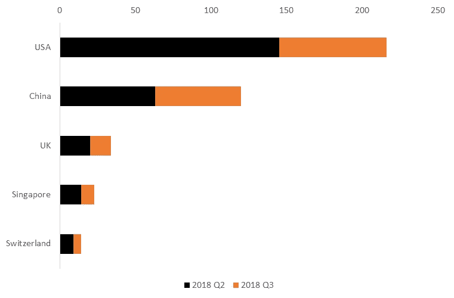
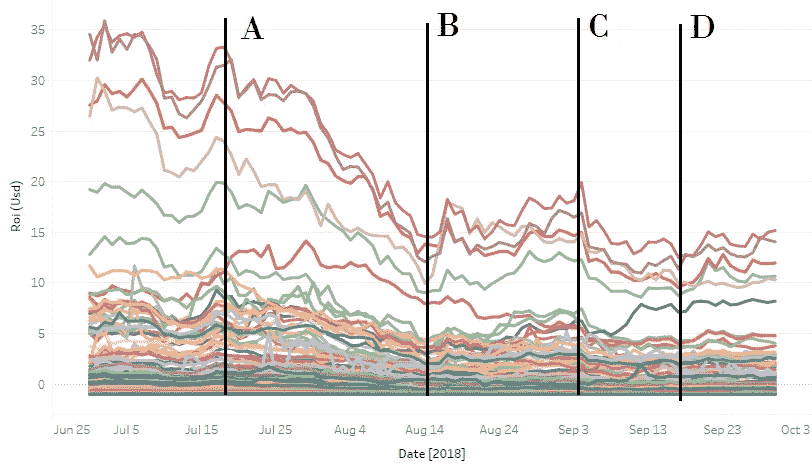

# 执行摘要:InWara 的 2018 年第三季度报告。

> 原文：<https://medium.com/hackernoon/https-medium-com-syedshoeb-executive-summary-q3-2018-report-by-inwara-c5b53773da28>

与 2017 年相比，Crypto 在 2018 年有所增长，但 2018 年第三季度的增长率大幅下降。尽管与传统市场相比，加密行业非常不稳定，但如果操作得当，它的回报是其他行业无法比拟的。

这份 2018 年第三季度的 ICO 市场分析报告包含了尽职调查所需的所有数据。需要采取广泛措施将来自 40 多个公共来源的信息整理到一个平台上。InWara 通过分析 3000 多份 ICO 白皮书、近 2200 篇官方公司博客文章、500 篇官方新闻稿以及对新闻和社交媒体来源的持续网络监控来实现这一目标。

[InWara](http://www.inwara.com/?utm_source=executivesummary&utm_medium=executivesummary&utm_campaign=exesumm) 是一个首屈一指的数据库，是对当今数字货币格局进行自下而上的基础研究的一站式资源。InWara 提供关于 ico 背后的公司、其竞争对手、资金、路线图和管理的数据和研究。

这份报告主要对以下主题提出了真正的见解。

*   ICO 景观
*   ico 和区块链公司中的私人资金
*   区块链中的并购
*   杂项统计

## ICO 景观:

No. of ICOs by Industry (Q2 2018 vs Q3 2018): Fin remains king

金融服务仍然是 ico 中最受欢迎的领域，第三季度新产品的势头越来越大。区块链作为一种技术，在 2018 年第三季度，技术和区块链平台获得了牵引力。

No. of ICOs by Country (2017 vs 2018): USA leads, Africa lags

有关各个部门的更多信息，请参见完整报告。

2018 年加入竞争的 ico 数量远远超过 2017 年——Q1 和 Q2 在高硬币价格的支持下蓬勃发展，促使 ico 涌入

关于 ICO 前景的完整报告阐明了围绕公用令牌的不确定性、各国对 ICO 的规定及其对加密空间市场的影响。

## ico 和区块链公司中的私人资金

本节涵盖参与 ico 的程度——私人融资轮数、筹集的资金、前 10 大加密基金的投资数量。

风险投资在售前和私下销售阶段占主导地位，在主要销售阶段也有一些行动。私人融资在 2018 年大幅增长了约 90%，融资总数比 2017 年翻了一番，这清楚地表明了风险投资和对冲基金对 ico 的兴趣。

Number of investments by top 10 crypto investment funds

风险投资在售前和私下销售阶段占主导地位，在主要销售阶段也有一些行动。在中国、日本和韩国之外运营的少数 HNI 公司，也在一些特定国际投资公司的私人融资轮中占据主导地位

# of Private Funding Rounds By Country

美国主导了市场，风投们更愿意在美国之外运作。亚洲在私人融资方面领先欧洲，中国和新加坡都获得了约 150 轮融资

## 区块链中的并购

这部分包括区块链空间行业 wise 在 2018 年第三季度发生的所有并购。

Mergers and Acquisitions

2018 年第三季度，区块链地区的并购增长了约 20%。然而，在 2018 年第 3 季度，没有看到轰动一时的交易。Tron -BitTorrent 交易仍然是加密领域最大的收购，交易价值为 1.4 亿美元。

## 其他统计信息:

除了这些方面，本报告还涵盖了影响市场和该领域新进入者的所有新闻和炒作。

例如，

RoI trend during Q3, 2018

垂直线 A、B、C 和 D 表示可能影响密码货币市场的事件或新闻。线“T0”A 代表证交会正式推迟比特币交易所交易基金审批听证会的那一天。

正如您所看到的，延迟导致了密码领域的大规模崩溃，ICOs 损失了 50%以上。

作为最受信任的 ICO 数据库，所有见解均来自于 [InWara 的](http://www.inwara.com/?utm_source=executivesummary&utm_medium=executivesummary&utm_campaign=exesumm) ICO 数据库。所有订阅者都可以实时获得这些见解。