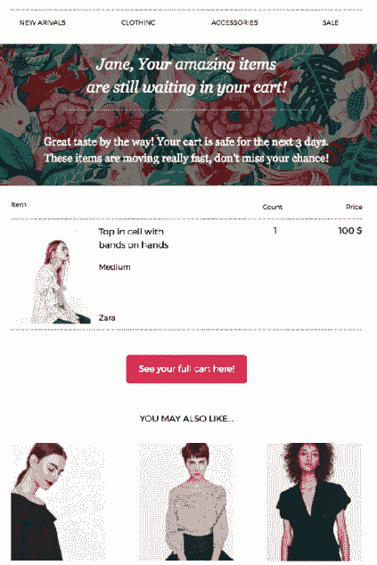
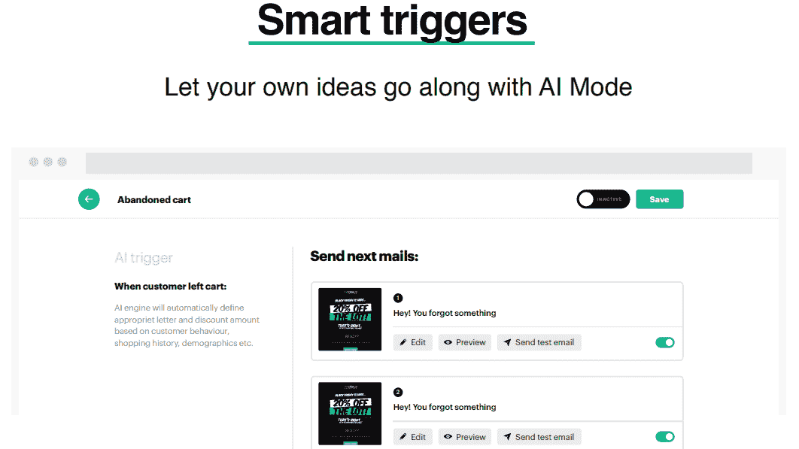

# 为什么你的电子邮件会从主收件箱中消失？

> 原文：<https://medium.com/hackernoon/https-medium-com-triggmine-why-your-emails-disappear-from-the-main-inbox-7fe90b281581>

如果你是一个活跃的 Gmail 用户，你肯定知道大量的电子邮件会直接进入“**推广**标签，而不会进入你的主收件箱。

不是这些垃圾邮件，只是那些不属于私人或工作交流的信件。

也许你不常去那里，但有时(也许一周一两次)你会去。你开始检查你的“促销”收件箱，经常在头脑中有一些目标。**你给了这些信件一个吸引你注意力的机会，但最终还是浏览了那些应该被扔进垃圾邮件的信件**。

还有一个问题。

> *如果我需要发送一封收件人同意的商业信函，但它到达了促销标签，该怎么办？我应该等到一个人决定每周浏览一次文件夹吗？*

**随着** [**即将推出的 Triggmine on product hunt**](https://www.producthunt.com/upcoming/triggmine)**，我们决定最终回答这个问题——为什么你的电子邮件会从主收件箱中消失。**

# **邮件如何到达促销文件夹？**

谷歌在这方面没有官方指导方针。

这封邮件可以被请求并且完全可信(就像 Hustle 时事通讯一样)。尽管如此，它还是经常出现在促销标签中。请记住，这都是个人的，取决于用户的行为。*您收件箱中的促销信息可能会转到您朋友的主收件箱*。

好吧，让我们分享几个可以让电子邮件和时事通讯远离推广标签的方法。

## **链接位置**

你不希望你的邮件中有两个以上的链接。其中一个链接会隐藏在“取消订阅”按钮下，所以你只能看到一个。

Only TWO links

**如果你有链接，让你的接收器与你的链接互动**

这不是让客户渴望点击的有说服力的技巧或销售技巧。诀窍就简单多了。你的第一个字母应该带有*链接，接收者肯定会点击*。这里有一个场景:

> 你有一家电子商务商店。一位客户下了订单，在这个过程中，他给了你一个电子邮件地址。显然，你想在电子邮件活动中进一步使用它，并确保你的信件最终会在主邮箱中。为了达到这种效果，你需要发送 2-3 封“确定”的电子邮件，人们肯定会打开并与之互动。

这方面的例子有:

**订单确认。**下订单后，您可以发送一封个性化的电子邮件，其中包含购物车中订购的商品。该链接导致订单的批准。用户必须点击——否则，订单不会被批准。你得到了一个互动。

*下面是一封用*[*Triggmine*](http://www.triggmine.com/smart-ecommerce-marketing?utm_source=medium&utm_medium=social&utm_campaign=medium-blog-outreach)*发送的电子邮件的例子，这是一种电子邮件营销自动化服务。*

**收货确认。**当订单发出时，客户总是渴望知道他们的产品何时到达。利用这个机会创建另一封肯定会被打开的电子邮件。

**关于顾客购买的特定产品的建议。**这里你需要记住一点:特异性是关键。只有当你把它与特定的产品和特定的订单联系起来时，电子邮件才会起作用。您可以自动化发送过程，坦率地说，您应该这样做，但是文本和设计应该尽可能地个性化。

# 特异性是关键

给你的一个小练习。

> 打开你的促销邮件。我们打赌个性化的唯一元素就是你的名字。到现在，每个人都明白这只是一个营销伎俩，老式的“在信中写上名字”已经不再有效了。

**在时事通讯和群发邮件中有可能更具体吗？**

展示一家公司或一家商店不声称了解他们的客户。这些都是美丽的话，但事实上，我们没有太多的空间来了解我们的网站访问者——除了他们在订阅表格中给我们的信息。

还是我们？

事实上，有一种方法可以更好地了解网站访问者，使用人工智能触发监控系统。

当访问者访问网站时，他/她会执行一些操作——点击、滚动、点击。通过使用*触发系统*，该算法可以跟踪这些交互，并根据接收者的活动调整电子邮件活动。

**细分呢？**

您不必根据收件人的活动手动将其分组，算法也会这样做。您只需编辑电子邮件的基本模板(页眉和页脚)，正文就会自动填充。为了确保它是正确的，请检查最终版本，就像您的订户将收到的版本一样。

我什么时候能测试这个？

就现在。

它不是未来的预测或可能的趋势，而是现有的工作解决方案。我们 Triggmine 开发了一种人工智能驱动的电子邮件营销自动化，允许企业主创建、发送、管理和监控电子邮件营销活动，使它们尽可能个性化和具体化。

## 如果你对发送智能邮件给你的客户感兴趣，你一定要试试 Triggmine。只需在 ProductHunt 上订阅 [Triggmine](https://www.producthunt.com/upcoming/triggmine) 页面即可开始体验，并与我们分享。