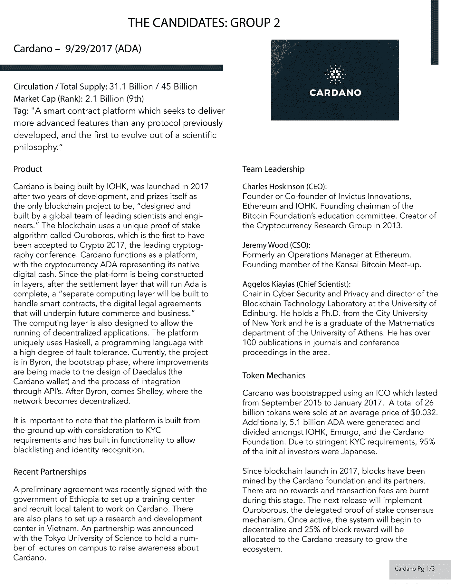
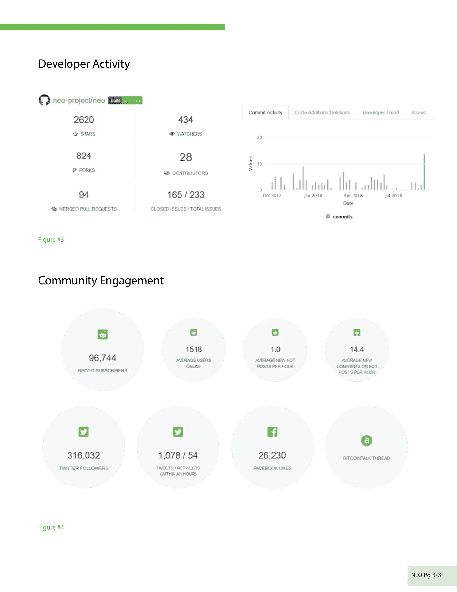
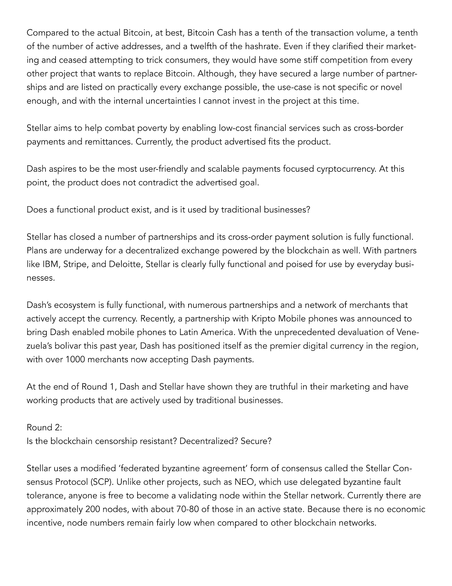

# 创建一个 10 年持有期的加密货币投资组合

> 原文：<https://medium.com/hackernoon/https-medium-com-zvnowman-building-a-cryptocurrency-portfolio-for-a-10-year-holding-period-e7ed407a9754>

这是一项全面的工作，包括对 12 个主要的区块链项目进行基本的定量分析。

BCH XLM DASH EOS 阿达 LSK ZEC XMR XVG 新兽医 TRX-你会选择哪四个？

[Source](https://i.stack.imgur.com/BQePF.jpg)

