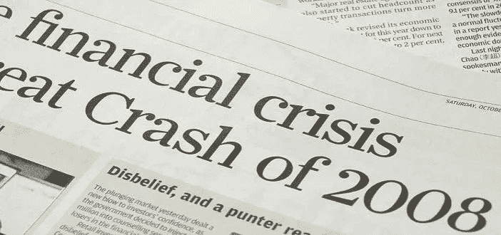

# 加密货币中的傲慢和系统风险

> 原文：<https://medium.com/hackernoon/hubris-and-systemic-risk-in-cryptocurrencies-7f8d270db52f>

> “投资和投机之间的界限从来就不明确，当大多数市场参与者最近享受胜利时，这一界限变得更加模糊。没有什么能像大量轻松的金钱一样让理性平静下来。在那种令人兴奋的经历之后，通常理智的人会变得行为类似于舞会上的灰姑娘。他们知道，庆祝活动结束后，也就是说，继续投机那些相对于他们未来可能产生的现金有巨大估值的公司，最终会带来南瓜和老鼠。但是他们仍然不愿意错过这场盛大聚会的一分钟。因此，头晕的参与者都计划在午夜前几秒钟离开。不过，有一个问题:他们在一个没有指针的房间里跳舞。” *—沃伦·巴菲特致股东的信*

# 投资中最危险的想法

如果我问你，你认为投资者必须警惕的最危险的投资理念是什么，你会说是什么？熊市？高波动性？技术分析？不，不，再一次不。投资中最危险的想法是以下四个字:“这次不同”。

“这次不一样”是一个过于热切的投资者的狂妄自大的结果，是那些相信他们可以忽略以前关于投资的态度、信仰、概念或想法的投资者的战斗口号，因为“这次不一样”。当你听到有人说这句话或类似的话时，你应该跑得越远越好，不要回头看。这句话造成的损失比在枪口下造成的损失还要多。我不在乎最近的投资热潮看起来有多么不同，或者你投资的某项技术有多么广泛的创新，但今天的投资经验和过去的经验之间至少有一些相似之处。事实上，这些相似之处可能比你想象的更加接近。

即使在投资加密货币的“狂野西部”领域，这一点依然成立。尽管我们不希望这是真的，但从长期来看，基本面仍然适用于加密货币。哪些加密货币/代币将在 10-15 年内提供实际价值？哪些令牌是以这样一种方式设计的，即长期持有令牌实际上是有意义的？加密货币/代币背后的团队是否经验丰富、声誉良好且值得信赖？加密货币/代币是在解决现实世界的问题，还是试图为实际不存在的问题创造解决方案的代币(即本末倒置)？如果你想投资在未来几年为你提供强劲回报的加密货币/代币，你必须能够完整地回答这些问题。

当然，在谈到加密货币时，人们可能会陷入“这次不同了”的心态，这是可以理解的。毕竟，通常这种心态与梦想不可想象的财富相关，相信这一次真的*是*不同的，并且以前发生类似事情的时代是根本不同的(例如网络泡沫)

在互联网泡沫期间，投资者也有“这次不同了”的心态，因为技术的创新性及其长期的影响。在这次泡沫期间，许多投资者渴望投资于任何估值的公司，只要这些公司具有“高价值”。com”后缀。

我们今天看到了同样的事情发生——一家名为“[在线 plc](https://www.bloomberg.com/news/articles/2017-10-27/what-s-in-a-name-u-k-stock-surges-394-on-blockchain-rebrand) ”的投资互联网和信息业务的英国公司宣布，它正计划将其名称改为“在线区块链 plc”。其股价在一天内上涨了 394%。这也不是什么疯狂或极端的案例。一家名为“ [Bioptix](https://www.bloomberg.com/news/articles/2017-10-04/from-biotech-to-bitcoin-bioptix-shifts-focus-to-blockchain) ”的生物技术公司更名为“Riot Blockchain”，其股票在宣布之前上涨了 50%以上，在他们正式公布更名后上涨了 17%。

这令人担忧。一家公司能够简单地在其名称中添加一个术语，并使其股票价值飙升，这一事实应该向您展示市场对任何与区块链/加密货币相关的事物的非理性。这与更大的傻瓜愿意为网络公司支付巨额估值没有什么不同。

马克·吐温曾经说过，*“历史不会重演，但却常常押韵”。没有哪个领域比投资更符合这一点。根据这本书**这一次是不同的**，*“美国自以为其金融和监管体系能够持续承受大规模资本流入……可以说是为 21 世纪头十年的全球金融危机奠定了基础。”*读者们，我会让你们决定这是否也适用于加密货币市场。*

# 已知的未知、未知的已知和系统风险

> *“有已知的已知，我们知道我们知道的事情；还有已知的未知，我们知道自己不知道的事情。但也有未知的未知，我们不知道我们不知道的事情。”唐纳德·拉姆斯菲尔德*

如果当你听到或看到“系统性风险”这几个字时，你的眼神变得茫然，那么就有问题了。所以我就拿下面这一段来具体解释一下什么是系统性风险。

系统风险是特定公司或集团内的事件可能导致整个市场的大规模不稳定和不确定性。在这种情况下，我们关注的是加密货币和代币市场的系统性风险。存在系统性风险的公司或集团有时被通俗地称为“大到不能倒”，也就是说，如果它倒闭了，我们就完蛋了，所以它不能倒闭。

有许多不同类型的系统风险，这完全取决于我们所关注的行业或领域。某个特定市场的系统性风险可能仅仅局限于该市场，而不会对整体经济产生影响。有时，系统性风险会导致整个经济的不稳定。这些才是我们最应该关心的。

对于系统性风险，最令人担忧的是人们对其视而不见的频率，通常是不情愿的，但有时是心甘情愿的。但是等等，为什么有人会选择对风险视而不见呢？难道投资者不想知道这一点，以便他们能够保持谨慎并采取行动，防止受到系统性风险的影响吗？简单来说，答案是否定的。

加密货币投资者可能太愿意忽略明显的系统风险，因为他们赚了太多的钱，以至于不会关心一些愚蠢的概念，如“系统风险”，因为究竟什么是“系统风险”？在他们看来，这只是经济学教授(他们认为是骗子)用来防止他们通过风险投资赚更多钱的另一个术语。对他们来说，那是别人的问题，不是他们的。

系统性风险的困难之一是，除非知情，否则几乎不可能准确预测它是否会真正影响任何事情，以及它将如何影响市场。对系统性风险的预测越精确，发生的可能性就越小，因此，如果他们宣称的所谓“系统性风险”从未发生，人们会尽量避免称之为系统性风险，以免看起来像个傻瓜。我认为，这是为什么最令人担忧、最明显的系统性风险被有意忽视的原因之一。

比方说，我把某件事说成是一个明显的系统性风险，并尽我所能向所有人大肆宣扬，让他们意识到这一点。也许，仅仅是也许，我可能是错的，我一直抱怨的系统性风险不会带来任何不好的结果。现在我的名声毁了，因为我为一件根本无关紧要的事情大吵大闹。谁希望那发生在他们身上？这通常就是为什么指出明显系统性风险的人是那些处于图腾柱底部的人:他们没有什么可失去的。如果他们错了，那也不会对他们造成太大影响，因为他们本来就没有名声。但如果他们是对的，他们将会出名(或声名狼藉)，最有可能得到图书交易，被邀请到美国消费者新闻与商业频道，甚至可能成为传记电影中的主角，如果他们发现并指出某些特别重要的事情的系统风险(例如 *The Big Short*

系统性风险的一个方面是“卡珊德拉”原型的概念。这是什么原型？卡珊德拉是希腊神话中的一个女人，她被诅咒说出别人都不相信的真实预言。卡珊德拉存在至今；这些人大声疾呼金融市场中的系统性风险，而人们却对此视而不见。他们被认为是最令人讨厌的，最糟糕的是有害的，直到他们的预言(即系统风险)实现并导致灾难，他们才得到救赎。

投资者可能会遇到的一个困难是区分金融市场的预言家和妄想的小贩。所以我想提出一些问题，当你试图评估一个人是命运的预兆，还是完全被欺骗时，你可以用这些问题。请注意，这些问题并不详尽，但希望它提供了一个很好的起点，让您可以提出自己的问题/标准。注意，这不仅适用于加密货币，几乎适用于任何东西。无论如何，以下是你应该问的问题:

## 确定某人是庸医、骗子还是骗子的问题

1.  这个人在这个领域有经验吗？

*   此人是否发表过任何关于该主题的同行评审论文/书籍？
*   这个人是否被一个著名的组织认可为该领域的专家？
*   此人是否了解该领域的当前文献和信息？

2.这个人的动机是什么？

*   他们有意识形态的动机吗？
*   他们有经济动机吗？
*   他们在游戏中有利益关系吗(例如，如果他们错了，他们会受到影响吗)？

3.他们使用的信息有多准确？

*   他们是用事实/数据来支持自己的论点，还是大多用猜想？
*   他们使用的事实与他们试图提出的主张相关吗？
*   他们提供的信息来源有信誉吗？

4.还有谁在说类似的话？

*   其他有声望的人也这么说吗？
*   如果是这样的话，有多少人在他们的领域被认为是专家呢？

5.如果他们错了，对他们的声誉会有多坏？

6.他们对他人的警告有多坚定？

# 最后

投资加密货币时，要注意系统性风险。避免过度自大，如果加密货币投资的基本面没有意义，不要再告诉自己“这次不一样了”。当所谓的区块链/加密货币专家声称或预测某事时，问问自己我上面提供的问题，以确定你应该在多大程度上考虑他们的意见。

祝你的加密货币投资好运。愿投资基本面对你有利。

你可以通过捐赠 ETH(或 ERC20 代币)到这个地址来支持我:0x 0 BCB 78d 67 d8d 929 DC 03542 a5 aedef 257 f 378 e 513

你可以通过我的电子邮件直接联系我。

请鼓掌