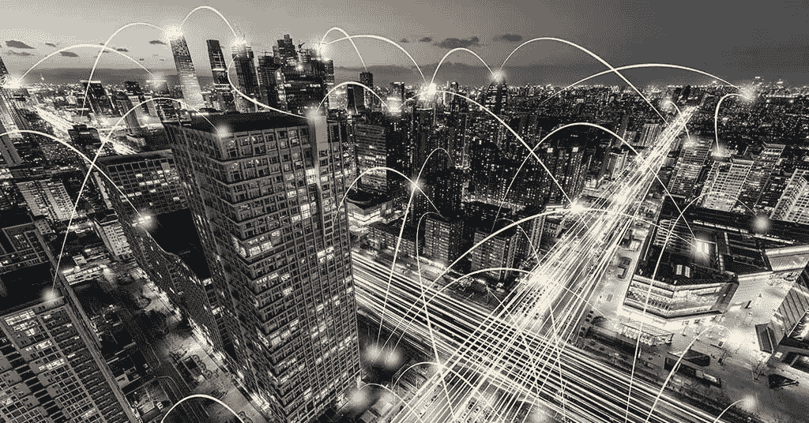
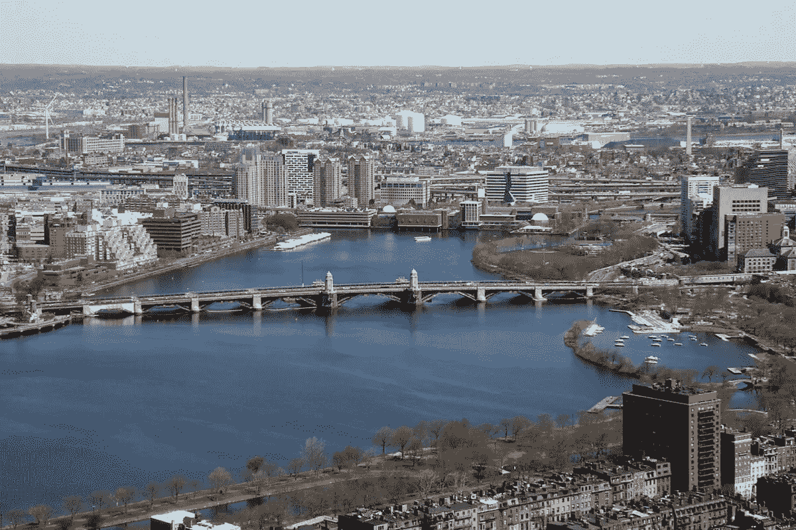

# 智慧城市的人心

> 原文：<https://medium.com/hackernoon/human-hearts-of-smart-cities-24470643b6c7>

由伊琳娜·贝兹博罗代赫

现代世界正在向城市转移。预计到 2050 年，城市人口将占总人口的 66 %。因此，城市本身也在不断发展，试图应对新的挑战:交通密度、生态问题和社会不可持续性。人工智能(AI)和物联网(IoT)等创新技术的应用使它们变得‘聪明’。当代的需求使我们生活在智能城市时代。开放和敏捷的智能城市[网络](https://hackernoon.com/tagged/network)统计到目前为止在 23 个国家有 100 个智能城市，中国计划到 2040 年建立 290 个。那么，它们是什么样的——那些未来的城市？

# 什么是智慧城市？

智慧城市是由信息和通信技术组成的框架。这些技术包括:

*   监控和视频分析；
*   照片和视频固定；
*   安全运营中心；
*   统一的应急管理；
*   [智能交通系统](https://stfalcon.com/en/blog/post/transportation-industry-trends)；
*   公共交通安全系统；
*   LTE，5G；
*   物联网；
*   [无人驾驶汽车](https://stfalcon.com/en/blog/post/transportation-industry-trends)；
*   生物识别技术；
*   非结构化数据处理；
*   数字顾问；
*   增强现实和虚拟现实；
*   [地理信息技术](https://stfalcon.com/en/blog/post/digitization-of-freight-transportation)；
*   [机器学习](https://stfalcon.com/en/blog/post/deep-learning-benefits-and-challenges)；
*   [云和雾计算](https://stfalcon.com/en/blog/post/women-in-IT)；
*   基于 LED 的街道照明。

这些服务可以即时分析数据，并帮助增强基础设施。它包括能源分配、公用事业、空气和水质量、交通、教育和医疗保健、公共安全和房地产。

从理论上讲，城市管理的任何领域都可以成为一项明智的举措。例如，在芝加哥，WindyGrid 技术项目有助于防治啮齿动物，在银川，你可以用自己的脸来支付商品和服务。

智能城市提高了市民的生活质量，节省了资金和资源。因此，巴塞罗那的物联网应用每年为城市预算节省高达 3500 万美元。不仅节省了资源，也节省了时间。根据英特尔的数据，明智实施的城市技术每年可以为每个居民节省多达 125 个小时。

# 三种智慧城市

城市变得智能有不同的方式。其中一些是从零开始建造的，其他的以他们自己的速度和方式进行现代化。让我们看一些有趣的例子。

# 1.从一开始就聪明

这些都是全新的专门建造的城市。IT 系统的实施被纳入他们的总体规划。其中一些设计看起来非常未来，像日本的 x-Seed 4000 或俄罗斯的水晶岛。虽然在最近的将来，我们可能不会在现实中看到这样的塔形城市，但已经被赋予生命的项目看起来也令人印象深刻。

比如阿布扎比郊区的马斯达尔市。这个项目的主要目的是尽量减少二氧化碳的排放，因此，所有的城市系统都使用可再生能源，非电力运输甚至禁止接近城市。这座城市有自己的交通系统，叫做个人快速公交系统。到目前为止，马斯达尔是一座科学家之城。首批住宅区计划于 2018 年建成。

# 2.实施新技术的老城区

这些已经存在的城市将智能市政的不同方面应用到他们的日常生活中。因此，在纽约，一个统一的数据库被用来检测来自镜头的振动。警察立即得到信号并迅速做出反应。大苹果的大数据还被用于预防火灾和清除街道上的垃圾。沃森健康项目在智能手表和传感器的帮助下，帮助跟踪公民的健康信息。

巴塞罗那有 20 多个智能项目领域和 100 多个正在进行的项目:从公共场所的 Wi-Fi 接入到智能照明和电动交通的推广。到目前为止，这是唯一一个由统一系统——Sentilo——从任何地方放置的所有传感器收集数据的城市。所有的数据都是免费的。技术化将给这个城市带来大约 4.7 万个新的工作场所。

智慧城市发展没有统一的模式。这项由诺基亚在 2016 年进行的研究为城市“智力”的发展定义了三种主要方式:

*   anchor —当定义了主城区问题(比如交通超载)时，就构建 app 来应对这个问题，然后不断添加其他 app；
*   平台——创建了支持各种智能应用和服务所需的基础设施；
*   beta-方法，首先在一个实验站点上实现几个应用程序，以评估它们的有效性。这种方式接近于第三种改造型城市，即生活实验室。

# 3.生活实验室

“生活实验室”一词指的是各种参与性的地方实验项目。生活实验室可以是校园、公司城，甚至是娱乐公园。他们来自一所大学，一个非营利性或营利性公司。这种实验室能够在真实生活环境中与真实用户进行实验和共同创造，在真实生活环境中，用户与研究人员、公司和公共机构一起寻找新的解决方案、新产品、新服务或新的商业模式。

例如，2017 年，Alphabet Holding 在离多伦多不远的安大略湖畔赢得了一场领地升级的竞赛。该项目包括引入无人驾驶交通工具、自适应路灯、[快递机器人](https://stfalcon.com/en/blog/post/AI-robotics-practical-application)和节能智能家居。该计划制定了 10 年，如果成功启动，所有举措将在加拿大许多其他城市推出。

但是这些不仅仅是让这些城市高效的技术。很大程度上取决于技术如何与人互动，因为城市不仅仅是基础设施和便利。它是关于塑造环境的公民。这就是为什么记住这些城市计划旨在帮助的人是很重要的。它不仅提高了人们对技术带来的好处的认识，还促进了居民的积极参与。

# 智能城市概念:从技术化到人性化

经过深思熟虑的智能解决方案可以改善公民参与和共同决策。城市战略家 Boyd Cohen 定义了城市在体现智能概念时所经历的三个阶段——从技术公司驱动到市政府驱动，最后是市民驱动。

首先，以技术为中心的智慧城市愿景是由鼓励采用其技术解决方案的技术公司实现的。如今，据说比尔·盖茨将投资 8000 万美元在亚利桑那州建造这样一座智能城市。凤凰城外的 25，000 英亩土地被 Gate 控制的投资公司 Cascade Investment 购买。这座城市被规划为一个未来社区，拥有高速网络、自动驾驶汽车、数字网络、数据中心、新的制造技术和自主物流枢纽。这些计划确实雄心勃勃。然而，批评者怀疑这一切是否会变成下一个像韩国松岛一样的鬼城，那里的高科技无法吸引足够多的市民。

在第二个阶段，城市的发展是由市政当局、有远见的市长和城市管理者开创的。市政当局利用技术来改善基础设施、效率、便利性和市民的生活质量。

里约市政府决定使用传感器网络来减轻山体滑坡的影响，或者共享数据来加强交通监控、安全和天气预报(该市遭受了严重的暴雨)。

但是，对里约 smart 计划的全面分析发现，在许多方面，它未能帮助城市居民。在《城市科技期刊》中提出的城市经验教训包括需要通过扩大城市政府的真实和虚拟可及性来改善人类体验，以及将技术化的重点从富人区转移到穷人区，从而弥合数字鸿沟。

第三阶段以领先的智能城市为代表，采用市民共创模式。它们有助于增加以知识为基础的公民参与和制定公共政策。

波士顿是这种参与式城市化的一个极好的例子。市政府制定了一个目标，制定以人为本的传感器技术实施战略。在 Github 放置的“剧本”中，它呼吁技术公司、科学家、研究人员、记者和活动家专注于公民的真正需求。“与街上的人们交谈，与当地的企业、艺术家、建筑师和规划师交谈，与倡导团体交谈——向我们展示你见过他们，思考过他们与城市的互动，并围绕他们的需求和体验设计了你的建议”，这是市政府对那些希望为波士顿智能城市项目做出贡献的人的号召。

该市为波士顿人推出了一套移动应用程序。通过他们，人们可以向当地政府报告问题，参与回收，道路维修，跟踪校车等。其他举措包括在线社区教育平台 Community PlanIt 和参与式唐人街教育居民参加社区会议和讨论。

在拉丁美洲，麦德林是值得关注和钦佩的。该市集中力量保护最脆弱的社区。早在 20 世纪 90 年代，麦德林被认为是世界上最暴力的城市:1991 年，它创下了每 10 万居民 390 起凶杀案的记录。今天，麦德林可以自豪地说，它的谋杀率下降了 95%，生活在极端贫困中的居民人数从 8%减少到 3%。这种彻底的转变是自 2004 年以来实施智慧城市战略的结果。其中包括创建免费互联网接入区、开放式政府、智能移动系统以及 Mi-Medellin 和 Citiesfor.life 共创门户网站，使市民能够参与并共同为城市创建解决方案。麦德林每年预算的 5%分配给公民，由他们决定如何使用预算来满足当地社区的需求。

# 未来展望

关于人工智能和物联网对我们生活的影响有不同的观点。一些人警告说，通用数据处理和传感器应用可能会给我们的生活带来隐私威胁——这不是没有原因的。其他人关注新技术给我们生活带来的机遇。事实上，任何技术解决方案都可以用于好的和坏的目的，可以限制或增加个人自由。这在很大程度上取决于每个人在建设我们都将生活在其中的未来时的个人参与。让我们一起建设这个未来！你的，[Stfalcon.com](https://stfalcon.com/)。

## *最初发表于*[T5【stfalcon.com】](https://stfalcon.com/en/blog/post/smart-cities)*。*