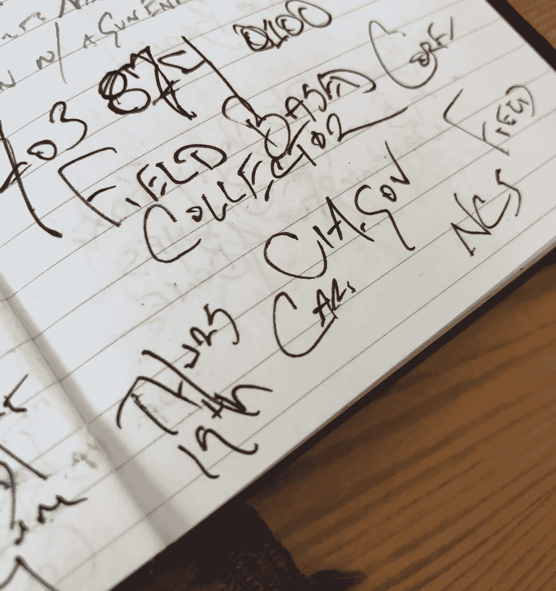

# 人类智力

> 原文：<https://medium.com/hackernoon/human-intelligence-d0b952baccdd>

## 一个风投从采访中情局中学到了什么

My notebook after I received a mysterious call…

> “诗人是无党派的。否则，他将只是一个凡人。”—夏尔·波德莱尔

2006 年秋天，我参加了成为中情局间谍的面试。事情是从一个电话开始的。在短暂的问候之后，我记得一个无形但坚定的声音说，“迈克尔，我们看到你申请政治分析师的职位，但我们想知道你是否会对秘密服务感兴趣。”

我不太记得当时我咕哝了什么，部分原因是我很惊讶，但主要是因为我从未想过要成为一名间谍。出于各种原因。但是在你的一生中有多少次有人会打电话问你？所以我想看看这个兔子洞能有多深。我低头沉思，“是的，我会的。”

"太好了，我们下周安排一次初步的电话面试吧."

在接下来的一周里，我不知道会发生什么，更不知道如何准备，所以我什么也没做。这不像麦肯锡的面试，你可以通过胡扯的案例研究和心算来提前练习一架 747 能装下多少个乒乓球。

当时，我在马萨诸塞州剑桥的布拉特尔街(Brattle Street)——即“托里街”(Tory Row)——附近一户人家的殖民地住宅里租了一套阁楼公寓。麻省理工学院的杂志《技术评论》聘请我为作家。为了酿造更好的啤酒，我涵盖了从量子计算到超声波反向散射的所有内容。我从牛津大学退学了，当时我正在攻读哲学博士学位。T2 皇家赌场不应该是这样开始的。我没有一套西装，甚至不能挑选一只昂贵的手表。

我在这个家庭的起居室里，在一堆儿童玩具中接了这个电话。那是十月下旬的一个下午，你会发现白天变短了。殖民地阁楼的信号不好，我担心这个未知的、无法追踪的电话会被切断。另一方面，呆在客厅里也有危险。妈妈和孩子们可以走进来。

再次简短问候，但不同的官僚声音。“我将回答一系列问题，并尽最大努力回答它们。好吗？那么……”回想一下 2006 年——“在伊拉克，逊尼派、什叶派、雅兹迪人、亚述人、库尔德人和伊拉克土库曼人之间引发教派冲突的主要动机和不满是什么？”

雅兹迪人？当我在电话里严肃地交谈时，我会踱步。跨栏散落的玩具，我说，用巨大的重量和权威，借鉴柏拉图，尼采，康德的作品，“嗯…

我尽最大努力重复我每天浏览《T4 时报》时收集到的一般分析。我可能听起来像是班上那个没读书的懒汉，但无论如何还是举手以获得出勤的分数。

他打断了我。“什么是情报？中情局想要什么样的信息？随便什么？是那种可以谷歌的吗？”

“嗯，当然不会，”我提议道。“就是别人不希望你有的那种。”

“有时候。但并不总是如此。这些信息对美国至关重要，关系到美国的国家安全和外交政策。这可能是外国政府高级官员的计划和意图。但这可能是时间敏感的信息，这些官员甚至没有意识到它的重要性。”

我被一只毛绒企鹅绊倒了。“我明白了。”

他接着向我解释了秘密服务中两个主要的初级角色，间谍通常是成对工作的，每个角色一个人一起工作。一方面，有“行动官”，他更像你想象中的间谍。他们在国外秘密活动，致力于将能够接触到外国情报的非美国公民转化为情报来源。这包括建立关系——也包括哄骗、说服和操纵——所以你可以想象，擅长这方面的人是那种能够评估他人、建立融洽关系并迅速交朋友的人。如果你见过我，你知道有人不是我。他们还练习所谓的“交易技巧”，指的是窃听器工厂、秘密地点、街道监视、安全屋的秘密会议等等。也许我能做到。有一次我把一把钥匙落在一个朋友家外面的石头下面。

另一个角色叫做“收集管理人员”如果操作人员收集拼图块，收集管理人员应该预测它们将如何组合在一起，它们将形成什么样的图片，即使他没有拼图盒。着眼于迫在眉睫的趋势，此人将收集到的信息置于更广泛的事件背景中，以研究和区域专业知识为支持。这两个一起解决了这个难题。

“那你更愿意申请什么角色呢？”

我不知道我是如何通过这一轮招聘程序的，但我做到了。我告诉他，我可能更适合收藏管理的角色，只是因为对我来说，这更有学术性。

然而，我没能通过下一轮。这包括一个智商测试，一个性格测试，一份价值观声明，一套论文问题，以及一份我应该用来作为参考的书单。我仍然保留着书单。一些书名，很多都很好，主要是批评中情局的活动和失败:史蒂夫科尔的 [*幽灵战争*](http://1517.mobilize.io/links?lid=QKGurfYtnIrjREFvg2tiJg&token=%2A%7CTOKEN%7C%2A&url=https%3A%2F%2Fwww.amazon.com%2FGhost-Wars-Afghanistan-Invasion-September%2Fdp%2F0143034669%2Fref%3Dsr_1_2%3Fie%3DUTF8%26qid%3D1531497609%26sr%3D8-2%26keywords%3Dsteve%2Bcoll%2Bbooks%26dpID%3D51pHDYQjmKL%26preST%3D_SY291_BO1%2C204%2C203%2C200_QL40_%26dpSrc%3Dsrch) ，一部关于塔利班和奥萨马本拉登在 20 世纪 90 年代崛起的细致历史；美国中央情报局反恐中心奥萨马·本·拉登小组的前负责人迈克尔·朔伊尔慷慨激昂的 [*帝国傲慢*](http://1517.mobilize.io/links?lid=QKGurfYtnIrjREFvg2tiJg&token=%2A%7CTOKEN%7C%2A&url=https%3A%2F%2Fwww.amazon.com%2FImperial-Hubris-West-Losing-Terror%2Fdp%2F1597971596%2Fref%3Dsr_1_1%3Fs%3Dbooks%26ie%3DUTF8%26qid%3D1531502999%26sr%3D1-1%26keywords%3Dimperial%2Bhubris)；奇怪的是，我想到了大卫·伊格内修斯的间谍小说—*。*

*我不得不把我的论文打印出来，寄到弗吉尼亚的一个地址，一周后这个地址就消失了。我最喜欢的一个细节来自性格测试。“从一到五，1 表示‘非常不同意’，5 表示‘非常同意’，这句话是真的:当我走在街上时，我感觉周围有一股力量。”*

*他们到底在追踪什么？*

*我永远也不会知道他们为什么拒绝雇用我；也许是因为我没有权力的光环。但从那以后，我一直在思考情报收集的本质以及人们向我描述的方法。*

*风险投资有自己的信息收集过程。你不能在谷歌上搜索，也不能在推特上阅读。我们试图获得团队和技术方面的时间敏感信息，这些信息似乎没有人认为重要。未来是存在的，但在表面上看不见。我们必须从一个看不见的地方收集，没有人会注意的地方。*

*像中情局一样，1517 是成对工作的。人们称我们为《X 档案》中的穆德和史高丽。(出于某种原因，他们认为我是史高丽——理性怀疑论者——和丹尼尔·穆德，超自然和神秘事物的狂热爱好者。事实恰恰相反！)*

*我对单干的投资者持怀疑态度。人们问我们是否跟随科技潮流，但我们真的利用我们的优势建造拼图，旅行到遥远的地方。丹妮尔比我见过的任何人都更善于建立关系和信任。她是伟大的人和专业知识来源的引力井。她有敏锐的情商，在评估性格和人们为什么做事时，这让她有了正确的判断。更不用说她一秒钟执行的次数比大多数人一分钟执行的次数都多。*

*我更像是一个收款员。阅读的背景、与专家的交谈以及普遍的好奇心帮助我将我们接触到的作品整理得井井有条。我们遇到的最令人兴奋的人是那些为未来指明方向的人。我没有解谜盒来指引我们找到答案。我们遇到了创始人，他们把我们带到了理解的边缘。我们在那里学到的东西不是你在头条新闻中读到的。如果你知道，那已经太晚了。*

**什么是智力*？“φύσις κρύπτεσθαι φιλεῖ，”赫拉克利特说。"大自然喜欢隐藏她的秘密。"你可以在这里阅读中情局对 T4 的定义。*

*—迈克尔·吉布森*