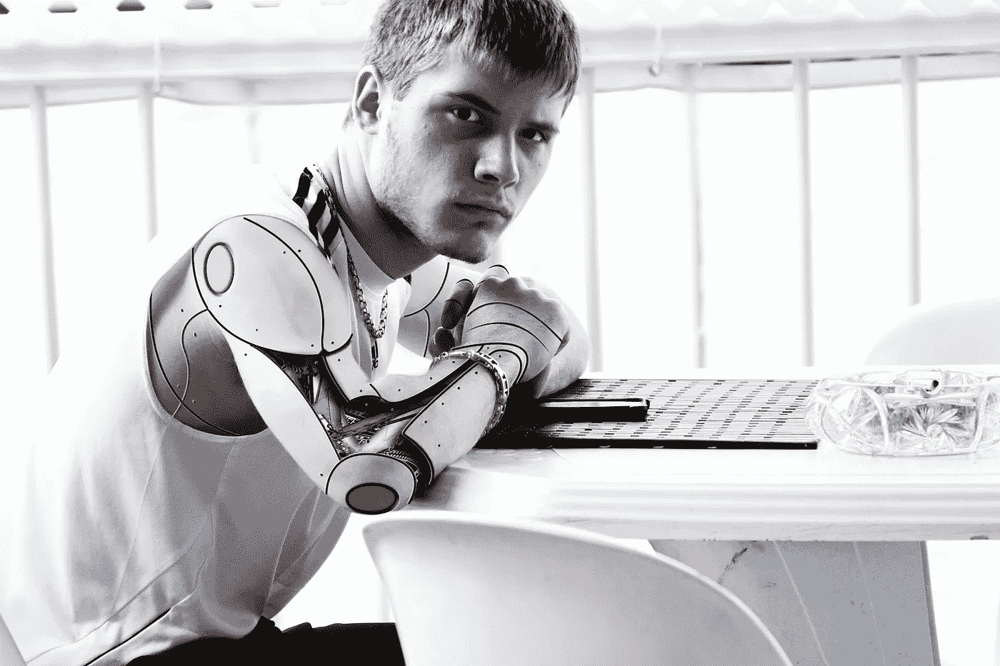

# 人类遇到电脑…剩下的就是历史了

> 原文：<https://medium.com/hackernoon/human-meets-computer-the-rest-is-history-2f00ce146e97>

人工智能是一个两极分化的话题……它可以让人联想到黑暗的[电脑](https://hackernoon.com/tagged/computer)霸主的形象，智胜劣等人类，接管世界。但是对于我们中的大多数人来说，用自动化来建造、设计和工作，我敢说消除人类劳动并不是我们的目标…事实上恰恰相反。事实是计算机让人类变得更好:更聪明、更快、更有效率。反之亦然。人类对于创建无缝的自动化流程和提供上下文视角是必要的。例如，以自动驾驶卡车这一棘手的业务为例。是的，自动驾驶卡车车队将与一些人类工作重叠——然而，这些可以缩小到最不可取的路线。另一个有利的方面是:需要人类以新的方式运用驾驶技能的工作:车队管理、卡车维修等。

kea 也是如此。:自动化为人们创造了新的更令人兴奋的机会。这里有更多关于我们如何看待 kea 的“人类遇见计算机”的爱情故事。：

**电脑**

kea 背后的软件涉及两个方面:在餐厅级别激活的电话自动化系统和存储订单数据的在线仪表板。电话系统在不中断餐厅流程的情况下接听顾客来电，餐厅员工经常被电话铃声淹没，尤其是在高峰时段。该系统可以接受订单，列出特价商品，并接管电话订单的日常工作。计算机可以为人类完成大量繁琐的任务，因此它们可以专注于更令人兴奋的任务，例如，Kayak 等网站通过数百万次航班来找到最合适和最优惠的交易。这让人类有时间做他们喜欢的事情:也许是研究目的地或挑选最佳景点和餐馆。当然，如果你也觉得这些很无聊，你可以让电脑参与进来，根据你的喜好来决定这个过程的长短。然而，有些人可能不喜欢或不相信电脑会告诉他们如何打发时间，他们更喜欢和旅伴或目的地的旅馆服务员聊天。kea 也是如此:需要额外帮助的客户可以选择与人交谈，这意味着那些喜欢踢它的老学校也包括在内。然后是仪表盘。如果自动电话系统是 kea 背后的酷的、华而不实的技术，那么仪表板就是软件的实用的一面，让一切井然有序。仪表盘让餐馆老板和员工可以管理重要信息，如何时下单、订单副本、kea 团队所做的任何笔记等等。通过这种方式，如果出现任何问题，技术会立即介入并回答它们。

**人类**

我们的客户服务专家团队能够处理自动化无法处理的电话订购的方方面面。当顾客忘记提及沙拉的调料或披萨的饼皮类型时，我们的专家会回电并提供“人性化服务”，意识到订单似乎有问题，并介入以确保顾客得到他们想要的东西。人类还通过在后端输入任何可能对餐馆有用的注释，使仪表板更加健壮。例如，如果 kea 团队成员打电话给客户获取优惠券信息，这将反映在仪表板上，甚至反映在餐厅订单上的订单注释或特殊说明中！有许多实例表明，雇佣人类将使计算机更加有效，例如，治疗机器人。虽然它们提供了认知行为治疗体验的基础，但当对话变得过于敏感时，例如，当用户提到伤害自己或他人时，人类也会介入。人使提供特别的支持和服务成为可能。

**电脑+人类**

你感受到爱了吗？我们的系统是关于人类和计算机相互支持的方式。技术有助于节省餐馆的劳动时间，并允许员工成为店内客户服务的专家，自动化处理他们工作中的不利方面。该软件还能让员工有条理地掌握关于未决订单和过去订单的有用数据。在这些方面，技术正在使人类变得更好，工作更聪明。同时，人类填补了上下文中的空白，反过来使软件更加有用。此外，当客户需要一些额外的帮助时，kea 支持团队会帮助他们，确保他们永远不会孤单。没有人，订单流程就不可能完善。女士们先生们，这就是完美的一对。