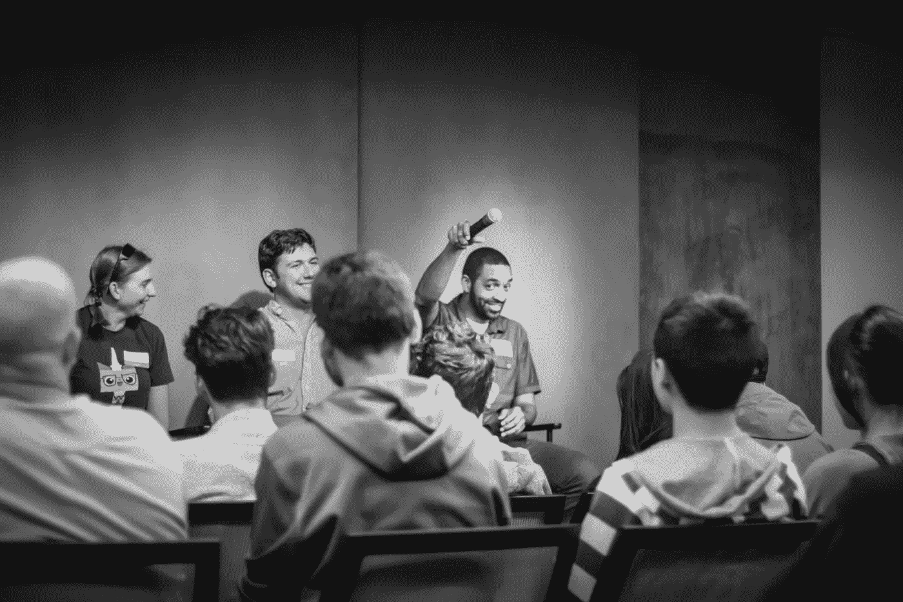

# 喧嚣聚光灯:采访丹尼尔·伯克，色码奖获得者

> 原文：<https://medium.com/hackernoon/hustle-spotlight-an-interview-with-daniel-burke-colorcode-award-winner-90c005d2129f>

答几个月前，Tia 和我决定，我们的奖学金基金 **ColorCode** 将资助一个有前途的人，让他参加从[到**磁性演讲**](https://magneticspeaking.com/) 的全方位领导力课程。申请书纷至沓来，我们整个假期都在阅读一堆电子信件，这些信件都是有色人种希望在科技领域发展事业的来信。

缩小获胜者的范围很困难(稍后会有更多内容)，但最终，我们选定了一个人，他闯入硅谷的独特故事因其努力和雄心而脱颖而出。获胜者是**丹尼尔·伯克**，他是[握手](https://www.joinhandshake.com/)的[工程](https://hackernoon.com/tagged/engineering)经理，也是[/开发/色彩](https://www.devcolor.org/)的主持人！

Daniel Burke

丹尼尔很友好地在假期里对我做了一个简短的采访，祝你愉快！

你是如何走上硅谷科技职业生涯的？

2001 年，当我还是 FSU 大学法律预科生时，我父亲让我为他的一个商业想法建立一个基础网站。我花了一些时间建造它。后来我改进了。最终我意识到我把大部分空闲时间都花在这上面了。我换了专业，再也没有回头看法律。

尽管如此，我从未在佛罗里达州立大学毕业。我走了一条漫长而曲折的道路，从技术行业进入销售部门，进入政府部门，拥有一家建筑行业的小企业，最终成为父亲。就在这个时候，我意识到我需要完成学业，建立自己的事业。

我用睡眠和假期换取了课程和代码。我在课堂上学到的还不够，所以我构建了比一些公司出货的更多的搁置软件，以帮助填补空白。我买了一块白板，自学了硅谷面试游戏。从一所相对不知名的小学校毕业后，我不得不建立一个作品组合，说明我能做什么。

一路走来，有一些关键人物教导、指导、倾听或以其他方式帮助我走到今天。

迄今为止，我已经建立了团队，并向数百万人运送了软件。我曾在科技会议上与成年人交谈，并在全国各地为孩子们举办研讨会。

我的道路并不传统，但我在这里。

你希望从磁性口语中学到什么？

我每年都会在 4 到 5 个不同规模的活动上发表演讲。我想开始更频繁地接受大型演讲活动。我从事这项工作已经有一段时间了，我相信我应该与更多的观众分享我所学到的东西。

为此，我希望这次培训能帮助我更有效地策划和准备我的演讲。我相信有人指出我的缺点也会让我受益。

对读者有什么建议吗？

你必须从某个地方开始。早在我真的觉得我要说的话会有很大价值之前，我就开始公开教学和演讲了。我这么做是为了练习。我这么做是为了得到反馈。尽管如此，每次我讲话，人们都会告诉我他们有多重视我说的话。

每个人都有分享的价值。如果它对你很重要，那么它对其他人也可能很重要。

祝贺丹尼尔！感谢所有 2017 年 ColorCode 的申请人，你们的故事太棒了，我们希望能够分享所有的故事。Tia 和我从这次经历中吸取了教训，ColorCode 2018 年的下一个奖项即将揭晓！

**尼克和蒂亚·考德威尔
色码基金**