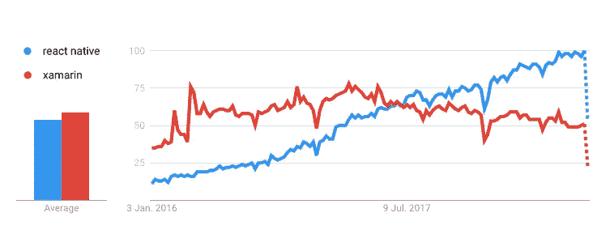

# 2018 年混合移动应用:React Native vs Xamarin

> 原文：<https://medium.com/hackernoon/hybrid-mobile-apps-in-2018-react-native-vs-xamarin-a03540f99005>

如果你刚刚开始使用混合移动应用，你可能会感到有些失落。在线定义可能不明确，指南通常缺乏最新信息。这就是为什么，在这篇文章中，我们将尽力帮助您了解什么是混合移动应用，以及 2018 年年中有哪些解决方案值得您关注。

因此，您决定构建一个移动应用程序。你做了一些研究，联系了几十家专门开发原生应用的公司。然后，你得到几十个带有随机数的估计值。

由于对结果不满意，您将注意力转移到了非本地解决方案上。但是，几个星期后，在网上呆了几个小时后，你并没有觉得自己变聪明了。像“混合”、“跨平台”和“移动网络应用”这样的词在你的脑海中盘旋。大多数文章承诺地球，但他们经常提出相互矛盾的理论，这加剧了局势，让你追逐自己的尾巴。

*Hybrid, cross-platform, React Native, Xamarin… ???*

为了学习混合移动应用程序开发的基础知识，让我们从头开始。

# 定义

## 跨平台

根据定义，跨平台软件适用于许多平台。这可以是在各种操作系统上运行的单一代码库，无需特殊准备(如 Java)。它也可能是同一个应用程序——具有相同的业务逻辑、相同的品牌等。——但写成两个独立的原生应用，一个用于 iOS，一个用于 Android。总而言之，“跨平台”是一个非常模糊的术语。

## 混合物

混合移动应用程序(或简称为“混合”)是跨平台软件的一个子集，它们没有明确的定义。

> 传统的混合是包装在某种原生容器中的 web 应用程序。

开发人员建立一种单页网站，使其对移动设备友好，并将其放入容器中。最后，他们将其连接到一些智能手机/平板电脑硬件。瞧啊。一个伪装成移动应用的 web 应用诞生了，每个平台都有一个代码。容器(包装)带有一个框架选择(如 Apache Cordova，Ionic 等。).

现代混血儿就不一样了。它们不是 web 应用程序，而是实际的移动应用程序，用 JavaScript 编写，并在运行时翻译成一组本机指令。看起来不错，不是吗？但是有什么选择呢？

## 框架和语言

以下是可用的混合应用程序开发工具:

*   **Xamarin** 是一套工具(框架)，开发者在其中使用 C#和。网
*   **React Native** 是一个框架，开发者在其中使用 JavaScript 和 React 构建产品
*   **NativeScript** 是一个框架，开发者在其中用 JavaScript 和 Angular 构建代码
*   **Cordova/PhoneGap/Ionic** 是开发人员使用 HTML、CSS 和 JavaScript 的框架

# 市场上有什么

从商业角度来看，软件必须能够工作，并且对用户友好，经得起未来考验。技术扮演了第二个角色。然而，一些技术选择会产生商业后果。下面，我们列出了一些关于混合移动应用的重大决策。

## 网站和渐进式网络应用程序(PWA)

今天的网站不再只是一堆表格和链接的静态内容。当代网络应用在 UX 和功能性领域与桌面和移动软件竞争。然而，并不是所有的东西在手机上都是一样的。当涉及到在后台工作，蓝牙，电池信息或 iOS FaceID，网络应用是一个没有去。

渐进式 web 应用程序(PWA)是一个新概念，在某种程度上，它结合了 web 和本地方法。这是一个可以在某种程度上离线工作的网络应用程序，在主屏幕上有一个可见的图标。然而，它的局限性依然存在。应用的行为和功能在很大程度上取决于平台。这是一个有趣的概念，可以发展和改进，但是，首先，它需要时间来成熟(iOS 从 11.3 版本开始才支持 PWAs)。

*You need to remember that PWA is nothing more but a website with push notifications pretending to be a mobile app (source:* [*easternpeak.com*](https://easternpeak.com/blog/progressive-web-apps/)*)*

## 传统(网络)混合

多年来，传统混合动力车一直是快速 MVP 或非常简单产品的首选。有许多工具可供选择:最流行的 Apache Cordova、它的堂兄 PhoneGap、基于 Angular 的 Ionic 等等。这种方法的优点是:单一的代码库加上较低的开发和维护成本。更何况这样的产品开箱就可以有网页版。缺点不太明显，也不是每个人都直截了当地谈论它们。

> 但是，事实是，你不能用传统的混合移动应用程序 100%模仿本地应用程序，不管它们的创作者说什么。

您将体验到更差的性能、更差的 UX，以及要实现的一组有限的现成功能。将会有无数的小东西工作起来很奇怪或者很慢。即使你不知道具体是什么，这款应用看起来总是有点问题。

幸运的是，传统混合动力车的优势已经结束，因为最近几个月给我们带来了更好的替代品。至少，我们是这么认为的。

## Xamarin

使用 Xamarin，您可以为许多平台构建本机应用程序。它允许 C#和。NET 开发者为 Android、iOS 和 Windows 开发本地应用。在 Xamarin 中有两种方法。第一个是 Xamarin Forms，它创建了一个单一的代码库，几乎不做任何更改就可以在平台之间共享。但这是有代价的:Xamarin。Forms 适用于构建简单的 MVP、快速原型或非常非常简单的应用程序。甚至 Xamarin 也在其文档文件中声明:

> Xamarin。表单允许应用程序的快速原型化，应用程序可以随着时间的推移发展成复杂的应用程序。

所以用 Xamarin。要求更高的项目的表格可能会很难。

对于复杂的混合移动应用程序开发，有 Xamarin 原生方法。使用 Xamarin Native **，**你可以获得原生应用的外观和感觉，而且你可以只使用一种技术(C#和。网)。这意味着你可以只支付一个开发团队的费用。弊端？不再有单一的代码库，所以您最终需要创建和维护两个独立的项目——每个平台一个。只有部分代码库可以共享(比如业务逻辑或通信服务)。UI 实现必须保持独立。

如果你有。NET 开发人员，Xamarin Native 是一个很好的工具，因为您可以将可用的资源分配给移动开发。它也可以在 Windows 上运行，性能良好，并提供良好的用户体验。总之，它比传统的混合动力车要好。那么成本是多少呢？时间。与传统的相比，使用 Xamarin Native 创建的移动应用程序将需要更多的时间来开发。

## 反应自然

脸书为 JavaScript (JS)开发者创建了 React Native (RN)。使用 RN，可以在 React(用于构建用户界面的 JS 库)中构建 iOS 和 Android 移动应用。明智之举，因为 React 非常受欢迎，并且经过了实战检验。

如果这听起来像传统的混合描述，JS 是这里唯一的链接。在 RN 中，你不能在一个本地包装器中构建网站。你用 JavaScript 开发原生应用(技术上，React 和一种类似 HTML 的标记语言)。RN 将代码翻译成适用于 iOS 和 Android 的指令。所以，你“说”React/JavaScript，RN 即时翻译。这样，移动设备可以很容易地显示例如 Android 专用按钮。这是一个现代的混合体——一个代码适用于所有的操作系统。

> 这带来了更好的用户体验和原生应用的感觉。用 RN 开发的混合移动应用运行起来更加流畅，用户通常无法分辨出其中的区别(不像传统的混合应用)。

缺点？一些特定于平台的功能可能难以实现。RN 并没有提供所有适用于本地应用的现成产品。另一方面，开发人员可以为缺失的扩展添加一段本机代码，或者使用 RN 社区构建的数千个代码中的一个。RN 甚至被像微软或 Wix 这样的大玩家使用，这有助于社区令人印象深刻的规模。

最终 RN 混合移动 app 在某些方面无法与原生竞争。但是，通常情况下，最终的效果是令人满意的。该框架在用户体验和性能方面都是对传统混合系统的巨大改进。在软件公司，我们相信它物有所值。

## 原生脚本

NativeScript 是一个混合移动应用框架，类似于 RN，但基于 Angular(另一个 JS 框架)。它像 RN 一样处理混合问题——通过使用基于 JavaScript 代码的本地组件和类。框架内有一堆现成的多平台组件，就像 RN 一样，在需要时可以扩展它。

如果你有一个对 Angular 有经验的 JS 开发团队，NativeScript 肯定是要考虑的。请记住，就目前而言，与 RN 相比，它的社区要小得多。这相当于减少了现成的插件和库。

# Xamarin Vs. React Native

在 NativeScript 尚未成长、移动 web 应用落后的情况下，2018 年 8 月，Xamarin 和 React Native 似乎成为混合移动应用开发领域的主要参与者。至少，我们是这么认为的。现在让我们比较一下这两者。

*A comparison of React Native and Xamarin web searches from the last 30 months. As you can see, React Native took the lead approximately 1 year ago (source: Google Trends).*

## 码基数

在 **RN** 中有一个代码库，在平台之间完全共享。因此，几乎不需要任何特定于平台的代码。这产生了一定的局限性，但同时也大大减少了开发时间和成本。为了实现更本土化的方法， **Xamarin** 开发者只分享他们的部分代码。UI 是为每个平台单独构建的。这产生了 Xamarin UI 更自然的感觉，但也导致了更长的开发时间。

## 支持的平台

眼下， **RN** 支持 iOS 和 Android，覆盖全球 90%以上的移动设备。 **Xamarin** 同时支持 iOS 和 Android，加上通用的 Windows 平台和 macOS。如果这些平台对您的业务至关重要，请选择 Xamarin。

## 所需资源

对于 RN ，你很可能需要在 React 方面有经验的前端开发人员，但是任何 JavaScript 开发人员也应该处理这项任务。要在 Xamarin 中编写混合移动应用程序，您可能会希望找到有经验的。NET 开发人员。

## 应用程序更新和错误修复

**RN** 运行时执行 JS 代码。这意味着您可以改进您的应用程序并修复错误，而无需更新商店中的应用程序——一些客户甚至可能不会注意到更新的发生。 **Xamarin** 在构建过程中预编译每个平台的代码，因此不可能进行动态更新。当你想引入错误修复时，你每次都必须更新商店中的应用程序。

## 用例

**RN** 适用于:

*   需要少量平台特定功能的应用程序和不太复杂且不需要原生用户界面的应用程序组件
*   重写你的旧的传统混合
*   有很多自定义设计的应用程序，但都是 UX 本地的

**Xamarin** 适用于以下情况:

*   你或你的附属公司有一个团队。NET 开发人员
*   需要访问复杂的特定于平台的功能
*   您需要为每个平台使用原生组件，使 UI 与传统的原生应用程序 UI 无法区分
*   你的目标是 Windows 平台

# 摘要

当谈到混合移动应用程序开发时，每个人都称赞自己的技术——记住这一点。此外，当你搜索更多信息时，你应该总是看时间戳——在移动世界中，几个月就像一个世纪，所以两年前的文章可能会误导你很多。

市场上有各种各样的跨平台技术，但很少有既成熟又经得起未来考验的。传统的混合动力车已经过时了——它们已经过了全盛时期。相比之下，Xamarin 和 React Native 都提供了构建混合移动应用程序的强大手段。在软件公司，我们使用 React Native，因为我们有一个强大的 React 团队。最终，选择取决于你偏好的资源和应用的商业目的。所以，最后，当你寻找一个团队来开发你的跨平台应用时，只要记住上面提到的这几点，你就没问题了。

**文章由 Kamil Pł aczek 和 Tomasz Mróz 撰写，最先发表在软件之家博客** **的** [**上。访问博客，获得更多关于最佳开发实践和软件外包技巧的文章。**](http://www.tsh.io/blog)