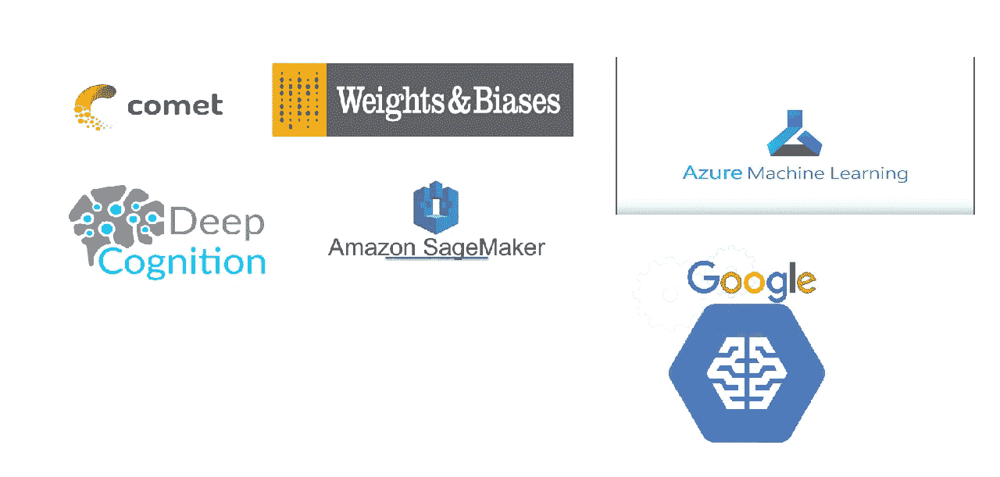
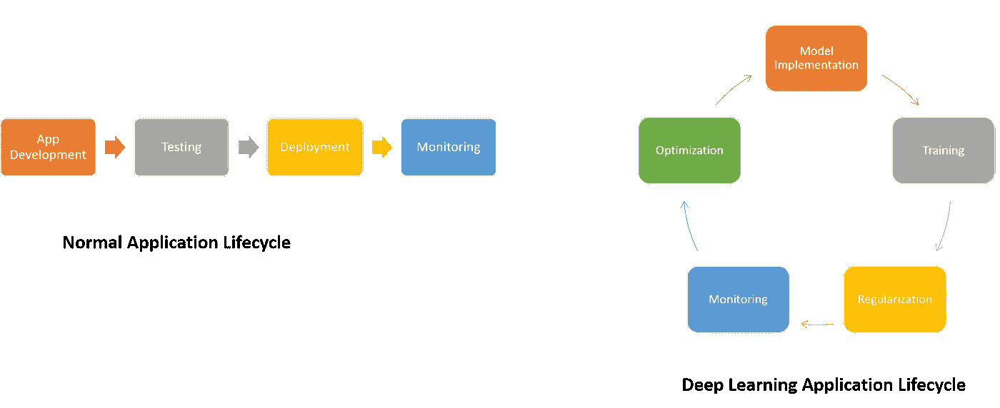

# 超参数调优平台正在成为深度学习领域的一个新市场

> 原文：<https://medium.com/hackernoon/hyperparameter-tuning-platforms-are-becoming-a-new-market-in-the-deep-learning-space-7106f0ac1689>

几天前，[亚马逊宣布在 AWS SageMaker 平台](https://aws.amazon.com/blogs/aws/sagemaker-automatic-model-tuning/)中提供一组新的自动模型调优功能。具体来说，新版本侧重于调整和优化与 SageMaker 模型相关的超参数。为了简化 SageMaker 在数据科学界的应用，这个版本是一个强大的补充。凭借新的超参数调整和模型优化功能，SageMaker 加入了一个新的平台群体，这些平台正在进入市场，试图解决深度学习应用中这一臭名昭著的挑战。

在现实世界中构建深度学习解决方案是一个不断实验和优化的过程。与任何其他类型的软件应用不同，深度学习应用没有线性的生命周期，因为模型需要不断地完善、优化和测试。

# 什么是超参数？

在深度学习模型的可能优化中，没有一个比超参数的调整发挥更突出的作用。从概念上讲，超参数是在模型外部影响其行为和知识的变量。一个中等规模的深度学习模型可能会受到许多超参数的影响，包括以下一些参数:

**学习率:**所有超参数之母，学习率以一种可用于优化其能力的方式量化模型的学习进度。

**隐单元数:**深度学习算法中的经典超参数，隐单元数是调节模型表示能力的关键。

**卷积核宽度:**在卷积神经网络(CNN)中，核宽度影响模型中的参数数量，从而影响其容量。

**动量:**这个超参数有助于用上一步的知识知道下一步的方向。它有助于防止振荡。

**批量大小:**最小批量大小是在参数更新发生后给网络的子样本数量。

# 玩家们

在深度学习应用程序中调整超参数可能是一个极具挑战性的过程，因为它不仅需要执行实验，还需要针对模型的其他版本评估结果。最近，有一批新的平台进入了市场，专注于解决不同深度学习框架的这一挑战。让我们看看这个新领域中几个最突出的解决方案:

SageMaker

在其最新版本中，SageMaker 直接在 SageMaker 控制台中创建了超参数调优作业。该平台执行不同超参数模型的评估和比较，并直接与培训工作和模型生命周期的其他方面集成。

[Comet.ml](https://www.comet.ml/)

Comet.ml 提供了一个超级简单的接口，用于跨不同深度学习框架(如 TensorFlow、Keras、PyTorch、Scikit-Learn 等)调整和优化超参数。开发人员可以使用平台提供的几个 SDK 以及 REST API 将 Comet.ml 无缝集成到他们的模型中。该平台提供了一种非常直观的方法来调整和评估超参数。

[权重&偏差](https://www.wandb.com/)

谈到超参数调整，我最喜欢的一个堆栈是新发布的权重和偏差(W&B)。W&B 由 OpenAI 等深度学习强国使用，提供了一种高级工具集和编程模型，用于记录和调整不同实验的超参数。该解决方案记录并可视化了模型执行中的不同步骤，并将其与其超参数的配置相关联

[深度认知](http://deepcognition.ai/)

DeepCognition 是进入自助式深度学习世界的新平台之一。在功能上，DeepCognition 以最少的编码实现了深度学习模型的实现、训练和优化。作为优化过程的一部分，DeepCognition 包括一个非常强大的可视化超参数调整引擎，它可以记录和比较基于特定超参数配置的实验的执行情况。

[天蓝色 ML](https://docs.microsoft.com/en-us/azure/machine-learning/studio-module-reference/tune-model-hyperparameters)

Azure ML 提供了本机超参数调优功能，作为其 ML Studio 的一部分。虽然与本文中涉及的其他一些选项相比，现有的功能似乎有限，但是该平台能够记录并提供与模型超参数相关的基本可视化。Azure ML 的超参数调优功能可以与其他服务(如[Azure ML experiments](https://azure.microsoft.com/en-us/services/machine-learning-services/))相结合，以简化新实验的创建和测试。

[云 ML](https://cloud.google.com/ml-engine/docs/tensorflow/hyperparameter-tuning-overview)

就像 AWS SageMaker 和 Azure ML 一样，Google Cloud ML 提供了一些基本的超参数调优功能，作为其平台的一部分。与一些竞争对手相比，当前的云 ML 功能集有点有限，但谷歌已经证明了它在这一领域更快迭代的能力。