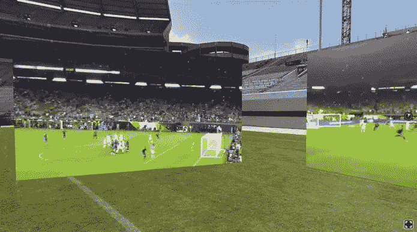
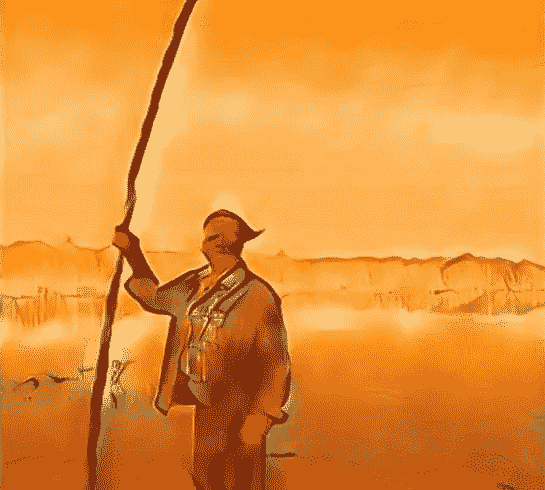

# 我❤️ SXSW 黑客马拉松

> 原文：<https://medium.com/hackernoon/i-%EF%B8%8F-sxsw-hackathon-7289b114f132>

SXSW 黑客马拉松在我心中有着非常特殊的地位，因为它是我有机会参加的最具创造力和创新性的活动之一。这是一场激烈的 24 小时比赛，旨在激励、构建和推动娱乐媒体的技术边界。

Office Hours with Cloudinary Developer Advocate Dan Zeitman

这项官方 [SXSW](https://hackernoon.com/tagged/sxsw) 活动由 Luann Williams 在 Travis Laurendine 的专业知识以及一系列同伴和志愿者的帮助下精彩制作。

Luann Williams and Travis Laurendine

这次活动的评委是一些娱乐和媒体行业最著名的有影响力的人。

今年的评委们面临着艰巨的任务，113 名黑客组成了 26 个团队。

他们的评判标准是**创造力、独创性、潜在影响**和**技术熟练程度。**

这是 SXSW 的第五次[黑客马拉松](https://hackernoon.com/tagged/hackathon)，也是 Cloudinary 作为 API 赞助商的第二年。这也是我作为导师参加的第二年。去年，我在一家实时数据流网络— [PubNub](http://pubnub.com?utm_source=PubNub&utm_medium=Website&utm_campaign=Evangelism&utm_term=Partner&utm_content=Website_PubNub) 工作，这是一家 Cloudinary 合作伙伴。事实上，我就是在这里认识了 Cloudinary 的福音传道副总裁多伦·谢尔曼(Doron Sherman)。Doron 亲眼看到了我指导开发人员的热情、快乐和动力，此后不久，我加入了 Cloudinary 团队。

回到奥斯汀参加 SXSW 真是太棒了。作为 API 赞助商，我们的主要目标是让尽可能多的团队参与进来，邀请他们发挥创造力，以新的和创新的方式实现我们的 API。黑客马拉松创造了一个绝佳的机会，让你看看开发人员能用你的产品做些什么，而且很多时候是以你意想不到的方式。

我真的很喜欢看到开发者在他们的项目中获得成功。组建团队，创造一个想法，然后在 24 小时内实现这个想法并进行演示，这是非常困难的。大多数团队也渴望学习新的 API，并接受挑战，尽可能多地包含 API，以对冲他们赢得至少一个奖项的机会。

在一个 24 小时的活动中，学习一个新 API 的来龙去脉是一项挑战，如果团队在这个过程中遇到困难，这无疑会带来灾难。为此，我们专注于通过提供一份[黑客马拉松指南](https://cloudinary.gitbook.io/sxsw-2018-hackathon-guide?utm_source=hackernoon&utm_medium=blog&utm_campaign=Evangelism&utm_term=hackernoon&utm_content=blog_hackernoon)来提供更好的体验，该指南充满了使用 Cloudinary 和其他相关技术的思想启动器和快速入门方法。今年，我们与环球音乐集团/国会音乐集团和 7Digital 合作创建了 SXSW 黑客马拉松指南，并为参赛团队提供专业的指导和支持。

Mentoring and digging deep into the code (Photo: Hacker Noon)

今年参赛队伍的创造力是惊人的。我们看到了几个 AR/VR 项目，它们在让用户参与混合现实体验方面有很好的基础。

例如有 [**geAR**](https://devpost.com/software/gear) **，**一款自动识别音乐齿轮并在增强现实中叠加附加信息的应用。

用户一指向乐器就能听到它的声音样本。如果用户有兴趣了解更多信息，他们可以查看关于该项目的更多细节，包括正在使用的设备的视频和使用该设备的艺术家的真实音频样本。也有可能听到不同的齿轮设置，如带有不同类型的放大器或踏板的吉他。该团队设想与 Jamup Pro 等现有的虚拟放大器应用程序集成，因此有经验的演奏者可以走进排练室，将吉他插入他们的 iPhone，并亲自尝试特定的放大器设置。

[**CardsAgainstReality**](https://devpost.com/software/cardsagainstreality)**(CARds)**很早就以其简单而优雅的方式吸引了我的注意，用 AR 组合来增强你的名片。

在 VR 类别中， [**FanSourceVR**](https://devpost.com/software/fansourcevr) 让球迷有机会以自己的视角对体育赛事进行视频直播。然后，整个体验被拼接成一个虚拟现实体验，使用户能够从多个角度观看事件。

FanSourceVR multiple POV experience

今年，区块链狂潮吸引了许多黑客的注意。UMG 的 Tuhin Roy 坚持认为，获胜的团队必须传达区块链的真实用例，这远远优于传统的数据库查找。

其中一个获奖项目是 [**Dapster**](https://devpost.com/software/dapster) **:** 现金流、流音乐。

Dapster’s blockchain-based application trades CPU cycles for music

Dapster 的网络应用程序使用户能够通过利用加密货币和待机 CPU 利用率来免费播放音乐。使用这些新兴技术的目标是创造一种可持续的方式来补贴内容流。他们的创新解决方案允许用户享受无限制的无广告音乐，以换取计算能力来开采 Monero 加密货币，进而支付给艺术家。

在到达终点的项目中，有六个团队围绕 Cloudinary APIs 构建了他们的项目。我们为两个团队颁发了奖项，分别是最具创造性地使用 Cloudinary 的**团队和最佳实施 Cloudinary** 的**团队。**

创造性地说 [**DreamNA 的**](https://devpost.com/software/noetic-dreams-vr) 项目一开始就引起了我们的注意。他们赢得了我们对云计算最具创造性的使用奖。

Dreams for people who can’t dream

**Ioana Mischie** 是一个跨媒体讲故事的人，以独特的眼光创造身临其境的视觉故事，帮助不会做梦的人——做梦。她的团队的挑战与 Cloudinary 的 API 完美匹配。

Interpreting dreams

该团队专注于利用我们的神经网络风格转移能力，对 360 VR 视频进行交互式风格化处理。

Cloudinary Winners DreamNA

在 24 小时内完成并实施一个工作项目极具挑战性，当我们看到这支来自日本的优秀团队构建并展示 emShare 时，我们知道我们获得了使用 Cloudinary 的最佳实施奖。 [**emShare**](https://devpost.com/software/emshare) 应用程序提供了在现场表演期间分享情绪的用户体验。

Cloudinary Winners emShare

其他用 Cloudinary APIs 构建的有趣项目包括:
[**power music**](https://devpost.com/software/powermusic-v3casq)——一个把权力还给艺人的音乐服务。
[**练习乐队**](https://devpost.com/software/practicehero)**——**乐队练习变得简单多了。
[**【摇滚投票**](https://devpost.com/software/the-rock-and-roll-poll) **:多功能投票应用—** 我们可以用区块链的分析告诉你谁是真正的摇滚之王。

Sponsorship that drives innovation

今年活动的独特之处在于，开发者有机会通过 7Digital 的 API 访问国会唱片/环球音乐集团目录中的各种音乐片段和歌曲。

一些著名的项目包括:

[Music Mod](https://devpost.com/software/media-mod) —在线区块链服务，处理音乐合作的内容传输、合同和托管。

[8Trac](https://devpost.com/software/8trac) —艺人集资制作自己内容的去中心化投资平台。公共唱片公司。

[ConcetBilia](https://devpost.com/software/concertbilia) —现场 VR 音乐会，你可以在区块链以太坊购买当天的音乐会收藏品。

# 那么下一步是什么？

再见奥斯汀，你好好莱坞！我们很高兴地宣布 Cloudinary 与好莱坞的国会大厦创新实验室(Capitol Innovation Labs)在传奇的国会大厦和工作室合作。

国会创新实验室将举办一系列活动，包括黑客马拉松和演讲者研讨会，这些活动将于 6 月开始。

第一届黑客马拉松定于 6 月 2 日和 3 日举行，将汇集软件开发人员、知名制作人、歌曲作者和有影响力的人，参加一场全球挑战，孵化新一波音乐相关产品、服务和内容。

在黑客马拉松的持续时间内，参与者将可以使用最先进的 Capitol 录音棚，以及由 UMG 合作伙伴 7Digital (B2B 数字音乐和广播服务公司)和 Cloudinary(端到端基于云的图像、音频和视频管理解决方案)提供的 UMG 音频流曲目目录。

获胜的开发团队将有资格获得 8 个月的创新许可，从该目录中抽取，而获胜的内容团队将有机会直接向 Capitol 的 A&R 团队推介他们的成品。

Hackfest 将与 Travis Laurendine 合作举办，他是北美顶级音乐节和会议黑客马拉松的制片人，包括 SXSW、Outside Lands 和[加拿大音乐节](http://cmw.net/cmw-hackathon/)。