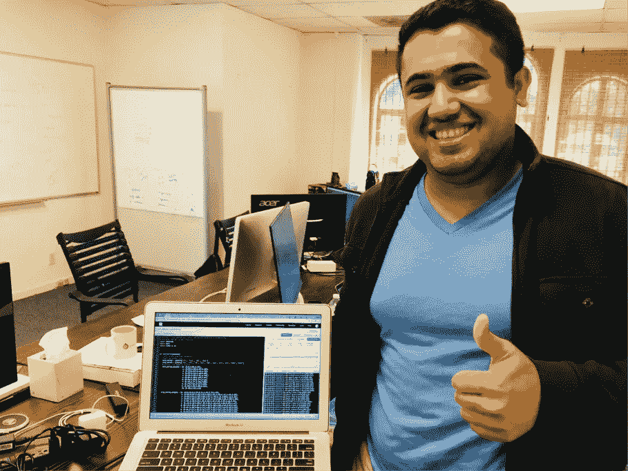
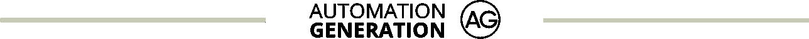

# 我是一名大学生，我建立了自己的机器人顾问

> 原文：<https://medium.com/hackernoon/i-am-a-college-student-and-i-built-my-own-robo-advisor-3f31b39dab50>



“Yes, you an do it too!”

我是[饶](/@raobvinnakota)，我是[羊驼](https://hackernoon.com/tagged/alpaca)的实习生，致力于构建一个开源[的 robo advisor](https://hackernoon.com/tagged/robo-advisor) 。我在这个领域没有太多经验，我不得不寻找很多答案。虽然网上有丰富的材料，但很少是有组织的。这个帖子是我通过阅读寻找答案的各种帖子和论坛的组合。

# 到底什么是机器人顾问？！

Robo advisors 是自动化的建议服务，几乎不需要用户交互。他们专门根据投资者选择的风险水平维护投资组合。顺便说一句，它们是在 2008 年金融危机开始时推出的。

机器人顾问的实际逻辑很简单。

*   "**分配** " —给定一个风险水平，部分资本被分配到不同的位置。
*   "**距离** " —在一段固定的时间间隔内，顾问会扫描投资组合余额是否有重大变化，以及
*   "**重新平衡** " —如有必要，重新平衡。

# 分配:

分配的过程是基于开发者的算法将不同的权重分配给资产类别。这些资产类别涵盖了市场的各个方面，并保持了多元化的投资组合。Wealthfront 将这些资产类别视为:

*   美国股票
*   外国股票
*   美国债券
*   外国债券
*   通货膨胀保护

这些资产中的每一种都用 ETF 来代表，ETF 捕捉到了该资产类别的大致情况。

# 距离:

重新平衡投资组合会带来一定的管理费用和成本。为了避免这种情况，robo advisor 会计算一个“距离”向量。要触发重新平衡，这个距离必须大于给定的阈值。大多数机器人顾问通常将这个阈值设置为 5%。

在这种情况下，距离是每个位置重量的个体变化。这是通过首先计算当前分配来完成的。这是相对于投资组合总价值的头寸价值。如果任何一个位置的权重大于 5%(当前权重/目标权重> 1.05)，那么 robo advisor 将触发重新平衡

# 重新平衡:

再平衡是指通过买卖让投资组合回到目标状态的行为。重要的是，所有销售都要先完成。一旦收集到所有可用的现金，就进行必要的购买。

要计算卖出多少，使用现金的目标分配(权重*投资组合价值)，并查看现金产生的股票数量。当前持有的股票数量与股票目标水平之间的差额就是买入/卖出的数量。

# 使用 Vanguard Core 系列实施 Robo Advisor:

既然我们已经建立了机器人顾问的各个组成部分，我们将开始执行构建一个机器人顾问的步骤。我们将使用 Quantopian 的 IDE 来构建我们的 robo advisor。

在实现我们的 advisor 时，我发现分步实现最简单。Quantopian 的 IDE 只能对完整的算法进行回溯测试。这意味着，没有“中途”发展。所以，每一步都是一个独立的算法。

注意:Vanguard 核心系列的实现使用了在此处找到的[信息。该投资组合包括对货币市场基金的 2%投资，但这在 Quantopian 上不可用，因此出于本教程的目的，我们将忽略它。](https://advisors.vanguard.com/iwe/pdf/FASINVMP.pdf)

# 基于风险的分配:

第一步，是确定我们的宇宙，并使用风险等级分配权重。我们的宇宙将是先锋核心系列:

*   VTI —国内股票
*   VXUS —国际股票
*   BND —国内固定收益(债券)
*   BNDX —国际固定收益(债券)

风险水平实际上是固定收益与权益的比率，权益的波动性更大。因此，0 级风险将所有资本分配到固定收益(BND，BNDX)，而 5 级风险将是 50/50。所有 11 个可能的风险级别都被编入字典，关键字是风险级别，值是包含权重分配的元组:

```
risk_level = 5
risk_based_allocation = {0: (0,0,0.686,0.294),
                         1: (0.059,0.039,0.617,0.265),
                         2: (0.118,0.078,0.549,0.235),
                         3: (0.176,0.118,0.480,0.206),
                         4: (0.235,0.157,0.412,0.176),
                         5: (0.294,0.196,0.343,0.147), 
                         6: (0.353,0.235,0.274,0.118),
                         7: (0.412,0.274,0.206,0.088),
                         8: (0.470,0.314,0.137,0.059),
                         9: (0.529,0.353,0.069,0.029),
                         10: (0.588,0.392,0,0)}
```

下一步将是在 Quantopian 中实现我们的分配。对于这一步，我们需要的唯一方法是 initialize 和 handle_data。其余的都是多余的。

initialize 方法是主要的。当回溯测试开始时，它会自动调用 initialize。因此，initialize 将是包含风险级别字典以及选择风险级别的函数。初始化后会自动调用 handle_data 方法。在这里，我们将实际购买 initialize 中列出的头寸。

initialize 和 handle_data 都有变量 context 和 data。上下文允许用户存储在方法间传递的全局变量。数据帮助算法获取不同种类的数据。(注意:这与 Quantopian 1 不同，在 quanto pian 1 中，数据是存储全局变量的对象)。

让我们开始吧。在初始化中，复制并粘贴以下代码:

```
context.stocks = symbols(‘VTI’, ‘VXUS’, ‘BND’, ‘BNDX’)
context.bought = Falserisk_level = 5
risk_based_allocation = {0: (0,0,0.686,0.294),
                         1: (0.059,0.039,0.617,0.265),
                         2: (0.118,0.078,0.549,0.235),
                         3: (0.176,0.118,0.480,0.206),
                         4: (0.235,0.157,0.412,0.176),
                         5: (0.294,0.196,0.343,0.147),
                         6: (0.353,0.235,0.274,0.118),
                         7: (0.412,0.274,0.206,0.088),
                         8: (0.470,0.314,0.137,0.059),
                         9: (0.529,0.353,0.069,0.029),
                         10: (0.588,0.392,0,0)}
    #Saves the weights to easily access during rebalance
context.target_allocation = dict(zip(context.stocks,
                            risk_based_allocation[risk_level])) #To make initial purchase
context.bought = False
```

变量 context.stocks 是股票对象的列表。symbols 函数将字符串转换成对象。这些对象具有诸如当前价格、收盘价等属性。使用该列表以及用于分配的字典，我们将创建第二个字典 context.target_allocation。关键是每个股票(VTI，VXUS 等。)并且这些值是股票行情自动收录器的权重。这本字典对分配和再平衡都有用。

复制并粘贴以下代码以创建 handle_data:

```
if not context.bought:
        for stock in context.stocks:
            amount = (context.target_allocation[stock] *
                      context.portfolio.cash) / data.current(stock,’price’)
            if (amount != 0):
                order(stock, int(amount))
                #log purchase
            log.info(“buying “ + str(int(amount)) + “ shares of “ +
                     str(stock)) #now won’t purchase again and again
         context.bought = True
```

变量 context.bought 指的是最初在 initialize 中设置为 False 的值。因为每次市场事件发生时都会调用 handle_data。因此，使用 context.bought 可以确保股票只被购买一次。

为了购买每只股票的股份，遍历股票对象列表。对于每只股票，通过分配适当数量的资本(重量*资本)，然后将该资本除以当前价格，计算出股票总数。由于我们只能购买整股股票，剩余的资本被添加回手头的现金。

最后，为了获得更流畅的回溯测试体验，所有事务都被记录。日志在右下角。构建当前算法。将开始日期设置为 2013 年 6 月或更晚，因为 ETF BNDX 于 2013 年 6 月 7 日首次交易。

# 计算距离:

在重新平衡投资组合之前，最好先计算一下当前投资组合是否值得重新平衡。在更复杂的 robo advisors 中，这一步将有一个用算法计算的目标投资组合。对于这个例子，我们的目标投资组合将是由 initialize 中的风险水平定义的初始分配。

随着每个头寸价值的波动，他们的投资组合权重也可能发生变化。距离向量将是每个单独位置的权重变化。计算距离分三步进行:

1.  计算每个位置的当前权重
2.  计算目标重量(已经完成)
3.  比较两个重量

我们希望每天检查余额，所以我们将在 _trading_starts 之前，在代码中添加以下函数:

```
def before_trading_starts(context, data):
    #total value
    value = context.portfolio.portfolio_value +
                                         context.portfolio.cash
    #calculating current weights for each position
    for stock in context.stocks:
        if (context.target_allocation[stock] == 0):
            continue
        current_holdings = data.current(stock,’close’) *
                      context.portfolio.positions[stock].amount
        weight = current_holdings/value
        growth = float(weight) /
                        float(context.target_allocation[stock])
        if (growth >= 1.025 or growth <= 0.975):
            log.info(“Need to rebalance portfolio”)
            break
```

我们首先计算总价值。因为这个值不变，所以它可能在循环之外。然后，计算每个头寸的单个权重，并与目标权重进行比较(我们使用除法，因为我们对头寸的相对增长感兴趣，而不是绝对增长)。如果增长超过阈值(目前为 2.5%)或低于阈值(贬值)，则会触发再平衡。我们没有编写实际的重新平衡函数，所以现在，我们将简单地记录重新平衡是必要的。重要的是要注意添加的中断。一旦算法意识到是时候重新平衡了，就没有必要继续检查剩余的股票。它创造了一个更好的最佳情况。

然而，我们实际上还没有完成。我们必须在 _trading_start 之前调用，但是循环调用效率很低。这就是为什么我们将在 initialize 中使用 schedule_function 命令。将这行代码添加到功能块的末尾:

```
 schedule_function(
    func=before_trading_starts,
    date_rule=date_rules.every_day(),
    time_rule=time_rules.market_open(hours=1))
```

这将在每天开市时安排一次距离计算。通过计算早晨的距离，我们有了执行再平衡行动所必需的时间和空间。

# 调整资金组合

重新平衡投资组合的行为分两步进行。先把需要卖的资产都卖了，再把需要买的资产都买了。先卖确保我们不会现金耗尽。

以下是重新平衡函数的代码:

```
def rebalance(context, data):
    for stock in context.stocks:
        current_weight = (data.current(stock, ‘close’) *
                          context.portfolio.positions[stock].amount) /
                          context.portfolio.portfolio_value
        target_weight = context.target_allocation[stock]
        distance = current_weight — target_weight
        if (distance > 0):
            amount = -1 * (distance * context.portfolio.portfolio_value) /
                     data.current(stock,’close’)
            if (int(amount) == 0):
                continue
            log.info(“Selling “ + str(int(amount)) + “ shares of “ +
                      str(stock))
            order(stock, int(amount))
    for stock in context.stocks:
        current_weight = (data.current(stock, ‘close’) *
                          context.portfolio.positions[stock].amount) /
                          context.portfolio.portfolio_value
        target_weight = context.target_allocation[stock]
        distance = current_weight — target_weight
        if (distance < 0):
            amount = -1 * (distance * context.portfolio.portfolio_value) /
                     data.current(stock,’close’)
            if (int(amount) == 0):
                continue
            log.info(“Buying “ + str(int(amount)) + “ shares of “ +
                      str(stock))
            order(stock, int(amount))
```

销售和购买机制是相同的。唯一的区别是在出售股票时，调用 order 函数时使用了负值。在这两种情况下，我们取重量的绝对差值(目标值-当前值)，并使用该值来计算要买卖的股票数量。

# 多重宇宙

先锋提供了核心系列之外的几个宇宙。目前，我们能够控制风险水平，并观察结果。让我们添加能够选择一个宇宙的功能。

第一种简单的方法是实现多个字典。这是类似的东西看起来的样子。我们的算法中加入了 CRSP 级数。用户现在可以选择领域和风险级别。

```
 core_series = symbols(‘VTI’, ‘VXUS’, ‘BND’, ‘BNDX’)
    crsp_series = symbols(‘VUG’, ‘VTV’, ‘VB’, ‘VEA’, ‘VWO’, ‘BSV’, ‘BIV’, ‘BLV’, ‘VMBS’, ‘BNDX’)
    #universe risk based allocation
    core_series_weights = {0: (0,0,0.686,0.294),
                           1: (0.059,0.039,0.617,0.265),
                           2: (0.118,0.078,0.549,0.235),
                           3: (0.176,0.118,0.480,0.206),
                           4: (0.235,0.157,0.412,0.176),
                           5: (0.294,0.196,0.343,0.147),
                           6: (0.353,0.235,0.274,0.118),
                           7: (0.412,0.274,0.206,0.088),
                           8: (0.470,0.314,0.137,0.059),
                           9: (0.529,0.353,0.069,0.029),
                           10: (0.588,0.392,0,0)}
    crsp_series_weights = {0: (0,0,0,0,0,0.273,0.14,0.123,0.15,0.294),
1: (0.024,0.027,0.008,0.03,0.009,0.245,0.126,0.111,0.135,0.265),
2: (0.048,0.054,0.016,0.061,0.017,0.218,0.112,0.099,0.12,0.235),
3: (0.072,0.082,0.022,0.091,0.027,0.191,0.098,0.086,0.105,0.206),
4: (0.096,0.109,0.03,0.122,0.035,0.164,0.084,0.074,0.09,0.176),
5: (0.120,0.136,0.038,0.152,0.044,0.126,0.07,0.062,0.075,0.147),
6: (0.143,0.163,0.047,0.182,0.053,0.109,0.056,0.049,0.06,0.118),
7: (0.167,0.190,0.055,0.213,0.061,0.082,0.042,0.037,0.045,0.088),
8: (0.191,0.217,0.062,0.243,0.071,0.055,0.028,0.024,0.030,0.059),
9: (0.215,0.245,0.069,0.274,0.079,0.027,0.014,0.013,0.015,0.029),
10: (0.239,0.272,0.077,0.304,0.088,0,0,0,0,0)} #set universe and risk level
    context.stocks = crsp_series
    risk_based_allocation = crsp_series_weights
    risk_level = 1
```

用户可以使用 context.stocks、risk_based_allocation 和 risk_level 这三个变量来设置范围和风险级别。

# 下一步是什么

用 Quantopian 开发是一种很棒的体验——他们提供了很多有用的工具。但是，它也有局限性，被迫只能在一个文件中工作，等等。为了进一步构建这个 robo advisor，我计划将我目前的工作迁移到后端，并使用 Quantopian 的开源 python 库 Zipline 来运行回溯测试。下一期将涵盖所有这些内容以及更多内容！

**你可以在这里** **找到算法** [**。你自己试试！**](https://www.quantopian.com/posts/built-robo-advisor)

*由* [*饶*](/@raobvinnakota)

[](https://medium.com/automation-generation)

## 金融市场、算法交易、技术方面的新岗位请关注[羊驼](/@alpacahq)和[自动化生成](https://medium.com/automation-generation)。

## 你可以找到我们[@羊驼 HQ](https://twitter.com/AlpacaHQ) ，如果你用 twitter 的话。

[](https://medium.com/automation-generation)

***感谢阅读！请跟随*** [***羊驼***](/@alpacahq) ***和*** [***自动化生成***](https://medium.com/automation-generation) ***获取金融市场、算法交易、技术方面的新鲜帖子。你可以找到我们***[***@羊驼 HQ***](https://twitter.com/AlpacaHQ) ***，如果你用 twitter 的话。***

如果你是一名黑客，并且能够创造出在金融市场上运行的很酷的东西，**请查看我们的项目“** [**免佣金股票交易 API**](https://alpaca.markets/?utm_source=medium&utm_medium=blog&utm_campaign=strategy_list&utm_content=part1) **”，在这里我们免费提供简单的 REST 交易 API 和实时市场数据。**

经纪服务由 FINRA/SIPC 成员 Alpaca Securities LLC([Alpaca . markets](https://alpaca.markets/?utm_source=medium&utm_medium=blog&utm_campaign=strategy_list&utm_content=part1))提供。羊驼证券有限责任公司是 AlpacaDB，Inc .的全资子公司。