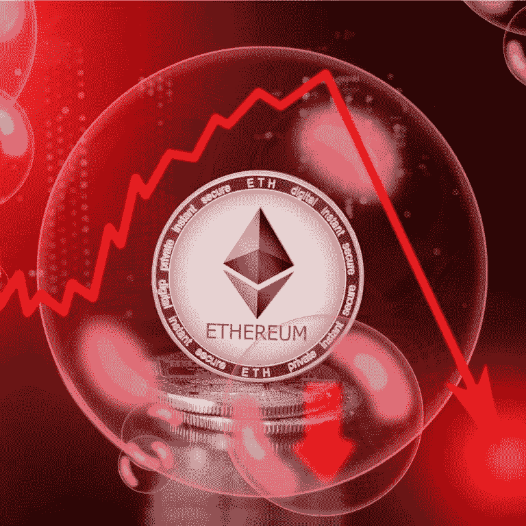

# 我不看好瑞士联邦理工学院，原因如下

> 原文：<https://medium.com/hackernoon/i-am-bearish-on-eth-and-here-is-why-66e8a2376654>

围绕以太坊网络的许多炒作都是基于与其当前技术状态不匹配的推测。

## **可扩展性问题**

可伸缩性问题在于以太坊不能在基础层上伸缩。这就是为什么即使是不太流行的分散式应用程序(dapps)也会削弱网络(例如 Cryptokitties 或过去流行的 ico)。可伸缩性问题是主流采用的障碍。就目前情况来看，以太坊甚至不能处理一个成为主流的 dapp。

以太坊区块链的大小也已经[超过了 1 TB](https://hackernoon.com/the-ethereum-blockchain-size-has-exceeded-1tb-and-yes-its-an-issue-2b650b5f4f62) 。这样的问题是更大的块需要[更强大的机器来验证](/datadriveninvestor/solving-the-blockchain-scalability-problem-with-layer-2-solutions-38e3f81aefbb)。所需的计算能力超过了一般用户的硬件和带宽。因此，更新网络的完整节点越来越少。更少的节点意味着更多的集中化。因此，以太坊不断增长的块大小正在导致一个更加集中的网络。

## **扩展解决方案及其不起作用的原因**

已经提出了以太坊网络的三种主要扩展解决方案:利益证明(PoS)验证、分片和第二层解决方案。这些都有一些严重的局限性，我将在下面描述。

*   **股权证明(PoS)没有物质基础**。与比特币力量不同，PoS 验证不依赖于物质价值，因为它不需要外部资源。有了动力，这种资源就是电。对电力的需求确保了攻击一个电力区块链在经济上是不可行的。用能量来支持一个块也给了它不变性的客观性。非基于能量的验证最终需要对不变性进行主观解释。相比之下，将能量附加到一个块上，就赋予了它在物理世界中的物质存在。
*   **PoS 正在集中**。增加块大小意味着权力集中在那些有能力拥有完整节点的人身上，也就是说，那些最有钱的人。目前，在以太坊网络上锁定一个节点的入口壁垒是 32 ETH。这不同于 PoW，在 PoW 中，矿工通过使用能量来竞争。
*   **分片**是一种将区块链分成多个部分(“分片”)的技术，这些部分具有不同的验证职责。这个想法是为了减少任何单个节点上的工作负载，这样就可以有更多的节点。然而，这种解决方案只会延长问题。分片将单个区块链转化为多个区块链，但并不能消除不断增长的块大小和不断增加的堆叠成本。简而言之，分片并不能解决根本问题。
*   **第 2 层解决方案**在我看来是唯一可行的扩展选项。像 Raiden 和 Loom Network 这样的新项目正在提供这样的解决方案。Loom 尤其有前途，因为它支持以太坊基础层之上的侧链。然而，第 2 层解决方案存在安全问题。此外，如果以太坊采用 PoS，它将有一个不安全的基础层，并且不可能在一个不安全的基础上建立一个安全的第二层。

## **智能合约**

智能合同缺乏大规模采用的潜力。原因如下。

它们**很难写**(例如见平价和刀法)，它们**没有法律约束力**(即不是真正的合同)。保护智能合同就像证明计算机程序没有错误。这非常困难，因为现有的每个计算机程序都有缺陷。此外，撰写传统合同需要多年的学习和通过律师考试。要在现实世界中发挥效用，智能合约至少需要这种能力。然而，写合同的人通常不了解法律，也不知道合同有多安全。

还有就是所谓的**甲骨文问题。**智能合约依赖于外部数据的准确性。但是这些数据从何而来？什么保证这些神谕不出错甚至不腐败呢？

## **以太坊的其他问题**

以太坊还有其他问题。一是它的**发行政策**。ETH 的发行不封顶。这意味着新制造的以太源源不断，这使得以太坊成为一种通胀资产。第二个问题是以太坊的**有限** **用例。**其中排名第一的是标记化，几乎只被 ico 使用。随着 ICO 趋势的下降，ETH 的价格也会下降。由此，以太坊的第二个用例(一个融资平台)也寿终正寝。令牌化证券和加密收藏品(ERC721)是潜在的未来市场，但它们不会像一些人预期的那样大(另一篇文章的主题)。最后， **BTC 还用[根茎](https://www.rsk.co/)(智能契约)和[驱动链](http://www.drivechain.info/)(侧链)越来越多地切入这两个用例**

## **最终想法**

区块链在非常特殊的领域有优势，即抵制审查和不变性。在不变性和防止集中控制很重要的环境中，实现区块链是有意义的。最好的使用案例是钱。我无法想象未来每个人都有一个以太坊钱包，里面有 345 种不同的令牌，可以提供 345 种特定的服务。我也怀疑以太坊处理这种数据负载的能力。以太坊不是群龙无首的(Vitalik Buterin 和 dev-team)，不是完全不可改变的(例如 DAO-hack 和随后的 fork)，不是一个很好的价值存储，因为没有上限的供应，并且不能在基础层上扩展。这就是我看空以太坊的原因。

*订阅我的频道* [*中*](/@minadown) *和* [*推特*](https://twitter.com/minad21) *如果你喜欢我的文章，想了解区块链和加密货币项目。

如果您对本文有任何疑问，请在下面的版块发表评论。*

*支持我写作:1 puzb 7 fturwikifug 4 zgdulyyeqkck 6o 9 FH*

*谢谢！*