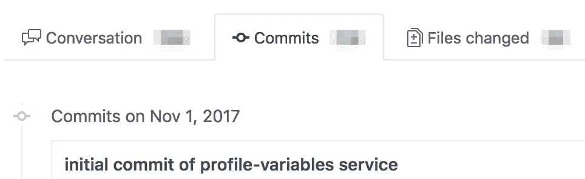
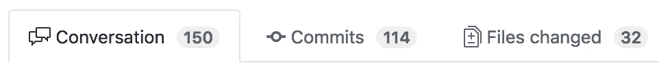

# “我做噩梦，觉得 pull (request) 17 永远不会被合并”

> 原文：<https://medium.com/hackernoon/i-am-having-nightmares-that-pull-request-17-is-never-going-to-get-merged-27b7d33307f5>

## 一个关于打地鼠公关评论的故事

访问 https://www.mikenikles.com****获取我的最新博文。****

**几分钟前，我在美丽、寒冷的天气里结束了在 [Assert(js) Testing Conf](https://medium.com/u/a5226958133a?source=post_page-----27b7d33307f5--------------------------------) 的美好一天后，回到了酒店房间🌧圣安东尼奥。如果 2018 年你不在，我强烈推荐你明年去！**

**会议有几个主题:模仿(或不模仿)，单元测试与集成测试或它们是否相同，减少循环和认知复杂性，以及其他伟大的内容。**

**我的头有点晕晕乎乎的(主要是因为一天中大量的知识堆积在我们身上，其次是因为参加会议后派对的后果……)，我坐下来浏览我的闲置通知。**

**其中一个立刻引起了我的注意:**

****

**😴 👻**

# **什么是“拉(请求)17”？**

**我喜欢把这种情况称为黑洞。这就像几年前某人写的一段代码，没有人理解，你不会想接近它。**

**嗯，PR 17 变成了黑洞。这一切都始于 2017 年 11 月 1 日——也就是 113 天前。**

****

**The beginning**

**出于各种原因，我们正在向一个更小的、独立的服务架构发展，每个服务负责整个平台的特定功能。
所以这个`profile-variables`服务就是这样一个服务，它意味着被开发和部署成小块，直到它的功能完成。**

# **发生了什么事？**

**两个字:不可思议。
最初，该服务是由一个承包商开发的，以 Docker 为部署环境，用标准 Node.js / Express 编写。在最初的几次提交后不久，我们决定部署到 Google Cloud Functions (GCF)并改用 PubSub(*此处插入一个不相关的长故事*)。`profile-variables`服务被选为在 GCF 上运行的第一个服务。**

**一个团队成员(让我们称他为虚构的 Jimmy)接管了现有的代码，并开始向 GCF 迁移。遵循最佳实践，他定期向 Github 推送新代码，评论者留下评论。新的团队成员加入了公司，也留下了笔记、建议、想法等。**

**虚构的吉米勤奋地回答问题，回复评论和应用评论家提出的建议。**

> **“我可以解决所有这些问题，但每次我解决问题时，都会有 10 个问题冒出来。”—虚构的吉米，今天**

**截至今天，PR 17 有 6 个贡献者，总体统计如下:**

****

**The end (?)**

# **怎么会这样？**

**大多数事故都是多件事情出错的结果。PR 17 也是。**

*   **我们过于关注微观，而没有关注宏观。**
*   **遵循了流程，但是它们要么没有很好地定义，要么可能遵循得太严格。**
*   **当 PR 17 超过一定数量的评论、提交或文件更改时，没有敲响警钟。**
*   **工具、自动化、CI/CD 一切都按预期运行，但是我们没有计划像我们在这次公关中遇到的情况。**
*   **我们不应该允许关于整个 GCF 部署的对话成为拉取请求的一部分。**

# **我们从中学到了什么？**

**这让我回到了今天的 AssertJS 大会和我之前提到的主题。**

**演讲者还提到了像拉式请求审查、自动化测试、使用工具来帮助流程等主题。当我记笔记时，我一直在想:**

*   **“拉式请求审查，没有强制推动”:✅，我们已经明白了。**
*   **“孤立测试”:✅:是的，完全同意。**
*   **“使用工具和机器人来扮演坏警察”:✅做到了这一点。**

**我觉得，考虑到所有的事情，我们的团队在保持代码高质量方面做得很好。**

**然后，我读了虚构的吉米的懈怠信息，它击中了我:**

> **工具、流程、自动化测试套件等。如果我们忘记了看到全局，这些都不重要。**

**我从会议中得到的许多收获都集中在提高代码质量、减少错误、交付运行良好的软件上。这些都是每个团队必须考虑的超级重要的事情。**

**但最重要的是，我们的 PR 17 情况告诉我，作为一个团队，我们必须偶尔后退一步，讨论日常流程，要求每个团队成员分享他们认为可以改进的地方。专注于工作的最佳工具或编写集成测试的最优雅方式很容易被冲昏头脑。**

**考虑到这一点，我鼓励你出去走走，思考一下你的流程，并列出你可以在工作流程中改进的三件事，以避免“PR 17”(是“黑洞”、“你最糟糕的噩梦”或类似说法的同义词)。**

**PS:感谢虚构的吉米为这篇博文提供灵感🙏！**