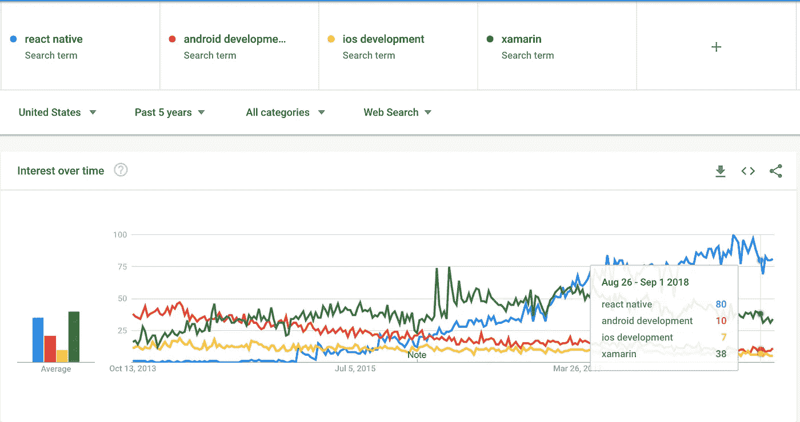
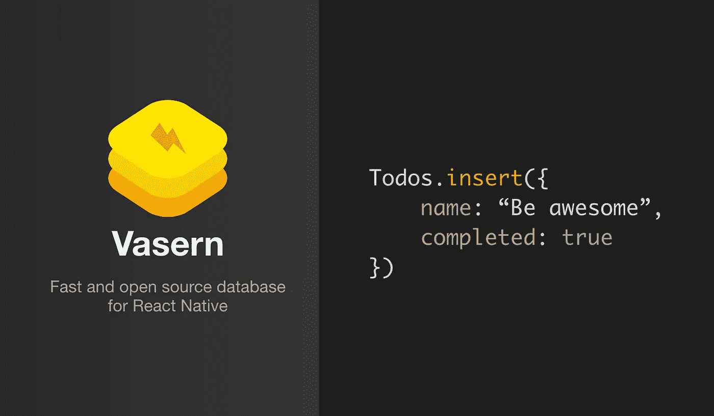

# 我建立了 Vasern——React Native 的数据存储

> 原文：<https://medium.com/hackernoon/i-built-vasern-a-data-storage-for-react-native-50ad91aa8b27>

## 开源同步数据库解决方案

React Native 是一个用于构建原生移动应用的框架，由脸书于 2013 年发布。在过去的 5 年里，React 的本土宣传稳步增长。

它目前在 Github 上有 69，469 颗星，并被许多像样的公司使用。包括脸书、Airbnb、Discord 等。

Current trends using Google Trends (can be different using other keywords)

我发现非常奇怪的一件事是数据存储的可用选项非常有限。其中包括 AsyncStorage、SQLite、Firebase(使用 LevelDB)和 Realm。而只有 Firebase 和 Realm 支持同步到云端，这就累坏了他们的服务。

最近，我经常和 React Native 打交道。尽管我对 React Native 开源数据库的现状并不满意。并决定建立一个数据库，允许我只插入和使用，而没有涉及许多第三方库或服务。

此外，为了获得最佳性能，我决定原生构建它。

# 但是为什么要建立一个数据库呢？

我发现 AsyncStorage 和 SQLite 相当慢。此外，在这两个 DB/storage 系统之上还构建了许多包装器库。

此外，目前大多数移动应用程序需要将数据同步到云，这意味着除了优化本地存储，开发人员还需要担心设置服务器(身份验证、安全性、性能、可扩展性等)。).或者像 Firebase，Realm 这样的付费服务。

我过去很喜欢同时使用 Firebase 和 Realm。唯一的问题是在服务器上进行扭曲来修复一个问题(例如一个特定的查询需求)是不可用的。对我来说附属于他们的服务似乎不是一件愉快的事。

Vasern 的目标集中在性能上，对开发者友好，让每个人都可以使用。

大多数时候，建立一个新的数据库并不是一个明智的想法。它非常耗时，需要极其小心地确保数据的一致性、可伸缩性、安全性等。不过，我觉得这个挑战很有趣，也是解决我面临的问题的一种方式。

# Vasern (alpha)版本

到目前为止，结果相当令人满意。它帮助我在不到 5 分钟的时间内为我的新 React 本机应用程序设置了一个本地数据库。[而且是超快的](https://youtu.be/e3OeL_wiIR8)。

我最近在 alpha 版本下发布了 Vasern。它支持 iOS 上的 React Native。更多细节和例子可以在 Github 上找到。

 [## 瓦塞恩/瓦塞恩

### Vasern 是 React Native - vasern/vasern 的快速、轻量级和开源数据存储

github.com](https://github.com/vasern/vasern) 

文件正在完成。关于 Vasern 的更多信息将在接下来的帖子中提供。感谢您的阅读，请订阅 Vasern Github 知识库以保持更新。

附言:我也[在 ProductHunt](https://www.producthunt.com/posts/vasern-for-react-native) 上发布了 Vasern，并感谢你的支持