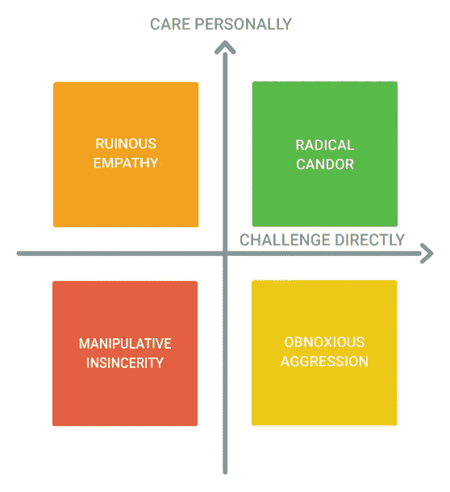
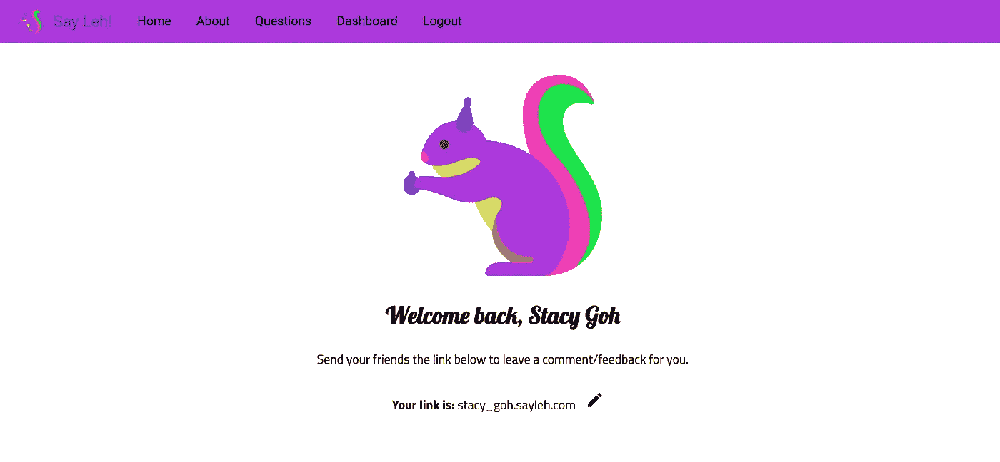
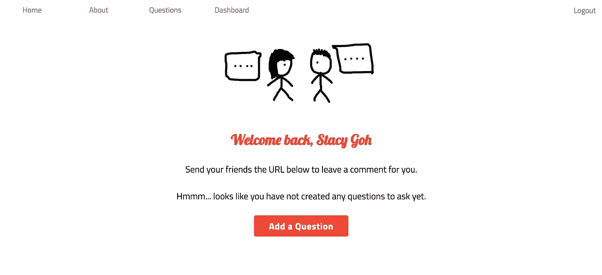
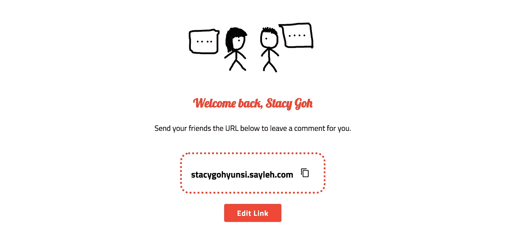
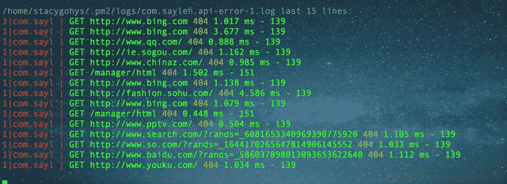

# 我来了，看了，建了… Sayleh，新的反馈循环工具

> 原文：<https://medium.com/hackernoon/i-came-i-saw-i-built-sayleh-the-new-feedback-loop-tool-8d6e95380c04>

# 我们是否都给予和接受了足够的反馈？

不久前，我和我的同事聊到在团队回顾中，我们是否为周围的人提供了足够的建设性反馈。然后，他提出了术语**，意思是 ***说出你所想的*** ***并直接挑战*** ，同时也向你展示了 ***对你要说的人的个人关怀*** (也就是说要确保处于右上象限)。**

****

**Source: [https://www.radicalcandor.com/](https://www.radicalcandor.com/)**

**提供建设性的反馈既困难又陌生，尤其是当我们成长在一种支持“如果你没有什么好话要说，那就什么都不要说”的文化中时。然而，什么都不说往往弊大于利。**

> **我认为，当你的员工搞砸了的时候，批评他们不仅仅是你的工作，实际上也是你的道德义务。**

**这不仅适用于老板和员工，向上的反馈也同样重要。**

> **埃隆·马斯克曾经说过:“我认为有一个反馈回路是非常重要的，在这个回路中，你会不断地思考你已经做了什么，以及如何才能做得更好。”**

**我很想知道人们对我的看法，或者我如何能做得更好——不是指“我认为你做得很好”，而是具体的反馈——帮助我改进的反馈。到目前为止，我的三个同事已经在工作场所向我寻求反馈。我三个月前开始了现在的工作。那个数字算很多吗？好吧，你告诉我。**

**这让我开始思考。什么时候是提供反馈的合适时机？员工多久有一次提供反馈的机会？即使有，反馈会议也可能是与直接上级的一对一预约。有没有快速的方法从和你一起工作的人那里得到反馈？即使有，人们敢说出他们真正的意思吗？**

**是时候把事情掌握在我自己手中了！**

# **介绍 [Sayleh](http://sayleh.com)**

**“呃，说吧，leh ..”**

**如果你住在新加坡，你会经常听到这个短语，因为它是一个新加坡式的术语，也可以翻译成“请说”(通常带有乞求的语气)。**

**Sayleh 是一个平台，让你可以问你的同行/同事你一直想知道(但不敢或不能找到)的问题。它让你发现人们对你的真实想法。你得到的答案是匿名的，因此你可以期待坦诚的反馈**。****

**Sayleh 的入门也非常简单。**

1.  **通过脸书登录 Sayleh，获得您自己生成的网址**
2.  **提出你想问同事/同事的问题(例如，你认为我的缺点是什么？)**
3.  **分享网址，然后高枕无忧，等待回复(所有回复都是匿名的)！**

# **我从设计 Sayleh 中学到的两件事**

## **你！==用户**

**完成 Sayleh 的初稿后，我去做了我的“用户研究”，问朋友们对网站的看法。令我惊讶的是，他们说用户入职的步骤不清楚。**

**我突然意识到，在早期阶段做“用户研究”是至关重要的。从零开始构建 Sayleh，并了解我头脑后面的用户流，整个体验对我来说很直观。然而，对于用户来说，我不知道一旦我进入这个页面，我需要采取什么步骤。**

**对于 Sayleh 的第一次迭代，这是用户通过脸书登录后在主页上看到的内容。**

****

**First iteration of Sayleh**

**虽然网站上有导航到不同页面的链接，但对于用户来说，下一步该做什么仍然不是很直观。接下来的修改(见下面的截图)包括为用户添加一个提示，以创建他们想问别人的问题，并在他们生成的 URL 旁边添加一个复制图标，以便他们可以轻松地复制他们的链接并共享它。**

****

**Nudging users to the right user flows**

****

**Allows users to copy links to share with their friends easily**

## **不要多此一举**

**在试图完成这个项目时，我在设计上花了不少心思。设计(以及 CSS 或 SCSS 的复杂性)从来都不是我的强项。通过这个项目，我学到了好的设计(或你团队中一个好的设计师)的重要性——我个人觉得这是一种平衡，既要有令人难忘的设计，又不能太过火，还要有贯穿整个网站的连贯主题。**

**我的一个建议是，当你刚刚起步时，永远不要重新发明轮子。除非你有设计天赋(这对你有好处)，从你最喜欢的应用程序中获得设计灵感，因为作为一个用户，我会熟悉我日常使用的界面，我不想(或者说这没有意义)重新学习一个新的界面。**

**事实上，我还在改进某些设计方面(非常欢迎反馈！).**

# **Sayleh 是如何建立的(为外面的极客)**

## **语言和框架**

**Sayleh 构建于 ReactJS 框架之上，具有 NodeJS 后端。选择 ReactJS 的原因是因为我一直是 AngularJS 的开发者。有了这么多比较 AngularJS 和 ReactJS 的文章(见这里的和这里的，我很好奇想尝试一下。**

## **ORMs 和数据库**

**由于要存储的数据(比如用户、问题、答案实体)大多是关系型的，所以我认为 mySQL 作为关系型数据库将是一个不错的选择。 [Sequelize](http://docs.sequelizejs.com/) 被用作[对象关系映射](https://en.wikipedia.org/wiki/Object-relational_mapping) (ORM)工具，可以方便地查询和操作数据库中的数据。换句话说，使用 ORM，不需要编写 mySQL 语句，而是直接与对象交互。**

**这通过创建一个在整个应用程序中使用的模型层，加强了[模型-视图-控制器(MVC)](https://en.wikipedia.org/wiki/Model%E2%80%93view%E2%80%93controller) 模式，使代码更加简洁。Sequelize 还可以执行简单的验证，比如在插入数据库之前确保数据类型是正确的。**

## **托管和配置**

**Sayleh 托管在 [DigitalOcean](https://www.digitalocean.com/) 上，并设置了 [Nginx](https://nginx.org/en/) 反向代理。Nginx 允许设置多个端口，用一个服务器或域名托管多个应用程序。**

**ReactJS 应用程序作为静态资产提供，而后端 NodeJS 服务器设置为使用 [PM2](http://pm2.keymetrics.io/) ，一个 NodeJS 流程管理器来运行应用程序。使用 PM2 的好处包括，如果应用程序崩溃，可以通过重启来帮助维持网站的正常运行。**

****测井****

**虽然`console.log()`使用起来很简单，但是在不同的环境下无法打开/关闭。例如，我只希望某些警告出现在开发中，而不是生产中。此外，它不为您提供关于日志的附加信息，如路线、错误的日期/时间等。**

**我使用[摩根](https://github.com/expressjs/morgan)和[温斯顿](https://github.com/winstonjs/winston/tree/2.4.0)来执行日志记录。**

**Morgan 是一个 HTTP 请求日志中间件。它允许我们格式化进来的请求。由于 NodeJS 提供了两个默认的写流— `stdout`和`stderr`，并且 PM2 默认为我们的`stdout`和`stderr`流创建单独的日志文件，我们可以使用 Morgan 来格式化到来的请求，并通过管道将其传递给相关的流。**

*****不要*** 低估应用程序的日志功能。在我看到这个之前，我从来不这么想。**轻度惊恐发作瞬间****

****

**Why you want hack me):**

**有人在我的网站上尝试不同的路线。但是，我无法获得远程 IP 地址的任何上下文或日期/时间。这是一个及时的提醒，以改善日志输出更多的信息，这样我就可以找到采取什么措施，使 Sayleh 更安全。**

**在这种情况下，我不得不改变 Morgan 的格式，在生产中使用`combined`，输出更多的属性，比如日期、远程地址等(并在开发中使用`dev`)。点击查看摩根[的更多格式。](https://github.com/expressjs/morgan)**

**Winston 是一个用于 NodeJS 的多传输异步日志库。目前，我通过管道将日志传输到一个文件中，并通过一个名为[https://github.com/winstonjs/winston-daily-rotate-file](https://github.com/winstonjs/winston-daily-rotate-file)的库添加了文件轮换。它允许我指定文件的最大大小，在此之后它将旋转，以及在日志被自动删除之前，我应该保留日志多长时间。**

# **变化是唯一不变的**

**我正在用集装箱装运 Sayleh。目前，当直接在 DigitalOcean works 上部署时，containerising 允许清晰地分离关注点并保证一致的环境，因此您可以确保代码在任何目标环境下都能工作(无论是您的笔记本电脑，还是您自己的 VPS 等)。此外，如果需要，它允许更容易的缩放。**

**在 Sayleh 的下一个阶段，你可以期待更多的特性，比如让用户选择创建不同类型的问题(也许是 mcq？)，当然还有更稳定的平台>。<**

**最后，开源！我愿意鼓励开发者之间的合作。**

# **请表现出你的爱好吗？**

**如果你想了解我在 Sayleh 和我的其他项目上的谦卑之旅，你可以在 Medium 上关注我，或者如果你对我如何改进网站有任何想法，我很乐意听到它们——只需给我发电子邮件到*hello@imstacy.com*。最后，如果你想帮助我让世界变得更美好，一次一行代码，你可以在我的 Patreon 账户[这里](https://www.patreon.com/stacygohys)支持我。**