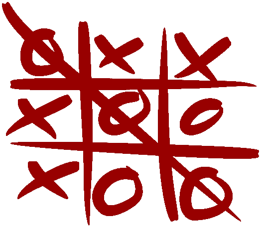
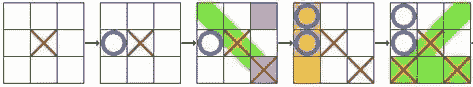
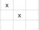
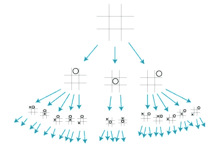
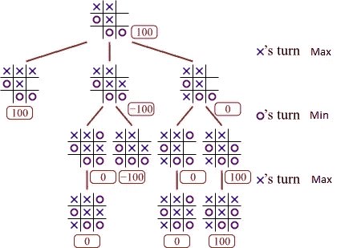

# 我创造了一个能在井字游戏中打败我的人工智能

> 原文：<https://medium.com/hackernoon/i-created-an-ai-that-beats-me-at-tic-tac-toe-3ea6ba22cd71>

*在井字游戏中尽情输吧:*【https://www.aaronccwong.com/tic-tac-toe】T2



Shamelessly taken from Wikipedia.

当我上一年级的时候，我认为自己是世界上最好的井字游戏玩家。我打败了我的朋友，他刚刚教过我怎么玩。对我来说不幸的是，这种天才的感觉没有持续很久。我亲爱的朋友，他的名字我已经不记得了，开始发起钳形攻势。游戏开始看起来有点像:



Yeah. Sucks for O.

我崩溃了。我回家练习，直到我能从一英里外看到那些技巧。当时我并没有意识到，我实际上是在搜索一棵**博弈树**，看看我正在走的这步棋是否会带来有利的结果。

你:那么……什么是博弈树？

我:哦。它只是一个博弈的**状态空间**，其中每个节点都是博弈的一个状态，每个边都是有效的移动。

你:…

我:不好意思。*状态空间是通过任何动作序列从* ***初始状态*** *可达到的状态集合。至少罗素和诺维格是这么定义的。任何游戏的初始状态都是游戏开始时棋盘的状态。井字游戏的初始状态只是一个 3x 3 的网格，其中没有 X 或 O。然后每当玩家移动一步，游戏就进入一个新的状态。例如，上图中 O 丢失的地方显示了 5 个状态。每走一步，就达到一个新的境界。所有可达状态的集合就是状态空间。任何需要打破游戏规则才能达到的状态都不被认为是可达到的状态。因此，具有两个 X 标记而没有 O 标记的井字游戏棋盘不是可到达的状态。*



Not a valid state.

你:这与你创造了一个在井字游戏中打败你的人工智能有什么关系？

我:那容易。我只是让电脑模拟了每回合开始时每一步可能的结果。完成模拟后，它会选择能带来最佳结果的行动。这相当于在博弈树中搜索具有最佳可能结果状态的叶子。



Partial game tree for tic-tac-toe. Credits to Professor Eppstein of UC Irvine.

一个自然产生的问题是，这在成本上是否可行。我们可以进行包络计算，看看有没有那么多的状态。假设计算机先走。那么有 9 种可能的移动。对于它选择的 9 步棋中的任何一步，它都必须模拟另一个玩家对此的反应。对此有 8 种可能的选择。然后它切换回计算机，在剩下 7 个选项的情况下再次移动。这种情况一直持续到没有剩余的移动。因此，在第一步，计算机需要浏览 9！= 362，880 个州。在计算机的下一步行动中，还有 7 个可能的地方需要标记，因此计算机需要检查 7 个地方！= 5040 个州。如果我们假设游戏一直持续到计算机只剩下一个可能的走法，那么计算机需要看完 9！+ 7!+ 5!+ 3!+ 1!=总共 368，047 个状态。作为比较，国际象棋博弈树有大约 10 个⁵⁴节点。

既然我们知道我们可以只看博弈树来寻找最佳可能的移动，并且搜索博弈树是可行的，那么什么算法在这里最有效呢？最小最大算法似乎是一个自然的候选。

在任何回合的两人零和游戏中，你总是试图达到对你来说最好的结果，在大多数情况下就是赢。这相当于另一个玩家达到了最坏的可能结果。同样，如果其他玩家达到了对自己来说最好的结果，这是你输了之后最差的结果。因此，如果我们让 U:State **→** ℝ作为效用函数，那么你的目标将是在游戏结束时最大化你的效用，而你的对手的目标将是通过最大化她的效用来最小化你的效用。

假设我们面对的是一个理性的对手，极大极小算法会在给定玩家的回合中，将每一步棋的最大可能效用显示出来。



为了更清楚地解释极大极小算法在做什么，看看上面的图片。假设赢给我们的效用是 100，输给我们的效用是-100，平局给我们的效用是 0。我们可以玩右上角的游戏并获胜，给我们 100 的效用，但是让我们把另外两种情况当作一个思考练习。

假设我们选择中间一排的空位。那么轮到 O 的时候，既然我们是假设它是一个理性的对手，那么 O 就会选择发挥我们效用最小化的位置。如果 O 打右上角，我们的效用是 0，如果 O 打左下角，那么 O 赢了，所以我们的效用是-100。因此，我们知道 O 将会选择左下角，所以我们知道如果我们选择中间一行，那么我们的效用将会是-100。

类似地，如果我们不打中间一行而是打左下角而不是中间一行，那么 O 将有两个移动可供选择。如果 O 打中间一排，那么我们可以通过打最后一个空位来获胜。o 不想这样。o 发现如果她改打右上角，那就是平局，所以我们得到的效用是 0。由于这使我们的效用最小化，O 将改为打右上角。因此，如果我们玩左下角的游戏，那么我们知道这个游戏将以平局结束，我们将得到 0 的效用。

从这个分析可以清楚地看出，在这三步棋中，打右上角会给我们带来最大的效用。因此，作为一个理性的代理人，这是我们选择的行动。

让`UTILITY(state)`返回当前状态的效用。设`ACTIONS(state)`是当前状态下所有有效移动的列表。让`RESULT(state, action)`成为在当前状态下做出给定动作后的结果状态。则极大极小算法由下式给出

```
MINIMAX(s)
    For every a ∊ Actions(s)
        if MIN-VALUE(RESULT(s, a)) > UTILITY(RESULT(s, best))
            best = a
    return bestMIN-VALUE(s)
    If GAME-OVER(s)
        return UTILITY(s)
    For every a ∊ Actions(s)
        sim-utility = MAX-VALUE(RESULT(s, a))
        if sim-utility < worst
            worst = sim-utility
    return worstMAX-VALUE(s)
    If GAME-OVER(s)
        return UTILITY(s)
    For every a ∊ Actions(s)
        sim-utility = MIN-VALUE(RESULT(s, a))
        if sim-utility > best
            best = sim-utility
    return best
```

要查看这个算法的 JavaScript 版本，请查看这里:[https://github . com/AaronCCWong/portfolio/blob/master/src/util/tictactoe/computer player . js # L15](https://github.com/AaronCCWong/portfolio/blob/master/src/util/tictactoe/ComputerPlayer.js#L15)

`MINIMAX`很明显是深度优先搜索的一个应用。它的运行时间为`O(b^n)`，其中`b`是给定回合中有效移动的最大数量，而`n`是树的最大深度。

这都是假设我们在和一个理性的对手比赛。如果对手玩次优怎么办？不难看出，在这种情况下`MINIMAX`不会做得更糟，因为对手会采取一种不会让我们达到最小效用的行动。

敏锐的读者会意识到，这种算法并不能创造出一个永远获胜的人工智能。然而，它确实创造了一个无与伦比的井字游戏玩家。也就是说，你最多只能打成平手。如果像我一样，你走得太快，你甚至可能会输。

*在这里随意去输井字游戏:*[https://www.aaronccwong.com/tic-tac-toe](https://www.aaronccwong.com/tic-tac-toe)

*点击此处查看原文:*[https://blog . aaronccwong . com/2018/I-created-an-ai-that-beats-me-at-TIC-tac-toe/](https://blog.aaronccwong.com/2018/i-created-an-ai-that-beats-me-at-tic-tac-toe/)

免责声明:如果你声称战胜了它，不要害怕在下面的评论中列出你为赢得胜利而采取的行动。电脑每次都会做出相同的动作，这样我们就可以验证你确实是井字游戏大师。通过教我们如何打败它，你也将为人类提供一个伟大的服务。