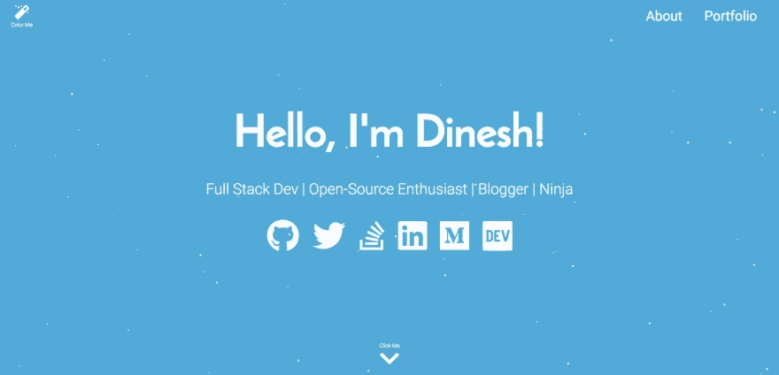

# 我用 React 和一些魔法创建了我的作品集🎉

> 原文：<https://medium.com/hackernoon/i-created-my-portfolio-with-react-and-some-magic-fda27ba06a06>



***TL；*** *博士——我在 React 中重写了我的* [***作品集***](https://flexdinesh.github.io/) *，并添加了一些小众的小技巧，让它看起来光彩照人。每次刷新页面，都会加载一个新的外观。*

这一整篇文章都是基于这个网站——Dinesh pandi Yan | Full Stack Dev

几周前，我创建了 [**Dev 登陆页面**](https://github.com/flexdinesh/dev-landing-page) ，并就此写了一篇 [**博文**](https://dev.to/flexdinesh/create-your-developer-landing-page-with-github-pages---42jk) 。在不到一周的时间里，回购获得了超过 150 颗星星，并出现在各种文章中。我猜人们喜欢它。我在此基础上创建了我的投资组合。

我不是 UI 专家，但最近我喜欢上了**响应式设计**、**动画**、 **flexbox** 以及其他一些花哨的 CSS 功能。所以我想我应该利用我的 UI 技能，并在这个过程中建立我的作品集。在寻找灵感的时候，我偶然发现了[阿里·斯皮特尔的](https://dev.to/aspittel)帖子[我是如何重写我的作品集网站](https://dev.to/aspittel/how-i-re-wrote-my-portfolio-site-cg)。她的作品集看起来非常棒，给你一种“哇”的感觉。然后，我开始了一段旅程，去建造一些能给人一种类似的氛围和**的神奇感觉的东西。**

我想在没有任何 UI 库/框架的帮助下从头开始构建一切**，但是除了 **React** 之外，因为我喜欢 React 简化整个 web 开发过程的方式。我在构建我的投资组合的每一个部分时都享受到了如此多的乐趣，同时也学到了如此多的新事物。我将列出这个网站中我最喜欢的几个部分，以及我从中学到的东西。**

*   Flexbox 布局
*   主题和反应的上下文 API
*   响应式设计
*   视差背景
*   动画片
*   浏览器特定代码

# Flexbox 布局

整个网站用 **Flexbox** 布局。

> *Flexbox 让一切就绪变得更加容易*

CSS Grid 和 Flexbox 已经成为最近的热门话题。尽管对 CSS 网格的支持不是很好，但是几乎所有的*浏览器都支持 flexbox。所以我认为用 Flexbox 而不是 Grid 来实现布局是相当安全的。*

Flexbox 是关于容器和孩子的。我在构建布局时使用了这张 [flex-cheatsheet](http://yoksel.github.io/flex-cheatsheet/) 作为参考，事情看起来很简单。

Flexbox 让我困扰的一点是`flex`属性。我用过，

`flex: 1 0 auto;`

`flex: auto;`

`flex: 1;`

在网站的很多地方，但仍然无法弄清楚它到底是如何运作的。大多数情况下，这是一种试错法。需要了解这些属性，也许我会很快写一篇关于它的帖子。

# 主题和反应的上下文 API

在决定网站的主题时，我不断地在两个主题之间周旋。有一天我会有一个，然后另一天我会用另一个主题替换我的 Sass 主题定义。结果，我不能选择一个，我想两个都要。

然后一个疯狂的想法出现在我的脑海里——*为什么不两者兼而有之呢？*

我探索了用 React 做这件事的方法，并选定了 React 的上下文 API。我们可以很容易地争论用 Redux 来代替，但是我已经用 Redux 做了太多的工作，并且想要在没有 Redux 的情况下用 **React 来弄脏我的手。Context API 是一种不太理想的做事方式，但它为我完成了工作，我对此很满意。我可能很快会用 React 16.3 的新上下文 API 重写这个。**

玩了一段时间后，我最终有了 **16 个很棒的主题**——**10 个光明主题**和 **6 个黑暗主题**。

在所有这些中，我最喜欢的三个主题中的一个将在网站加载时被应用。而当你点击**魔棒**时，16 个主题中的 **1 个就会被应用**。

试着看看你是否能区分所有 16 个主题。相信我，没那么容易: )

每次你刷新页面，都会加载一个新的外观。我不得不说，主题魔法是我最喜欢的✨网站的特色

# 响应式设计

如果你知道如何正确使用，Sass 可能是一个强大的工具。我最近开始探索 **Sass mixins** ，它帮助我毫不费力地设计和重构响应式布局。

我已经提出了标准的、可重用的 sass 断点混合。你可以在这里找到完整的 mixin 代码— [Sass 断点 mixin](https://github.com/flexdinesh/flexdinesh.github.io/blob/dev/src/styles/_breakpoints.scss)

使用这些 mixins 编写媒体查询要容易得多。

```
.content-grid {
  margin: 0 auto;
  width: calc(100% - 5rem); @include breakpoint-medium-up {
    width: calc(100% - 5rem);
  } @include breakpoint-large-up {
    width: calc(100% - 10rem);
  }

  @include breakpoint-xlarge-up {
    width: calc(100% - 20rem);
  }
}
```

# 视差背景

我见过*视差*标签帖子和代码笔不少，但从来没有尝试过。我从其中一个代码笔中得到灵感，并以我自己的版本结束— [视差星背景](https://codepen.io/flexdinesh/full/GxNazP/)

这不完全是*‘视差’*，但或多或少服务于目的，并在背景中创造了一个降雪效果。

# 动画片

我也在网站上添加了一些动画。你会发现**滚动到下一页**箭头上下跳动。当你将鼠标悬停在社交图标**上时，你还会发现这些图标** *(GitHub、Twitter、LinkedIn 等)*会跳动。

不知何故，《弹跳》似乎是我最喜欢的动画。*‘视差降雪’*也是一部动画，但大部分是灵感作品。

# 浏览器特定代码

在处理动画时，我发现 **Safari 不支持平滑滚动**并且 **FireFox 在渲染降雪**时有小故障。所以我需要特定于浏览器的行为，并最终创建了一个 react 组件来为特定的浏览器呈现代码。

你可以在这里找到组件的代码——浏览器组件。我正在考虑编写完整的测试用例，并在不久的将来开源这个组件。

像这样使用组件是非常简洁的。

```
<Browser except firefox chrome mobile>
  <span>All the magic tricks in this site work best in 
    <b>Chrome!</b>
  </span>
</Browser>
<Browser only firefox>
  <span>Magic background is disabled in FireFox. Try in 
    <b>Chrome!</b>
  </span>
</Browser>
```

# 网站启动并运行

我最近用 GatsbyJS 重新写了我的作品集— [**作品集 v3**](https://dineshpandiyan.com)
我把这篇帖子里提到的作品集移到这里— [**作品集 v2**](https://portfoliov2.dineshpandiyan.com/)

链接到源代码— [**React 代码库**](https://github.com/flexdinesh/flexdinesh.github.io/tree/dev)

我仍然在这里和那里调整。投资组合部分显然需要升级。但是大部分设计部分已经完成。请随意发表您对该网站的看法，以及是否有可以改进的地方。

你太棒了！祝你今天开心！玩的开心！✨

*原载于* [*dev.to*](https://dev.to/flexdinesh/i-re-wrote-my-portfolio-and-added-some-magic-22n7) *。*