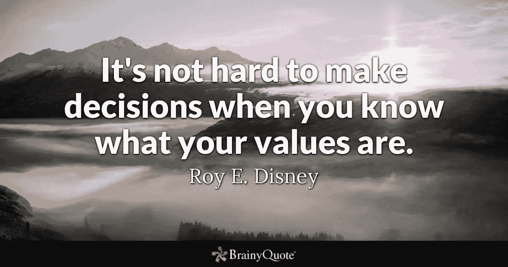

# 我没有接受脸书大学的工作邀请。原因如下。

> 原文：<https://medium.com/hackernoon/i-didnt-accept-job-offer-at-facebook-here-s-why-fd6fce49a26b>

## 你可能会认为我疯了。也许我是。也许我不是。

“space gray iPhone 6 with Facebook log-in display near Social Media scrabble tiles” by [William Iven](https://unsplash.com/@firmbee?utm_source=medium&utm_medium=referral) on Unspla

我在早上五点半左右醒来。我晚上睡得很晚，感到很困。但现在不是偷懒的时候，因为我必须为旅行做好准备。我沏了茶，吃了些面包作为早餐，冲了个澡，锁上门，给优步打了个电话。优步把我带到一个公共汽车站，我在那里订了一个座位。公共汽车晚点了大约 20 分钟，但我在早上 7 点 20 分离开了卡拉奇——灯光之城。根据交通状况、道路状况和巴士速度，需要 4-5 个小时的路程。

在整个旅途中，我都在向窗外窥视，看着树消失在身后。但我的心不在那辆车上。它在别的地方。我沉浸在一天前所做的决定中。我做了一个选择。我一直在想这件事。我在想，这是不是该做的事情，是不是该做决定的时候，是不是该追求的机会，或者对世界上最大的公司之一说不是不是正确的。

> 难的是不做决定。而是带着这些决定生活。

我不确定自己的想法和感受。也许我有点内疚，也许我不能相信敲我门的机会，也许这只是一个梦，也许这不是什么大不了的事，我正在做。但是有一件事我很确定，那就是我已经做出了决定，现在我必须接受它。在那辆巴士上，我在想如何让自己舒服一点，并消除心中的罪恶感。

Image Credit: [https://www.brainyquote.com/quotes/roy_e_disney_170949](https://www.brainyquote.com/quotes/roy_e_disney_170949?src=t_decisions)

我大约在上午 11 点到达我的家乡。它很快，我不希望太早到达。我上了一辆黄包车，又走了 10 多分钟才到家。我敲了门。我妻子打开了它。我们互相问候，微笑着。我已经两个星期没回家了。我坐在休息室。我妻子给我拿来一杯水。我仍在四处寻找我的父亲，但他不在里面。

几分钟后，他进了家，走了进去。他看到我很惊讶，我们拥抱了一下。我父亲看到我在家时那令人敬畏的微笑让我忘记了我做的那个重大决定，也消除了我所有的内疚。现在我确信自己做出了正确的决定，有些东西是无价的，无法用机会来衡量。

# 决定？什么决定？

“person in yellow coat standing on top of hill” by [Justin Luebke](https://unsplash.com/@jluebke?utm_source=medium&utm_medium=referral) on [Unsplash](https://unsplash.com?utm_source=medium&utm_medium=referral)

但是我在这个故事中反复提到的那个决定是什么呢？

正如你在故事标题中读到的。是关于脸书的一份工作邀请。我感到非常幸运，脸书考虑让我加入他们的团队。由于一些机密，我不能透露细节，如角色，责任，地点，工资和津贴等。但我可以在这里告诉你的是，我非常接近脸书的工作。

> 我感到非常幸运，脸书已经考虑让我在他们的团队和公司中担任一个职位。

我非常感谢脸书和它的招聘团队给我这个好机会和他们的考虑。作为一名开发人员，能够编写出能够在数十亿(而不是数百万)用户设备上运行的代码，这确实是一种巨大的荣誉和声望。我很抱歉拒绝接受这份工作。这个决定与工作、类型或过去几个月围绕脸书的争议没有任何关系。

这是一个将家庭置于事业之上、将幸福置于金钱之上的决定。是关于那个微笑。就在那一刻。是关于那个和家人在一起的周末。那是我与家人和父亲一起吃饭、开玩笑、思考和看电视节目的时候。是关于和我父亲一起去我母亲的墓地见她。

如果我接受了脸书的工作，我会穿越半个世界，住在租来的公寓里，试图通过低速网络视频通话来看望我的家人和父亲。对我来说，这些东西对我来说比事业、成长、金钱更重要。在你说我可以带我父亲一起走之前，让我告诉你，由于某些医疗条件，这是不可能的。所以选择对我来说很明确。我对此非常满意。

> 当你清楚自己的价值观时，做决定就变得容易了。~罗伊·迪斯尼

> 你疯了吗？你疯了吗？你傻吗？为什么？真的吗伙计？你应该去吗？

当我告诉我的圈子里的人，我在脸书找到了一份工作，但不得不拒绝时，他们的反应是这样的。在你通过思考或说同样的反应来判断我或错误判断我之前，让我意识到谁会拒绝这样的公司和工作机会，我相信有些东西和价值观对我来说比我的职业、金钱、成长等更重要。我只知道这是我职业生涯中得到的最大的机会，我甚至从未想象或梦想过它。所以说不是我一生中最难也是最艰难的决定之一，我花了几天时间做出这个决定，然后又花了几天时间接受我做了这个决定的事实。

对许多人来说，在脸书找到一份工作根本不是什么大事。但是，对我来说，这真的是巨大的，难以想象的。我只是一个住在巴基斯坦卡拉奇的普通人，据说那里是全世界第四个最不适宜居住的国家。我爱这个城市和国家胜过一切。

# 我是怎么得到机会的？

对于那些好奇我是如何得到这种巨大机会的人来说？自从我在过去的 7-8 个月开始做开源贡献以来，我已经在全球范围内获得了工作机会。你的工作得到国际认可并被欣赏，这种感觉很好。

 [## 开源代码 100 天

### 100 天我得到了什么，你能从开源得到什么？

android.jlelse.eu](https://android.jlelse.eu/100-days-of-code-in-open-source-3ceb38474a89) 

> 我会建议我的同事、朋友和来自我的国家巴基斯坦的开发人员做更多的开源工作，并尽可能地利用这些机会。我很乐意尽我所能帮忙。

**Wajahat Karim** 毕业于[NUST](http://nust.edu.pk)，一名经验丰富的移动开发者，一名活跃的开源贡献者，也是两本书[学习 Android 意图](https://www.amazon.com/Learning-Android-Intents-Muhammad-Usama/dp/1783289635)和[用 Unity 掌握 Android 游戏开发](https://www.amazon.com/Mastering-Android-Game-Development-Unity/dp/1783550775/)的合著者。在业余时间，他喜欢花时间和家人在一起，做编码实验，喜欢写很多东西(主要是在博客和媒体上)，并且是开源的热情贡献者。2018 年 6 月，他的一个库在 [Github Trending](https://github.com/trending) 上成为第一名。[他的库](http://github.com/wajahatkarim3)在 Github 上有大约 2000 颗星星，并被全球各地的开发者用于各种应用。在 Twitter 和 [Medium](/@wajahatkarim3) 上关注他，获得更多关于他的写作、Android 和开源工作的更新。

 [## Wajahat Karim (@WajahatKarim) |推特

### Wajahat Karim 的最新推文(@WajahatKarim)。安卓开发者。UI/UX 设计师。博主。作家…

twitter.com](https://twitter.com/WajahatKarim) 

此外，如果你有任何想让他回答的问题，请通过他在[wajahatkarim.com](http://wajahatkarim.com)的网站联系他，在主题行写上“亲爱的瓦贾哈特”。