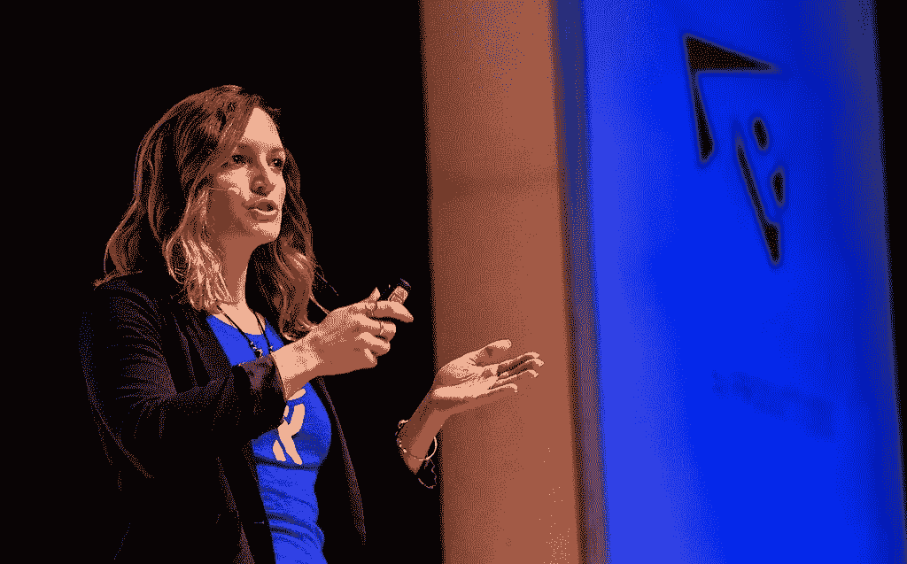

# 我不想再穿 t 恤了

> 原文：<https://medium.com/hackernoon/i-dont-want-to-wear-t-shirts-anymore-f2388b2dbe2d>

The leaning tower of t-shirts

首先，我穿 t 恤看起来很傻。它们过分突出了我的方形肩膀和宽阔平坦的胸部。他们的非定制和轻薄的面料让我看起来像是在我的腰部走私果冻卷。女式合身 t 恤最差。在他们试图适应女性的过程中，他们在腋窝下是如此的舒适，以至于他们确信我会一直保持着腋窝的污渍。

但是，唉，t 恤是科技文化的重要组成部分。我家里有一整个抽屉是专门给他们的。所有这些都用了聪明的说法，比如“HTTPster”或“Plan Ahead ”,而“D”在旁边，因为设计者显然没有提前计划(明白吗？).

我所有的 t 恤都是女性尺寸，你知道，为了包容，应该是为我的女性特征量身定做的。当然，如果你认为棉质圆领毛衣性感的话。还有怎么会有人抱怨免费的衣服呢？我真的再也不用买 t 恤了！

但是我讨厌他们。全部都是。

# 向美国企业竖起中指

我责怪马克·扎克伯格。t 恤曾经是他对西装笔挺、皮鞋锃亮、系着皮带的公司“男人”毫不隐讳的中指。他的非时尚时尚声明在技术社区传播开来，让所有人都有能力将休闲星期五扩展到日常生活。

不久之后，这种 t 恤成了硅谷的制服，象征着“我比你的着装要求高*”说到这里，我也不会再在小隔间里工作了。*

最终，t 恤成了科技“时尚”的中流砥柱(如果你能称之为时尚的话)。他们不是在说“f-you ”,而是在谈论穿自己喜欢的衣服的个人自由。它们让人们有宾至如归的感觉，即使是在工作中。他们让每个人都有机会在自己的个人广告牌上宣布自己的理想。

# **T 恤是新的商务休闲装**

但事实是:t 恤已经成为新的商务休闲装。t 恤曾经是代表包容性的反文化运动，现在已经变成了排外。独家是因为 t 恤是男性主导的时尚潮流。

> 作为一个女人，t 恤从来不觉得是我的叛逆，它们觉得是我融入社会的尝试。先说清楚:我绝不会在空闲时间穿 t 恤。永远不会。

t 恤不会让我觉得有女人味或者自由或者聪明。它们让我觉得又懒又胖。然而，当我穿着漂亮的衣服去工作时，我觉得有点不自在。如果我穿高跟鞋，人们会问我要去哪里。如果我穿上运动夹克，他们会怀疑我是否有工作面试。别误会，我喜欢穿任何我想穿的衣服去工作的自由。知道大多数人根本不在乎，甚至不会注意到我是穿连帽衫还是衬衫，这让我压力更小，也更开心。

但我在乎。

# **挣脱非定制圆领棉服的枷锁**

我可以理解着装要求，商务休闲装和周五休闲装，会让人感到压抑和窒息。我去过那里。我曾在一些公司办公室工作过，这些办公室试图抓住白领身上最后一丝优越感，在那里，牛仔裤几乎不被容忍，人字拖是一种直接的侮辱。我知道在小隔间里窒息的感觉和彼得·吉本斯沟通。

因此，当我搬到硅谷，开始我的大逃亡时，我迫不及待地想买一些书呆子气的 t 恤和帽衫。我自豪地穿着它们在旧金山四处走动，就像我在炫耀我母校的标志一样。就像，是的，我在技术部门工作，我想穿什么就穿什么，兄弟！

然而，最近，我在一些会议上发言。在会议上，许多男性演讲者在舞台上穿着 t 恤和牛仔裤。有些人甚至穿人字拖。在里斯本的一次会议上，我尝试了一下，心想，这只是制服，你必须代表硅谷的文化，这是人们想要的。所以我穿了 t 恤和运动夹克。我朋友指出的“科技兄弟制服”。

My tech-bro uniform

这时候我突然想到。这是科技兄弟的制服。这不是我个人认为最好的自己。回想起来，我觉得我只是看起来很傻。我不是说其他穿 t 恤的人看起来很蠢。相反，任何感觉很棒的人在展示他们最喜欢的 t 恤时，也会表现出这种感觉，看起来也很棒。但那不是我。

因此，如果 t 恤文化真的是关于做真实的自己的自由，摆脱那些抬高一些、压低另一些的规则或规范性文化标准的自由，那么我只想说:我不想再穿它们了。

我想看起来像克莱尔·安德伍德一样，强大、聪明、漂亮。我穿的衣服是让我有这种感觉的一部分。我不需要仅仅因为我是搞技术的就加入技术兄弟文化。我是一名从事技术工作的女性，我来定义这意味着什么。对我来说，这意味着再也没有该死的 t 恤了。

Speaking at the Atlassian Team Tour. Decided to sport a little Atlassian pin instead.

如果你喜欢这个博客，请关注我，了解更多关于技术、协作、生产力和在工作中做真实的自己的想法。

 [## 我如何通过个人工作成为最有效率的自己

### okr 是一个很好的决策框架。阅读我如何用它们来实现我的个人目标，以及如何…

medium.com](/@cdrumond/how-i-became-the-most-productive-version-of-myself-with-personal-okrs-663890b6dfa8)