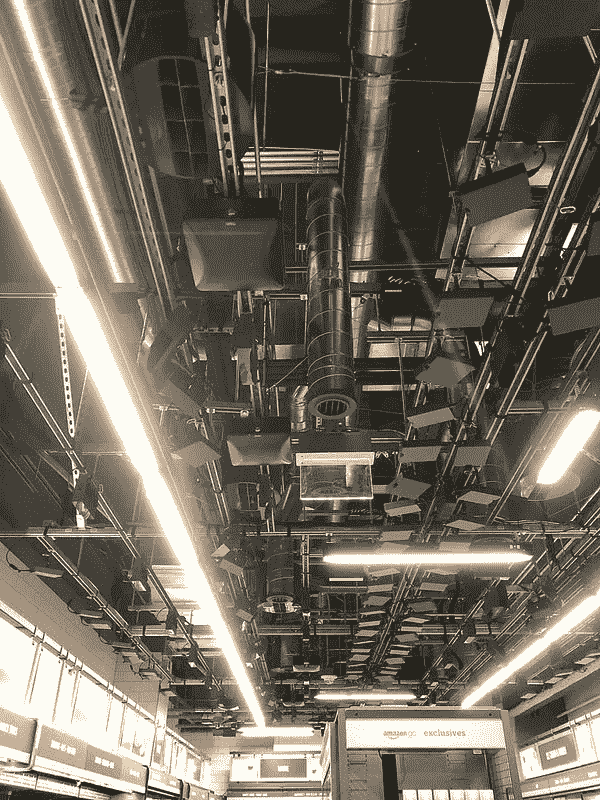
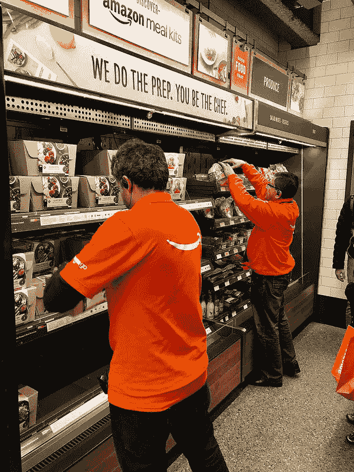

# 我体验了零售的未来:亚马逊 Go

> 原文：<https://medium.com/hackernoon/i-experienced-the-future-of-retail-amazon-go-3b823e434fc8>

“我见过的最疯狂的事情是一个穿着皮卡丘服装的人进来了”，一名亚马逊员工说，她递给我一个促销袋，袋的一边有 Amazon Go 的标志，另一边有文字“good food fast”。

我在晚上 7:20 左右到达西雅图市中心的新店，惊讶地看到人们的队伍仍然排到了街区的尽头。西雅图那天很冷，但这并没有阻止数百人在第一天来参观这家“神奇”的商店。我在这里没有轻描淡写地使用“神奇”这个词:这种体验确实是独一无二的，感觉好得难以置信。Amazon Go 可能是目前地球上传感器最多的商店，它令人生畏:

The ceiling of the Amazon Go store

天花板上的每一个盒子都是连接到深度学习算法的摄像头，这些算法分析你的每一个动作:你走过哪个通道，你拿起什么东西阅读然后回到货架，你把什么东西放在你的口袋或包里……一切都是为了确保你只对你带回家的东西收费。而且，确保你的购物模式得到研究和充分理解的一切。也许不是今天，但这是任何零售商店不可避免的下一步和最终梦想:了解他们的客户喜欢什么，以及对他们最有效的广告类型。

当我在商店里走动时，我想到了一些系统应该能够顺利通过的小测试:我首先拿了一个装有水果和奶酪的小吃托盘，开始在商店里漫游，没有想到具体的路径。在接下来的 5 分钟左右的时间里，每当我看到一群顾客，我就会走向他们，挤在几个人中间，好奇的想看看相机是否能跟着我走。我也停下来脱掉了外套(系统会注意到我改变了外貌吗？)，然后我抓起一块 manchego 奶酪，看了看，让它落在我拿着的包里，没有把我的胳膊插进包里(除非摄像头也在跟踪这个项目，否则我的身体会移动，就好像奶酪从我手里蒸发了一样)。最后，我拿了一瓶可以喝的酸奶，慢慢放在背包里。感觉就像是偷窃。

一位亚马逊员工告诉我，除了挡住你头顶的风景，你几乎可以做任何事情，比如打开一把伞。在离开之前，你甚至可以在那里吃东西(只是不要把容器放回架子上)。

如果你还没看过这种体验，这里有一段发布视频，实际上是在实际商店里拍摄的:

亚马逊尚未宣布任何扩张计划，但我敢打赌，他们只是将这家亚马逊 Go 商店作为未来更多商店的试点。如果这个概念行得通(我知道它会行得通)，亚马逊已经有一批商店等着用所谓的“走出去”技术实现现代化:全食超市。很明显，亚马逊希望 Amazon Go 获得成功，因为他们甚至可以将该技术授权给任何人和任何人。

许多人担心这对就业的影响，但正如桑德尔·皮帅上周五谈到人工智能时所说:“(T2)历史表明，退缩的国家不善于变革。所以你必须接受改变。“这种情绪也非常适用于这个场景；技术取代最便宜的体力劳动只是时间问题，因为这也是最容易自动化的。

Amazon employees doing what robots cannot do yet

当我离开商店时，我确认我的数字收据显示的金额是正确的。毕竟我被正确收费了！我转过头，注意到队伍仍然很长，于是我问了另一名亚马逊员工最后一个问题:“*你认为每天都会这样吗？”*；答案是"*我不这么认为！但是他们灿烂的笑容告诉我答案是“我希望如此！*”

你喜欢这篇文章吗？ [**订阅**](https://geekonrecord.com/subscribe/) **每月获取新帖。**

*伊万·罗德里格斯写的。原载于 2018 年 1 月 23 日 geekonrecord.com***。**