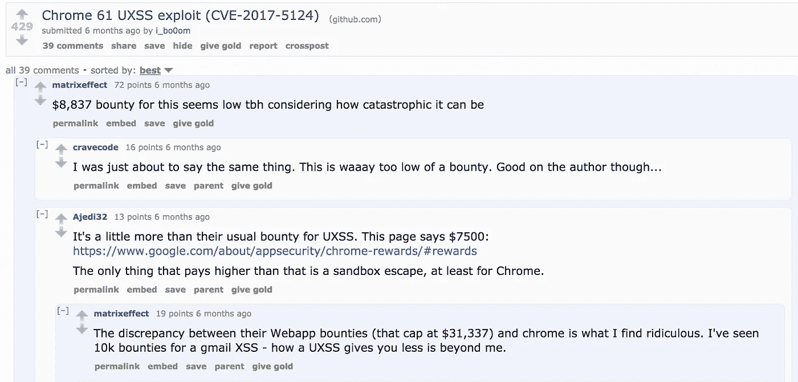
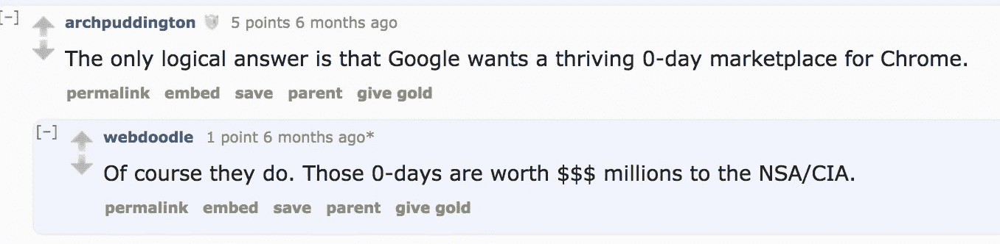

# 你的隐私价值约 7500 美元。

> 原文：<https://medium.com/hackernoon/i-give-you-a-working-exploit-for-stable-chrome-on-mac-8ac49af40910>

## 以及为什么浏览器安全性被低估。

## 慷慨

Reddit users agree that Google pays too low for browser security. [https://tinyurl.com/y8ort2qj](https://tinyurl.com/y8ort2qj)

让我们比较一下谷歌服务中的 [XSS 和 Chrome 中的](https://www.google.com/about/appsecurity/reward-program/) [UXSS 的奖金。](https://www.google.com/about/appsecurity/chrome-rewards/)

> 你在谷歌服务中报告 XSS，得到 3113 美元到 7500 美元(甚至更多)。
> 你在 Chrome 里举报 UXSS，最好的情况下得到 7500 美元。

> UXSS = [同源策略](https://en.wikipedia.org/wiki/Same-origin_policy)旁路

想象一下，攻击者可以从你访问过的所有页面中获取 cookies，嵌入[牛肉钩](https://github.com/beefproject/beef)，并做出其他有趣的事情。

危及数百万 Chrome 用户的 UXSS 被认为至少等同于谷歌服务中的 XSS。

> 据我所知，accounts.google.com 上的一辆**XSS**估价为 1.3 万美元。假设报告包括概念证明和解释，UXSS 的最大奖励是 7500 + 1337 补丁。

对谷歌来说，安装在数百万甚至数十亿台设备上的 Chrome 浏览器不如它们的服务和平台有价值。

> 只需将谷歌与 Hackerone 上的一些公司(如优步)进行比较。是的，这些公司为漏洞支付的费用比谷歌多，这些漏洞只影响他们的服务声誉，仅此而已。

## 没人关心你的浏览器

[https://tinyurl.com/y8ort2qj](https://tinyurl.com/y8ort2qj) Even if it sounds “crazy”, it makes sense

现在很明显，我希望[谷歌](https://hackernoon.com/tagged/google) **低估**浏览器[安全](https://hackernoon.com/tagged/security)。谷歌有时应该记得，Chrome 拥有近 65%的全球市场份额。

> 相反，他们为 ChromeOS 提供了一大笔赏金( **10 万美元**)，而 ChromeOS 的全球市场份额甚至难以计算(**约为 0.5-0.6%)。**

注意，**我没有**说**谷歌不关心**安全性。**谷歌关心**但以某种**可笑的**方式。

Chrome 安全团队运作良好。低奖金可能是因为谷歌依赖内部团队。

然而，你可以在任何 Chrome 版本中检查找到的简历，并发现独立研究人员和项目成员(不是员工)报告了许多(甚至大多数)问题。因此，低奖金不能用仅仅依靠内部研究的方法来解释。

## 苹果不需要帮助别人黑你，因为他们已经帮过你了

你还记得苹果公司拒绝帮助联邦调查局绕过触控 ID 的那个案子吗？这只是一个很好的公关策略。

> [注意:Zerodium 认为触控 ID 和密码旁路是最不严重的漏洞。](https://www.zerodium.com/program.html)

为什么这只是一次公关行动？因为，Google Project Zero 的成员(lokihardt)在 2016 年 12 月-2017 年 3 月期间(至少)发现了 **22 个 UXSS** ，其中一些是**回归测试，像 CVE-2017–2508。**

## CVE-2016–6755 = CVE-2017–2508 =回归测试

也就是说，开发者已经**知道**这个漏洞只在 Chrome 中打了补丁，而这个问题已经在 Safari **中持续了一年多**，直到 Project Zero 在研究中发现了它。

另一个很好的例子是[**CVE-2017–2364**](https://bugs.chromium.org/p/project-zero/issues/detail?id=1056)。我敢打赌，它是在 Project Zero 的审计之前被发现甚至使用的，因为与其他漏洞相比，它非常容易被利用。

## 苹果不在乎

我们注意一下，苹果并没有针对 Safari(Webkit)的 bug 赏金计划。与有 bug 赏金计划的谷歌相反，*苹果大概是想从黑客那里把自己的研究* ***直接提交到“黑市”。***

所以，**所有这些帖子**和关于苹果有多关心隐私和安全的新闻**都只是神话**。此外，可以通过比较过去几年 iOS/MacOS/Webkit 中的 CVE 数量和 Android/Chrome 中的 CVE 数量来证明这一点。你可能已经看过这样的比较。

> 甚至火狐浏览器也有针对网页和浏览器的漏洞奖励。然而， **Mozilla 基金会**是一个**非营利**组织，**不是一个 1 万亿美元的公司。**

感谢阅读😈

github:[https://github.com/Metnew](https://github.com/Metnew)

推特:[https://twitter.com/vladimir_metnew](https://twitter.com/vladimir_metnew)

UXSSs: [https://github.com/Metnew/uxss-db](https://github.com/Metnew/uxss-db)