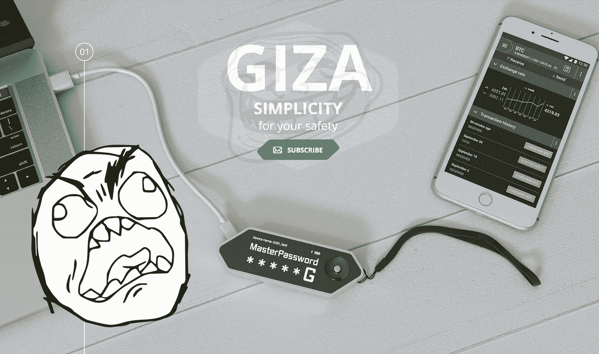
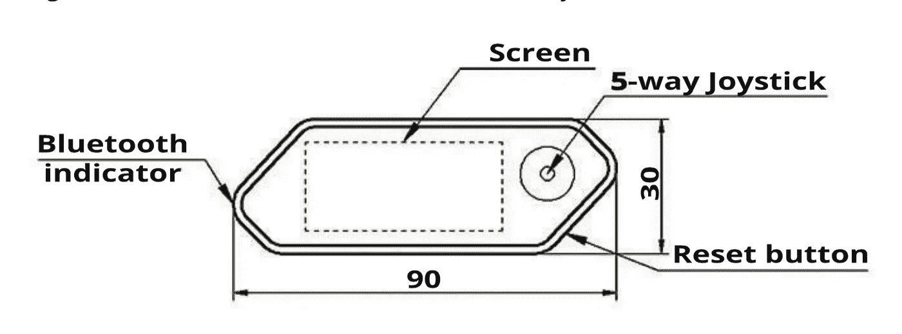
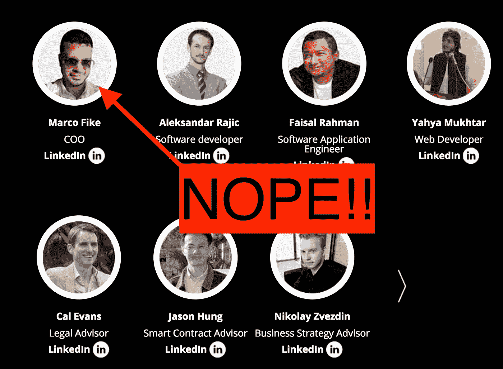

# 我太粗心了。我被骗了

> 原文：<https://medium.com/hackernoon/i-got-sloppy-i-got-scammed-10e00ac0905>

## *通过吉萨*

好了，在推特上发现的热门新闻[ICO](https://hackernoon.com/tagged/ico)…让我们做一个快速的总结:

*   华而不实的网站？支票
*   [推特](https://hackernoon.com/tagged/twitter)/媒体/电报？支票
*   信用良好的团队和顾问？支票
*   封顶众卖？支票
*   很酷的产品/想法？支票

不用动脑筋，对吧？只需投入一些资金，等待里程碑式的公告、交易所交易和产品发布，就能收获那些甜蜜的收益！

只不过这是吉萨 ICO。一个高达 2100 ETH 的退出骗局。令人敬畏的寻找硬件钱包结束所有硬件钱包是完全的蒸汽。它只存在于 3D 效果图和几百个“投资人”的想象中。前往[美国消费者新闻与商业频道，了解骗局本身的梗概](https://www.cnbc.com/2018/03/09/cryptocurrency-scammers-of-giza-make-off-with-2-million-after-ico.html)。

在下面的评论区被“你真蠢！！!"帖子，让我第一个告诉你，是的，我很蠢。但是让我比一般的笨蛋稍微聪明一点的是，我反思我过去的错误，并试图从中吸取教训。亲爱的读者，现在我与你分享这些想法。

# 我哪里做错了？

1.  **我没有看** [**白皮书**](https://web.archive.org/web/20180130165246/https://www.gizadevice.com/files/pdf/GIZA_White_Paper.pdf) 。完全没有描述这个装置实际上是如何工作的。只有承诺，还有一大段描述 ICO 的错综复杂。说真的，下图是整个文档中最复杂的图。作为基准，看看莱杰纳米的技术规格。如此复杂。很多技术。哇哦。

That’s it? Really?

2.我没有停下来思考。被大肆宣传所吸引，而且在达到上限之前供应量迅速减少，我迅速做出决定，抓住这个绝佳的机会。或许稍作停顿，我可能会质疑这位首席执行官的模糊头像照片，并认为也许，*只是也许，*这可能是假的。但他上过 LinkedIn，而且 LinkedIn 从不说谎！

3.**那是** **一个没有 KYC 的无管制证券。众所周知，ico 受到大多数政府监管机构的反对。如今，文明世界中几乎所有合法的 ICO 要么直接禁止美国公民，要么要求 KYC 和认证。Giza 什么也没要求——只是一个复选框，基本上写着“你很酷，对吗？”**

4.没有产品。最后，但同样重要的是，吉萨只是一个想法。没有原型(甚至 [Kickstarter 需要一个原型](https://www.kickstarter.com/rules/prototypes?ref=rules))，没有 GitHub 代码，没有内部工作的 CAD 图。只有营销。营销完全是为了迷惑卡通长颈鹿，让它们放弃一些辛苦挣来的 ETH(只有 0.5ETH，但仍然……)。

Don’t get hoodwinked.

# 记住:不要相信，要验证。

在你进入那个热门的新 ICO 之前，确保产品是真实的，并核实领导层的身份(所有人，尤其是[瑞恩·高斯林](https://thenextweb.com/hardfork/2018/03/05/ryan-gosling-cryptocurrency-ico/))。查找代码，试用 alpha，阅读白皮书中难以理解的规范，查看 gitter.im 上的开发人员聊天记录，甚至可能在 Telegram 或 Twitter 上向创始人提问(我对 Bloom.io 的创始人也是这样做的，他们对我不断的提问一点也不感兴趣)。

# 它可以等待

现在，ICO 猫已经出笼，而且有大笔资金参与其中，所有最好的项目甚至在公众听说之前就已经获得了资金——要么通过预售，要么通过传统的私募股权协议。如果你发现一个 ICO 还有剩余时间和未售出的代币，你不得不奇怪为什么 [Polychain Capital](https://www.crunchbase.com/organization/polychain-capital#section-investments) 、 [A16z](https://a16z.com/category/blockchain-cryptocurrencies-bitcoin-ethereum/) 、[马克·库班](https://www.coindesk.com/mark-cuban-backed-unikrn-raises-31-million-e-sports-token-sale/)、[你有钱的叔叔](https://en.wikipedia.org/wiki/Accredited_investor)、 [50 美分](https://www.theverge.com/2018/1/24/16930010/50-cent-rich-bitcoin-twitter-instagram-humblebrag)就这么过去了。如果他们认为不值得看，也许，仅仅是也许，你也应该通过。

喜欢阅读我的令人尴尬的错误，这样你就不会犯同样的错误…或者对犯同样的错误感觉更好？给我一些掌声，并在推特上关注我！