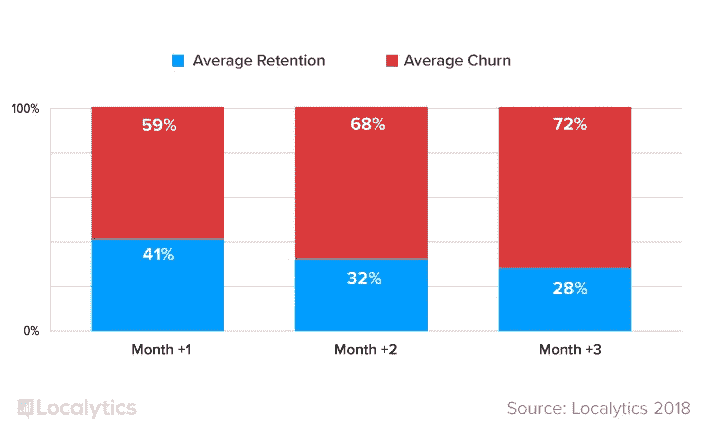
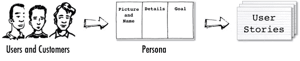

# 我有一个应用程序的想法…但我不是程序员

> 原文：<https://medium.com/hackernoon/i-have-an-app-idea-but-im-not-a-programmer-77327fe448c3>

在这个系列的上一篇文章中，我谈到了是否有可能用小资金推出 MVP。让我们后退一步，看看从灵感的第一瞬间到与工程师坐下来，有一个应用程序想法的商业实用性。

# 我有一个网络应用的想法

缪斯女神给了你灵感，祝贺你！现在是时候认真审视一下你的想法，决定是完善它，继续原型化它，还是完全搁置你的新想法更好。

如果你不是程序员(因为这篇文章的标题包括“我不是程序员”，我猜你实际上不是程序员)，很难快速验证一个应用程序的想法。我的想法在今天的技术下可行吗？或者它是一个需要数百万美元研究来测试这个想法是否可行的登月计划？随着 [Theranos 的崩溃](https://www.vanityfair.com/news/2016/09/elizabeth-holmes-theranos-exclusive)，投资者正在寻找基于现实的创业公司，而不是在 50 年后可能成功的童话故事中。考虑到这一点，我鼓励非技术型创业者将技术验证推迟到最后一步。

# 验证一个想法的第一步是理解一个问题

在 [eTeam](https://eteam.io/) ，制造有用的产品帮助数百万人做得更好或简化他们的生活是我们的核心价值观之一。这也是验证你的应用想法的最简单的方法之一——你的想法有可能有用吗？请注意，我没有说要酷，要时尚，要好看。有用。我是认真的。

现在才上午，我已经使用了十几个为我做了一些事情的应用程序。航空邮件集成到我的 GTD 系统中，这样就不会遗漏任何东西，Trello 跟踪更大的事情，Asana 保持日常任务有条不紊。这些都解决了我日常工作流程中的一个具体问题。

花一两天时间看看你的想法解决了什么问题，并注意这个问题是如何出现在你的日常生活中的。记笔记(也许你会注意到，目前许多记笔记的应用程序还有很多不足之处，这是应用程序创意的另一个途径！)并提炼出*为什么*有人会使用你的应用来解决问题，以及*它将如何*工作。

# 有用不仅仅是生产力应用

我遇到的一个常见错误是希望将所有东西都视为生产力应用程序。这有点太反乌托邦了，即使对我这样一个靠咖啡因提神的 CEO 来说也是如此。在经济学中，[效用](https://www.thoughtco.com/definition-of-utility-1148048)与幸福和满足感以及良好的效用有关。

我*喜欢* Instagram。看世界各地的快照，和我不常见面的朋友保持联系解决了一个问题(太忙了，一天打电话给 30 个人聊一会儿天)。即使是纯粹为了好玩和快乐而构建的应用程序也是有用的，并且解决了一个现实问题。

*The percent of users who return to an app one month, two months, and three months after the app is downloaded*

# 我有一个应用程序的想法，我如何保护它？

所以你已经证实了你的想法是有用的，并且有可能变成一个应用程序。事情开始严重了！

我有一个朋友，似乎每周至少有一次关于应用程序的想法。他在脸书上公布每个想法，并告诉他所有的朋友。虽然我的朋友并不总是认真地将他的应用程序想法转化为原型或成熟的 MVP，但在这个阶段，向世界大声疾呼你的应用程序想法仍然不是一个好主意。事实上，不止一次，我朋友的应用程序创意的修改版本被其他人带到了市场上。

很难不被兴奋所征服，但当你保护你的应用程序想法时，冷静的商业思维必须首先出现。自己或在一个可信任的商业伙伴小圈子里测试你的想法。

当你开始联系代理公司开发你的应用程序时，确保你已经准备好了 NDA。如果一个机构不愿意签署 NDA，甚至不要考虑他们！

在一个以法治著称的司法管辖区寻找法律实体的机构或合作伙伴也是值得的。如果一家公司在美国或欧盟注册，并有来自那里的员工，该机构更有可能遵守 NDA。你能与世界另一端的自由职业者签订合同的可能性基本为零。

没必要在这里大谈特谈。在社交媒体上大肆宣扬你的想法之前要三思，并寻找合法经营的知名机构。

# 如何向开发者展示一个应用创意

开发人员会做一些神奇的事情，当需要让东西工作的时候，他们会成为真正的忍者。不幸的是，我从来没有见过一个会读心术的开发者。这就是为什么知道如何向开发人员展示你的想法是很重要的。

[*image source*](https://www.romanpichler.com/blog/10-tips-writing-good-user-stories/)

大多数开发人员倾向于使用敏捷人群，在[用户故事](https://www.romanpichler.com/blog/10-tips-writing-good-user-stories/)中思考。我建议初露头角的创业者也要学会在用户故事中思考，并以这种形式向开发者展示他们的应用创意。

保持简单:作为一个(人物角色，用户)，我想(目标，而不是功能！)这样(可选为什么)。

您大概可以从下面的例子中猜出该产品:

1.  作为一名青少年，我想分享手机中的照片，以便更容易地与广泛的朋友保持联系。
2.  作为一名专业人士，我希望将我的长期任务放在一个有组织的列表中，这样它们就不会在日常工作中丢失。
3.  作为一名作家，我想在不知道如何编码的情况下分享我的故事，这样我就可以专注于内容。

写几个用户故事，涵盖你的目标受众以及使用你的应用可以完成的任务。根据我的经验，对于一个开发人员来说，拥有一些可靠的用户故事就足以理解你的项目从技术角度来看是否可行。工程师也将能够告诉你需要构建什么样的特性，以便有可能完成你的用户故事中提到的目标。

# 你有想讨论的应用想法吗？

如果你有一个想讨论的应用想法，[让我们联系](https://eteam.io/hireus)。我们的专家可以带领您完成从创意到 MVP 以及将您的应用变为现实的过程。