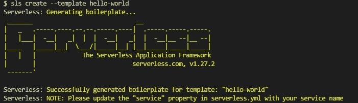
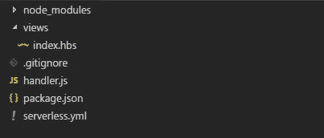
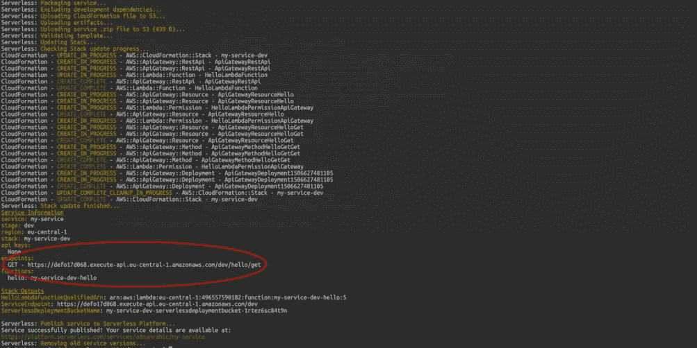
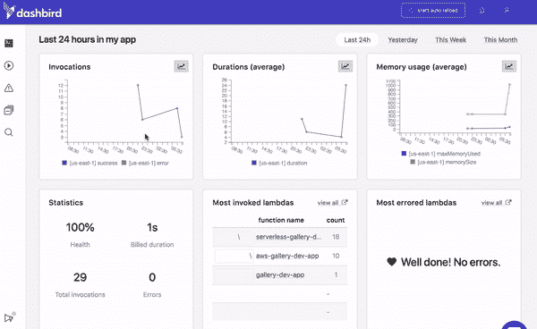

# 我刚刚在 15 分钟内推出了一个无服务器网站。

> 原文：<https://medium.com/hackernoon/i-just-launched-a-serverless-website-in-15-minutes-8e399c827fef>


好了，我们谈了“无服务器是可怕的”的谈话，但现在是时候去实践了。在接下来的 15 分钟里，我将带你经历创建你的第一个运行在无服务器上的网站的整个过程，你最好相信它会很棒。

所以，事不宜迟，让我们从你需要什么开始。首先，你需要注册 T2 亚马逊 T3。有几个步骤你必须采取，以广场了，但整个过程应该不到 5 分钟。

现在一切都准备好了，确保你已经在电脑上安装了[节点](https://nodejs.org/en/)。我使用的是版本 8，所以你可能希望至少有 NodeJs v8+。

# 先决条件

如果你没有，你可以在这里下载 NodeJs。你必须下载安装程序，按照屏幕上的指示运行它，然后重启电脑。完成后，让我们测试一下，看看是否一切运行正常。打开你的终端或者喜欢的命令行工具，输入`node -v`。您应该会看到一条消息，上面写着 v8.xx.x 或类似的内容。接下来，我们需要再次检查 npm 是否安装正确。你可能已经猜到了这个命令是`npm -v`。

# 无服务器设置

好了，既然一切看起来都很好，让我们从安装无服务器框架开始。在您的终端中键入以下内容:

```
npm install -g serverless
```

你会注意到这里的“-g”。它代表全球。在我的 Windows 机器上，我在安装无服务器时遇到了问题，为了让它正常工作，我不得不全局安装它。

接下来，我们将登录到新安装的无服务器平台

```
serverless login
//sls login is a shorthand that works too
```

您将打开一个新的浏览器窗口，要求您登录(您可以使用 GitHub 来完成)

完成之后，我们需要配置我们的 AWS 凭证。这个过程很简单，但需要多个步骤。幸运的是，有一个很棒的[无服务器教程](https://hackernoon.com/a-crash-course-on-serverless-with-node-js-632b37d58b44)，由[阿德南·拉希奇](https://twitter.com/adnanrahic)制作。关注第 2 步和第 3 步。这就是神奇之处。

如果这还不够，这里有一个视频[展示整个过程。](https://www.youtube.com/watch?v=tgb_MRVylWw)

好了，既然我们已经把基本的东西都弄清楚了，那就让我们进入正题吧。

打开文件资源管理器，为项目创建一个新文件夹。我称我的为“无服务器应用”。在新创建的文件夹中，打开您的终端，创建一个简单的无服务器样板。

```
//create the boilerplate mentioned above
sls create --template  hello-world
```

您最终会得到这样的结果:



# 项目设置

在我们开始安装依赖项之前，我们必须创建我们的 package.json 文件。

```
// generate a package.json file
npm init
```

您需要提供姓名、描述和许多其他信息。因为这是一个测试，所以只需按“回车键”并将所有字段留空。

我们将使用 [Expres](https://expressjs.com/) 一个极简主义的网络框架来加快进度。你基本上可以用任何你想建的网站。

# 安装依赖项

```
//install express - a simple web framework
npm i --save express
//install the body-parser middleware
npm i --save body-parser
//install view engine for express
npm i --save  hbs
//you'll need serverless-http to connect your api to aws
npm i --save serverless-http
```

现在我们有所进展了。

在您的计算机上打开 handler.js 文件并粘贴以下代码:

```
const serverless = require("serverless-http");
const hbs = require("hbs");
const express = require("express");
const bodyParser = require("body-parser");const app = express();
app.use(bodyParser.urlencoded({ extended: false }));
// parse application/json
app.use(bodyParser.json());
app.set("view engine", "hbs");app.get("/", function(req, res) {
  res.status(200).render("index");
});module.exports.awesomesauce= serverless(app);
```

接下来:每个人都熟悉的部分，HTML 代码。您必须在项目的根目录下创建一个名为“视图”的新文件夹。打开文件夹，创建一个名为 index.hbs 的车把模板

您的项目应该如下所示:



# 创建网站

这是我添加到我的网站的代码。有创造力，我知道。

```
<!DOCTYPE html>
<html>
<head>
<meta charset="UTF-8">
<title>What's all the FaaS about?</title>
<style>
body
{
text-align:center;
}
</style>
</head>
<body><h1>What's all the FaaS about?</h1>
<p>Get it? It's a punn.</p>
<p>Unfunny joke brought to you by John Demian</p></body>
</html>
```

你可以创建 js 文件，css 文件，基本上无论你在这个阶段想要什么。

# 创建您的服务

几乎完成，与我赤手空拳。打开您的无服务器. yml 文件并粘贴以下内容:

```
service: awesomesauce# The `provider` block defines where your service will be deployed
provider:
  name: aws
  runtime: nodejs8.10# The `functions` block defines what code to deploy
functions:
  app:
    handler: handler.awesomesauce
    # The `events` block defines how to trigger the http events
    events:
        - http: ANY /
        - http: 'ANY {proxy+}'
```

你刚刚做的是设置我们的运行时环境，nodjs8.10，我们指定了我们的应用程序的名称，直观地称为“应用程序”，然后我们指定了处理程序，碰巧是我们服务的名称:“awesome 酱”。

***重要提示:*** 请确保代码缩进正确。

# 部署

我们已经走到了最后一步。一旦您将其部署到 AWS，您将拥有自己的无服务器网站。这有多棒？回到终点站，再走一条线:

```
sls deploy
```

您会看到终端在做各种各样的极客工作，但在最后，您会看到类似这样的东西:



将端点复制并粘贴到您的浏览器中，瞧，您的第一个无服务器网站已经启动并运行。

干得好！四周击掌！这是一段相当漫长的旅程，但它是值得的。您是一个全新网站的自豪拥有者。

# 监控您的应用程序

AWS Lambda 非常棒，但是在某些方面严重缺乏。其中一个方面是监测。他们的工具并不可怕，但对于不习惯的人来说，它可能是压倒性的。

为了解决这个问题，我使用了 [Dashbird.io](http://dashbird.io) ，这是一个针对 AWS Lambda 的无服务器监控工具，让我能够看到幕后发生的一切，从而在出现故障或需要监控成本时能够快速做出反应。



注册只需要几分钟，我强烈建议您继续，尤其是如果您刚开始使用无服务器，因为它提供了为人类定制的洞察力。

差点忘了提这个，不过 [Dashbird.io](http://dashbird.io) 有一个免费层，你现在就可以开始使用。使用免费版本将允许您监视来自 AWS 的高达 1gb 的日志和无限数量的调用。